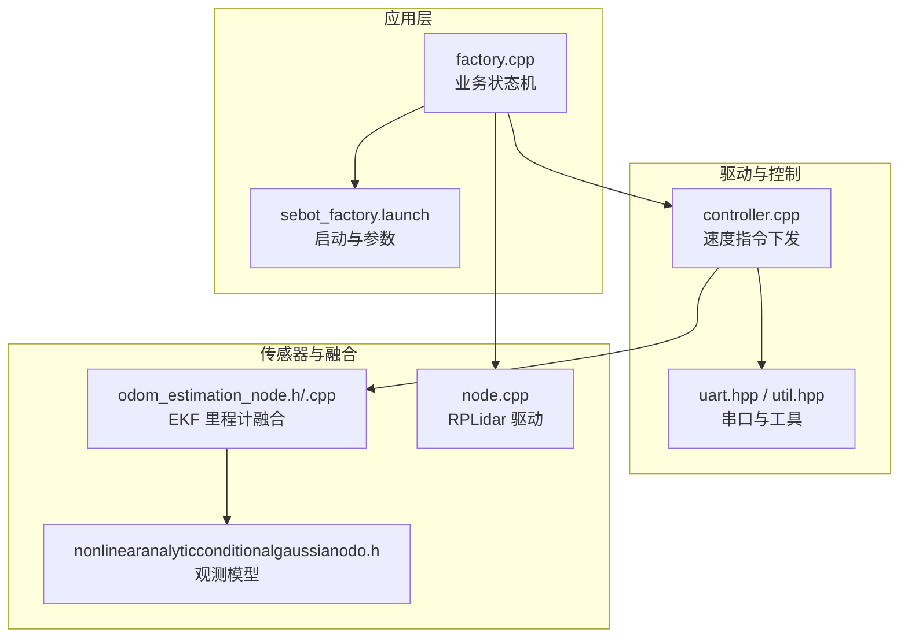
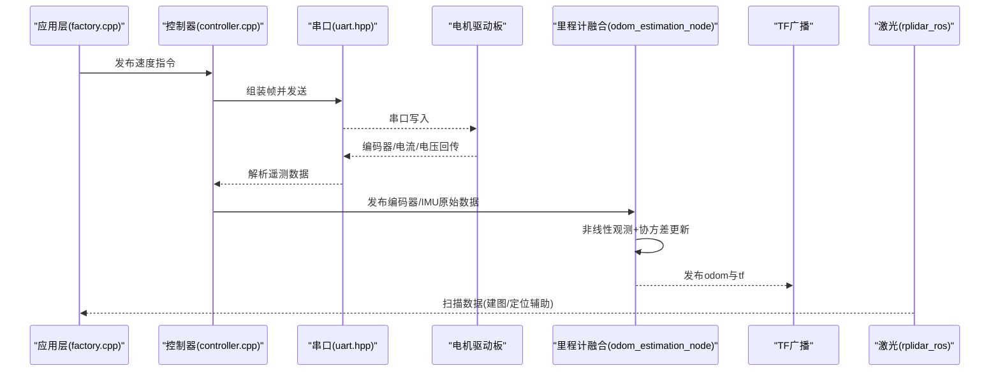
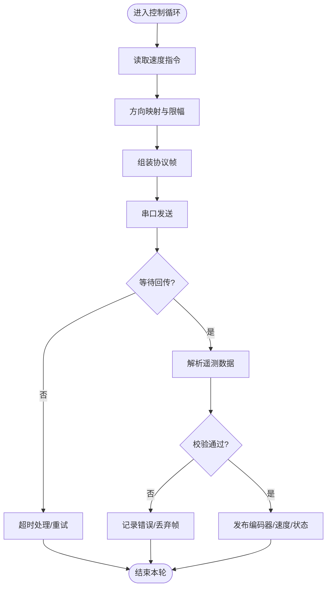
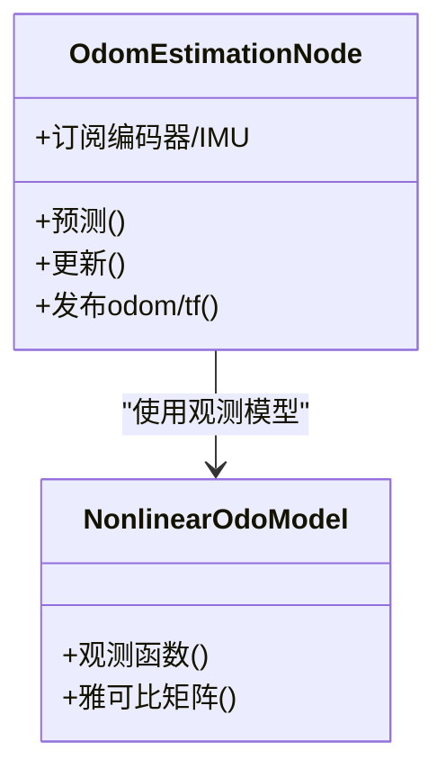
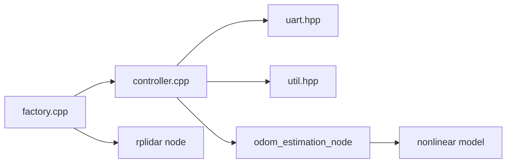

# 电机驱动问题

<cite>
**本文引用的文件**   
- [sebot_robot/controller.cpp](file://sebot_ros_kits/src/sebot_robot/src/controller.cpp)
- [sebot_robot/uart.hpp](file://sebot_ros_kits/src/sebot_robot/include/uart.hpp)
- [sebot_robot/util.hpp](file://sebot_ros_kits/src/sebot_robot/include/util.hpp)
- [sebot_robot/launch/sebot_odom.launch](file://sebot_ros_kits/src/sebot_robot/launch/sebot_odom.launch)
- [sebot_robot/launch/sebot_transform.launch](file://sebot_ros_kits/src/sebot_robot/launch/sebot_transform.launch)
- [robot_pose_ekf/odom_estimation_node.h](file://sebot_ros_kits/src/sebot_driver/robot_pose_ekf/include/robot_pose_ekf/odom_estimation_node.h)
- [robot_pose_ekf/odom_estimation.cpp](file://sebot_ros_kits/src/sebot_driver/robot_pose_ekf/src/odom_estimation.cpp)
- [robot_pose_ekf/nonlinearanalyticconditionalgaussianodo.h](file://sebot_ros_kits/src/sebot_driver/robot_pose_ekf/include/robot_pose_ekf/nonlinearanalyticconditionalgaussianodo.h)
- [rplidar_ros/node.cpp](file://sebot_ros_kits/src/sebot_driver/rplidar_ros/src/node.cpp)
- [sebot_factory/factory.cpp](file://sebot_factory/src/sebot_factory/src/factory.cpp)
- [sebot_factory/launch/sebot_factory.launch](file://sebot_factory/src/sebot_factory/launch/sebot_factory.launch)
</cite>

## 目录
1. [简介](#简介)
2. [项目结构](#项目结构)
3. [核心组件](#核心组件)
4. [架构总览](#架构总览)
5. [详细组件分析](#详细组件分析)
6. [依赖关系分析](#依赖关系分析)
7. [性能与实时性考虑](#性能与实时性考虑)
8. [故障排查指南](#故障排查指南)
9. [结论](#结论)
10. [附录](#附录)

## 简介
本指南面向机器人轮式底盘的电机驱动系统，聚焦于控制逻辑、里程计数据异常诊断、驱动板通信故障排查、参数校准与电源管理等方面。文档基于仓库中的 sebot_robot（底层驱动与控制）、robot_pose_ekf（里程计融合）、rplidar_ros（激光雷达节点）以及 sebot_factory（业务状态机与启动配置）等关键包进行梳理，提供从现象到根因、从定位到修复的系统化方法。

## 项目结构
- sebot_factory：应用层业务（订单、取件、结算等），通过 launch 集成导航、视觉、机械臂与底层驱动。
- sebot_ros_kits：机器人套件，包含 sebot_robot（串口驱动、控制器、发布器）、sebot_driver（EKF 里程计、RPLidar 驱动）、sebot_slam、sebot_speech、sebot_visions 等。
- sebot_ros_stdr：仿真环境（STDR），用于离线调试与验证。

图表来源 
- [sebot_factory/factory.cpp](file://sebot_factory/src/sebot_factory/src/factory.cpp)
- [sebot_factory/launch/sebot_factory.launch](file://sebot_factory/src/sebot_factory/launch/sebot_factory.launch)
- [sebot_robot/controller.cpp](file://sebot_ros_kits/src/sebot_robot/src/controller.cpp)
- [sebot_robot/uart.hpp](file://sebot_ros_kits/src/sebot_robot/include/uart.hpp)
- [sebot_robot/util.hpp](file://sebot_ros_kits/src/sebot_robot/include/util.hpp)
- [robot_pose_ekf/odom_estimation_node.h](file://sebot_ros_kits/src/sebot_driver/robot_pose_ekf/include/robot_pose_ekf/odom_estimation_node.h)
- [robot_pose_ekf/odom_estimation.cpp](file://sebot_ros_kits/src/sebot_driver/robot_pose_ekf/src/odom_estimation.cpp)
- [robot_pose_ekf/nonlinearanalyticconditionalgaussianodo.h](file://sebot_ros_kits/src/sebot_driver/robot_pose_ekf/include/robot_pose_ekf/nonlinearanalyticconditionalgaussianodo.h)
- [rplidar_ros/node.cpp](file://sebot_ros_kits/src/sebot_driver/rplidar_ros/src/node.cpp)

章节来源
- [sebot_factory/factory.cpp](file://sebot_factory/src/sebot_factory/src/factory.cpp)
- [sebot_factory/launch/sebot_factory.launch](file://sebot_factory/src/sebot_factory/launch/sebot_factory.launch)
- [sebot_robot/controller.cpp](file://sebot_ros_kits/src/sebot_robot/src/controller.cpp)
- [sebot_robot/uart.hpp](file://sebot_ros_kits/src/sebot_robot/include/uart.hpp)
- [sebot_robot/util.hpp](file://sebot_ros_kits/src/sebot_robot/include/util.hpp)
- [robot_pose_ekf/odom_estimation_node.h](file://sebot_ros_kits/src/sebot_driver/robot_pose_ekf/include/robot_pose_ekf/odom_estimation_node.h)
- [robot_pose_ekf/odom_estimation.cpp](file://sebot_ros_kits/src/sebot_driver/robot_pose_ekf/src/odom_estimation.cpp)
- [robot_pose_ekf/nonlinearanalyticconditionalgaussianodo.h](file://sebot_ros_kits/src/sebot_driver/robot_pose_ekf/include/robot_pose_ekf/nonlinearanalyticconditionalgaussianodo.h)
- [rplidar_ros/node.cpp](file://sebot_ros_kits/src/sebot_driver/rplidar_ros/src/node.cpp)

## 核心组件
- 电机控制与串口通信
  - controller.cpp：订阅速度指令，封装为帧并通过串口下发至驱动板；处理回传编码器/电流/电压等遥测数据。
  - uart.hpp / util.hpp：串口打开/关闭、波特率设置、读写缓冲、校验与超时处理、日志与错误码定义。
- 里程计与位姿估计
  - robot_pose_ekf：订阅 IMU、编码器、可选激光里程计，输出融合后的 odom 与 tf。
  - nonlinearanalyticconditionalgaussianodo.h：非线性观测模型与协方差传播。
- 激光雷达
  - rplidar_ros/node.cpp：扫描数据获取、时间戳同步、ROS 消息发布。
- 应用与启动
  - factory.cpp：业务状态机（自检、导航、确认、抓取、送达、结算）。
  - sebot_factory.launch：仿真开关、调试界面、导航超时、PID、取件距离、补扫等关键参数。

章节来源
- [sebot_robot/controller.cpp](file://sebot_ros_kits/src/sebot_robot/src/controller.cpp)
- [sebot_robot/uart.hpp](file://sebot_ros_kits/src/sebot_robot/include/uart.hpp)
- [sebot_robot/util.hpp](file://sebot_ros_kits/src/sebot_robot/include/util.hpp)
- [robot_pose_ekf/odom_estimation_node.h](file://sebot_ros_kits/src/sebot_driver/robot_pose_ekf/include/robot_pose_ekf/odom_estimation_node.h)
- [robot_pose_ekf/odom_estimation.cpp](file://sebot_ros_kits/src/sebot_driver/robot_pose_ekf/src/odom_estimation.cpp)
- [robot_pose_ekf/nonlinearanalyticconditionalgaussianodo.h](file://sebot_ros_kits/src/sebot_driver/robot_pose_ekf/include/robot_pose_ekf/nonlinearanalyticconditionalgaussianodo.h)
- [rplidar_ros/node.cpp](file://sebot_ros_kits/src/sebot_driver/rplidar_ros/src/node.cpp)
- [sebot_factory/factory.cpp](file://sebot_factory/src/sebot_factory/src/factory.cpp)
- [sebot_factory/launch/sebot_factory.launch](file://sebot_factory/src/sebot_factory/launch/sebot_factory.launch)

## 架构总览
下图展示了从上层命令到底层驱动的完整链路，以及里程计融合与激光数据的参与位置。

图表来源 
- [sebot_factory/factory.cpp](file://sebot_factory/src/sebot_factory/src/factory.cpp)
- [sebot_robot/controller.cpp](file://sebot_ros_kits/src/sebot_robot/src/controller.cpp)
- [sebot_robot/uart.hpp](file://sebot_ros_kits/src/sebot_robot/include/uart.hpp)
- [robot_pose_ekf/odom_estimation_node.h](file://sebot_ros_kits/src/sebot_driver/robot_pose_ekf/include/robot_pose_ekf/odom_estimation_node.h)
- [robot_pose_ekf/odom_estimation.cpp](file://sebot_ros_kits/src/sebot_driver/robot_pose_ekf/src/odom_estimation.cpp)
- [rplidar_ros/node.cpp](file://sebot_ros_kits/src/sebot_driver/rplidar_ros/src/node.cpp)

## 详细组件分析

### 电机控制与串口通信（controller.cpp + uart.hpp + util.hpp）
- 职责
  - 接收速度指令（线速度/角速度），转换为左右轮目标转速。
  - 将指令打包为协议帧，经串口发送至驱动板。
  - 解析驱动板回传的编码器计数、电流、电压、温度等遥测数据。
  - 对异常（超时、校验失败、缓冲区溢出）进行告警与降级策略。
- 关键流程
  - 初始化：打开串口、设置波特率/数据位/停止位/校验、注册回调。
  - 周期任务：读取编码器增量、计算瞬时速度、发布里程计原始数据。
  - 指令下发：限速限流、方向映射、防抖与死区处理。
- 常见问题定位
  - 无响应：检查串口设备权限、端口号、波特率匹配、握手帧是否成功。
  - 乱码/解析失败：检查帧头/尾、长度字段、校验和、字节序。
  - 丢帧：增大缓冲区、降低频率、增加重发机制、优化中断优先级。
  - 方向错误：检查左右轮正负映射、坐标系约定、安装方向。
  - 转速异常：检查增益/比例系数、负载变化、电池电压补偿。

图表来源 
- [sebot_robot/controller.cpp](file://sebot_ros_kits/src/sebot_robot/src/controller.cpp)
- [sebot_robot/uart.hpp](file://sebot_ros_kits/src/sebot_robot/include/uart.hpp)
- [sebot_robot/util.hpp](file://sebot_ros_kits/src/sebot_robot/include/util.hpp)

章节来源
- [sebot_robot/controller.cpp](file://sebot_ros_kits/src/sebot_robot/src/controller.cpp)
- [sebot_robot/uart.hpp](file://sebot_ros_kits/src/sebot_robot/include/uart.hpp)
- [sebot_robot/util.hpp](file://sebot_ros_kits/src/sebot_robot/include/util.hpp)

### 里程计与位姿估计（robot_pose_ekf）
- 职责
  - 融合 IMU、编码器、可选激光里程计，输出更稳健的 odom 与 tf。
  - 使用非线性观测模型与协方差传播，抑制噪声与漂移。
- 关键流程
  - 订阅编码器增量与 IMU 数据。
  - 预测步骤：基于运动学模型预测位姿。
  - 更新步骤：利用 IMU 与编码器观测修正，必要时引入激光里程计约束。
  - 发布融合后的里程计与坐标变换。
- 常见问题定位
  - 里程计发散：检查 IMU 零偏标定、编码器脉冲数、轮径与轴距参数。
  - 速度偏差：核对编码器分辨率、采样周期、积分算法。
  - 打滑检测：对比 IMU 加速度与轮速推算加速度，设定阈值报警。
  - 时间同步：确保各传感器时间戳一致，避免插值误差。

图表来源 
- [robot_pose_ekf/odom_estimation_node.h](file://sebot_ros_kits/src/sebot_driver/robot_pose_ekf/include/robot_pose_ekf/odom_estimation_node.h)
- [robot_pose_ekf/odom_estimation.cpp](file://sebot_ros_kits/src/sebot_driver/robot_pose_ekf/src/odom_estimation.cpp)
- [robot_pose_ekf/nonlinearanalyticconditionalgaussianodo.h](file://sebot_ros_kits/src/sebot_driver/robot_pose_ekf/include/robot_pose_ekf/nonlinearanalyticconditionalgaussianodo.h)

章节来源
- [robot_pose_ekf/odom_estimation_node.h](file://sebot_ros_kits/src/sebot_driver/robot_pose_ekf/include/robot_pose_ekf/odom_estimation_node.h)
- [robot_pose_ekf/odom_estimation.cpp](file://sebot_ros_kits/src/sebot_driver/robot_pose_ekf/src/odom_estimation.cpp)
- [robot_pose_ekf/nonlinearanalyticconditionalgaussianodo.h](file://sebot_ros_kits/src/sebot_driver/robot_pose_ekf/include/robot_pose_ekf/nonlinearanalyticconditionalgaussianodo.h)

### 激光雷达（rplidar_ros）
- 职责
  - 与 RPLidar 设备通信，获取扫描点云并发布 ROS 消息。
  - 处理连接断开、数据不完整、时间戳异常等情况。
- 常见问题定位
  - 无法连接：检查 USB/串口、权限、波特率、固件版本。
  - 数据跳变：检查供电稳定性、线缆质量、电磁干扰。
  - 时间戳错位：确保系统时钟同步，避免跨进程延迟。

章节来源
- [rplidar_ros/node.cpp](file://sebot_ros_kits/src/sebot_driver/rplidar_ros/src/node.cpp)

### 应用与启动（sebot_factory）
- 职责
  - 工厂业务状态机：上电自检、加载地图、AMCL 定位、导航至取件台、需求确认、YOLO 搜索、机械臂抓取、送达结算。
  - 通过 launch 文件统一启动各节点，注入关键参数。
- 关键参数（示例类别）
  - 仿真模式：simulation=true/false 切换 STDR 仿真。
  - 调试界面：debug=true/false 控制图像识别 UI。
  - 导航超时：move_base 超时阈值、recovery 行为。
  - PID 参数：转向/前进闭环增益。
  - 取件距离：接近目标的容差。
  - 补扫参数：局部重扫触发条件。

章节来源
- [sebot_factory/factory.cpp](file://sebot_factory/src/sebot_factory/src/factory.cpp)
- [sebot_factory/launch/sebot_factory.launch](file://sebot_factory/src/sebot_factory/launch/sebot_factory.launch)

## 依赖关系分析
- 模块耦合
  - controller.cpp 依赖 uart.hpp 完成串口 I/O，依赖 util.hpp 的工具函数。
  - odom_estimation_node 依赖编码器与 IMU 数据源，内部使用非线性观测模型。
  - factory.cpp 依赖 sebot_robot、robot_pose_ekf、rplidar_ros 等多个节点协同工作。
- 外部依赖
  - ROS 1 通信（topic/service/action）。
  - 硬件：电机驱动板、编码器、IMU、RPLidar、电池管理系统。

图表来源 
- [sebot_factory/factory.cpp](file://sebot_factory/src/sebot_factory/src/factory.cpp)
- [sebot_robot/controller.cpp](file://sebot_ros_kits/src/sebot_robot/src/controller.cpp)
- [sebot_robot/uart.hpp](file://sebot_ros_kits/src/sebot_robot/include/uart.hpp)
- [sebot_robot/util.hpp](file://sebot_ros_kits/src/sebot_robot/include/util.hpp)
- [robot_pose_ekf/odom_estimation_node.h](file://sebot_ros_kits/src/sebot_driver/robot_pose_ekf/include/robot_pose_ekf/odom_estimation_node.h)
- [robot_pose_ekf/nonlinearanalyticconditionalgaussianodo.h](file://sebot_ros_kits/src/sebot_driver/robot_pose_ekf/include/robot_pose_ekf/nonlinearanalyticconditionalgaussianodo.h)
- [rplidar_ros/node.cpp](file://sebot_ros_kits/src/sebot_driver/rplidar_ros/src/node.cpp)

章节来源
- [sebot_factory/factory.cpp](file://sebot_factory/src/sebot_factory/src/factory.cpp)
- [sebot_robot/controller.cpp](file://sebot_ros_kits/src/sebot_robot/src/controller.cpp)
- [sebot_robot/uart.hpp](file://sebot_ros_kits/src/sebot_robot/include/uart.hpp)
- [sebot_robot/util.hpp](file://sebot_ros_kits/src/sebot_robot/include/util.hpp)
- [robot_pose_ekf/odom_estimation_node.h](file://sebot_ros_kits/src/sebot_driver/robot_pose_ekf/include/robot_pose_ekf/odom_estimation_node.h)
- [robot_pose_ekf/nonlinearanalyticconditionalgaussianodo.h](file://sebot_ros_kits/src/sebot_driver/robot_pose_ekf/include/robot_pose_ekf/nonlinearanalyticconditionalgaussianodo.h)
- [rplidar_ros/node.cpp](file://sebot_ros_kits/src/sebot_driver/rplidar_ros/src/node.cpp)

## 性能与实时性考虑
- 控制周期
  - 建议控制频率不低于 50Hz，串口发送与解析需保证低延迟。
- 缓冲区与队列
  - 合理设置串口与 ROS 队列长度，避免丢包或积压。
- CPU 与调度
  - 提升关键线程优先级，减少 GUI/IO 对控制环的影响。
- 传感器同步
  - 使用统一的时钟源，确保编码器、IMU、激光的时间对齐。

[本节为通用指导，不直接分析具体文件]

## 故障排查指南

### 电机转速异常
- 可能原因
  - 速度增益过大/过小、负载突变、电池电压下降、编码器分辨率设置错误。
- 排查步骤
  - 在空载与满载下分别测试速度曲线，观察线性度。
  - 检查控制器中速度映射与限幅参数。
  - 监测电池电压与电流，评估供电能力。
  - 核对编码器脉冲数与轮径参数。

章节来源
- [sebot_robot/controller.cpp](file://sebot_ros_kits/src/sebot_robot/src/controller.cpp)
- [sebot_robot/uart.hpp](file://sebot_ros_kits/src/sebot_robot/include/uart.hpp)

### 方向错误
- 可能原因
  - 左右轮正负映射颠倒、坐标系不一致、机械安装反向。
- 排查步骤
  - 单轮点动测试，确认旋转方向与指令一致。
  - 检查控制器中的方向映射表与坐标系约定。
  - 若机械反转，调整安装或软件映射。

章节来源
- [sebot_robot/controller.cpp](file://sebot_ros_kits/src/sebot_robot/src/controller.cpp)

### 响应延迟
- 可能原因
  - 串口阻塞、ROS 队列堆积、CPU 占用过高、传感器时间戳不同步。
- 排查步骤
  - 监控串口吞吐与错误计数，增加重发与超时处理。
  - 减小 ROS 队列长度，分离高频 IO 线程。
  - 使用 rostopic hz/rqt_graph 定位瓶颈。

章节来源
- [sebot_robot/uart.hpp](file://sebot_ros_kits/src/sebot_robot/include/uart.hpp)
- [sebot_robot/util.hpp](file://sebot_ros_kits/src/sebot_robot/include/util.hpp)

### 里程计数据异常（打滑、编码器错误、速度偏差）
- 打滑检测
  - 比较 IMU 加速度与轮速推算加速度，超过阈值标记打滑并降速。
- 编码器计数错误
  - 检查脉冲信号完整性、屏蔽干扰、更换线缆。
- 速度计算偏差
  - 校正轮径、轴距、编码器分辨率；检查积分算法与采样周期。

章节来源
- [robot_pose_ekf/odom_estimation.cpp](file://sebot_ros_kits/src/sebot_driver/robot_pose_ekf/src/odom_estimation.cpp)
- [robot_pose_ekf/nonlinearanalyticconditionalgaussianodo.h](file://sebot_ros_kits/src/sebot_driver/robot_pose_ekf/include/robot_pose_ekf/nonlinearanalyticconditionalgaussianodo.h)

### 驱动板通信故障（串口、帧解析、初始化）
- 串口连接问题
  - 检查设备权限、端口号、波特率、数据位/停止位/校验。
- 数据帧解析错误
  - 校验帧头/尾、长度字段、校验和；增加日志与断言。
- 驱动板初始化失败
  - 发送握手/复位帧，等待 ACK；失败则重试与降级。

章节来源
- [sebot_robot/uart.hpp](file://sebot_ros_kits/src/sebot_robot/include/uart.hpp)
- [sebot_robot/util.hpp](file://sebot_ros_kits/src/sebot_robot/include/util.hpp)
- [sebot_robot/controller.cpp](file://sebot_ros_kits/src/sebot_robot/src/controller.cpp)

### 电机参数校准（零位、速度增益、加速度限制）
- 零位校准
  - 静止状态下采集编码器零点，消除偏置。
- 速度增益调整
  - 小步长调节比例系数，观察稳态误差与超调。
- 加速度限制
  - 设置最大加减速率，避免冲击与失步。

章节来源
- [sebot_robot/controller.cpp](file://sebot_ros_kits/src/sebot_robot/src/controller.cpp)
- [sebot_robot/util.hpp](file://sebot_ros_kits/src/sebot_robot/include/util.hpp)

### 电源管理相关问题（电压波动、电流保护、电量监测）
- 电压波动影响
  - 监测母线电压，动态限功率；增加滤波电容。
- 电流保护触发
  - 检查负载与短路，调整限流阈值与恢复策略。
- 电池电量监测
  - 校准 SOC 估算，低电量预警与自动返航。

章节来源
- [sebot_robot/controller.cpp](file://sebot_ros_kits/src/sebot_robot/src/controller.cpp)
- [sebot_robot/uart.hpp](file://sebot_ros_kits/src/sebot_robot/include/uart.hpp)

### 启动与运行配置（launch 参数）
- 关键参数说明
  - simulation：切换 STDR 仿真模式。
  - debug：控制图像识别界面开关。
  - 导航超时、PID、取件距离、补扫参数等。
- 常用操作
  - 修改参数后重启对应节点，观察效果。
  - 使用 roslaunch 启动时传入覆盖参数。

章节来源
- [sebot_factory/launch/sebot_factory.launch](file://sebot_factory/src/sebot_factory/launch/sebot_factory.launch)

## 结论
通过对 sebot_robot、robot_pose_ekf、rplidar_ros 与 sebot_factory 等核心组件的分析，本文构建了从控制指令下发、串口通信、里程计融合到应用集成的全链路排查框架。针对转速异常、方向错误、响应延迟、里程计异常、通信故障与电源管理等典型问题，提供了系统化的诊断方法与改进建议。建议在开发过程中结合日志、指标与可视化手段，持续迭代参数与策略，以提升系统的鲁棒性与可维护性。

[本节为总结，不直接分析具体文件]

## 附录
- 常用诊断命令
  - rostopic list/hz/info：查看话题与频率。
  - rosrun rqt_graph：可视化节点关系。
  - dmesg | grep tty：检查串口设备信息。
- 推荐工具
  - rqt_plot：绘制速度与电流曲线。
  - rviz：可视化里程计与激光数据。

[本节为补充内容，不直接分析具体文件]