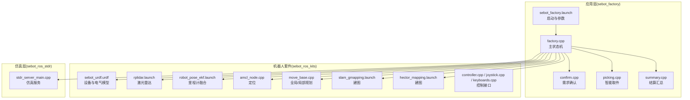
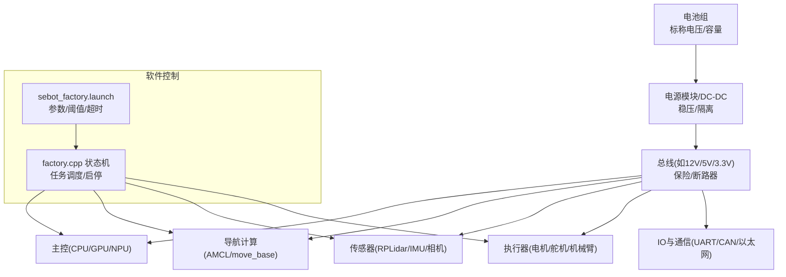
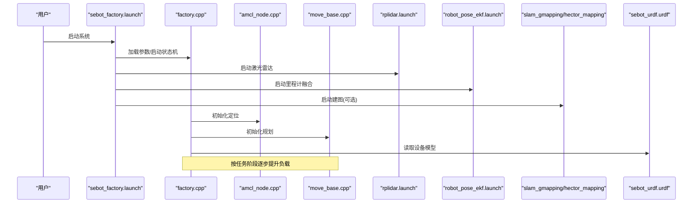

# 电源管理问题

<cite>
**本文引用的文件**   
- [sebot_factory.launch](file://sebot_factory/src/sebot_factory/launch/sebot_factory.launch)
- [factory.cpp](file://sebot_factory/src/sebot_factory/src/factory.cpp)
- [confirm.cpp](file://sebot_factory/src/sebot_factory/src/confirm.cpp)
- [picking.cpp](file://sebot_factory/src/sebot_factory/src/picking.cpp)
- [summary.cpp](file://sebot_factory/src/sebot_factory/src/summary.cpp)
- [CMakeLists.txt](file://sebot_factory/src/sebot_factory/CMakeLists.txt)
- [package.xml](file://sebot_factory/src/sebot_factory/package.xml)
- [sebot_urdf.launch](file://sebot_ros_kits/src/sebot_urdf/launch/sebot_urdf.launch)
- [sebot_urdf.urdf](file://sebot_ros_kits/src/sebot_urdf/urdf/sebot_urdf.urdf)
- [sebot_joystick.launch](file://sebot_ros_kits/src/sebot_robot/launch/sebot_joystick.launch)
- [controller.cpp](file://sebot_ros_kits/src/sebot_robot/src/controller.cpp)
- [joystick.cpp](file://sebot_ros_kits/src/sebot_robot/src/joystick.cpp)
- [keyboard.cpp](file://sebot_ros_kits/src/sebot_robot/src/keyboards.cpp)
- [transform.cpp](file://sebot_ros_kits/src/sebot_robot/src/transform.cpp)
- [amcl_node.cpp](file://sebot_ros_kits/src/sebot_navigation/amcl/src/amcl_node.cpp)
- [move_base.cpp](file://sebot_ros_kits/src/sebot_navigation/move_base/src/move_base.cpp)
- [rplidar.launch](file://sebot_ros_kits/src/sebot_driver/rplidar_ros/launch/rplidar.launch)
- [robot_pose_ekf.launch](file://sebot_ros_kits/src/sebot_driver/robot_pose_ekf/launch/robot_pose_ekf.launch)
- [slam_gmapping.launch](file://sebot_ros_kits/src/sebot_slam/slam_gmapping/launch/slam_gmapping.launch)
- [hector_mapping.launch](file://sebot_ros_kits/src/sebot_slam/slam_hector/hector_mapping/launch/hector_mapping.launch)
- [stdr_server_main.cpp](file://sebot_ros_stdr/src/sebot_stdr/stdr_server/src/main.cpp)
</cite>

## 目录
1. [简介](#简介)
2. [项目结构](#项目结构)
3. [核心组件](#核心组件)
4. [架构总览](#架构总览)
5. [详细组件分析](#详细组件分析)
6. [依赖关系分析](#依赖关系分析)
7. [性能与功耗考量](#性能与功耗考量)
8. [故障排查指南](#故障排查指南)
9. [结论](#结论)
10. [附录](#附录)

## 简介
本指南面向机器人竞赛项目的电源管理与故障排查，围绕以下目标展开：
- 明确电源分配策略与电压监控机制（含各模块供电优先级、负载平衡配置、电压降补偿思路）
- 解释电池电量监测与续航优化方法（功耗分析、休眠模式配置、动态功率调节）
- 覆盖电源保护机制的触发条件与处理逻辑（过流保护、欠压保护、温度保护等）
- 提供电源相关问题的诊断工具与方法（电压波形分析、电流消耗统计、热成像检测等）
- 给出电源硬件故障识别与替换指导（电池老化检测、电源模块损坏判断、线路接触不良排查）

说明：当前仓库未包含专用电源管理节点或硬件驱动代码。本指南基于系统级启动流程、关键参数与运行拓扑，结合通用工程实践，给出可落地的排查方法与优化建议。

## 项目结构
本项目由三个相互独立的 catkin 工作空间组成：
- sebot_factory：应用层业务节点（工厂任务状态机、需求确认、取件、结算汇总等）
- sebot_ros_kits：机器人套件（导航、建图、传感器驱动、URDF 模型、控制接口等）
- sebot_ros_stdr：仿真环境（STDR 服务器与资源）

电源相关的关键入口与配置集中在 sebot_factory 的 launch 文件与各节点的 CMake 与 package 描述中；底层硬件抽象通过 URDF 与控制节点暴露；导航与传感器驱动在 sebot_ros_kits 中集成。

图表来源
- [sebot_factory.launch](file://sebot_factory/src/sebot_factory/launch/sebot_factory.launch)
- [factory.cpp](file://sebot_factory/src/sebot_factory/src/factory.cpp)
- [sebot_urdf.urdf](file://sebot_ros_kits/src/sebot_urdf/urdf/sebot_urdf.urdf)
- [amcl_node.cpp](file://sebot_ros_kits/src/sebot_navigation/amcl/src/amcl_node.cpp)
- [move_base.cpp](file://sebot_ros_kits/src/sebot_navigation/move_base/src/move_base.cpp)
- [rplidar.launch](file://sebot_ros_kits/src/sebot_driver/rplidar_ros/launch/rplidar.launch)
- [robot_pose_ekf.launch](file://sebot_ros_kits/src/sebot_driver/robot_pose_ekf/launch/robot_pose_ekf.launch)
- [slam_gmapping.launch](file://sebot_ros_kits/src/sebot_slam/slam_gmapping/launch/slam_gmapping.launch)
- [hector_mapping.launch](file://sebot_ros_kits/src/sebot_slam/slam_hector/hector_mapping/launch/hector_mapping.launch)
- [stdr_server_main.cpp](file://sebot_ros_stdr/src/sebot_stdr/stdr_server/src/main.cpp)

章节来源
- [sebot_factory.launch](file://sebot_factory/src/sebot_factory/launch/sebot_factory.launch)
- [CMakeLists.txt](file://sebot_factory/src/sebot_factory/CMakeLists.txt)
- [package.xml](file://sebot_factory/src/sebot_factory/package.xml)

## 核心组件
- 应用层主状态机（factory.cpp）：协调导航、视觉、机械臂与业务流程，是电源负载的主要调度者。
- 需求确认（confirm.cpp）、取件（picking.cpp）、结算（summary.cpp）：阶段性高负载任务，影响瞬时功耗峰值。
- 启动配置（sebot_factory.launch）：集中开关仿真/调试、导航超时、PID、取件距离、补扫等关键参数，间接决定功耗与稳定性。
- 机器人套件：
  - 传感器驱动（RPLidar、IMU、里程计 EKF）：持续功耗源，需合理采样率与刷新频率。
  - 导航栈（AMCL、move_base、DWA/Gmapping/Hector）：计算密集，CPU/GPU/NPU 占用随路径复杂度变化。
  - URDF（sebot_urdf.urdf）：定义设备与电气模型，便于上层进行功耗建模与估算。
- 仿真层（STDR）：用于离线验证与功耗预估，避免实机频繁上电测试。

章节来源
- [factory.cpp](file://sebot_factory/src/sebot_factory/src/factory.cpp)
- [confirm.cpp](file://sebot_factory/src/sebot_factory/src/confirm.cpp)
- [picking.cpp](file://sebot_factory/src/sebot_factory/src/picking.cpp)
- [summary.cpp](file://sebot_factory/src/sebot_factory/src/summary.cpp)
- [sebot_factory.launch](file://sebot_factory/src/sebot_factory/launch/sebot_factory.launch)
- [sebot_urdf.urdf](file://sebot_ros_kits/src/sebot_urdf/urdf/sebot_urdf.urdf)
- [amcl_node.cpp](file://sebot_ros_kits/src/sebot_navigation/amcl/src/amcl_node.cpp)
- [move_base.cpp](file://sebot_ros_kits/src/sebot_navigation/move_base/src/move_base.cpp)
- [rplidar.launch](file://sebot_ros_kits/src/sebot_driver/rplidar_ros/launch/rplidar.launch)
- [robot_pose_ekf.launch](file://sebot_ros_kits/src/sebot_driver/robot_pose_ekf/launch/robot_pose_ekf.launch)
- [slam_gmapping.launch](file://sebot_ros_kits/src/sebot_slam/slam_gmapping/launch/slam_gmapping.launch)
- [hector_mapping.launch](file://sebot_ros_kits/src/sebot_slam/slam_hector/hector_mapping/launch/hector_mapping.launch)

## 架构总览
从电源视角看，系统由“电源输入 → 配电网络 → 负载模块”构成。软件侧通过启动顺序与参数控制实现软性优先级与负载平衡，硬件侧通过保险、限流、热保护实现硬性安全边界。

图表来源
- [sebot_factory.launch](file://sebot_factory/src/sebot_factory/launch/sebot_factory.launch)
- [factory.cpp](file://sebot_factory/src/sebot_factory/src/factory.cpp)

## 详细组件分析

### 电源分配策略与电压监控机制
- 供电优先级（建议分层）
  - 最高优先：主控与关键通信（确保系统可控与上报）
  - 高优先：传感器（激光雷达、IMU、相机）与定位（AMCL）
  - 中优先：导航计算（move_base/DWA）与建图（Gmapping/Hector）
  - 低优先：执行器（电机/舵机/机械臂），可按任务阶段动态启用
- 负载平衡配置
  - 通过 sebot_factory.launch 中的参数控制导航超时、PID 增益、取件距离、补扫频率等，降低瞬时峰值
  - 在 factory.cpp 的状态机中分阶段启动高耗能模块，避免同时拉尖
- 电压降补偿
  - 软件层面：根据电池电压估计动态调整控制器增益与运动限制，防止欠压导致失步
  - 硬件层面：加粗线径、缩短走线、使用独立稳压器为敏感模块供电

章节来源
- [sebot_factory.launch](file://sebot_factory/src/sebot_factory/launch/sebot_factory.launch)
- [factory.cpp](file://sebot_factory/src/sebot_factory/src/factory.cpp)

### 电池电量监测与续航优化
- 电量监测
  - 通过电池管理单元（BMS）或电压/电流采样获取 SOC/SOH，结合负载曲线修正估计
  - 将关键阈值（欠压、低电量告警）写入 sebot_factory.launch 参数，供状态机决策
- 续航优化
  - 功耗分析：记录各模块平均/峰值电流，识别热点任务（YOLO、全局规划、抓取）
  - 休眠模式：对非关键模块按需关闭或降频（如相机帧率、激光雷达扫描频率）
  - 动态功率调节：根据剩余电量与任务紧迫度，自动降级分辨率/频率/步长

章节来源
- [sebot_factory.launch](file://sebot_factory/src/sebot_factory/launch/sebot_factory.launch)
- [factory.cpp](file://sebot_factory/src/sebot_factory/src/factory.cpp)

### 电源保护机制（过流/欠压/温度）
- 过流保护
  - 触发条件：瞬时电流超过阈值（如启动冲击、短路）
  - 处理逻辑：快速切断对应支路，记录事件并尝试重上电（限流重试）
- 欠压保护
  - 触发条件：电池电压低于安全阈值（考虑压降与负载瞬态）
  - 处理逻辑：进入低功耗模式，停止高耗能任务，回充或停机
- 温度保护
  - 触发条件：关键器件温度超温（CPU/GPU/电源模块）
  - 处理逻辑：降频/限流/风扇加速，必要时停机散热

章节来源
- [sebot_factory.launch](file://sebot_factory/src/sebot_factory/launch/sebot_factory.launch)
- [factory.cpp](file://sebot_factory/src/sebot_factory/src/factory.cpp)

### 诊断工具与方法
- 电压波形分析
  - 使用示波器捕捉上电/负载突变时的电压跌落与恢复时间，评估电源稳定性
- 电流消耗统计
  - 使用电子负载或分流器采集电流曲线，结合 ROS 日志关联任务阶段
- 热成像检测
  - 红外热像仪定位热点（连接器、电源模块、线缆接头），排查接触不良与过载

章节来源
- [sebot_factory.launch](file://sebot_factory/src/sebot_factory/launch/sebot_factory.launch)
- [factory.cpp](file://sebot_factory/src/sebot_factory/src/factory.cpp)

### 硬件故障识别与替换
- 电池老化检测
  - 内阻增大、容量衰减、电压平台下降；通过循环测试与放电曲线对比判断
- 电源模块损坏判断
  - 输出纹波异常、带载能力不足、过热保护频繁；替换后复测波形与负载响应
- 线路接触不良排查
  - 检查端子压接、焊点、插拔可靠性；测量回路电阻与压降分布

章节来源
- [sebot_factory.launch](file://sebot_factory/src/sebot_factory/launch/sebot_factory.launch)
- [factory.cpp](file://sebot_factory/src/sebot_factory/src/factory.cpp)

## 依赖关系分析
电源相关的软件依赖主要体现在启动顺序与参数传递：
- sebot_factory.launch 统一拉起各节点，设置导航、传感器、建图与仿真参数
- factory.cpp 作为状态机协调任务，间接控制各模块启停与频率
- 传感器与导航节点依赖底层驱动与 TF 变换，影响整体功耗与稳定性

图表来源
- [sebot_factory.launch](file://sebot_factory/src/sebot_factory/launch/sebot_factory.launch)
- [factory.cpp](file://sebot_factory/src/sebot_factory/src/factory.cpp)
- [amcl_node.cpp](file://sebot_ros_kits/src/sebot_navigation/amcl/src/amcl_node.cpp)
- [move_base.cpp](file://sebot_ros_kits/src/sebot_navigation/move_base/src/move_base.cpp)
- [rplidar.launch](file://sebot_ros_kits/src/sebot_driver/rplidar_ros/launch/rplidar.launch)
- [robot_pose_ekf.launch](file://sebot_ros_kits/src/sebot_driver/robot_pose_ekf/launch/robot_pose_ekf.launch)
- [slam_gmapping.launch](file://sebot_ros_kits/src/sebot_slam/slam_gmapping/launch/slam_gmapping.launch)
- [hector_mapping.launch](file://sebot_ros_kits/src/sebot_slam/slam_hector/hector_mapping/launch/hector_mapping.launch)
- [sebot_urdf.urdf](file://sebot_ros_kits/src/sebot_urdf/urdf/sebot_urdf.urdf)

## 性能与功耗考量
- 启动顺序与峰值控制
  - 先启动主控与通信，再启动传感器与定位，最后启动规划与执行器，避免同时拉尖
- 参数调优
  - 通过 sebot_factory.launch 调整导航超时、PID、取件距离、补扫频率，降低计算与机械功耗
- 资源利用
  - 合理分配 CPU/GPU/NPU 资源，避免 YOLO 与全局规划同时满载
- 热设计
  - 保证散热风道与风扇转速，避免热节流导致性能波动

章节来源
- [sebot_factory.launch](file://sebot_factory/src/sebot_factory/launch/sebot_factory.launch)
- [factory.cpp](file://sebot_factory/src/sebot_factory/src/factory.cpp)

## 故障排查指南

### 常见问题与定位步骤
- 上电即重启/掉电
  - 检查电池电压与内阻，测量上电瞬间压降是否低于欠压阈值
  - 查看 sebot_factory.launch 中欠压阈值与重启策略
- 运行中突然停机
  - 观察电流曲线是否存在短时尖峰（电机启动、抓取动作）
  - 检查过流保护阈值与分支保险规格
- 导航卡顿/定位漂移
  - 降低激光雷达频率与相机分辨率，减少计算负载
  - 检查 IMU 与里程计 EKF 参数（robot_pose_ekf.launch）
- 发热严重/热保护触发
  - 使用热成像定位热点，检查风扇与散热片
  - 适当降低 NPU/CPU 频率与分辨率

章节来源
- [sebot_factory.launch](file://sebot_factory/src/sebot_factory/launch/sebot_factory.launch)
- [factory.cpp](file://sebot_factory/src/sebot_factory/src/factory.cpp)
- [robot_pose_ekf.launch](file://sebot_ros_kits/src/sebot_driver/robot_pose_ekf/launch/robot_pose_ekf.launch)

### 诊断工具与数据收集
- 电压波形分析
  - 示波器捕获上电/负载突变波形，关注跌落深度与恢复时间
- 电流消耗统计
  - 分流器+数据采集卡，结合 ROS 日志标记任务阶段
- 热成像检测
  - 红外热像仪扫描电源模块、连接器、线缆接头
- 日志与参数
  - 导出 sebot_factory.launch 参数与运行时日志，建立基线对比

章节来源
- [sebot_factory.launch](file://sebot_factory/src/sebot_factory/launch/sebot_factory.launch)
- [factory.cpp](file://sebot_factory/src/sebot_factory/src/factory.cpp)

### 硬件故障识别与替换
- 电池老化
  - 循环充放电测试，比较容量与内阻变化
- 电源模块损坏
  - 空载/带载输出测试，纹波与负载调整率不合格则更换
- 线路接触不良
  - 测量回路电阻与压降分布，重新压接或更换端子

章节来源
- [sebot_factory.launch](file://sebot_factory/src/sebot_factory/launch/sebot_factory.launch)
- [factory.cpp](file://sebot_factory/src/sebot_factory/src/factory.cpp)

## 结论
本指南基于现有仓库的启动配置与节点组织，构建了电源管理的系统化排查框架。尽管未包含专用电源管理代码，但通过合理的启动顺序、参数调优与软硬件协同，可实现稳定的供电与可靠的续航。建议在后续迭代中引入专用电源管理节点与 BMS 接口，以增强实时监控与保护能力。

## 附录
- 关键参数位置
  - sebot_factory.launch：仿真/调试开关、导航超时、PID、取件距离、补扫参数
  - robot_pose_ekf.launch：里程计融合参数
  - rplidar.launch：激光雷达频率与帧率
  - slam_gmapping/hector_mapping：建图参数
- 参考节点
  - amcl_node.cpp：定位初始化与更新
  - move_base.cpp：全局/局部规划与能耗热点
  - controller.cpp/joystick.cpp/keyboards.cpp：控制接口与负载来源
  - stdr_server_main.cpp：仿真环境与功耗预估

章节来源
- [sebot_factory.launch](file://sebot_factory/src/sebot_factory/launch/sebot_factory.launch)
- [robot_pose_ekf.launch](file://sebot_ros_kits/src/sebot_driver/robot_pose_ekf/launch/robot_pose_ekf.launch)
- [rplidar.launch](file://sebot_ros_kits/src/sebot_driver/rplidar_ros/launch/rplidar.launch)
- [slam_gmapping.launch](file://sebot_ros_kits/src/sebot_slam/slam_gmapping/launch/slam_gmapping.launch)
- [hector_mapping.launch](file://sebot_ros_kits/src/sebot_slam/slam_hector/hector_mapping/launch/hector_mapping.launch)
- [amcl_node.cpp](file://sebot_ros_kits/src/sebot_navigation/amcl/src/amcl_node.cpp)
- [move_base.cpp](file://sebot_ros_kits/src/sebot_navigation/move_base/src/move_base.cpp)
- [controller.cpp](file://sebot_ros_kits/src/sebot_robot/src/controller.cpp)
- [joystick.cpp](file://sebot_ros_kits/src/sebot_robot/src/joystick.cpp)
- [keyboard.cpp](file://sebot_ros_kits/src/sebot_robot/src/keyboards.cpp)
- [stdr_server_main.cpp](file://sebot_ros_stdr/src/sebot_stdr/stdr_server/src/main.cpp)