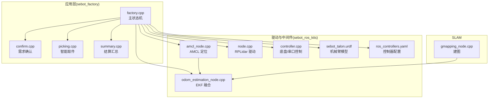
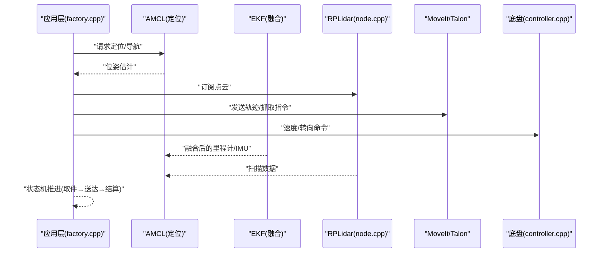
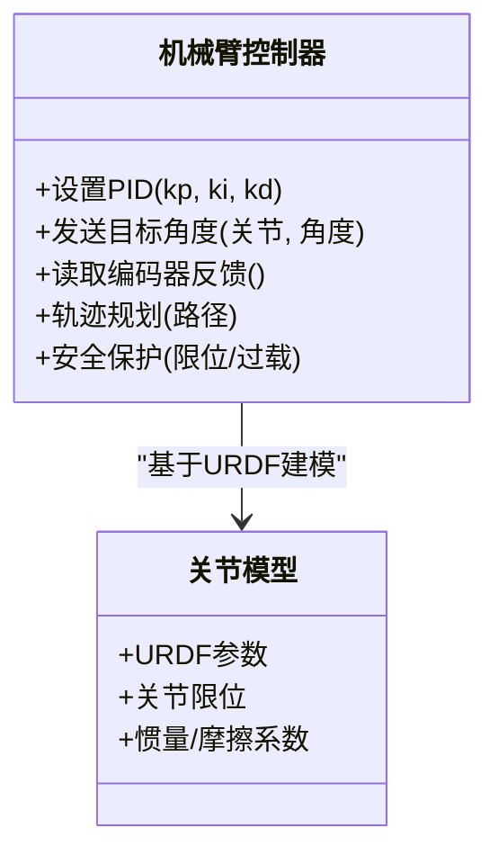
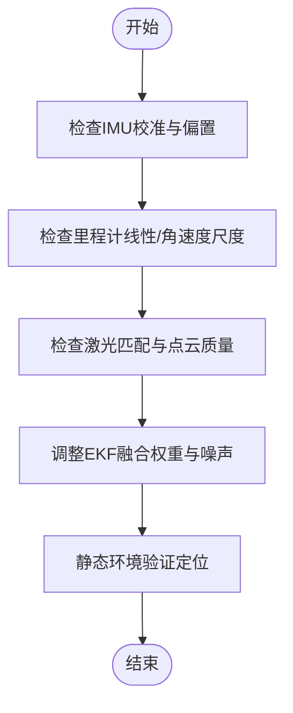
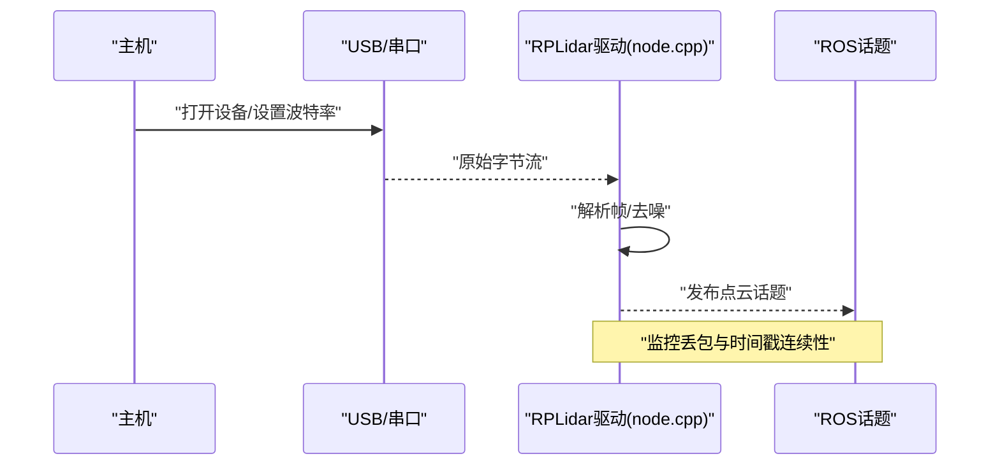
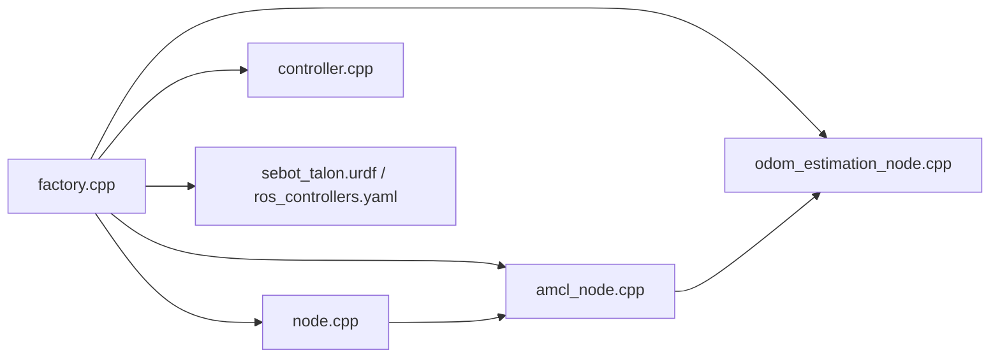

# 硬件控制问题

<cite>
**本文引用的文件**   
- [sebot_factory.launch](file://sebot_factory/launch/sebot_factory.launch)
- [factory.cpp](file://sebot_factory/src/factory.cpp)
- [confirm.cpp](file://sebot_factory/src/confirm.cpp)
- [picking.cpp](file://sebot_factory/src/picking.cpp)
- [summary.cpp](file://sebot_factory/src/summary.cpp)
- [arm.hpp](file://sebot_factory/include/arm.hpp)
- [test_arm.cpp](file://sebot_factory/unit/test_arm.cpp)
- [sebot_talon.urdf](file://sebot_ros_kits/src/sebot_driver/sebot_talon/urdf/sebot_talon.urdf)
- [ros_controllers.yaml](file://sebot_ros_kits/src/sebot_driver/sebot_talon_moveit/config/ros_controllers.yaml)
- [joint_limits.yaml](file://sebot_ros_kits/src/sebot_driver/sebot_talon_moveit/config/joint_limits.yaml)
- [robot_pose_ekf.launch](file://sebot_ros_kits/src/sebot_driver/robot_pose_ekf/launch/robot_pose_ekf.launch)
- [odom_estimation_node.cpp](file://sebot_ros_kits/src/sebot_driver/robot_pose_ekf/src/odom_estimation_node.cpp)
- [nonlinearanalyticconditionalgaussianodo.h](file://sebot_ros_kits/src/sebot_driver/robot_pose_ekf/include/robot_pose_ekf/nonlinearanalyticconditionalgaussianodo.h)
- [rplidar.launch](file://sebot_ros_kits/src/sebot_driver/rplidar_ros/launch/rplidar.launch)
- [node.cpp](file://sebot_ros_kits/src/sebot_driver/rplidar_ros/src/node.cpp)
- [controller.cpp](file://sebot_ros_kits/src/sebot_robot/src/controller.cpp)
- [uart.hpp](file://sebot_ros_kits/src/sebot_robot/include/uart.hpp)
- [sebot_odom.launch](file://sebot_ros_kits/src/sebot_robot/launch/sebot_odom.launch)
- [amcl_node.cpp](file://sebot_ros_kits/src/sebot_navigation/amcl/src/amcl_node.cpp)
- [amcl.launch](file://sebot_ros_kits/src/sebot_navigation/amcl/examples/amcl_diff.launch)
- [gmapping_node.cpp](file://sebot_ros_kits/src/sebot_slam/slam_gmapping/slam_gmapping/gmapping_node.cpp)
- [slam_gmapping.launch](file://sebot_ros_kits/src/sebot_slam/slam_gmapping/slam_gmapping/slam_gmapping.launch)
</cite>

## 目录
1. [简介](#简介)
2. [项目结构](#项目结构)
3. [核心组件](#核心组件)
4. [架构总览](#架构总览)
5. [详细组件分析](#详细组件分析)
6. [依赖关系分析](#依赖关系分析)
7. [性能与稳定性考虑](#性能与稳定性考虑)
8. [故障排查指南](#故障排查指南)
9. [结论](#结论)
10. [附录](#附录)

## 简介
本文件面向机器人竞赛系统的硬件控制问题排查，聚焦机械臂控制（Talon）、电机驱动、传感器通信与融合定位等关键环节。内容覆盖：
- Talon 机械臂 PID 参数调优、关节运动异常、抓取精度不足的诊断与修复建议
- EKF 姿态估计融合错误、轮式里程计数据异常、IMU 校准问题的定位方法
- 串口通信故障、USB 设备连接问题、电源管理相关故障的排查流程
- 硬件接口测试方法、信号质量检测和故障定位技巧
- 结合 sebot_factory、sebot_driver、sebot_robot、导航与 SLAM 模块的集成要点

## 项目结构
仓库由三个相互独立的 catkin 工作空间组成：
- sebot_factory：应用层业务节点（工厂状态机、需求确认、取件、结算）
- sebot_ros_kits：机器人驱动与中间件（Talon 机械臂、RPLidar、EKF、AMCL、SLAM、底盘控制）
- sebot_ros_stdr：仿真环境（STDR 仿真器及示例）

运行配置集中在 launch/sebot_factory.launch，其中 simulation 参数切换 STDR 仿真模式、debug 参数控制图像识别界面开关；导航超时、PID、取件距离、补扫参数等均在此配置。

图表来源
- [factory.cpp](file://sebot_factory/src/factory.cpp)
- [confirm.cpp](file://sebot_factory/src/confirm.cpp)
- [picking.cpp](file://sebot_factory/src/picking.cpp)
- [summary.cpp](file://sebot_factory/src/summary.cpp)
- [amcl_node.cpp](file://sebot_ros_kits/src/sebot_navigation/amcl/src/amcl_node.cpp)
- [odom_estimation_node.cpp](file://sebot_ros_kits/src/sebot_driver/robot_pose_ekf/src/odom_estimation_node.cpp)
- [node.cpp](file://sebot_ros_kits/src/sebot_driver/rplidar_ros/src/node.cpp)
- [controller.cpp](file://sebot_ros_kits/src/sebot_robot/src/controller.cpp)
- [sebot_talon.urdf](file://sebot_ros_kits/src/sebot_driver/sebot_talon/urdf/sebot_talon.urdf)
- [ros_controllers.yaml](file://sebot_ros_kits/src/sebot_driver/sebot_talon_moveit/config/ros_controllers.yaml)

章节来源
- [sebot_factory.launch](file://sebot_factory/launch/sebot_factory.launch)
- [factory.cpp](file://sebot_factory/src/factory.cpp)

## 核心组件
- 应用层状态机：factory.cpp 实现比赛全链路状态机，协调导航、视觉、机械臂与结算流程
- 机械臂控制：Talon URDF + MoveIt! 控制器配置，通过 ros_controllers.yaml 定义 PID/轨迹执行策略
- 定位与融合：AMCL 粒子滤波 + EKF 融合 IMU/里程计/激光，输出稳定位姿
- 传感器驱动：RPLidar 点云采集、串口/USB 通信底层由 controller.cpp 与 uart.hpp 封装
- 建图：Gmapping/Hector 提供地图构建能力，供 AMCL 使用

章节来源
- [factory.cpp](file://sebot_factory/src/factory.cpp)
- [ros_controllers.yaml](file://sebot_ros_kits/src/sebot_driver/sebot_talon_moveit/config/ros_controllers.yaml)
- [amcl_node.cpp](file://sebot_ros_kits/src/sebot_navigation/amcl/src/amcl_node.cpp)
- [odom_estimation_node.cpp](file://sebot_ros_kits/src/sebot_driver/robot_pose_ekf/src/odom_estimation_node.cpp)
- [node.cpp](file://sebot_ros_kits/src/sebot_driver/rplidar_ros/src/node.cpp)
- [controller.cpp](file://sebot_ros_kits/src/sebot_robot/src/controller.cpp)
- [uart.hpp](file://sebot_ros_kits/src/sebot_robot/include/uart.hpp)

## 架构总览
系统以 ROS 1 + catkin 为核心，上层业务节点通过主题与服务调用驱动层与感知层，形成“感知—定位—规划—控制”闭环。

图表来源
- [factory.cpp](file://sebot_factory/src/factory.cpp)
- [amcl_node.cpp](file://sebot_ros_kits/src/sebot_navigation/amcl/src/amcl_node.cpp)
- [odom_estimation_node.cpp](file://sebot_ros_kits/src/sebot_driver/robot_pose_ekf/src/odom_estimation_node.cpp)
- [node.cpp](file://sebot_ros_kits/src/sebot_driver/rplidar_ros/src/node.cpp)
- [controller.cpp](file://sebot_ros_kits/src/sebot_robot/src/controller.cpp)

## 详细组件分析

### 机械臂控制（Talon）与 PID 调优
- 模型与控制器：sebot_talon.urdf 描述连杆与关节，ros_controllers.yaml 定义控制器类型与参数，joint_limits.yaml 限制关节范围与速度
- 常见问题：
  - 关节抖动/过冲：增大阻尼或降低比例增益，检查负载与摩擦
  - 跟踪误差大：提高比例增益，适度增加积分项消除稳态误差
  - 抓取精度不足：优化末端标定、调整轨迹插值与加减速曲线，提升编码器分辨率或滤波
- 调试建议：
  - 使用 unit/test_arm.cpp 进行单关节步进与回零验证
  - 在 RViz 中观察关节角度与实际反馈差异，逐步逼近目标
  - 记录不同参数下的响应曲线，避免同时调整多个参数

图表来源
- [sebot_talon.urdf](file://sebot_ros_kits/src/sebot_driver/sebot_talon/urdf/sebot_talon.urdf)
- [ros_controllers.yaml](file://sebot_ros_kits/src/sebot_driver/sebot_talon_moveit/config/ros_controllers.yaml)
- [joint_limits.yaml](file://sebot_ros_kits/src/sebot_driver/sebot_talon_moveit/config/joint_limits.yaml)
- [test_arm.cpp](file://sebot_factory/unit/test_arm.cpp)

章节来源
- [sebot_talon.urdf](file://sebot_ros_kits/src/sebot_driver/sebot_talon/urdf/sebot_talon.urdf)
- [ros_controllers.yaml](file://sebot_ros_kits/src/sebot_driver/sebot_talon_moveit/config/ros_controllers.yaml)
- [joint_limits.yaml](file://sebot_ros_kits/src/sebot_driver/sebot_talon_moveit/config/joint_limits.yaml)
- [test_arm.cpp](file://sebot_factory/unit/test_arm.cpp)

### 定位与融合（AMCL + EKF）
- AMCL：基于激光扫描与先验地图进行粒子滤波定位，对初始位姿与地图质量敏感
- EKF：融合 IMU、轮式里程计与激光观测，输出更稳定的位姿与协方差
- 常见问题：
  - 融合发散：IMU偏置未校准、里程计跳变、激光匹配失败
  - 定位漂移：地图不匹配、动态物体干扰、粒子数不足
  - 初始化失败：初始位姿偏差过大或缺少有效观测
- 调试建议：
  - 检查 robot_pose_ekf.launch 中的传感器权重与噪声参数
  - 观察 odom_estimation_node 输出的协方差与残差
  - 在静态环境中验证 IMU 零偏与尺度因子

图表来源
- [amcl_node.cpp](file://sebot_ros_kits/src/sebot_navigation/amcl/src/amcl_node.cpp)
- [odom_estimation_node.cpp](file://sebot_ros_kits/src/sebot_driver/robot_pose_ekf/src/odom_estimation_node.cpp)
- [nonlinearanalyticconditionalgaussianodo.h](file://sebot_ros_kits/src/sebot_driver/robot_pose_ekf/include/robot_pose_ekf/nonlinearanalyticconditionalgaussianodo.h)
- [robot_pose_ekf.launch](file://sebot_ros_kits/src/sebot_driver/robot_pose_ekf/launch/robot_pose_ekf.launch)

章节来源
- [amcl_node.cpp](file://sebot_ros_kits/src/sebot_navigation/amcl/src/amcl_node.cpp)
- [odom_estimation_node.cpp](file://sebot_ros_kits/src/sebot_driver/robot_pose_ekf/src/odom_estimation_node.cpp)
- [robot_pose_ekf.launch](file://sebot_ros_kits/src/sebot_driver/robot_pose_ekf/launch/robot_pose_ekf.launch)

### 传感器通信（RPLidar、串口/USB）
- RPLidar：通过 node.cpp 解析 SDK 数据并发布点云，注意波特率、帧率与丢包
- 串口/USB：controller.cpp 与 uart.hpp 封装底层读写，需校验端口权限、流控与缓冲区溢出
- 常见问题：
  - 点云缺失/延迟：USB 带宽不足、驱动版本不匹配、雷达供电不稳
  - 串口无响应：端口占用、权限不足、波特率不一致、线缆接触不良
- 调试建议：
  - 使用 rplidar.launch 启动并检查话题是否发布
  - 通过 dmesg/lsusb 查看设备枚举与错误信息
  - 使用串口工具验证收发数据一致性

图表来源
- [node.cpp](file://sebot_ros_kits/src/sebot_driver/rplidar_ros/src/node.cpp)
- [rplidar.launch](file://sebot_ros_kits/src/sebot_driver/rplidar_ros/launch/rplidar.launch)
- [controller.cpp](file://sebot_ros_kits/src/sebot_robot/src/controller.cpp)
- [uart.hpp](file://sebot_ros_kits/src/sebot_robot/include/uart.hpp)

章节来源
- [node.cpp](file://sebot_ros_kits/src/sebot_driver/rplidar_ros/src/node.cpp)
- [rplidar.launch](file://sebot_ros_kits/src/sebot_driver/rplidar_ros/launch/rplidar.launch)
- [controller.cpp](file://sebot_ros_kits/src/sebot_robot/src/controller.cpp)
- [uart.hpp](file://sebot_ros_kits/src/sebot_robot/include/uart.hpp)

### 底盘控制与电源管理
- 底盘控制：controller.cpp 负责速度/转向命令下发，配合 sebot_odom.launch 发布里程计
- 电源管理：关注电机驱动板供电、主控供电与热保护，避免电压跌落导致重启
- 常见问题：
  - 运动卡顿/失步：电流限幅过低、电池内阻过大、PWM频率不当
  - 系统重启：电源纹波过大、接地不良、瞬时功耗峰值
- 调试建议：
  - 监测电机电流与电压波形，确保裕量充足
  - 分阶段上电，避免多设备同时启动造成浪涌
  - 使用示波器检测关键信号边沿与噪声

章节来源
- [controller.cpp](file://sebot_ros_kits/src/sebot_robot/src/controller.cpp)
- [sebot_odom.launch](file://sebot_ros_kits/src/sebot_robot/launch/sebot_odom.launch)

## 依赖关系分析
- 应用层依赖导航与感知：factory.cpp 调用 AMCL/EKF/RPLidar/底盘/机械臂
- 定位依赖传感器：AMCL 依赖激光，EKF 依赖 IMU/里程计
- 机械臂依赖控制器与模型：MoveIt/Talon 依赖 URDF 与控制器参数
- 传感器依赖底层驱动：RPLidar/串口均依赖驱动与硬件抽象

图表来源
- [factory.cpp](file://sebot_factory/src/factory.cpp)
- [amcl_node.cpp](file://sebot_ros_kits/src/sebot_navigation/amcl/src/amcl_node.cpp)
- [odom_estimation_node.cpp](file://sebot_ros_kits/src/sebot_driver/robot_pose_ekf/src/odom_estimation_node.cpp)
- [node.cpp](file://sebot_ros_kits/src/sebot_driver/rplidar_ros/src/node.cpp)
- [controller.cpp](file://sebot_ros_kits/src/sebot_robot/src/controller.cpp)
- [sebot_talon.urdf](file://sebot_ros_kits/src/sebot_driver/sebot_talon/urdf/sebot_talon.urdf)
- [ros_controllers.yaml](file://sebot_ros_kits/src/sebot_driver/sebot_talon_moveit/config/ros_controllers.yaml)

章节来源
- [factory.cpp](file://sebot_factory/src/factory.cpp)
- [amcl_node.cpp](file://sebot_ros_kits/src/sebot_navigation/amcl/src/amcl_node.cpp)
- [odom_estimation_node.cpp](file://sebot_ros_kits/src/sebot_driver/robot_pose_ekf/src/odom_estimation_node.cpp)
- [node.cpp](file://sebot_ros_kits/src/sebot_driver/rplidar_ros/src/node.cpp)
- [controller.cpp](file://sebot_ros_kits/src/sebot_robot/src/controller.cpp)
- [sebot_talon.urdf](file://sebot_ros_kits/src/sebot_driver/sebot_talon/urdf/sebot_talon.urdf)
- [ros_controllers.yaml](file://sebot_ros_kits/src/sebot_driver/sebot_talon_moveit/config/ros_controllers.yaml)

## 性能与稳定性考虑
- 机械臂：合理设置 PID 与轨迹平滑参数，避免高频振荡；增加末端力矩/位置限幅保护
- 定位：AMCL 粒子数与激光匹配阈值需平衡精度与计算开销；EKF 噪声矩阵应反映真实传感器特性
- 传感器：RPLidar 点云滤波与降采样减少 CPU 压力；串口缓冲与异步读写避免阻塞
- 电源：采用独立稳压与去耦电容，降低地环路干扰；关键节点加入看门狗与异常恢复

## 故障排查指南

### 机械臂 PID 调优与抓取精度
- 步骤：
  - 单关节步进测试，记录响应曲线
  - 逐步调整 kp/ki/kd，避免同时变更多个参数
  - 检查末端标定与负载变化对精度的影响
  - 使用 test_arm.cpp 验证回零与重复定位
- 常见症状与对策：
  - 抖动/过冲：降低 kp，增加 kd
  - 稳态误差：适当增加 ki
  - 抓取偏移：重新标定末端坐标系，优化轨迹插值

章节来源
- [test_arm.cpp](file://sebot_factory/unit/test_arm.cpp)
- [ros_controllers.yaml](file://sebot_ros_kits/src/sebot_driver/sebot_talon_moveit/config/ros_controllers.yaml)
- [sebot_talon.urdf](file://sebot_ros_kits/src/sebot_driver/sebot_talon/urdf/sebot_talon.urdf)

### EKF 融合错误与 IMU 校准
- 步骤：
  - 检查 IMU 零偏与尺度因子，静态环境下采集数据
  - 验证里程计线性/角速度尺度，对比实际位移
  - 调整 EKF 权重与噪声矩阵，观察协方差收敛
  - 使用 robot_pose_ekf.launch 与 odom_estimation_node 监控融合状态
- 常见症状与对策：
  - 发散：降低 IMU/里程计权重，检查传感器同步
  - 漂移：增强激光匹配，增加粒子数或地图更新频率

章节来源
- [robot_pose_ekf.launch](file://sebot_ros_kits/src/sebot_driver/robot_pose_ekf/launch/robot_pose_ekf.launch)
- [odom_estimation_node.cpp](file://sebot_ros_kits/src/sebot_driver/robot_pose_ekf/src/odom_estimation_node.cpp)
- [nonlinearanalyticconditionalgaussianodo.h](file://sebot_ros_kits/src/sebot_driver/robot_pose_ekf/include/robot_pose_ekf/nonlinearanalyticconditionalgaussianodo.h)

### 轮式里程计数据异常
- 步骤：
  - 检查编码器接线与脉冲计数逻辑
  - 验证轮径与齿比参数，核对单位换算
  - 观察里程计发布频率与时间戳连续性
- 常见症状与对策：
  - 跳变：滤波处理或更换高质量编码器
  - 方向错误：检查极性与安装方向

章节来源
- [controller.cpp](file://sebot_ros_kits/src/sebot_robot/src/controller.cpp)
- [sebot_odom.launch](file://sebot_ros_kits/src/sebot_robot/launch/sebot_odom.launch)

### 串口通信与 USB 设备连接
- 步骤：
  - 使用 lsusb/dmesg 检查设备枚举与权限
  - 通过串口工具验证波特率与数据格式
  - 监控 driver 日志，定位解析错误与超时
- 常见症状与对策：
  - 无响应：检查端口占用、权限与线缆
  - 数据乱码：确认波特率一致，增加校验与重传机制

章节来源
- [node.cpp](file://sebot_ros_kits/src/sebot_driver/rplidar_ros/src/node.cpp)
- [controller.cpp](file://sebot_ros_kits/src/sebot_robot/src/controller.cpp)
- [uart.hpp](file://sebot_ros_kits/src/sebot_robot/include/uart.hpp)

### 电源管理与系统重启
- 步骤：
  - 测量关键节点电压与纹波
  - 分阶段上电，避免浪涌
  - 检查接地与屏蔽，减少干扰
- 常见症状与对策：
  - 重启：增加电容与稳压模块，优化布线
  - 掉电：升级电源容量，降低瞬时功耗峰值

章节来源
- [controller.cpp](file://sebot_ros_kits/src/sebot_robot/src/controller.cpp)

## 结论
通过分层排查与参数化调优，可有效解决机械臂 PID、EKF 融合、传感器通信与电源管理等硬件控制问题。建议建立标准化测试流程与日志采集规范，提升故障定位效率与系统稳定性。

## 附录
- 常用命令与工具：rostopic、rosbag、dmesg、lsusb、串口终端、示波器
- 参考文档：各模块 README 与官方文档，结合本项目 launch 与参数文件进行定制