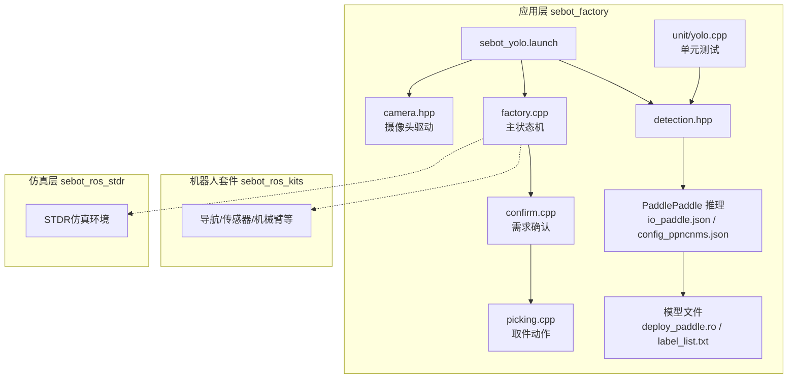
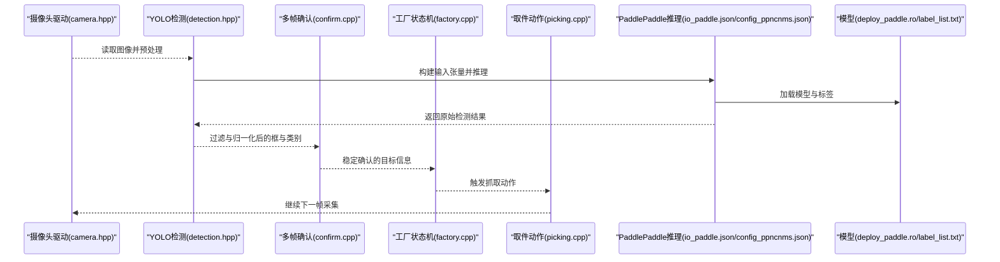
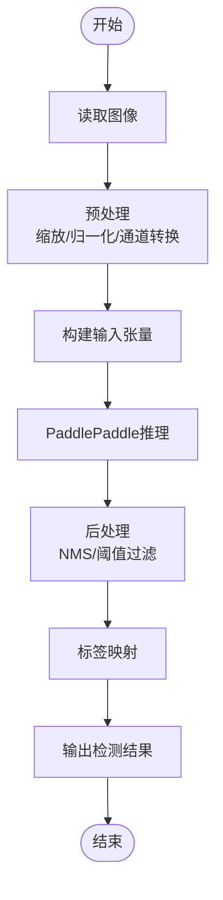
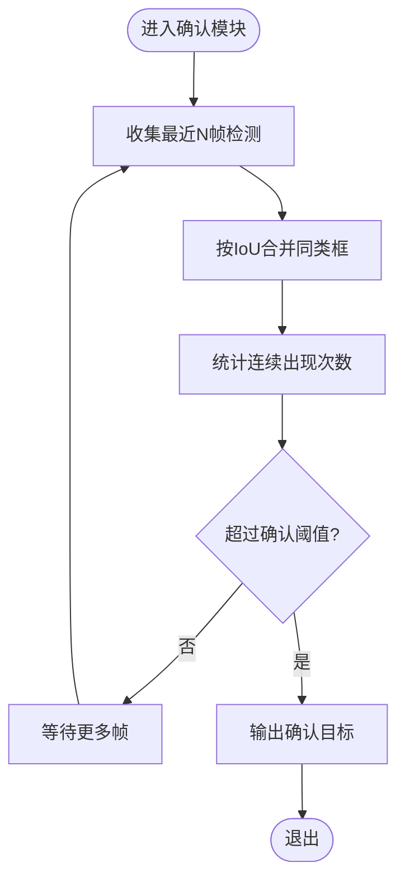
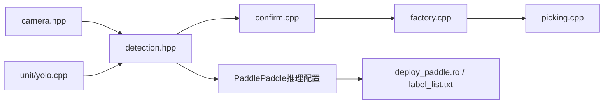

# 视觉识别问题

<cite>
**本文引用的文件**   
- [sebot_yolo.launch](file://sebot_factory/src/sebot_factory/launch/sebot_yolo.launch)
- [factory.cpp](file://sebot_factory/src/sebot_factory/src/factory.cpp)
- [confirm.cpp](file://sebot_factory/src/sebot_factory/src/confirm.cpp)
- [picking.cpp](file://sebot_factory/src/sebot_factory/src/picking.cpp)
- [detection.hpp](file://sebot_factory/src/sebot_factory/include/detection.hpp)
- [camera.hpp](file://sebot_factory/src/sebot_factory/include/camera.hpp)
- [io_paddle.json](file://sebot_factory/src/sebot_factory/res/inference/io_paddle.json)
- [config_ppncnms.json](file://sebot_factory/src/sebot_factory/res/inference/config_ppncnms.json)
- [label_list.txt](file://sebot_factory/src/sebot_factory/res/inference/label_list.txt)
- [deploy_paddle.ro](file://sebot_factory/src/sebot_factory/res/inference/deploy_paddle.ro)
- [unit/yolo.cpp](file://sebot_factory/src/sebot_factory/unit/yolo.cpp)
- [sebot_factory.launch](file://sebot_factory/src/sebot_factory/launch/sebot_factory.launch)
</cite>

## 目录
1. [简介](#简介)
2. [项目结构](#项目结构)
3. [核心组件](#核心组件)
4. [架构总览](#架构总览)
5. [详细组件分析](#详细组件分析)
6. [依赖关系分析](#依赖关系分析)
7. [性能与资源监控](#性能与资源监控)
8. [故障排查指南](#故障排查指南)
9. [结论](#结论)
10. [附录：参数与配置清单](#附录参数与配置清单)

## 简介
本文件面向机器人竞赛系统中的“视觉识别”模块，聚焦YOLO目标检测在PaddlePaddle推理引擎上的部署与调试。内容覆盖模型加载失败、NPU推理加速异常、图像预处理错误、检测结果不准确、多帧确认机制调试、置信度阈值调整、标签映射错误处理、GPU/NPU资源监控、内存泄漏检测、推理性能优化以及效果评估方法。文档同时给出常见问题的定位步骤与解决方案，帮助快速恢复系统运行并提升识别稳定性。

## 项目结构
本项目由三个相互独立的catkin工作空间组成：应用层 sebot_factory、机器人套件 sebot_ros_kits、仿真层 sebot_ros_stdr。视觉识别相关代码主要集中在 sebot_factory 包内，包括：
- 启动与配置：launch 脚本（如 sebot_yolo.launch、sebot_factory.launch）
- 业务状态机与流程控制：factory.cpp、confirm.cpp、picking.cpp
- 视觉接口与摄像头驱动：detection.hpp、camera.hpp
- PaddlePaddle推理配置与模型：io_paddle.json、config_ppncnms.json、label_list.txt、deploy_paddle.ro
- 单元测试与验证：unit/yolo.cpp

图表来源
- [sebot_yolo.launch](file://sebot_factory/src/sebot_factory/launch/sebot_yolo.launch)
- [factory.cpp](file://sebot_factory/src/sebot_factory/src/factory.cpp)
- [confirm.cpp](file://sebot_factory/src/sebot_factory/src/confirm.cpp)
- [picking.cpp](file://sebot_factory/src/sebot_factory/src/picking.cpp)
- [detection.hpp](file://sebot_factory/src/sebot_factory/include/detection.hpp)
- [camera.hpp](file://sebot_factory/src/sebot_factory/include/camera.hpp)
- [io_paddle.json](file://sebot_factory/src/sebot_factory/res/inference/io_paddle.json)
- [config_ppncnms.json](file://sebot_factory/src/sebot_factory/res/inference/config_ppncnms.json)
- [label_list.txt](file://sebot_factory/src/sebot_factory/res/inference/label_list.txt)
- [deploy_paddle.ro](file://sebot_factory/src/sebot_factory/res/inference/deploy_paddle.ro)
- [unit/yolo.cpp](file://sebot_factory/src/sebot_factory/unit/yolo.cpp)

章节来源
- [sebot_yolo.launch](file://sebot_factory/src/sebot_factory/launch/sebot_yolo.launch)
- [sebot_factory.launch](file://sebot_factory/src/sebot_factory/launch/sebot_factory.launch)

## 核心组件
- 视觉检测接口 detection.hpp：封装YOLO推理调用、输入预处理、输出后处理、标签映射与结果过滤。
- 摄像头驱动 camera.hpp：负责图像采集、格式转换、分辨率与帧率设置、设备连接与错误处理。
- PaddlePaddle推理配置：
  - io_paddle.json：定义输入输出张量名称、形状、数据类型及NPU/GPU后端选择。
  - config_ppncnms.json：非极大值抑制（NMS）参数、类别数、锚框配置等。
  - deploy_paddle.ro：PaddlePaddle导出模型文件。
  - label_list.txt：类别标签映射表。
- 业务状态机 factory.cpp：协调导航、视觉搜索、确认与抓取流程。
- 需求确认 confirm.cpp：基于多帧检测的确认逻辑，降低误检。
- 取件动作 picking.cpp：结合视觉结果执行机械臂抓取。
- 单元测试 unit/yolo.cpp：对YOLO推理链路进行离线验证。

章节来源
- [detection.hpp](file://sebot_factory/src/sebot_factory/include/detection.hpp)
- [camera.hpp](file://sebot_factory/src/sebot_factory/include/camera.hpp)
- [io_paddle.json](file://sebot_factory/src/sebot_factory/res/inference/io_paddle.json)
- [config_ppncnms.json](file://sebot_factory/src/sebot_factory/res/inference/config_ppncnms.json)
- [label_list.txt](file://sebot_factory/src/sebot_factory/res/inference/label_list.txt)
- [deploy_paddle.ro](file://sebot_factory/src/sebot_factory/res/inference/deploy_paddle.ro)
- [factory.cpp](file://sebot_factory/src/sebot_factory/src/factory.cpp)
- [confirm.cpp](file://sebot_factory/src/sebot_factory/src/confirm.cpp)
- [picking.cpp](file://sebot_factory/src/sebot_factory/src/picking.cpp)
- [unit/yolo.cpp](file://sebot_factory/src/sebot_factory/unit/yolo.cpp)

## 架构总览
视觉识别子系统以ROS节点形式运行，通过launch脚本启动。数据流从摄像头驱动到YOLO推理再到业务状态机，最终驱动机械臂完成抓取。

图表来源
- [camera.hpp](file://sebot_factory/src/sebot_factory/include/camera.hpp)
- [detection.hpp](file://sebot_factory/src/sebot_factory/include/detection.hpp)
- [confirm.cpp](file://sebot_factory/src/sebot_factory/src/confirm.cpp)
- [factory.cpp](file://sebot_factory/src/sebot_factory/src/factory.cpp)
- [picking.cpp](file://sebot_factory/src/sebot_factory/src/picking.cpp)
- [io_paddle.json](file://sebot_factory/src/sebot_factory/res/inference/io_paddle.json)
- [config_ppncnms.json](file://sebot_factory/src/sebot_factory/res/inference/config_ppncnms.json)
- [deploy_paddle.ro](file://sebot_factory/src/sebot_factory/res/inference/deploy_paddle.ro)
- [label_list.txt](file://sebot_factory/src/sebot_factory/res/inference/label_list.txt)

## 详细组件分析

### YOLO推理与预处理（detection.hpp + PaddlePaddle配置）
- 输入预处理：图像缩放、归一化、通道顺序转换（BGR/RGB）、数据类型对齐。
- 推理后端：根据io_paddle.json选择CPU/GPU/NPU；NPU需确保驱动与运行时版本匹配。
- 输出后处理：解析预测框、类别得分、NMS（config_ppncnms.json），生成最终检测结果。
- 标签映射：依据label_list.txt将类别索引映射为可读标签。

图表来源
- [detection.hpp](file://sebot_factory/src/sebot_factory/include/detection.hpp)
- [io_paddle.json](file://sebot_factory/src/sebot_factory/res/inference/io_paddle.json)
- [config_ppncnms.json](file://sebot_factory/src/sebot_factory/res/inference/config_ppncnms.json)
- [label_list.txt](file://sebot_factory/src/sebot_factory/res/inference/label_list.txt)

章节来源
- [detection.hpp](file://sebot_factory/src/sebot_factory/include/detection.hpp)
- [io_paddle.json](file://sebot_factory/src/sebot_factory/res/inference/io_paddle.json)
- [config_ppncnms.json](file://sebot_factory/src/sebot_factory/res/inference/config_ppncnms.json)
- [label_list.txt](file://sebot_factory/src/sebot_factory/res/inference/label_list.txt)

### 摄像头驱动（camera.hpp）
- 设备连接：检查摄像头设备是否存在、权限是否正确。
- 图像格式：支持多种像素格式（如BGR8U、YUV等），需与预处理一致。
- 分辨率与帧率：影响推理速度与精度，需在launch或参数中配置。
- 错误处理：断线重连、超时重试、异常日志记录。

章节来源
- [camera.hpp](file://sebot_factory/src/sebot_factory/include/camera.hpp)

### 多帧检测确认（confirm.cpp）
- 目的：降低单帧误检，提高稳定性。
- 策略：滑动窗口统计同一目标的连续出现次数，达到阈值后确认为有效目标。
- 参数：窗口大小、最小连续帧数、时间窗口、IoU合并策略。
- 调试：打印每帧检测结果、确认计数、合并前后的框变化。

图表来源
- [confirm.cpp](file://sebot_factory/src/sebot_factory/src/confirm.cpp)

章节来源
- [confirm.cpp](file://sebot_factory/src/sebot_factory/src/confirm.cpp)

### 工厂状态机与业务流程（factory.cpp）
- 状态流转：上电自检 → 加载地图与定位 → 导航至取件台 → 视觉搜索 → 需求确认 → 抓取 → 送达结算。
- 视觉集成：在“视觉搜索”阶段调用detection.hpp与confirm.cpp，获取稳定目标后进入抓取。
- 参数控制：导航超时、PID、取件距离、补扫等关键参数在launch中配置。

章节来源
- [factory.cpp](file://sebot_factory/src/sebot_factory/src/factory.cpp)
- [sebot_factory.launch](file://sebot_factory/src/sebot_factory/launch/sebot_factory.launch)

### 取件动作（picking.cpp）
- 输入：确认后的目标位置与姿态。
- 执行：机械臂运动规划与抓取闭环控制（PID）。
- 反馈：抓取成功与否的状态上报，用于后续导航与结算。

章节来源
- [picking.cpp](file://sebot_factory/src/sebot_factory/src/picking.cpp)

### 单元测试（unit/yolo.cpp）
- 用途：离线验证YOLO推理链路，包括模型加载、预处理、推理、后处理与标签映射。
- 场景：使用样本图像与已知标注对比，评估精度与耗时。

章节来源
- [unit/yolo.cpp](file://sebot_factory/src/sebot_factory/unit/yolo.cpp)

## 依赖关系分析
- detection.hpp 依赖 camera.hpp（图像输入）、PaddlePaddle推理库（io_paddle.json、config_ppncnms.json、deploy_paddle.ro、label_list.txt）。
- confirm.cpp 依赖 detection.hpp 的输出。
- factory.cpp 协调 confirm.cpp 与 picking.cpp，并通过 launch 脚本注入参数。
- unit/yolo.cpp 独立验证 detection.hpp 的推理链路。

图表来源
- [camera.hpp](file://sebot_factory/src/sebot_factory/include/camera.hpp)
- [detection.hpp](file://sebot_factory/src/sebot_factory/include/detection.hpp)
- [confirm.cpp](file://sebot_factory/src/sebot_factory/src/confirm.cpp)
- [factory.cpp](file://sebot_factory/src/sebot_factory/src/factory.cpp)
- [picking.cpp](file://sebot_factory/src/sebot_factory/src/picking.cpp)
- [io_paddle.json](file://sebot_factory/src/sebot_factory/res/inference/io_paddle.json)
- [config_ppncnms.json](file://sebot_factory/src/sebot_factory/res/inference/config_ppncnms.json)
- [deploy_paddle.ro](file://sebot_factory/src/sebot_factory/res/inference/deploy_paddle.ro)
- [label_list.txt](file://sebot_factory/src/sebot_factory/res/inference/label_list.txt)
- [unit/yolo.cpp](file://sebot_factory/src/sebot_factory/unit/yolo.cpp)

## 性能与资源监控
- GPU/NPU资源监控：
  - NPU：使用厂商工具（如昇腾CANN）查看算力占用、显存使用、温度与功耗。
  - GPU：使用nvidia-smi监控显存与利用率。
- 内存泄漏检测：
  - 使用valgrind或AddressSanitizer检测C++内存问题。
  - 关注PaddlePaddle张量生命周期，避免重复分配。
- 推理性能优化：
  - 调整图像分辨率与批次大小。
  - 启用NPU/GPU加速，确保驱动与运行时版本匹配。
  - 优化预处理流水线，减少拷贝与格式转换开销。
  - 合理设置NMS与置信度阈值，减少无效计算。

## 故障排查指南

### 模型加载失败
- 可能原因：
  - 模型路径错误或文件损坏。
  - io_paddle.json中输入输出张量名称/形状不匹配。
  - 后端（CPU/GPU/NPU）未正确配置或驱动缺失。
- 排查步骤：
  - 校验deploy_paddle.ro与label_list.txt存在且完整。
  - 检查io_paddle.json中的张量配置与模型导出一致。
  - 确认后端环境变量与驱动版本匹配。
  - 使用unit/yolo.cpp进行离线加载测试。

章节来源
- [io_paddle.json](file://sebot_factory/src/sebot_factory/res/inference/io_paddle.json)
- [deploy_paddle.ro](file://sebot_factory/src/sebot_factory/res/inference/deploy_paddle.ro)
- [label_list.txt](file://sebot_factory/src/sebot_factory/res/inference/label_list.txt)
- [unit/yolo.cpp](file://sebot_factory/src/sebot_factory/unit/yolo.cpp)

### NPU推理加速异常
- 可能原因：
  - NPU驱动或固件版本不兼容。
  - 模型未针对NPU优化或量化配置错误。
  - 内存不足或并发过高。
- 排查步骤：
  - 检查NPU驱动与CANN版本。
  - 确认io_paddle.json中backend设置为NPU。
  - 监控NPU资源使用，降低并发或分辨率。
  - 使用厂商工具进行性能剖析。

章节来源
- [io_paddle.json](file://sebot_factory/src/sebot_factory/res/inference/io_paddle.json)

### 图像预处理错误
- 可能原因：
  - 图像格式不匹配（BGR/RGB、通道顺序）。
  - 尺寸缩放或归一化参数错误。
  - 数据类型不一致（uint8 vs float32）。
- 排查步骤：
  - 核对camera.hpp输出的像素格式与detection.hpp期望一致。
  - 检查预处理参数（resize、normalize、mean/std）。
  - 打印中间张量形状与范围进行验证。

章节来源
- [camera.hpp](file://sebot_factory/src/sebot_factory/include/camera.hpp)
- [detection.hpp](file://sebot_factory/src/sebot_factory/include/detection.hpp)

### 检测结果不准确
- 可能原因：
  - 置信度阈值过低导致误检。
  - NMS参数不当造成框重叠或漏检。
  - 标签映射错误。
  - 光照或遮挡影响。
- 排查步骤：
  - 调整置信度阈值与NMS IoU阈值。
  - 检查label_list.txt与模型类别顺序一致。
  - 使用unit/yolo.cpp在样本集上评估mAP与召回率。
  - 增加多帧确认以减少瞬时误检。

章节来源
- [config_ppncnms.json](file://sebot_factory/src/sebot_factory/res/inference/config_ppncnms.json)
- [label_list.txt](file://sebot_factory/src/sebot_factory/res/inference/label_list.txt)
- [confirm.cpp](file://sebot_factory/src/sebot_factory/src/confirm.cpp)
- [unit/yolo.cpp](file://sebot_factory/src/sebot_factory/unit/yolo.cpp)

### 摄像头驱动问题
- 可能原因：
  - 设备权限不足或路径错误。
  - 分辨率/帧率设置不支持。
  - 驱动崩溃或断线。
- 排查步骤：
  - 检查设备节点权限与路径。
  - 尝试不同分辨率与帧率组合。
  - 实现断线重连与异常日志。

章节来源
- [camera.hpp](file://sebot_factory/src/sebot_factory/include/camera.hpp)

### 多帧检测确认机制调试
- 建议：
  - 打印每帧检测框、类别与置信度。
  - 观察确认计数随帧数的变化曲线。
  - 调整窗口大小与连续阈值，平衡实时性与稳定性。

章节来源
- [confirm.cpp](file://sebot_factory/src/sebot_factory/src/confirm.cpp)

### 置信度阈值调整
- 方法：
  - 在detection.hpp或config_ppncnms.json中调整阈值。
  - 使用验证集绘制PR曲线，选择合适阈值。
  - 结合业务需求权衡召回率与准确率。

章节来源
- [config_ppncnms.json](file://sebot_factory/src/sebot_factory/res/inference/config_ppncnms.json)
- [detection.hpp](file://sebot_factory/src/sebot_factory/include/detection.hpp)

### 标签映射错误处理
- 方法：
  - 确保label_list.txt顺序与模型输出一致。
  - 添加映射校验与告警。
  - 在单元测试中验证映射正确性。

章节来源
- [label_list.txt](file://sebot_factory/src/sebot_factory/res/inference/label_list.txt)
- [unit/yolo.cpp](file://sebot_factory/src/sebot_factory/unit/yolo.cpp)

### GPU/NPU资源监控与内存泄漏检测
- 监控：
  - NPU：使用厂商工具查看算力、显存、温度。
  - GPU：nvidia-smi监控显存与利用率。
- 内存泄漏：
  - valgrind或AddressSanitizer检测。
  - 关注PaddlePaddle张量生命周期与缓存。

### 推理性能优化
- 优化点：
  - 降低输入分辨率与批次大小。
  - 启用NPU/GPU加速。
  - 减少预处理拷贝与格式转换。
  - 合理设置NMS与阈值。

## 结论
视觉识别系统在机器人竞赛中承担关键角色。通过规范化的PaddlePaddle推理配置、稳健的摄像头驱动、有效的多帧确认机制与完善的性能监控，可显著提升YOLO目标检测的准确性与稳定性。遇到问题时，应遵循“模型加载→预处理→推理→后处理→确认→动作”的链路逐步排查，并结合单元测试与资源监控工具定位瓶颈与缺陷。

## 附录：参数与配置清单
- 启动与模式切换：
  - simulation：切换STDR仿真模式。
  - debug：控制图像识别界面开关。
- 导航与控制：
  - 导航超时、PID参数、取件距离、补扫参数等。
- 推理与模型：
  - io_paddle.json：输入输出张量、后端选择。
  - config_ppncnms.json：NMS参数、类别数、锚框。
  - deploy_paddle.ro：模型文件。
  - label_list.txt：类别标签映射。

章节来源
- [sebot_factory.launch](file://sebot_factory/src/sebot_factory/launch/sebot_factory.launch)
- [io_paddle.json](file://sebot_factory/src/sebot_factory/res/inference/io_paddle.json)
- [config_ppncnms.json](file://sebot_factory/src/sebot_factory/res/inference/config_ppncnms.json)
- [deploy_paddle.ro](file://sebot_factory/src/sebot_factory/res/inference/deploy_paddle.ro)
- [label_list.txt](file://sebot_factory/src/sebot_factory/res/inference/label_list.txt)