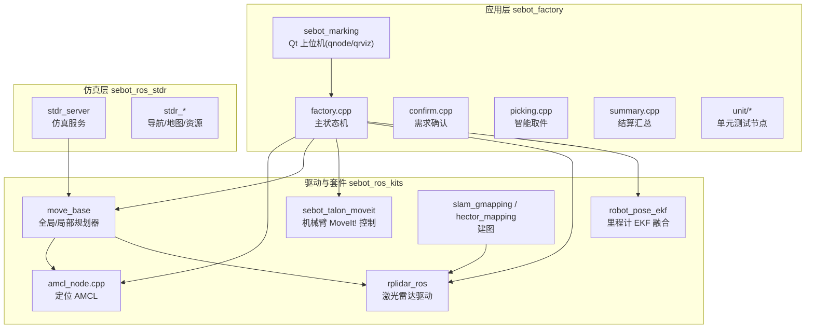
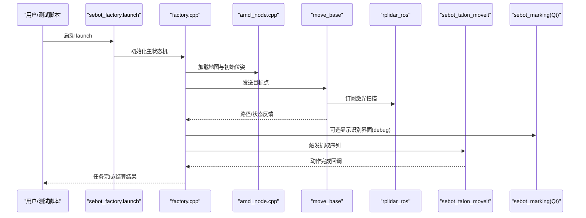
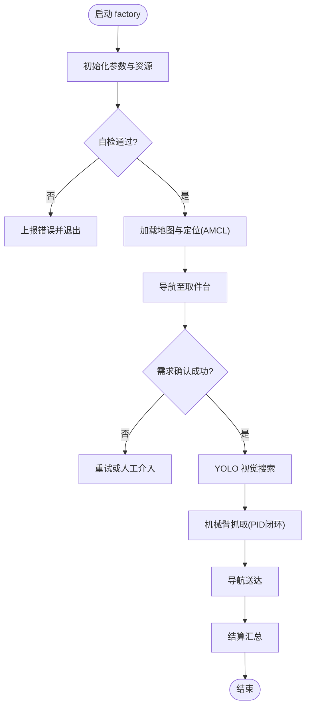
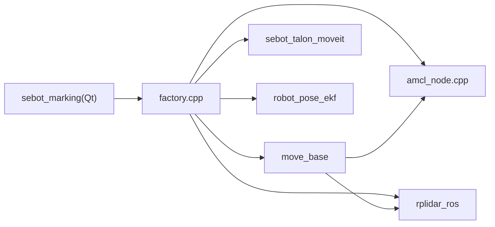

# 调试工具使用

<cite>
**本文引用的文件**   
- [sebot_factory.launch](file://sebot_factory/src/sebot_factory/launch/sebot_factory.launch)
- [factory.cpp](file://sebot_factory/src/sebot_factory/src/factory.cpp)
- [confirm.cpp](file://sebot_factory/src/sebot_factory/src/confirm.cpp)
- [picking.cpp](file://sebot_factory/src/sebot_factory/src/picking.cpp)
- [summary.cpp](file://sebot_factory/src/sebot_factory/src/summary.cpp)
- [test_arm.cpp](file://sebot_factory/src/sebot_factory/unit/test_arm.cpp)
- [qnode.hpp](file://sebot_factory/src/sebot_marking/include/qnode.hpp)
- [qrviz.hpp](file://sebot_factory/src/sebot_marking/include/qrviz.hpp)
- [addtopics.h](file://sebot_factory/src/sebot_marking/include/addtopics.h)
- [slam.h](file://sebot_factory/src/sebot_marking/include/slam.h)
- [rplidar.rviz](file://sebot_ros_kits/src/sebot_driver/rplidar_ros/rviz/rplidar.rviz)
- [odom.rviz](file://sebot_ros_kits/src/sebot_robot/rviz/odom.rviz)
- [robot_pose_ekf.launch](file://sebot_ros_kits/src/sebot_driver/robot_pose_ekf/launch/robot_pose_ekf.launch)
- [move_group.launch](file://sebot_ros_kits/src/sebot_driver/sebot_talon_moveit/launch/move_group.launch)
- [amcl_node.cpp](file://sebot_ros_kits/src/sebot_navigation/amcl/src/amcl_node.cpp)
- [move_base 源码目录](file://sebot_ros_kits/src/sebot_navigation/move_base/src/)
- [gmapping 源码目录](file://sebot_ros_kits/src/sebot_slam/slam_gmapping/slam_gmapping/)
- [hector_mapping 源码目录](file://sebot_ros_kits/src/sebot_slam/slam_hector/hector_mapping/src/)
- [stdr_server 源码目录](file://sebot_ros_stdr/src/sebot_stdr/stdr_server/src/)
</cite>

## 目录
1. [简介](#简介)
2. [项目结构](#项目结构)
3. [核心组件](#核心组件)
4. [架构总览](#架构总览)
5. [详细组件分析](#详细组件分析)
6. [依赖关系分析](#依赖关系分析)
7. [性能与稳定性分析](#性能与稳定性分析)
8. [故障排查指南](#故障排查指南)
9. [结论](#结论)
10. [附录：常用命令与脚本](#附录常用命令与脚本)

## 简介
本文件面向机器人竞赛系统的调试与排障，系统基于 ROS 1 + catkin，包含应用层 sebot_factory、驱动与套件 sebot_ros_kits、仿真层 sebot_ros_stdr。文档聚焦以下主题：
- ROS 调试工具：rosnode、rostopic、rosbag、rqt 等
- RViz 可视化配置与使用（传感器数据、TF 坐标系、路径规划结果）
- 日志记录与分析（ROS 日志级别、自定义输出、日志文件分析）
- 性能分析与调试（htop、valgrind、GDB）
- 结合本项目 launch 与关键节点的调试实践与示例

## 项目结构
仓库由三个相互独立的 catkin 工作空间组成：
- sebot_factory：应用层业务节点与 UI（工厂流程、确认、取件、结算、YOLO 视觉、Qt 标注上位机）
- sebot_ros_kits：机器人驱动与导航套件（RPLidar、EKF 里程计融合、MoveIt! 机械臂、AMCL、move_base、SLAM 等）
- sebot_ros_stdr：STDR 仿真环境与服务

图表来源
- [sebot_factory.launch](file://sebot_factory/src/sebot_factory/launch/sebot_factory.launch)
- [factory.cpp](file://sebot_factory/src/sebot_factory/src/factory.cpp)
- [amcl_node.cpp](file://sebot_ros_kits/src/sebot_navigation/amcl/src/amcl_node.cpp)
- [move_base 源码目录](file://sebot_ros_kits/src/sebot_navigation/move_base/src/)
- [rplidar.rviz](file://sebot_ros_kits/src/sebot_driver/rplidar_ros/rviz/rplidar.rviz)
- [odom.rviz](file://sebot_ros_kits/src/sebot_robot/rviz/odom.rviz)

章节来源
- [sebot_factory.launch](file://sebot_factory/src/sebot_factory/launch/sebot_factory.launch)
- [factory.cpp](file://sebot_factory/src/sebot_factory/src/factory.cpp)

## 核心组件
- 应用层主状态机：factory.cpp 实现“上电自检 → 加载地图与 AMCL 定位 → 导航至取件台 → 需求确认 → YOLO 视觉搜索 → 机械臂抓取 → 导航送达并结算”的全链路逻辑。
- 需求确认：confirm.cpp 负责订单校验与交互确认。
- 智能取件：picking.cpp 协调视觉与机械臂动作。
- 结算汇总：summary.cpp 统计任务结果与指标。
- Qt 标注上位机：qnode.hpp/qrviz.hpp/addtopics.h/slam.h 提供建图标注与话题管理界面。
- 驱动与导航：rplidar_ros、robot_pose_ekf、AMCL、move_base、SLAM、MoveIt! 等。
- 仿真：stdr_server 提供 STDR 仿真环境与测试场景。

章节来源
- [factory.cpp](file://sebot_factory/src/sebot_factory/src/factory.cpp)
- [confirm.cpp](file://sebot_factory/src/sebot_factory/src/confirm.cpp)
- [picking.cpp](file://sebot_factory/src/sebot_factory/src/picking.cpp)
- [summary.cpp](file://sebot_factory/src/sebot_factory/src/summary.cpp)
- [qnode.hpp](file://sebot_factory/src/sebot_marking/include/qnode.hpp)
- [qrviz.hpp](file://sebot_factory/src/sebot_marking/include/qrviz.hpp)
- [addtopics.h](file://sebot_factory/src/sebot_marking/include/addtopics.h)
- [slam.h](file://sebot_factory/src/sebot_marking/include/slam.h)

## 架构总览
下图展示从启动到执行任务的典型调用链与数据流，便于理解各模块在调试中的关注点。

图表来源
- [sebot_factory.launch](file://sebot_factory/src/sebot_factory/launch/sebot_factory.launch)
- [factory.cpp](file://sebot_factory/src/sebot_factory/src/factory.cpp)
- [amcl_node.cpp](file://sebot_ros_kits/src/sebot_navigation/amcl/src/amcl_node.cpp)
- [move_base 源码目录](file://sebot_ros_kits/src/sebot_navigation/move_base/src/)
- [rplidar.rviz](file://sebot_ros_kits/src/sebot_driver/rplidar_ros/rviz/rplidar.rviz)
- [move_group.launch](file://sebot_ros_kits/src/sebot_driver/sebot_talon_moveit/launch/move_group.launch)

## 详细组件分析

### 应用层主状态机（factory.cpp）
- 职责：编排导航、定位、视觉、机械臂与结算流程；处理超时、重试与异常恢复。
- 调试要点：
  - 通过 rostopic 观察状态机发布/订阅的话题（如订单、位姿、路径、动作状态）。
  - 使用 rqt_graph 检查节点连接与消息流向。
  - 在关键分支插入日志（ROS_LOG），配合 roslog 过滤与查看。
  - 使用 rosbag 录制关键阶段数据，回放验证。

图表来源
- [factory.cpp](file://sebot_factory/src/sebot_factory/src/factory.cpp)

章节来源
- [factory.cpp](file://sebot_factory/src/sebot_factory/src/factory.cpp)

### 需求确认（confirm.cpp）
- 职责：校验订单信息、与上层交互确认。
- 调试要点：
  - 使用 rostopic echo 观察确认消息内容。
  - 通过 rqt_plot 绘制确认阈值与置信度曲线。
  - 若涉及 UI，可在 Qt 界面中打印中间变量。

章节来源
- [confirm.cpp](file://sebot_factory/src/sebot_factory/src/confirm.cpp)

### 智能取件（picking.cpp）
- 职责：协调视觉检测结果与机械臂动作，确保抓取成功率。
- 调试要点：
  - 录制视觉与点云数据（rosbag record），回放分析检测精度。
  - 使用 rqt_tf_tree 检查坐标变换一致性。
  - 调整 PID 参数后对比轨迹误差（rqt_plot）。

章节来源
- [picking.cpp](file://sebot_factory/src/sebot_factory/src/picking.cpp)

### 结算汇总（summary.cpp）
- 职责：统计任务耗时、成功率、失败原因等。
- 调试要点：
  - 将关键指标写入日志或持久化存储，便于赛后复盘。
  - 使用 rqt_dashboard 或外部脚本聚合指标。

章节来源
- [summary.cpp](file://sebot_factory/src/sebot_factory/src/summary.cpp)

### Qt 标注上位机（sebot_marking）
- 职责：提供建图标注、话题管理与 SLAM 可视化界面。
- 调试要点：
  - 通过 addtopics.h 动态添加/删除话题订阅。
  - qrviz.hpp 集成 RViz 显示，便于现场标定与调试。
  - slam.h 封装 SLAM 相关接口，便于快速切换算法。

章节来源
- [qnode.hpp](file://sebot_factory/src/sebot_marking/include/qnode.hpp)
- [qrviz.hpp](file://sebot_factory/src/sebot_marking/include/qrviz.hpp)
- [addtopics.h](file://sebot_factory/src/sebot_marking/include/addtopics.h)
- [slam.h](file://sebot_factory/src/sebot_marking/include/slam.h)

### 单元测试与机械臂测试（test_arm.cpp）
- 职责：对机械臂运动学、动力学与动作进行单元验证。
- 调试要点：
  - 使用 GDB 断点跟踪关节角度与力矩。
  - 通过 rostopic 监控动作服务器状态。

章节来源
- [test_arm.cpp](file://sebot_factory/src/sebot_factory/unit/test_arm.cpp)

## 依赖关系分析
- 应用层依赖导航栈（AMCL、move_base）、传感器驱动（RPLidar）、EKF 里程计融合、MoveIt! 机械臂控制。
- 仿真层通过 stdr_server 提供虚拟传感器与场景，便于离线调试。
- RViz 配置文件用于统一可视化布局，便于团队协作。

图表来源
- [factory.cpp](file://sebot_factory/src/sebot_factory/src/factory.cpp)
- [amcl_node.cpp](file://sebot_ros_kits/src/sebot_navigation/amcl/src/amcl_node.cpp)
- [move_base 源码目录](file://sebot_ros_kits/src/sebot_navigation/move_base/src/)
- [rplidar.rviz](file://sebot_ros_kits/src/sebot_driver/rplidar_ros/rviz/rplidar.rviz)
- [odom.rviz](file://sebot_ros_kits/src/sebot_robot/rviz/odom.rviz)
- [robot_pose_ekf.launch](file://sebot_ros_kits/src/sebot_driver/robot_pose_ekf/launch/robot_pose_ekf.launch)
- [move_group.launch](file://sebot_ros_kits/src/sebot_driver/sebot_talon_moveit/launch/move_group.launch)

章节来源
- [sebot_factory.launch](file://sebot_factory/src/sebot_factory/launch/sebot_factory.launch)
- [rplidar.rviz](file://sebot_ros_kits/src/sebot_driver/rplidar_ros/rviz/rplidar.rviz)
- [odom.rviz](file://sebot_ros_kits/src/sebot_robot/rviz/odom.rviz)

## 性能与稳定性分析
- 进程与资源监控：
  - 使用 htop 观察 CPU、内存占用，识别热点节点。
  - 使用 roswtf 检查节点健康状态与通信问题。
- 内存与性能剖析：
  - 使用 valgrind 检测内存泄漏与性能瓶颈（建议在单元测试或最小复现场景运行）。
  - 使用 perf 或 rosprofile 分析函数级热点。
- 实时性与延迟：
  - 使用 rostopic hz 与 rqt_plot 观察关键话题频率与延迟。
  - 调整线程优先级与调度策略（需 root 权限）。
- 稳定性：
  - 设置合理的超时与重试机制（在 factory.cpp 的状态机中体现）。
  - 使用 rosbag 录制长时数据，回放定位偶发问题。

[本节为通用指导，不直接分析具体文件]

## 故障排查指南
- 常见问题定位步骤：
  - 确认节点运行：rosnode list、rosnode info <node>
  - 检查话题连通：rostopic list、rostopic echo、rqt_graph
  - 查看 TF 树：rosrun tf view_frames、rqt_tf_tree
  - 回放数据：rosbag play <file.bag> --clock
  - 过滤日志：export ROSCONSOLE_CONFIG_FILE=... 或使用 roslog 工具
- 日志级别与自定义输出：
  - 设置 ROS 日志级别（DEBUG/INFO/WARN/ERROR/FATAL）
  - 在代码中使用 ROS_LOG 宏输出结构化日志
  - 将日志重定向到文件，便于离线分析
- 可视化辅助：
  - RViz 加载 rplidar.rviz、odom.rviz 等配置文件，快速查看传感器与里程计
  - 使用 rqt_image_view 查看图像流，rqt_plot 绘制时序数据
- 机械臂与导航：
  - 通过 move_group.launch 启动 MoveIt! 控制器，检查关节状态
  - 使用 amcl_node.cpp 的日志与参数调优定位定位漂移
  - move_base 的路径与代价地图可通过 RViz 直观检查

章节来源
- [robot_pose_ekf.launch](file://sebot_ros_kits/src/sebot_driver/robot_pose_ekf/launch/robot_pose_ekf.launch)
- [move_group.launch](file://sebot_ros_kits/src/sebot_driver/sebot_talon_moveit/launch/move_group.launch)
- [amcl_node.cpp](file://sebot_ros_kits/src/sebot_navigation/amcl/src/amcl_node.cpp)
- [move_base 源码目录](file://sebot_ros_kits/src/sebot_navigation/move_base/src/)
- [gmapping 源码目录](file://sebot_ros_kits/src/sebot_slam/slam_gmapping/slam_gmapping/)
- [hector_mapping 源码目录](file://sebot_ros_kits/src/sebot_slam/slam_hector/hector_mapping/src/)
- [stdr_server 源码目录](file://sebot_ros_stdr/src/sebot_stdr/stdr_server/src/)

## 结论
通过系统化使用 ROS 调试工具与本项目提供的 launch 与 RViz 配置，可高效定位与解决竞赛系统中的通信、感知、规划与控制问题。建议建立标准化的调试流程与脚本库，提升团队效率与问题复现能力。

[本节为总结性内容，不直接分析具体文件]

## 附录：常用命令与脚本
- 节点与话题
  - rosnode list/info
  - rostopic list/echo/hz/pub
  - rqt_graph/rqt_console/rqt_plot/rqt_image_view
- 数据录制与回放
  - rosbag record -O <file> <topics>
  - rosbag play --clock <file.bag>
- 坐标与地图
  - rosrun tf view_frames
  - rviz -d <config.rviz>
- 性能与调试
  - htop/top
  - valgrind --leak-check=full ./node
  - gdb ./node (break/run/continue/backtrace)
- 日志
  - export ROS_LOG_DIR=~/.ros/log
  - export ROSCONSOLE_FORMAT="[${severity}] ${message}"
  - 使用 roslog 过滤与导出

[本节为通用参考，不直接分析具体文件]