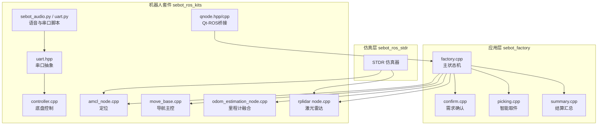
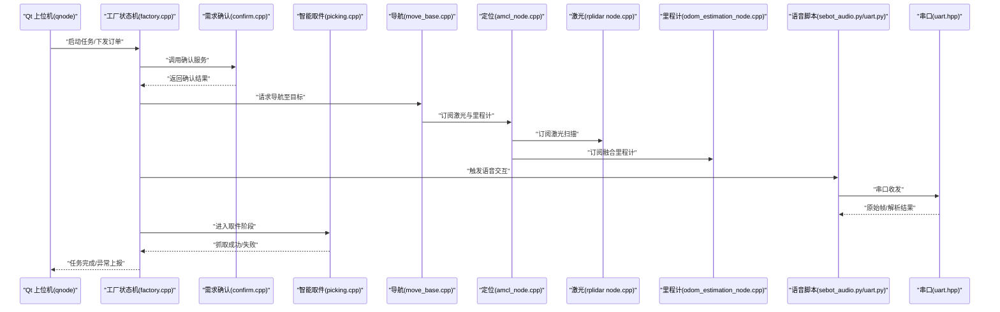
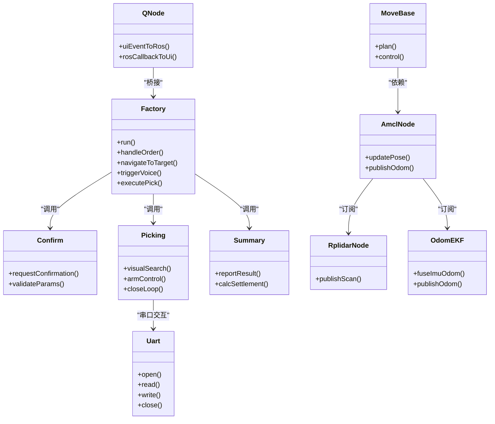
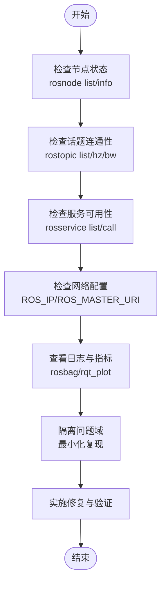

# 通信问题排查

<cite>
**本文引用的文件**   
- [sebot_factory.launch](file://sebot_factory/src/sebot_factory/launch/sebot_factory.launch)
- [factory.cpp](file://sebot_factory/src/sebot_factory/src/factory.cpp)
- [confirm.cpp](file://sebot_factory/src/sebot_factory/src/confirm.cpp)
- [picking.cpp](file://sebot_factory/src/sebot_factory/src/picking.cpp)
- [summary.cpp](file://sebot_factory/src/sebot_factory/src/summary.cpp)
- [qnode.hpp](file://sebot_ros_kits/src/sebot_marking/include/qnode.hpp)
- [qnode.cpp](file://sebot_ros_kits/src/sebot_marking/src/qnode.cpp)
- [uart.hpp](file://sebot_ros_kits/src/sebot_robot/include/uart.hpp)
- [controller.cpp](file://sebot_ros_kits/src/sebot_robot/src/controller.cpp)
- [sebot_audio.py](file://sebot_ros_kits/src/sebot_speech/scripts/sebot_audio.py)
- [uart.py](file://sebot_ros_kits/src/sebot_speech/scripts/uart.py)
- [amcl_node.cpp](file://sebot_ros_kits/src/sebot_navigation/amcl/src/amcl_node.cpp)
- [move_base 主循环入口](file://sebot_ros_kits/src/sebot_navigation/move_base/src/move_base.cpp)
- [odom_estimation_node.cpp](file://sebot_ros_kits/src/sebot_driver/robot_pose_ekf/src/odom_estimation_node.cpp)
- [rplidar node.cpp](file://sebot_ros_kits/src/sebot_driver/rplidar_ros/src/node.cpp)
</cite>

## 目录
1. [简介](#简介)
2. [项目结构](#项目结构)
3. [核心组件](#核心组件)
4. [架构总览](#架构总览)
5. [详细组件分析](#详细组件分析)
6. [依赖关系分析](#依赖关系分析)
7. [性能考量](#性能考量)
8. [故障排查指南](#故障排查指南)
9. [结论](#结论)
10. [附录](#附录)

## 简介
本文件面向机器人竞赛系统的通信问题排查，覆盖 ROS 节点间通信、串口（UART）通信与网络通信三类场景。重点包括：
- 话题订阅/发布失败、服务调用超时、消息队列积压等 ROS 通信问题的定位与修复
- 语音模块 UART 通信异常、音频数据处理错误、语音识别结果解析失败的诊断方法
- 网络延迟测量、带宽占用分析与通信协议调试方法
- 通信性能监控工具与标准化故障诊断流程

本项目由三个相互独立的 catkin 工作空间组成：应用层 sebot_factory、机器人套件 sebot_ros_kits、仿真层 sebot_ros_stdr。自研核心代码集中在 sebot_factory（工厂状态机、需求确认、智能取件、结算汇总）、sebot_marking（Qt 建图标注上位机）、sebot_robot（底盘控制与串口）、sebot_speech（语音脚本）。导航栈与 SLAM 相关包为开源 fork，本文仅说明其在本项目中的角色与集成方式。

## 项目结构
- 应用层 sebot_factory：业务主状态机与任务编排，通过 ROS 话题与服务协调视觉、导航、机械臂等子系统
- 机器人套件 sebot_ros_kits：驱动与中间件封装，包含底盘控制、激光雷达、EKF 里程计融合、语音脚本、SLAM/导航等
- 仿真层 sebot_ros_stdr：STDR 仿真环境，提供传感器与机器人模型，便于离线验证

图表来源
- [factory.cpp](file://sebot_factory/src/sebot_factory/src/factory.cpp)
- [confirm.cpp](file://sebot_factory/src/sebot_factory/src/confirm.cpp)
- [picking.cpp](file://sebot_factory/src/sebot_factory/src/picking.cpp)
- [summary.cpp](file://sebot_factory/src/sebot_factory/src/summary.cpp)
- [qnode.hpp](file://sebot_ros_kits/src/sebot_marking/include/qnode.hpp)
- [qnode.cpp](file://sebot_ros_kits/src/sebot_marking/src/qnode.cpp)
- [uart.hpp](file://sebot_ros_kits/src/sebot_robot/include/uart.hpp)
- [controller.cpp](file://sebot_ros_kits/src/sebot_robot/src/controller.cpp)
- [sebot_audio.py](file://sebot_ros_kits/src/sebot_speech/scripts/sebot_audio.py)
- [uart.py](file://sebot_ros_kits/src/sebot_speech/scripts/uart.py)
- [amcl_node.cpp](file://sebot_ros_kits/src/sebot_navigation/amcl/src/amcl_node.cpp)
- [move_base 主循环入口](file://sebot_ros_kits/src/sebot_navigation/move_base/src/move_base.cpp)
- [odom_estimation_node.cpp](file://sebot_ros_kits/src/sebot_driver/robot_pose_ekf/src/odom_estimation_node.cpp)
- [rplidar node.cpp](file://sebot_ros_kits/src/sebot_driver/rplidar_ros/src/node.cpp)

章节来源
- [sebot_factory.launch](file://sebot_factory/src/sebot_factory/launch/sebot_factory.launch)

## 核心组件
- 工厂主状态机（factory.cpp）：串联导航、视觉、抓取、结算等阶段，负责跨节点协调与超时控制
- 需求确认（confirm.cpp）：与上层交互确认订单需求，可能涉及服务调用与参数校验
- 智能取件（picking.cpp）：与视觉、机械臂交互，执行闭环抓取策略
- 结算汇总（summary.cpp）：统计任务结果并上报
- Qt-ROS 桥接（qnode.hpp/cpp）：将 Qt 界面事件转换为 ROS 调用，处理 UI 与节点通信
- 串口抽象（uart.hpp）：统一串口读写接口，供底盘控制与语音脚本使用
- 语音脚本（sebot_audio.py, uart.py）：采集音频、编码、发送/接收串口帧，解析识别结果
- 定位与导航（amcl_node.cpp, move_base.cpp）：基于激光与里程计的粒子滤波定位与路径规划
- 里程计融合（odom_estimation_node.cpp）：IMU+轮速的 EKF 融合输出稳定里程计
- 激光雷达（rplidar node.cpp）：高频点云数据源，影响导航与建图稳定性

章节来源
- [factory.cpp](file://sebot_factory/src/sebot_factory/src/factory.cpp)
- [confirm.cpp](file://sebot_factory/src/sebot_factory/src/confirm.cpp)
- [picking.cpp](file://sebot_factory/src/sebot_factory/src/picking.cpp)
- [summary.cpp](file://sebot_factory/src/sebot_factory/src/summary.cpp)
- [qnode.hpp](file://sebot_ros_kits/src/sebot_marking/include/qnode.hpp)
- [qnode.cpp](file://sebot_ros_kits/src/sebot_marking/src/qnode.cpp)
- [uart.hpp](file://sebot_ros_kits/src/sebot_robot/include/uart.hpp)
- [controller.cpp](file://sebot_ros_kits/src/sebot_robot/src/controller.cpp)
- [sebot_audio.py](file://sebot_ros_kits/src/sebot_speech/scripts/sebot_audio.py)
- [uart.py](file://sebot_ros_kits/src/sebot_speech/scripts/uart.py)
- [amcl_node.cpp](file://sebot_ros_kits/src/sebot_navigation/amcl/src/amcl_node.cpp)
- [move_base 主循环入口](file://sebot_ros_kits/src/sebot_navigation/move_base/src/move_base.cpp)
- [odom_estimation_node.cpp](file://sebot_ros_kits/src/sebot_driver/robot_pose_ekf/src/odom_estimation_node.cpp)
- [rplidar node.cpp](file://sebot_ros_kits/src/sebot_driver/rplidar_ros/src/node.cpp)

## 架构总览
系统以 factory.cpp 为主控制器，通过 ROS 话题与服务协调各子系统；Qt 上位机通过 qnode 进行人机交互；语音模块通过 Python 脚本与串口交互；导航与定位由 AMCL 与 move_base 完成；里程计由 EKF 融合；激光雷达提供环境感知。

图表来源
- [factory.cpp](file://sebot_factory/src/sebot_factory/src/factory.cpp)
- [confirm.cpp](file://sebot_factory/src/sebot_factory/src/confirm.cpp)
- [picking.cpp](file://sebot_factory/src/sebot_factory/src/picking.cpp)
- [move_base 主循环入口](file://sebot_ros_kits/src/sebot_navigation/move_base/src/move_base.cpp)
- [amcl_node.cpp](file://sebot_ros_kits/src/sebot_navigation/amcl/src/amcl_node.cpp)
- [rplidar node.cpp](file://sebot_ros_kits/src/sebot_driver/rplidar_ros/src/node.cpp)
- [odom_estimation_node.cpp](file://sebot_ros_kits/src/sebot_driver/robot_pose_ekf/src/odom_estimation_node.cpp)
- [sebot_audio.py](file://sebot_ros_kits/src/sebot_speech/scripts/sebot_audio.py)
- [uart.py](file://sebot_ros_kits/src/sebot_speech/scripts/uart.py)
- [uart.hpp](file://sebot_ros_kits/src/sebot_robot/include/uart.hpp)

## 详细组件分析

### ROS 话题订阅/发布失败排查
常见问题与定位要点：
- 名称不一致或命名空间未对齐：检查发布者与订阅者是否在同一命名空间，话题名是否一致
- 连接数不足或线程池耗尽：roscpp 默认线程池较小，高并发下可能出现回调阻塞导致“无订阅者”
- 消息类型不匹配：msg/srv 定义不一致会导致连接失败
- 网络分区或主机名解析失败：确保 master URI、ROS_IP/ROS_HOSTNAME 配置正确
- 防火墙或端口限制：roscore 默认端口 11311 需开放

建议步骤：
- 使用 rosnode info、rostopic list、rostopic hz、rostopic bw 观察节点与话题状态
- 使用 rqt_graph 可视化连接拓扑，快速定位断链
- 增加 roscpp::CallbackQueue 或使用异步回调避免阻塞
- 调整 ROS 网络参数（如 tcp_nodelay、reconnect 间隔）

章节来源
- [factory.cpp](file://sebot_factory/src/sebot_factory/src/factory.cpp)
- [confirm.cpp](file://sebot_factory/src/sebot_factory/src/confirm.cpp)
- [picking.cpp](file://sebot_factory/src/sebot_factory/src/picking.cpp)
- [qnode.cpp](file://sebot_ros_kits/src/sebot_marking/src/qnode.cpp)

### 服务调用超时与重试机制
常见问题与定位要点：
- 服务端未启动或响应慢：检查服务提供者是否运行，CPU/IO 是否瓶颈
- 客户端超时设置过短：根据业务合理设置 timeout
- 死锁或资源竞争：避免在服务回调中长时间阻塞

建议步骤：
- 使用 rosservice call 测试服务可用性
- 在客户端实现指数退避重试与熔断
- 在服务端添加日志与耗时统计，定位慢调用

章节来源
- [confirm.cpp](file://sebot_factory/src/sebot_factory/src/confirm.cpp)
- [factory.cpp](file://sebot_factory/src/sebot_factory/src/factory.cpp)

### 消息队列积压与背压
常见问题与定位要点：
- 发布者频率过高或订阅者处理慢：导致 queue_size 溢出
- 大消息（图像/点云）频繁传输：内存与带宽压力
- 回调阻塞：同步处理导致队列堆积

建议步骤：
- 降低发布频率或分块传输
- 使用压缩与降采样（图像/点云）
- 引入独立处理线程与缓冲队列，避免阻塞回调

章节来源
- [rplidar node.cpp](file://sebot_ros_kits/src/sebot_driver/rplidar_ros/src/node.cpp)
- [amcl_node.cpp](file://sebot_ros_kits/src/sebot_navigation/amcl/src/amcl_node.cpp)
- [move_base 主循环入口](file://sebot_ros_kits/src/sebot_navigation/move_base/src/move_base.cpp)

### 语音模块 UART 通信异常
常见问题与定位要点：
- 波特率/数据位/停止位/校验位不匹配
- 设备权限不足或端口被占用
- 帧格式不一致：起始符、长度、校验、结束符
- 音频编码与采样率不匹配：导致解码失败

建议步骤：
- 使用 miniterm/pyserial 直连测试串口连通性
- 打印原始字节流，核对帧头/尾与校验和
- 统一编码格式（如 PCM/WAV）与采样率（如 16kHz）
- 在 uart.py 中添加重连与自动降级逻辑

章节来源
- [uart.py](file://sebot_ros_kits/src/sebot_speech/scripts/uart.py)
- [sebot_audio.py](file://sebot_ros_kits/src/sebot_speech/scripts/sebot_audio.py)
- [uart.hpp](file://sebot_ros_kits/src/sebot_robot/include/uart.hpp)

### 音频数据处理错误
常见问题与定位要点：
- 缓冲区溢出或截断
- 多通道/单通道混用
- 时间戳不同步：导致播放卡顿或识别错位

建议步骤：
- 固定缓冲区大小，采用环形缓冲
- 统一声道数与采样率
- 在 sebot_audio.py 中记录丢帧与抖动指标

章节来源
- [sebot_audio.py](file://sebot_ros_kits/src/sebot_speech/scripts/sebot_audio.py)

### 语音识别结果解析失败
常见问题与定位要点：
- 返回 JSON/XML 字段缺失或类型不符
- 乱码或编码不一致（UTF-8 vs GBK）
- 多音字/噪声干扰导致置信度低

建议步骤：
- 在解析前做健壮性校验与默认值回退
- 增加日志与样本回放能力
- 对低置信度结果进行二次确认

章节来源
- [uart.py](file://sebot_ros_kits/src/sebot_speech/scripts/uart.py)
- [sebot_audio.py](file://sebot_ros_kits/src/sebot_speech/scripts/sebot_audio.py)

### 定位与导航通信链路
常见问题与定位要点：
- 激光数据丢失或延迟：导致 AMCL 发散
- 里程计漂移：EKF 参数不当或 IMU 校准不足
- move_base 规划失败：代价地图更新不及时

建议步骤：
- 检查 /scan、/odom、/imu 的频率与时序
- 调整 AMCL 与 EKF 参数，必要时重新标定
- 使用 rviz 可视化观测数据质量

章节来源
- [amcl_node.cpp](file://sebot_ros_kits/src/sebot_navigation/amcl/src/amcl_node.cpp)
- [odom_estimation_node.cpp](file://sebot_ros_kits/src/sebot_driver/robot_pose_ekf/src/odom_estimation_node.cpp)
- [rplidar node.cpp](file://sebot_ros_kits/src/sebot_driver/rplidar_ros/src/node.cpp)
- [move_base 主循环入口](file://sebot_ros_kits/src/sebot_navigation/move_base/src/move_base.cpp)

## 依赖关系分析
- factory.cpp 依赖 confirm.cpp、picking.cpp、summary.cpp 以及导航、定位、语音等子系统
- qnode 作为 Qt 与 ROS 的桥梁，向上承接 UI 事件，向下调用 ROS 服务/话题
- uart.hpp 为底层串口抽象，被 controller.cpp 与语音脚本共同使用
- amcl_node 依赖激光与里程计数据，move_base 依赖 AMCL 与代价地图

图表来源
- [factory.cpp](file://sebot_factory/src/sebot_factory/src/factory.cpp)
- [confirm.cpp](file://sebot_factory/src/sebot_factory/src/confirm.cpp)
- [picking.cpp](file://sebot_factory/src/sebot_factory/src/picking.cpp)
- [summary.cpp](file://sebot_factory/src/sebot_factory/src/summary.cpp)
- [qnode.hpp](file://sebot_ros_kits/src/sebot_marking/include/qnode.hpp)
- [qnode.cpp](file://sebot_ros_kits/src/sebot_marking/src/qnode.cpp)
- [uart.hpp](file://sebot_ros_kits/src/sebot_robot/include/uart.hpp)
- [amcl_node.cpp](file://sebot_ros_kits/src/sebot_navigation/amcl/src/amcl_node.cpp)
- [move_base 主循环入口](file://sebot_ros_kits/src/sebot_navigation/move_base/src/move_base.cpp)
- [rplidar node.cpp](file://sebot_ros_kits/src/sebot_driver/rplidar_ros/src/node.cpp)
- [odom_estimation_node.cpp](file://sebot_ros_kits/src/sebot_driver/robot_pose_ekf/src/odom_estimation_node.cpp)

## 性能考量
- 话题频率与消息体积：图像/点云应降采样与压缩，避免带宽饱和
- 回调阻塞：避免在回调中进行 I/O 或长耗时计算，使用独立线程
- 线程池与队列：合理设置 roscpp 线程数与 queue_size，防止积压
- 网络参数：启用 tcp_nodelay、调整重连策略，减少延迟抖动
- 串口吞吐：提高波特率、批量读写、帧合并，降低 CPU 占用

[本节为通用指导，无需特定文件引用]

## 故障排查指南

### 标准诊断流程

[本图为概念流程图，无需图表来源]

### ROS 通信问题清单
- 订阅/发布失败：核对命名空间、消息类型、连接数与线程池
- 服务超时：检查服务端负载、客户端超时与重试策略
- 队列积压：降低频率、压缩消息、解耦回调
- 网络问题：主机名解析、防火墙、master 可达性

章节来源
- [factory.cpp](file://sebot_factory/src/sebot_factory/src/factory.cpp)
- [confirm.cpp](file://sebot_factory/src/sebot_factory/src/confirm.cpp)
- [picking.cpp](file://sebot_factory/src/sebot_factory/src/picking.cpp)
- [qnode.cpp](file://sebot_ros_kits/src/sebot_marking/src/qnode.cpp)

### 串口通信问题清单
- 端口权限与占用：ls -l /dev/tty*、fuser、chmod
- 参数不匹配：波特率、数据位、停止位、校验位
- 帧解析失败：打印原始字节流，校验起始/结束符与校验和
- 音频编码不一致：统一采样率与编码格式

章节来源
- [uart.py](file://sebot_ros_kits/src/sebot_speech/scripts/uart.py)
- [sebot_audio.py](file://sebot_ros_kits/src/sebot_speech/scripts/sebot_audio.py)
- [uart.hpp](file://sebot_ros_kits/src/sebot_robot/include/uart.hpp)

### 网络延迟与带宽分析
- 延迟测量：ping、traceroute、rosnode ping
- 带宽占用：rostopic bw、iftop/nethogs
- 协议调试：tcpdump/wireshark 抓包，核对 ROS 报文结构

章节来源
- [amcl_node.cpp](file://sebot_ros_kits/src/sebot_navigation/amcl/src/amcl_node.cpp)
- [rplidar node.cpp](file://sebot_ros_kits/src/sebot_driver/rplidar_ros/src/node.cpp)

### 关键参数与配置
- sebot_factory.launch：simulation 切换仿真模式、debug 控制识别界面开关；导航超时、PID、取件距离、补扫参数等
- ROS 网络参数：ROS_IP、ROS_MASTER_URI、tcp_nodelay
- 串口参数：波特率、数据位、停止位、校验位
- 语音参数：采样率、编码格式、缓冲区大小

章节来源
- [sebot_factory.launch](file://sebot_factory/src/sebot_factory/launch/sebot_factory.launch)

## 结论
通过分层排查（ROS 层、串口层、网络层）与标准化流程，可快速定位通信问题根因。结合日志、指标与可视化工具，持续优化频率、缓冲与网络参数，提升系统稳定性与实时性。

[本节为总结，无需特定文件引用]

## 附录
- 常用命令
  - rosnode list/info、rostopic list/hz/bw、rosservice list/call
  - rosbag record、rqt_graph、rqt_plot
  - miniterm/pyserial、tcpdump/wireshark、iftop/nethogs
- 参考文件路径
  - 工厂状态机与业务节点：factory.cpp、confirm.cpp、picking.cpp、summary.cpp
  - Qt-ROS 桥接：qnode.hpp、qnode.cpp
  - 串口与语音：uart.hpp、uart.py、sebot_audio.py
  - 定位与导航：amcl_node.cpp、move_base.cpp、odom_estimation_node.cpp、rplidar node.cpp

[本节为附录，无需特定文件引用]