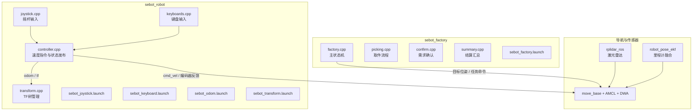
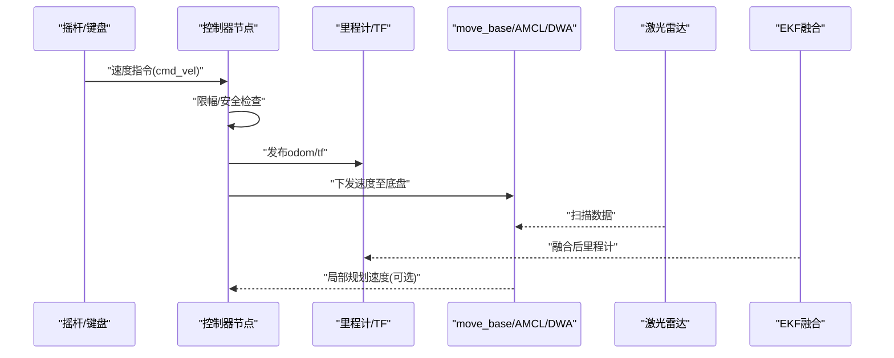
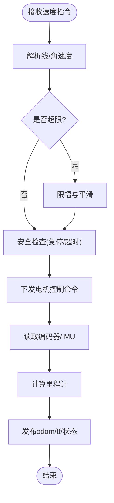
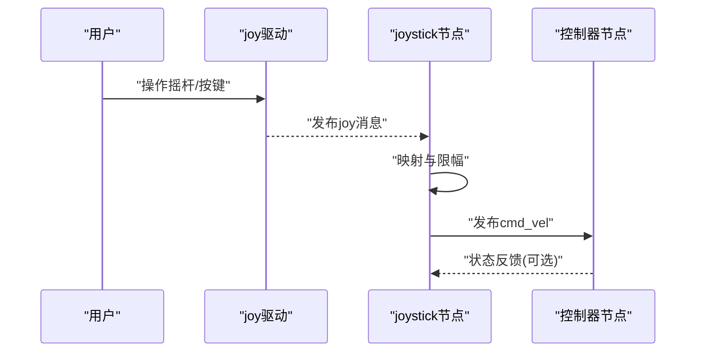
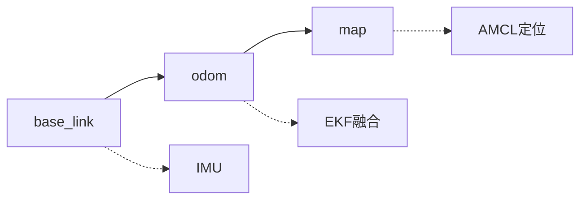
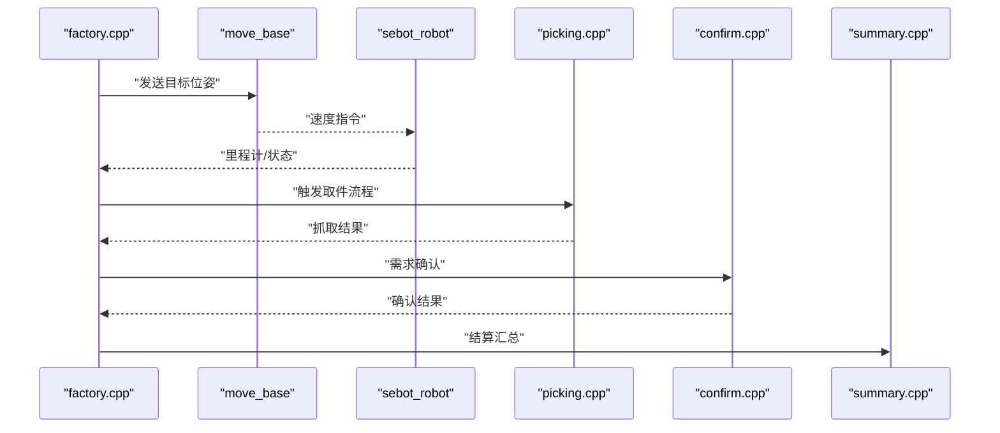
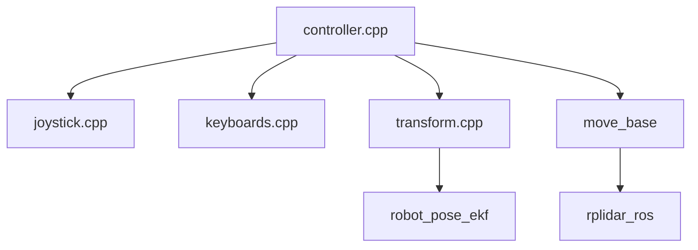

# 机器人基础控制

<cite>
**本文引用的文件**   
- [sebot_robot/src/controller.cpp](file://sebot_ros_kits/src/sebot_robot/src/controller.cpp)
- [sebot_robot/src/joystick.cpp](file://sebot_ros_kits/src/sebot_robot/src/joystick.cpp)
- [sebot_robot/src/keyboards.cpp](file://sebot_ros_kits/src/sebot_robot/src/keyboards.cpp)
- [sebot_robot/src/transform.cpp](file://sebot_ros_kits/src/sebot_robot/src/transform.cpp)
- [sebot_robot/launch/sebot_joystick.launch](file://sebot_ros_kits/src/sebot_robot/launch/sebot_joystick.launch)
- [sebot_robot/launch/sebot_keyboard.launch](file://sebot_ros_kits/src/sebot_robot/launch/sebot_keyboard.launch)
- [sebot_robot/launch/sebot_odom.launch](file://sebot_ros_kits/src/sebot_robot/launch/sebot_odom.launch)
- [sebot_robot/launch/sebot_transform.launch](file://sebot_ros_kits/src/sebot_robot/launch/sebot_transform.launch)
- [sebot_robot/CMakeLists.txt](file://sebot_ros_kits/src/sebot_robot/CMakeLists.txt)
- [sebot_robot/package.xml](file://sebot_ros_kits/src/sebot_robot/package.xml)
- [sebot_factory/launch/sebot_factory.launch](file://sebot_factory/launch/sebot_factory.launch)
- [sebot_factory/src/factory.cpp](file://sebot_factory/src/factory.cpp)
- [sebot_factory/src/picking.cpp](file://sebot_factory/src/picking.cpp)
- [sebot_factory/src/confirm.cpp](file://sebot_factory/src/confirm.cpp)
- [sebot_factory/src/summary.cpp](file://sebot_factory/src/summary.cpp)
- [sebot_navigation/param/nav_params.yaml](file://sebot_ros_kits/src/sebot_navigation/param/nav_params.yaml)
- [sebot_urdf/urdf/sebot_urdf.urdf](file://sebot_ros_kits/src/sebot_urdf/urdf/sebot_urdf.urdf)
- [sebot_urdf/config/sebot_urdf.yaml](file://sebot_ros_kits/src/sebot_urdf/config/sebot_urdf.yaml)
- [rplidar_ros/src/node.cpp](file://sebot_ros_kits/src/sebot_driver/rplidar_ros/src/node.cpp)
- [robot_pose_ekf/src/odom_estimation_node.cpp](file://sebot_ros_kits/src/sebot_driver/robot_pose_ekf/src/odom_estimation_node.cpp)
</cite>

## 目录
1. [简介](#简介)
2. [项目结构](#项目结构)
3. [核心组件](#核心组件)
4. [架构总览](#架构总览)
5. [详细组件分析](#详细组件分析)
6. [依赖关系分析](#依赖关系分析)
7. [性能考虑](#性能考虑)
8. [故障诊断指南](#故障诊断指南)
9. [结论](#结论)
10. [附录](#附录)

## 简介
本文件面向“机器人基础控制系统”，聚焦 sebot_robot 包中的控制器节点、摇杆与键盘输入、坐标变换（TF）系统，以及与上层工厂业务（sebot_factory）和导航栈的集成。文档覆盖速度指令处理、电机控制接口、状态反馈、消息类型与参数配置、实时控制示例、故障诊断方法与性能优化建议，帮助读者快速理解并正确使用该系统。

## 项目结构
本项目由三个相互独立的 catkin 工作空间组成：
- sebot_factory：应用层，包含工厂主状态机、需求确认、智能取件、结算汇总等节点。
- sebot_ros_kits：机器人套件层，包含 sebot_robot（底盘控制、输入设备、TF）、导航栈、传感器驱动、SLAM 等。
- sebot_ros_stdr：仿真层，提供 STDR 仿真环境与配套工具。

本节重点说明 sebot_robot 包的结构与控制链路，以及其在整体系统中的位置。

图表来源
- [sebot_robot/src/controller.cpp](file://sebot_ros_kits/src/sebot_robot/src/controller.cpp)
- [sebot_robot/src/joystick.cpp](file://sebot_ros_kits/src/sebot_robot/src/joystick.cpp)
- [sebot_robot/src/keyboards.cpp](file://sebot_ros_kits/src/sebot_robot/src/keyboards.cpp)
- [sebot_robot/src/transform.cpp](file://sebot_ros_kits/src/sebot_robot/src/transform.cpp)
- [sebot_factory/src/factory.cpp](file://sebot_factory/src/factory.cpp)
- [rplidar_ros/src/node.cpp](file://sebot_ros_kits/src/sebot_driver/rplidar_ros/src/node.cpp)
- [robot_pose_ekf/src/odom_estimation_node.cpp](file://sebot_ros_kits/src/sebot_driver/robot_pose_ekf/src/odom_estimation_node.cpp)

章节来源
- [sebot_robot/CMakeLists.txt](file://sebot_ros_kits/src/sebot_robot/CMakeLists.txt)
- [sebot_robot/package.xml](file://sebot_ros_kits/src/sebot_robot/package.xml)
- [sebot_factory/launch/sebot_factory.launch](file://sebot_factory/launch/sebot_factory.launch)

## 核心组件
- 控制器节点（controller.cpp）
  - 订阅速度指令（如 cmd_vel），解析线速度与角速度，进行限幅与安全校验。
  - 通过底层接口（串口/ROS服务）下发到电机驱动器，实现差速或全向运动控制。
  - 周期读取编码器/IMU，计算里程计并发布 odom 与 TF。
  - 维护运行状态（空闲、运行、错误、急停），并通过 ROS 话题或服务上报。
- 摇杆控制（joystick.cpp）
  - 订阅 joy 消息，将摇杆轴向映射为线/角速度，支持死区与灵敏度调节。
  - 提供按键绑定功能键（如急停、模式切换）。
- 键盘控制（keyboards.cpp）
  - 监听键盘事件，将按键映射为速度指令，便于调试与手动测试。
- 坐标变换（transform.cpp）
  - 发布 base_link -> odom、odom -> map 等 TF 帧，保证坐标系一致性。
  - 与里程计、AMCL、激光雷达数据时间戳对齐，避免抖动与漂移。

章节来源
- [sebot_robot/src/controller.cpp](file://sebot_ros_kits/src/sebot_robot/src/controller.cpp)
- [sebot_robot/src/joystick.cpp](file://sebot_ros_kits/src/sebot_robot/src/joystick.cpp)
- [sebot_robot/src/keyboards.cpp](file://sebot_ros_kits/src/sebot_robot/src/keyboards.cpp)
- [sebot_robot/src/transform.cpp](file://sebot_ros_kits/src/sebot_robot/src/transform.cpp)

## 架构总览
下图展示从输入设备到控制器、再到导航与传感器的整体数据流与控制流。

图表来源
- [sebot_robot/src/controller.cpp](file://sebot_ros_kits/src/sebot_robot/src/controller.cpp)
- [sebot_robot/src/transform.cpp](file://sebot_ros_kits/src/sebot_robot/src/transform.cpp)
- [rplidar_ros/src/node.cpp](file://sebot_ros_kits/src/sebot_driver/rplidar_ros/src/node.cpp)
- [robot_pose_ekf/src/odom_estimation_node.cpp](file://sebot_ros_kits/src/sebot_driver/robot_pose_ekf/src/odom_estimation_node.cpp)

## 详细组件分析

### 控制器节点（controller.cpp）
- 功能要点
  - 速度指令处理：订阅速度主题，解析线/角速度，进行限幅、平滑与防抖。
  - 电机控制：通过底层通信接口（串口/服务）下发控制命令，支持差速/全向模式。
  - 状态反馈：周期性读取编码器与IMU，计算里程计并发布；维护运行状态与错误码。
  - 安全机制：急停检测、超时保护、速度限制、碰撞预警（与导航联动）。
- 关键接口与消息
  - 输入：速度指令（标准几何消息）、模式切换命令、标定参数。
  - 输出：里程计（带协方差）、TF 帧、运行状态与服务响应。
- 参数配置
  - 速度上限、加速度限制、编码器分辨率、轮径、基座宽度、滤波系数等。
- 实时性
  - 控制循环频率、线程优先级、缓冲区大小、丢包重传策略。

图表来源
- [sebot_robot/src/controller.cpp](file://sebot_ros_kits/src/sebot_robot/src/controller.cpp)

章节来源
- [sebot_robot/src/controller.cpp](file://sebot_ros_kits/src/sebot_robot/src/controller.cpp)

### 摇杆控制（joystick.cpp）
- 输入映射
  - 摇杆轴向映射为线速度与角速度，支持死区阈值与灵敏度曲线。
  - 按键映射：急停、模式切换、点动步进等。
- 使用方式
  - 启动 launch 文件加载参数，连接 USB/蓝牙摇杆。
  - 在 RViz 中可视化速度指令与机器人姿态变化。
- 常见问题
  - 轴映射错位、死区过大导致不响应、延迟过高影响操控体验。

图表来源
- [sebot_robot/src/joystick.cpp](file://sebot_ros_kits/src/sebot_robot/src/joystick.cpp)

章节来源
- [sebot_robot/src/joystick.cpp](file://sebot_ros_kits/src/sebot_robot/src/joystick.cpp)
- [sebot_robot/launch/sebot_joystick.launch](file://sebot_ros_kits/src/sebot_robot/launch/sebot_joystick.launch)

### 键盘控制（keyboards.cpp）
- 功能要点
  - 键盘按键映射为速度指令，适合调试与简单测试。
  - 支持组合键与快捷键，提高操作效率。
- 使用方式
  - 启动 launch 文件，确保终端焦点位于键盘节点窗口。
  - 常用键：W/S（前进/后退）、A/D（左转/右转）、Q/E（旋转）。
- 注意事项
  - 需保持终端活跃，避免后台进程抢占输入。

章节来源
- [sebot_robot/src/keyboards.cpp](file://sebot_ros_kits/src/sebot_robot/src/keyboards.cpp)
- [sebot_robot/launch/sebot_keyboard.launch](file://sebot_ros_kits/src/sebot_robot/launch/sebot_keyboard.launch)

### 坐标变换系统（transform.cpp）
- 职责
  - 维护 TF 树：base_link -> odom、odom -> map（AMCL 发布）。
  - 与里程计、激光雷达、IMU 的时间戳对齐，减少抖动。
- 配置要点
  - 固定帧与动态帧设置、发布频率、插值策略。
- 常见问题
  - TF 跳变、坐标系未更新、时间不同步导致定位漂移。

图表来源
- [sebot_robot/src/transform.cpp](file://sebot_ros_kits/src/sebot_robot/src/transform.cpp)
- [robot_pose_ekf/src/odom_estimation_node.cpp](file://sebot_ros_kits/src/sebot_driver/robot_pose_ekf/src/odom_estimation_node.cpp)

章节来源
- [sebot_robot/src/transform.cpp](file://sebot_ros_kits/src/sebot_robot/src/transform.cpp)
- [sebot_robot/launch/sebot_transform.launch](file://sebot_ros_kits/src/sebot_robot/launch/sebot_transform.launch)

### 与上层工厂业务（sebot_factory）集成
- 工厂主状态机（factory.cpp）
  - 负责订单处理、导航调度、取件流程、需求确认与结算汇总。
  - 通过 move_base 发送目标位姿，与 sebot_robot 的速度控制形成闭环。
- 取件流程（picking.cpp）
  - 结合视觉（YOLO）与机械臂（MoveIt!）完成抓取，返回状态给工厂主状态机。
- 需求确认（confirm.cpp）
  - 与用户交互确认订单细节，防止误操作。
- 结算汇总（summary.cpp）
  - 统计任务执行结果，生成报表。

图表来源
- [sebot_factory/src/factory.cpp](file://sebot_factory/src/factory.cpp)
- [sebot_factory/src/picking.cpp](file://sebot_factory/src/picking.cpp)
- [sebot_factory/src/confirm.cpp](file://sebot_factory/src/confirm.cpp)
- [sebot_factory/src/summary.cpp](file://sebot_factory/src/summary.cpp)

章节来源
- [sebot_factory/src/factory.cpp](file://sebot_factory/src/factory.cpp)
- [sebot_factory/launch/sebot_factory.launch](file://sebot_factory/launch/sebot_factory.launch)

## 依赖关系分析
- 包内依赖
  - controller 依赖 joy 与 keyboard 输入，发布 odom/tf，与 move_base 交互。
  - transform 依赖里程计与传感器数据，维护 TF 树。
- 外部依赖
  - rplidar_ros 提供激光雷达数据。
  - robot_pose_ekf 融合 IMU 与编码器，提升里程计精度。
  - move_base + AMCL + DWA 完成全局与局部路径规划。

图表来源
- [sebot_robot/src/controller.cpp](file://sebot_ros_kits/src/sebot_robot/src/controller.cpp)
- [sebot_robot/src/joystick.cpp](file://sebot_ros_kits/src/sebot_robot/src/joystick.cpp)
- [sebot_robot/src/keyboards.cpp](file://sebot_ros_kits/src/sebot_robot/src/keyboards.cpp)
- [sebot_robot/src/transform.cpp](file://sebot_ros_kits/src/sebot_robot/src/transform.cpp)
- [rplidar_ros/src/node.cpp](file://sebot_ros_kits/src/sebot_driver/rplidar_ros/src/node.cpp)
- [robot_pose_ekf/src/odom_estimation_node.cpp](file://sebot_ros_kits/src/sebot_driver/robot_pose_ekf/src/odom_estimation_node.cpp)

章节来源
- [sebot_robot/CMakeLists.txt](file://sebot_ros_kits/src/sebot_robot/CMakeLists.txt)
- [sebot_robot/package.xml](file://sebot_ros_kits/src/sebot_robot/package.xml)

## 性能考虑
- 控制循环频率
  - 合理设置控制器频率，避免过高导致 CPU 占用或过低影响响应。
- 滤波器与平滑
  - 对速度指令与编码器数据进行低通滤波，减少抖动。
- 内存与线程
  - 避免频繁分配内存，使用环形缓冲；控制线程优先级高于感知线程。
- 通信开销
  - 批量发布里程计与 TF，降低网络负载；使用压缩传输图像数据。
- 传感器同步
  - 统一时间源，确保激光雷达、IMU、编码器时间戳一致。

[本节为通用指导，无需特定文件引用]

## 故障诊断指南
- 常见症状
  - 机器人不动或乱动：检查速度指令是否正确、限幅参数是否过小、急停是否触发。
  - 里程计漂移：检查编码器分辨率、轮径参数、EKF 融合参数、IMU 校准。
  - TF 跳变：检查坐标系发布频率、时间戳对齐、插值策略。
  - 导航失败：检查地图加载、AMCL 初始化、激光雷达数据是否正常。
- 诊断步骤
  - 使用 rostopic echo 查看速度指令与里程计数据。
  - 使用 rviz 可视化 TF 树与传感器数据。
  - 检查日志与错误码，定位具体模块问题。
- 恢复策略
  - 重启相关节点、重置参数、重新校准传感器。

章节来源
- [sebot_robot/src/controller.cpp](file://sebot_ros_kits/src/sebot_robot/src/controller.cpp)
- [sebot_robot/src/transform.cpp](file://sebot_ros_kits/src/sebot_robot/src/transform.cpp)
- [robot_pose_ekf/src/odom_estimation_node.cpp](file://sebot_ros_kits/src/sebot_driver/robot_pose_ekf/src/odom_estimation_node.cpp)

## 结论
本控制系统以 sebot_robot 为核心，整合摇杆与键盘输入、控制器节点与 TF 系统，与上层工厂业务和导航栈紧密协作。通过合理的参数配置与性能优化，可实现稳定、高效的机器人基础控制。故障诊断方法有助于快速定位与解决问题，保障系统可靠性。

[本节为总结，无需特定文件引用]

## 附录
- 控制接口 API
  - 速度指令：标准几何消息，包含线速度与角速度。
  - 里程计：包含位姿、速度、协方差矩阵。
  - 状态服务：查询运行状态、错误码、复位控制。
- 消息类型定义
  - 几何消息：Twist、Pose、Transform。
  - 自定义消息：状态枚举、错误码定义。
- 参数配置选项
  - 速度上限、加速度限制、编码器分辨率、轮径、基座宽度、滤波系数。
  - 摇杆死区、灵敏度、按键映射。
  - TF 发布频率、坐标系名称、时间同步参数。
- 实时控制示例
  - 启动摇杆控制：运行 sebot_joystick.launch，操作摇杆发送速度指令。
  - 键盘控制：运行 sebot_keyboard.launch，使用键盘按键控制机器人。
  - 导航集成：启动 sebot_factory.launch，配置地图与 AMCL，执行自动导航任务。

章节来源
- [sebot_robot/launch/sebot_joystick.launch](file://sebot_ros_kits/src/sebot_robot/launch/sebot_joystick.launch)
- [sebot_robot/launch/sebot_keyboard.launch](file://sebot_ros_kits/src/sebot_robot/launch/sebot_keyboard.launch)
- [sebot_factory/launch/sebot_factory.launch](file://sebot_factory/launch/sebot_factory.launch)
- [sebot_urdf/urdf/sebot_urdf.urdf](file://sebot_ros_kits/src/sebot_urdf/urdf/sebot_urdf.urdf)
- [sebot_urdf/config/sebot_urdf.yaml](file://sebot_ros_kits/src/sebot_urdf/config/sebot_urdf.yaml)