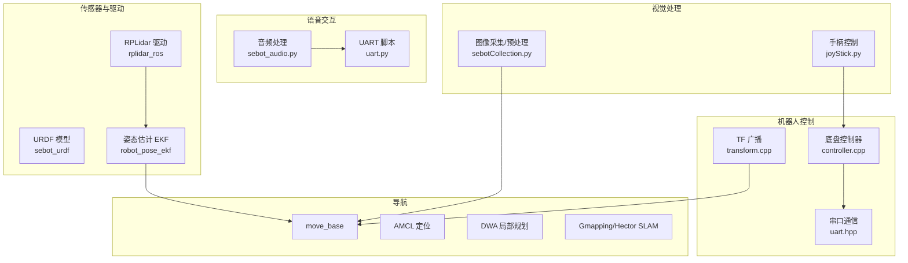
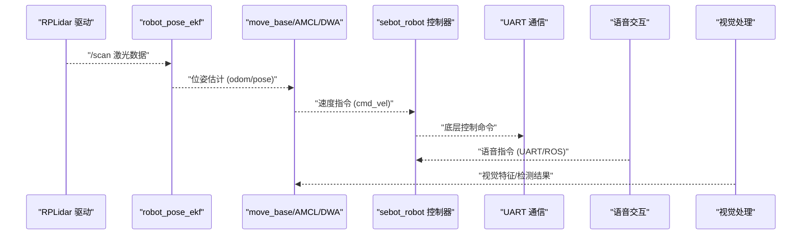
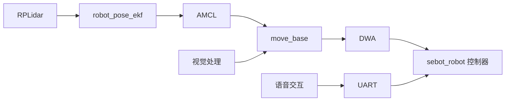

# 机器人套件层

<cite>
**本文引用的文件**   
- [sebot_factory.launch](file://sebot_factory/src/sebot_factory/launch/sebot_factory.launch)
- [factory.cpp](file://sebot_factory/src/sebot_factory/src/factory.cpp)
- [confirm.cpp](file://sebot_factory/src/sebot_factory/src/confirm.cpp)
- [picking.cpp](file://sebot_factory/src/sebot_factory/src/picking.cpp)
- [summary.cpp](file://sebot_factory/src/sebot_factory/src/summary.cpp)
- [yolo.cpp](file://sebot_factory/src/sebot_factory/unit/yolo.cpp)
- [sebot_urdf.launch](file://sebot_ros_kits/src/sebot_driver/sebot_urdf/launch/sebot_urdf.launch)
- [rplidar.launch](file://sebot_ros_kits/src/sebot_driver/rplidar_ros/launch/rplidar.launch)
- [robot_pose_ekf.launch](file://sebot_ros_kits/src/sebot_driver/robot_pose_ekf/launch/robot_pose_ekf.launch)
- [odom_estimation_node.cpp](file://sebot_ros_kits/src/sebot_driver/robot_pose_ekf/src/odom_estimation_node.cpp)
- [sebot_odom.launch](file://sebot_ros_kits/src/sebot_robot/launch/sebot_odom.launch)
- [controller.cpp](file://sebot_ros_kits/src/sebot_robot/src/controller.cpp)
- [transform.cpp](file://sebot_ros_kits/src/sebot_robot/src/transform.cpp)
- [uart.hpp](file://sebot_ros_kits/src/sebot_robot/include/uart.hpp)
- [sebot_audio.xml](file://sebot_ros_kits/src/sebot_speech/launch/sebot_audio.xml)
- [sebot_audio.py](file://sebot_ros_kits/src/sebot_speech/scripts/sebot_audio.py)
- [uart.py](file://sebot_ros_kits/src/sebot_speech/scripts/uart.py)
- [sebotCollection.py](file://sebot_ros_kits/src/sebot_visions/scripts/sebotCollection.py)
- [joyStick.py](file://sebot_ros_kits/src/sebot_visions/scripts/joyStick.py)
</cite>

## 目录
1. [简介](#简介)
2. [项目结构](#项目结构)
3. [核心组件](#核心组件)
4. [架构总览](#架构总览)
5. [详细组件分析](#详细组件分析)
6. [依赖关系分析](#依赖关系分析)
7. [性能考虑](#性能考虑)
8. [故障排除指南](#故障排除指南)
9. [结论](#结论)
10. [附录](#附录)

## 简介
本仓库由三个相互独立的 catkin 工作空间组成：应用层 sebot_factory、机器人套件 sebot_ros_kits、仿真层 sebot_ros_stdr。文档聚焦于机器人套件层（sebot_ros_kits），涵盖激光雷达驱动、姿态估计融合、基础控制、语音交互与视觉处理等模块的 ROS 接口、配置参数与调试方法，并给出硬件连接、数据流与配置示例，以及性能优化与故障排除建议。

## 项目结构
机器人套件层按功能划分为多个子包：
- sebot_driver：传感器与驱动（RPLidar、URDF、robot_pose_ekf）
- sebot_robot：底盘控制与通信（UART、里程计发布、TF 广播）
- sebot_speech：语音交互（音频采集、识别、UART 下发）
- sebot_visions：视觉处理（图像采集、预处理、特征提取）
- sebot_navigation：导航栈（move_base、AMCL、DWA、Gmapping/Hector 等）

图表来源
- [rplidar.launch](file://sebot_ros_kits/src/sebot_driver/rplidar_ros/launch/rplidar.launch)
- [sebot_urdf.launch](file://sebot_ros_kits/src/sebot_driver/sebot_urdf/launch/sebot_urdf.launch)
- [robot_pose_ekf.launch](file://sebot_ros_kits/src/sebot_driver/robot_pose_ekf/launch/robot_pose_ekf.launch)
- [controller.cpp](file://sebot_ros_kits/src/sebot_robot/src/controller.cpp)
- [transform.cpp](file://sebot_ros_kits/src/sebot_robot/src/transform.cpp)
- [uart.hpp](file://sebot_ros_kits/src/sebot_robot/include/uart.hpp)
- [sebot_audio.xml](file://sebot_ros_kits/src/sebot_speech/launch/sebot_audio.xml)
- [sebotCollection.py](file://sebot_ros_kits/src/sebot_visions/scripts/sebotCollection.py)
- [joyStick.py](file://sebot_ros_kits/src/sebot_visions/scripts/joyStick.py)

章节来源
- [sebot_odom.launch](file://sebot_ros_kits/src/sebot_robot/launch/sebot_odom.launch)
- [rplidar.launch](file://sebot_ros_kits/src/sebot_driver/rplidar_ros/launch/rplidar.launch)
- [robot_pose_ekf.launch](file://sebot_ros_kits/src/sebot_driver/robot_pose_ekf/launch/robot_pose_ekf.launch)

## 核心组件
- RPLidar 激光雷达驱动：通过 rplidar_ros 节点启动，订阅串口设备并发布 /scan 点云扫描数据，供建图与避障使用。
- robot_pose_ekf 姿态估计：融合 IMU、轮式里程计与激光里程计，输出更稳定的位姿估计，供 AMCL 与 move_base 使用。
- sebot_robot 基础控制：提供底盘运动控制、UART 通信、TF 变换与里程计发布，是上层导航与任务调度的执行层。
- 语音交互系统：音频采集与识别后，通过 UART 将指令下发至底层控制器，实现语音驱动的交互。
- 视觉处理模块：负责图像采集、预处理与特征提取，为上层业务（如取件确认、目标检测）提供输入。

章节来源
- [rplidar.launch](file://sebot_ros_kits/src/sebot_driver/rplidar_ros/launch/rplidar.launch)
- [robot_pose_ekf.launch](file://sebot_ros_kits/src/sebot_driver/robot_pose_ekf/launch/robot_pose_ekf.launch)
- [controller.cpp](file://sebot_ros_kits/src/sebot_robot/src/controller.cpp)
- [transform.cpp](file://sebot_ros_kits/src/sebot_robot/src/transform.cpp)
- [uart.hpp](file://sebot_ros_kits/src/sebot_robot/include/uart.hpp)
- [sebot_audio.xml](file://sebot_ros_kits/src/sebot_speech/launch/sebot_audio.xml)
- [sebotCollection.py](file://sebot_ros_kits/src/sebot_visions/scripts/sebotCollection.py)

## 架构总览
机器人套件层的整体数据流如下：传感器（激光雷达、IMU、里程计）经驱动与 EKF 融合得到稳定位姿；上层导航（move_base + AMCL + DWA）基于位姿与地图生成全局/局部轨迹；语音与视觉作为感知输入，通过 UART 或 ROS 主题与底层控制器交互。

图表来源
- [rplidar.launch](file://sebot_ros_kits/src/sebot_driver/rplidar_ros/launch/rplidar.launch)
- [robot_pose_ekf.launch](file://sebot_ros_kits/src/sebot_driver/robot_pose_ekf/launch/robot_pose_ekf.launch)
- [controller.cpp](file://sebot_ros_kits/src/sebot_robot/src/controller.cpp)
- [uart.hpp](file://sebot_ros_kits/src/sebot_robot/include/uart.hpp)
- [sebot_audio.xml](file://sebot_ros_kits/src/sebot_speech/launch/sebot_audio.xml)
- [sebotCollection.py](file://sebot_ros_kits/src/sebot_visions/scripts/sebotCollection.py)

## 详细组件分析

### RPLidar 激光雷达驱动
- 启动方式：通过 rplidar.launch 启动节点，配置串口路径、波特率与帧率等参数。
- 数据输出：发布 /scan 消息，包含角度、距离与强度信息，用于建图与避障。
- 集成要点：确保串口权限正确、设备名匹配；在 EKF 中启用激光里程计以改善位姿估计。

章节来源
- [rplidar.launch](file://sebot_ros_kits/src/sebot_driver/rplidar_ros/launch/rplidar.launch)

### robot_pose_ekf 姿态估计
- 功能：融合 IMU、轮式里程计与激光里程计，输出平滑且鲁棒的位姿估计。
- 关键参数：各传感器的噪声协方差、时间延迟补偿、坐标系转换等。
- 调试方法：观察 /odom、/imu/data、/scan 的同步性；调整协方差矩阵以平衡响应与稳定性。

章节来源
- [robot_pose_ekf.launch](file://sebot_ros_kits/src/sebot_driver/robot_pose_ekf/launch/robot_pose_ekf.launch)
- [odom_estimation_node.cpp](file://sebot_ros_kits/src/sebot_driver/robot_pose_ekf/src/odom_estimation_node.cpp)

### sebot_robot 基础控制
- 控制逻辑：接收 cmd_vel 速度指令，转换为底层电机控制命令，通过 UART 发送。
- 里程计与 TF：发布里程计与坐标变换，供导航与可视化使用。
- 调试要点：检查 UART 通信状态、指令频率与反馈一致性；使用 rviz 验证 TF 链完整性。

章节来源
- [controller.cpp](file://sebot_ros_kits/src/sebot_robot/src/controller.cpp)
- [transform.cpp](file://sebot_ros_kits/src/sebot_robot/src/transform.cpp)
- [uart.hpp](file://sebot_ros_kits/src/sebot_robot/include/uart.hpp)
- [sebot_odom.launch](file://sebot_ros_kits/src/sebot_robot/launch/sebot_odom.launch)

### 语音交互系统
- 音频处理：通过 sebot_audio.py 进行录音与预处理，调用语音识别服务。
- UART 通信：识别结果经 uart.py 转换为底层指令，通过串口下发至控制器。
- 集成方式：通过 sebot_audio.xml 启动相关节点，配置音频设备与识别阈值。

章节来源
- [sebot_audio.xml](file://sebot_ros_kits/src/sebot_speech/launch/sebot_audio.xml)
- [sebot_audio.py](file://sebot_ros_kits/src/sebot_speech/scripts/sebot_audio.py)
- [uart.py](file://sebot_ros_kits/src/sebot_speech/scripts/uart.py)

### 视觉处理模块
- 图像采集：sebotCollection.py 负责相机初始化、图像抓取与预处理（缩放、滤波）。
- 特征提取：对预处理后的图像进行边缘检测、角点提取或深度学习推理（NPU 加速）。
- 集成方式：将特征结果发布到 ROS 主题，供导航与任务决策使用。

章节来源
- [sebotCollection.py](file://sebot_ros_kits/src/sebot_visions/scripts/sebotCollection.py)
- [joyStick.py](file://sebot_ros_kits/src/sebot_visions/scripts/joyStick.py)

## 依赖关系分析
- 传感器到导航：RPLidar → EKF → AMCL/move_base → DWA → 控制器
- 语音到控制：语音识别 → UART → 控制器
- 视觉到导航：图像处理 → 特征/检测结果 → 导航决策

图表来源
- [rplidar.launch](file://sebot_ros_kits/src/sebot_driver/rplidar_ros/launch/rplidar.launch)
- [robot_pose_ekf.launch](file://sebot_ros_kits/src/sebot_driver/robot_pose_ekf/launch/robot_pose_ekf.launch)
- [controller.cpp](file://sebot_ros_kits/src/sebot_robot/src/controller.cpp)
- [sebot_audio.xml](file://sebot_ros_kits/src/sebot_speech/launch/sebot_audio.xml)
- [sebotCollection.py](file://sebot_ros_kits/src/sebot_visions/scripts/sebotCollection.py)

## 性能考虑
- 传感器频率：合理设置 RPLidar 与相机的采集频率，避免 CPU 过载。
- EKF 参数：根据环境动态调整协方差矩阵，提升位姿估计精度与实时性。
- 导航参数：优化全局/局部规划器的代价函数权重，减少震荡与死锁。
- 语音与视觉：降低识别阈值与模型复杂度，保证实时响应。

## 故障排除指南
- 激光雷达无数据：检查串口权限与设备名；确认 rplidar.launch 参数正确。
- 位姿漂移：调整 EKF 协方差；检查 IMU 与里程计的同步与标定。
- 语音无响应：验证音频设备与识别服务；检查 UART 通信链路。
- 视觉卡顿：优化图像处理流水线；降低分辨率或帧率。

## 结论
机器人套件层通过模块化设计实现了传感器驱动、姿态估计、基础控制、语音交互与视觉处理的完整闭环。合理的参数配置与调试方法可显著提升系统稳定性与性能。建议在实际部署中结合具体硬件与环境进行精细化调优。

## 附录
- 硬件连接建议：激光雷达接 USB/串口，IMU 与编码器接入主控板，语音模块与相机通过 USB 连接。
- 配置示例：参考 sebot_factory.launch 中的 simulation、debug、导航超时、PID、取件距离与补扫参数。
- 调试工具：使用 rostopic、rviz、rosbag 记录与分析数据流。