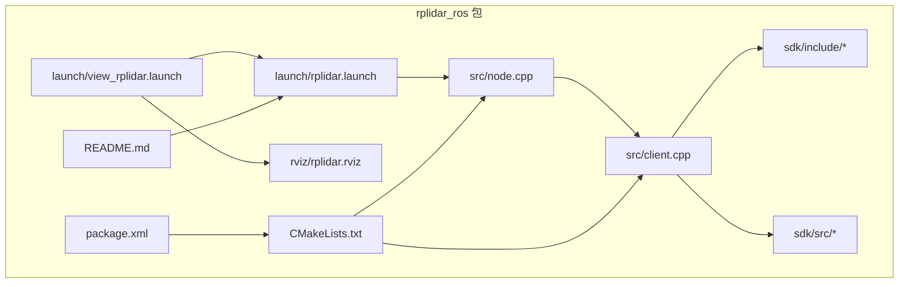
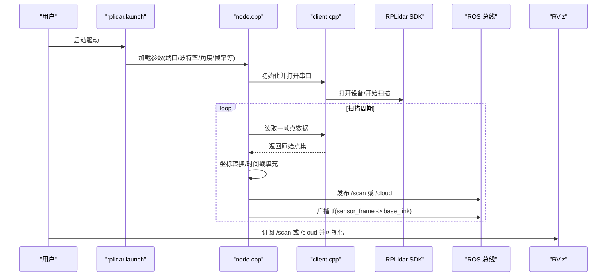
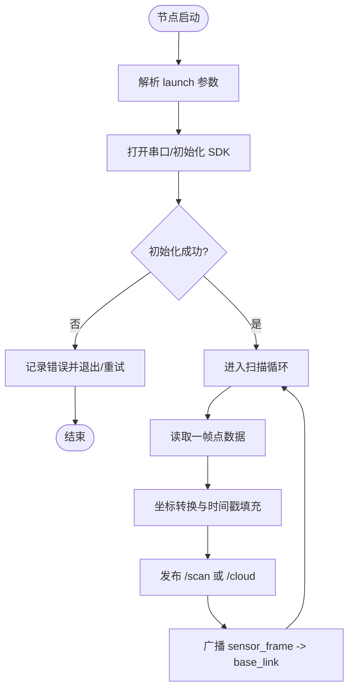
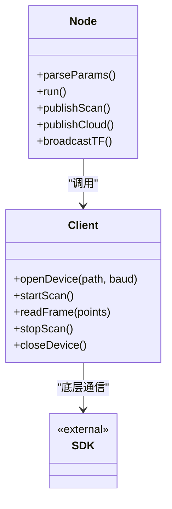
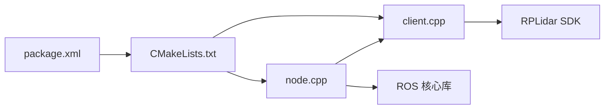

# RPLidar激光雷达驱动

<cite>
**本文引用的文件**   
- [rplidar.launch](file://sebot_ros_kits/src/sebot_driver/rplidar_ros/launch/rplidar.launch)
- [view_rplidar.launch](file://sebot_ros_kits/src/sebot_driver/rplidar_ros/launch/view_rplidar.launch)
- [rplidar.rviz](file://sebot_ros_kits/src/sebot_driver/rplidar_ros/rviz/rplidar.rviz)
- [node.cpp](file://sebot_ros_kits/src/sebot_driver/rplidar_ros/src/node.cpp)
- [client.cpp](file://sebot_ros_kits/src/sebot_driver/rplidar_ros/src/client.cpp)
- [CMakeLists.txt](file://sebot_ros_kits/src/sebot_driver/rplidar_ros/CMakeLists.txt)
- [package.xml](file://sebot_ros_kits/src/sebot_driver/rplidar_ros/package.xml)
- [README.md](file://sebot_ros_kits/src/sebot_driver/rplidar_ros/README.md)
</cite>

## 目录
1. [简介](#简介)
2. [项目结构](#项目结构)
3. [核心组件](#核心组件)
4. [架构总览](#架构总览)
5. [详细组件分析](#详细组件分析)
6. [依赖关系分析](#依赖关系分析)
7. [性能与帧率配置](#性能与帧率配置)
8. [故障排查指南](#故障排查指南)
9. [结论](#结论)
10. [附录：调试命令与可视化](#附录：调试命令与可视化)

## 简介
本文件面向使用 RPLidar 激光雷达的 ROS 开发者，基于仓库中的 rplidar_ros 包，系统说明硬件连接、串口参数、ROS 节点启动流程、点云发布机制、坐标系变换、帧率配置以及 launch 关键参数。同时给出常见连接问题的排查方法与性能优化建议，并提供 rostopic 查看数据、rviz 可视化与故障诊断技巧。

## 项目结构
rplidar_ros 包位于 sebot_ros_kits/src/sebot_driver/rplidar_ros，包含 SDK、ROS 节点源码、launch 与 rviz 配置文件等。典型结构如下：
- launch：rplidar.launch（启动驱动）、view_rplidar.launch（启动驱动+RViz）
- src：node.cpp（ROS 节点主循环）、client.cpp（SDK 客户端封装）
- sdk：RPLidar 官方 SDK 头与实现
- rviz：rplidar.rviz（默认可视化场景）
- CMakeLists.txt、package.xml：构建与依赖声明
- README.md：使用说明

图表来源 
- [rplidar.launch](file://sebot_ros_kits/src/sebot_driver/rplidar_ros/launch/rplidar.launch)
- [view_rplidar.launch](file://sebot_ros_kits/src/sebot_driver/rplidar_ros/launch/view_rplidar.launch)
- [node.cpp](file://sebot_ros_kits/src/sebot_driver/rplidar_ros/src/node.cpp)
- [client.cpp](file://sebot_ros_kits/src/sebot_driver/rplidar_ros/src/client.cpp)
- [CMakeLists.txt](file://sebot_ros_kits/src/sebot_driver/rplidar_ros/CMakeLists.txt)
- [package.xml](file://sebot_ros_kits/src/sebot_driver/rplidar_ros/package.xml)
- [README.md](file://sebot_ros_kits/src/sebot_driver/rplidar_ros/README.md)

章节来源
- [rplidar.launch](file://sebot_ros_kits/src/sebot_driver/rplidar_ros/launch/rplidar.launch)
- [view_rplidar.launch](file://sebot_ros_kits/src/sebot_driver/rplidar_ros/launch/view_rplidar.launch)
- [node.cpp](file://sebot_ros_kits/src/sebot_driver/rplidar_ros/src/node.cpp)
- [client.cpp](file://sebot_ros_kits/src/sebot_driver/rplidar_ros/src/client.cpp)
- [CMakeLists.txt](file://sebot_ros_kits/src/sebot_driver/rplidar_ros/CMakeLists.txt)
- [package.xml](file://sebot_ros_kits/src/sebot_driver/rplidar_ros/package.xml)
- [README.md](file://sebot_ros_kits/src/sebot_driver/rplidar_ros/README.md)

## 核心组件
- 驱动节点（node.cpp）：负责串口初始化、设备扫描、数据读取、坐标转换与消息发布（LaserScan 或 PointCloud2）。
- SDK 客户端（client.cpp）：封装 RPLidar SDK 调用，提供设备打开、开始扫描、获取点数据、停止扫描等接口。
- Launch 文件：集中管理串口路径、波特率、角度范围、帧率、坐标系等参数，并启动 RViz 进行可视化。
- RViz 配置：预设 LaserScan/PointCloud2 显示样式，便于快速验证数据质量。

章节来源
- [node.cpp](file://sebot_ros_kits/src/sebot_driver/rplidar_ros/src/node.cpp)
- [client.cpp](file://sebot_ros_kits/src/sebot_driver/rplidar_ros/src/client.cpp)
- [rplidar.launch](file://sebot_ros_kits/src/sebot_driver/rplidar_ros/launch/rplidar.launch)
- [view_rplidar.launch](file://sebot_ros_kits/src/sebot_driver/rplidar_ros/launch/view_rplidar.launch)
- [rplidar.rviz](file://sebot_ros_kits/src/sebot_driver/rplidar_ros/rviz/rplidar.rviz)

## 架构总览
RPLidar 驱动通过串口与雷达通信，节点周期性读取扫描数据，转换为标准 ROS 消息并发布到 /scan 或 /cloud 主题；同时广播传感器到基座的 TF 变换，供导航与建图使用。

图表来源 
- [rplidar.launch](file://sebot_ros_kits/src/sebot_driver/rplidar_ros/launch/rplidar.launch)
- [node.cpp](file://sebot_ros_kits/src/sebot_driver/rplidar_ros/src/node.cpp)
- [client.cpp](file://sebot_ros_kits/src/sebot_driver/rplidar_ros/src/client.cpp)
- [rplidar.rviz](file://sebot_ros_kits/src/sebot_driver/rplidar_ros/rviz/rplidar.rviz)

## 详细组件分析

### 驱动节点（node.cpp）
- 功能要点
  - 解析 launch 参数：设备路径、波特率、扫描模式、角度范围、帧率、输出格式（LaserScan/PointCloud2）、坐标系名等。
  - 建立与 SDK 客户端的连接，控制扫描启停。
  - 将原始点数据转换为 ROS 消息，设置正确的时间戳与坐标系。
  - 发布 /scan（LaserScan）或 /cloud（PointCloud2），并广播 sensor_frame 到 base_link 的 TF。
- 数据处理流程
  - 读取原始点 → 去噪/滤波（可选）→ 坐标变换 → 填充消息字段 → 发布。
- 错误处理
  - 串口打开失败、设备无响应、扫描超时等异常分支，记录日志并尝试重连或退出。

图表来源 
- [node.cpp](file://sebot_ros_kits/src/sebot_driver/rplidar_ros/src/node.cpp)

章节来源
- [node.cpp](file://sebot_ros_kits/src/sebot_driver/rplidar_ros/src/node.cpp)

### SDK 客户端（client.cpp）
- 功能要点
  - 封装 RPLidar SDK 的打开设备、设置扫描模式、开始/停止扫描、获取点数据等接口。
  - 处理底层通信错误与超时，向上层提供稳定 API。
- 与节点的交互
  - 节点调用 client 的“开始扫描”和“读取帧”方法，client 内部与 SDK 交互并返回结果。

图表来源 
- [client.cpp](file://sebot_ros_kits/src/sebot_driver/rplidar_ros/src/client.cpp)
- [node.cpp](file://sebot_ros_kits/src/sebot_driver/rplidar_ros/src/node.cpp)

章节来源
- [client.cpp](file://sebot_ros_kits/src/sebot_driver/rplidar_ros/src/client.cpp)

### Launch 文件与关键参数
- rplidar.launch
  - 常用参数：设备路径（如 /dev/ttyUSB0）、波特率（如 115200/256000）、扫描模式、角度范围（min_angle/max_angle）、帧率（scan_frequency）、输出类型（laser_scan/cloud）、坐标系名（frame_id）等。
  - 作用：集中注入参数至 node 与 client，统一启动行为。
- view_rplidar.launch
  - 在 rplidar.launch 基础上自动启动 RViz，并加载 rplidar.rviz 配置，便于即时可视化。

章节来源
- [rplidar.launch](file://sebot_ros_kits/src/sebot_driver/rplidar_ros/launch/rplidar.launch)
- [view_rplidar.launch](file://sebot_ros_kits/src/sebot_driver/rplidar_ros/launch/view_rplidar.launch)

### RViz 可视化配置
- rplidar.rviz
  - 预设 LaserScan 或 PointCloud2 显示项，颜色、尺寸、更新频率等默认值，帮助快速确认数据是否正常。
  - 可切换显示类型以对比不同输出格式的效果。

章节来源
- [rplidar.rviz](file://sebot_ros_kits/src/sebot_driver/rplidar_ros/rviz/rplidar.rviz)

## 依赖关系分析
- 包内依赖
  - node.cpp 依赖 client.cpp；client.cpp 依赖 RPLidar SDK。
- 外部依赖
  - ROS 核心库（roscpp、sensor_msgs、tf、std_msgs 等）。
  - 操作系统串口库（Linux 下通常为 termios/POSIX）。
- 构建与打包
  - CMakeLists.txt 声明编译目标与链接库；package.xml 声明依赖包与运行环境。

图表来源 
- [node.cpp](file://sebot_ros_kits/src/sebot_driver/rplidar_ros/src/node.cpp)
- [client.cpp](file://sebot_ros_kits/src/sebot_driver/rplidar_ros/src/client.cpp)
- [CMakeLists.txt](file://sebot_ros_kits/src/sebot_driver/rplidar_ros/CMakeLists.txt)
- [package.xml](file://sebot_ros_kits/src/sebot_driver/rplidar_ros/package.xml)

章节来源
- [CMakeLists.txt](file://sebot_ros_kits/src/sebot_driver/rplidar_ros/CMakeLists.txt)
- [package.xml](file://sebot_ros_kits/src/sebot_driver/rplidar_ros/package.xml)

## 性能与帧率配置
- 帧率与扫描模式
  - 通过 launch 参数调整 scan_frequency 与扫描模式（如标准/增强模式），影响数据吞吐与 CPU 占用。
- 输出格式选择
  - LaserScan 更轻量，适合 2D 建图与定位；PointCloud2 信息更丰富但带宽更高。
- 坐标与时间戳
  - 确保 frame_id 与时间戳准确，避免下游算法出现漂移或丢帧。
- 缓冲区与队列
  - 合理设置发布者队列长度，避免阻塞或丢包。
- 串口与传输
  - 选择合适的波特率与 USB 端口，减少通信延迟与丢包。

[本节为通用指导，不直接分析具体文件]

## 故障排查指南
- 无法打开串口
  - 检查设备路径是否正确、权限是否足够（如加入 dialout 组）。
  - 确认波特率与雷达匹配，必要时降低波特率测试。
- 无数据或数据断续
  - 观察串口是否有乱码或频繁断开；检查供电与线缆质量。
  - 降低帧率或切换扫描模式，观察稳定性变化。
- 坐标系错乱
  - 核对 frame_id 与 TF 树，确保 sensor_frame 到 base_link 的变换存在且正确。
- 高 CPU 占用
  - 减少输出分辨率或切换 LaserScan；关闭不必要的可视化。
- 日志定位
  - 启用节点日志级别，关注打开设备、扫描启停、读取帧等关键步骤的错误信息。

章节来源
- [README.md](file://sebot_ros_kits/src/sebot_driver/rplidar_ros/README.md)

## 结论
rplidar_ros 包提供了完整的 RPLidar 接入方案：从串口初始化、SDK 调用到 ROS 消息发布与 TF 广播。通过 launch 文件集中配置关键参数，结合 RViz 可视化与 rostopic 调试，可快速完成硬件联调与性能优化。遵循本文的排查与优化建议，可有效提升稳定性与实时性。

[本节为总结，不直接分析具体文件]

## 附录：调试命令与可视化
- 查看主题与数据
  - rostopic list 列出所有主题
  - rostopic echo /scan 或 /cloud 查看数据内容
  - rostopic hz /scan 或 /cloud 查看发布频率
- 可视化
  - rosrun rviz rviz 启动 RViz
  - 添加 LaserScan 或 PointCloud2 显示项，选择对应主题与坐标系
- 常见问题定位
  - dmesg | tail 查看内核串口相关日志
  - ls -l /dev/ttyUSB* 检查设备节点与权限
  - stty -F /dev/ttyUSB0 -a 查看串口参数

[本节为通用指导，不直接分析具体文件]