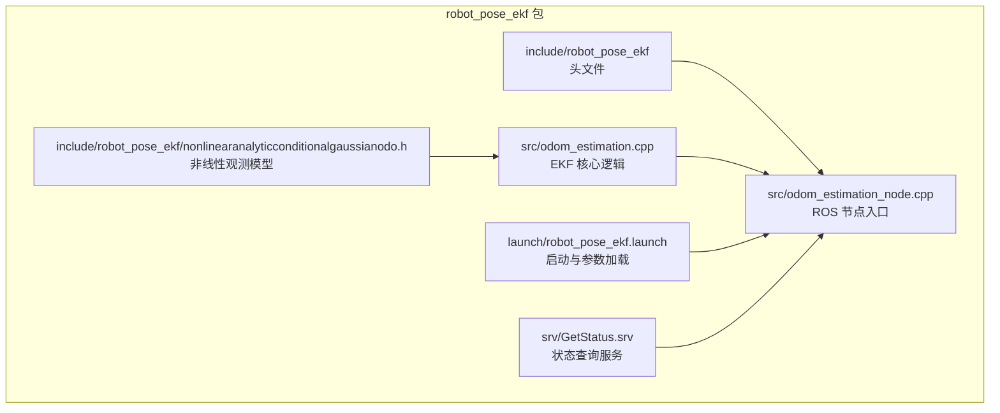
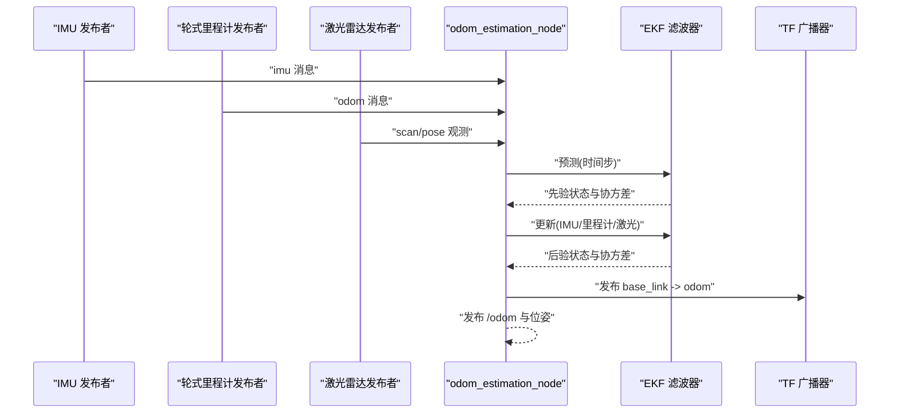
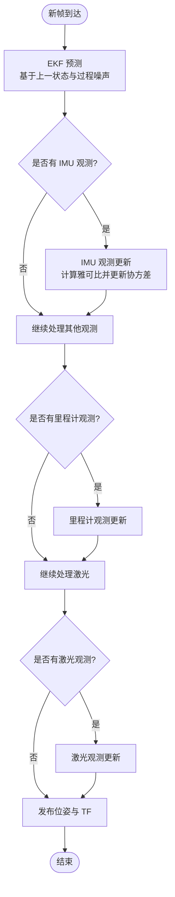
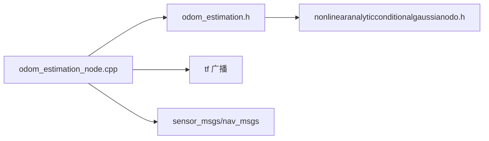

# 机器人位姿 EKF 姿态估计

<cite>
**本文引用的文件**   
- [robot_pose_ekf/README.md](file://sebot_ros_kits/src/sebot_driver/robot_pose_ekf/README.md)
- [robot_pose_ekf/CMakeLists.txt](file://sebot_ros_kits/src/sebot_driver/robot_pose_ekf/CMakeLists.txt)
- [robot_pose_ekf/package.xml](file://sebot_ros_kits/src/sebot_driver/robot_pose_ekf/package.xml)
- [robot_pose_ekf.launch](file://sebot_ros_kits/src/sebot_driver/robot_pose_ekf/launch/robot_pose_ekf.launch)
- [odom_estimation_node.cpp](file://sebot_ros_kits/src/sebot_driver/robot_pose_ekf/src/odom_estimation_node.cpp)
- [odom_estimation.h](file://sebot_ros_kits/src/sebot_driver/robot_pose_ekf/include/robot_pose_ekf/odom_estimation.h)
- [nonlinearanalyticconditionalgaussianodo.h](file://sebot_ros_kits/src/sebot_driver/robot_pose_ekf/include/robot_pose_ekf/nonlinearanalyticconditionalgaussianodo.h)
- [GetStatus.srv](file://sebot_ros_kits/src/sebot_driver/robot_pose_ekf/srv/GetStatus.srv)
</cite>

## 目录
1. [简介](#简介)
2. [项目结构](#项目结构)
3. [核心组件](#核心组件)
4. [架构总览](#架构总览)
5. [详细组件分析](#详细组件分析)
6. [依赖关系分析](#依赖关系分析)
7. [性能与调参指南](#性能与调参指南)
8. [故障排查与调试](#故障排查与调试)
9. [结论](#结论)
10. [附录：传感器输入格式与配置示例](#附录传感器输入格式与配置示例)

## 简介
本模块基于扩展卡尔曼滤波（EKF）对多源传感器数据进行融合，输出机器人位姿（位置与朝向）及其协方差。典型输入包括 IMU、轮式里程计和激光雷达观测；输出为统一坐标系下的位姿估计，供导航栈（AMCL/move_base）使用。文档聚焦于：
- EKF 滤波原理与本实现的数据融合机制
- IMU、轮式里程计、激光雷达的输入消息格式与关键参数
- 协方差矩阵设置、噪声参数调优与收敛性检查
- 不同传感器组合的配置示例与性能对比思路
- 调试方法（rosbag 录制、状态监控、精度评估工具）

## 项目结构
该 EKF 模块位于 sebot_ros_kits 工作空间的 robot_pose_ekf 包中，采用 ROS 标准包结构：
- include/robot_pose_ekf：头文件定义滤波器类与观测模型
- src/：节点主程序与核心实现
- launch/：启动脚本与默认参数
- srv/：服务接口用于运行时查询状态

图表来源
- [CMakeLists.txt](file://sebot_ros_kits/src/sebot_driver/robot_pose_ekf/CMakeLists.txt)
- [package.xml](file://sebot_ros_kits/src/sebot_driver/robot_pose_ekf/package.xml)
- [odom_estimation_node.cpp](file://sebot_ros_kits/src/sebot_driver/robot_pose_ekf/src/odom_estimation_node.cpp)
- [odom_estimation.h](file://sebot_ros_kits/src/sebot_driver/robot_pose_ekf/include/robot_pose_ekf/odom_estimation.h)
- [nonlinearanalyticconditionalgaussianodo.h](file://sebot_ros_kits/src/sebot_driver/robot_pose_ekf/include/robot_pose_ekf/nonlinearanalyticconditionalgaussianodo.h)
- [robot_pose_ekf.launch](file://sebot_ros_kits/src/sebot_driver/robot_pose_ekf/launch/robot_pose_ekf.launch)
- [GetStatus.srv](file://sebot_ros_kits/src/sebot_driver/robot_pose_ekf/srv/GetStatus.srv)

章节来源
- [robot_pose_ekf/README.md](file://sebot_ros_kits/src/sebot_driver/robot_pose_ekf/README.md)
- [CMakeLists.txt](file://sebot_ros_kits/src/sebot_driver/robot_pose_ekf/CMakeLists.txt)
- [package.xml](file://sebot_ros_kits/src/sebot_driver/robot_pose_ekf/package.xml)

## 核心组件
- 节点入口与参数管理：负责订阅 IMU、里程计、激光等话题，加载参数，发布位姿与 TF
- EKF 滤波器：维护状态向量（位姿与可能的速度项）、协方差矩阵，执行预测与更新
- 观测模型：将不同传感器的测量映射到状态空间，计算雅可比并更新协方差
- 服务接口：提供运行时状态查询（如协方差、是否收敛、最近更新时间）

章节来源
- [odom_estimation_node.cpp](file://sebot_ros_kits/src/sebot_driver/robot_pose_ekf/src/odom_estimation_node.cpp)
- [odom_estimation.h](file://sebot_ros_kits/src/sebot_driver/robot_pose_ekf/include/robot_pose_ekf/odom_estimation.h)
- [nonlinearanalyticconditionalgaussianodo.h](file://sebot_ros_kits/src/sebot_driver/robot_pose_ekf/include/robot_pose_ekf/nonlinearanalyticconditionalgaussianodo.h)
- [GetStatus.srv](file://sebot_ros_kits/src/sebot_driver/robot_pose_ekf/srv/GetStatus.srv)

## 架构总览
下图展示了数据流与控制流：传感器消息进入节点后，由 EKF 进行预测与更新，最终输出位姿与 TF。

图表来源
- [odom_estimation_node.cpp](file://sebot_ros_kits/src/sebot_driver/robot_pose_ekf/src/odom_estimation_node.cpp)
- [odom_estimation.h](file://sebot_ros_kits/src/sebot_driver/robot_pose_ekf/include/robot_pose_ekf/odom_estimation.h)
- [nonlinearanalyticconditionalgaussianodo.h](file://sebot_ros_kits/src/sebot_driver/robot_pose_ekf/include/robot_pose_ekf/nonlinearanalyticconditionalgaussianodo.h)

## 详细组件分析

### EKF 滤波器与状态空间
- 状态向量：通常包含平面位姿（x, y, theta），可选加入线/角速度以改善动态场景
- 协方差矩阵：描述各状态分量的不确定性与相关性，随时间增长（预测）并在观测后缩小（更新）
- 过程噪声：建模未观测到的加速度/扰动，影响协方差增长速率
- 观测噪声：来自传感器自身精度，决定更新时的“信任度”

章节来源
- [odom_estimation.h](file://sebot_ros_kits/src/sebot_driver/robot_pose_ekf/include/robot_pose_ekf/odom_estimation.h)
- [nonlinearanalyticconditionalgaussianodo.h](file://sebot_ros_kits/src/sebot_driver/robot_pose_ekf/include/robot_pose_ekf/nonlinearanalyticconditionalgaussianodo.h)

### 观测模型与多传感器融合
- IMU 观测：提供角速度与加速度信息，常用于修正朝向与抑制漂移
- 轮式里程计：提供相对位移与朝向变化，作为主要运动学约束
- 激光雷达：通过扫描匹配或特征提取得到绝对位姿观测，用于全局校正

图表来源
- [odom_estimation_node.cpp](file://sebot_ros_kits/src/sebot_driver/robot_pose_ekf/src/odom_estimation_node.cpp)
- [odom_estimation.h](file://sebot_ros_kits/src/sebot_driver/robot_pose_ekf/include/robot_pose_ekf/odom_estimation.h)
- [nonlinearanalyticconditionalgaussianodo.h](file://sebot_ros_kits/src/sebot_driver/robot_pose_ekf/include/robot_pose_ekf/nonlinearanalyticconditionalgaussianodo.h)

章节来源
- [odom_estimation_node.cpp](file://sebot_ros_kits/src/sebot_driver/robot_pose_ekf/src/odom_estimation_node.cpp)
- [odom_estimation.h](file://sebot_ros_kits/src/sebot_driver/robot_pose_ekf/include/robot_pose_ekf/odom_estimation.h)
- [nonlinearanalyticconditionalgaussianodo.h](file://sebot_ros_kits/src/sebot_driver/robot_pose_ekf/include/robot_pose_ekf/nonlinearanalyticconditionalgaussianodo.h)

### 节点入口与服务接口
- 节点职责：订阅传感器话题、加载参数、调用 EKF 预测/更新、发布位姿与 TF、响应状态查询服务
- 服务 GetStatus：返回当前协方差、最近更新时间、是否收敛等信息，便于在线诊断

章节来源
- [odom_estimation_node.cpp](file://sebot_ros_kits/src/sebot_driver/robot_pose_ekf/src/odom_estimation_node.cpp)
- [GetStatus.srv](file://sebot_ros_kits/src/sebot_driver/robot_pose_ekf/srv/GetStatus.srv)

## 依赖关系分析
- 外部依赖：ROS 基础库（roscpp、tf、sensor_msgs、nav_msgs）、Eigen（线性代数）
- 内部依赖：节点依赖 EKF 滤波器与观测模型；滤波器依赖协方差与噪声参数
- 耦合关系：节点与 EKF 解耦良好，观测模型可替换扩展

图表来源
- [odom_estimation_node.cpp](file://sebot_ros_kits/src/sebot_driver/robot_pose_ekf/src/odom_estimation_node.cpp)
- [odom_estimation.h](file://sebot_ros_kits/src/sebot_driver/robot_pose_ekf/include/robot_pose_ekf/odom_estimation.h)
- [nonlinearanalyticconditionalgaussianodo.h](file://sebot_ros_kits/src/sebot_driver/robot_pose_ekf/include/robot_pose_ekf/nonlinearanalyticconditionalgaussianodo.h)

章节来源
- [CMakeLists.txt](file://sebot_ros_kits/src/sebot_driver/robot_pose_ekf/CMakeLists.txt)
- [package.xml](file://sebot_ros_kits/src/sebot_driver/robot_pose_ekf/package.xml)

## 性能与调参指南
- 协方差矩阵设置
  - 初始协方差：反映初始不确定性，过大导致收敛慢，过小易发散
  - 过程噪声：根据实际振动与打滑情况调整，过大会使协方差快速膨胀
  - 观测噪声：依据传感器标定结果设定，IMU 角速度/加速度、里程计线/角速度误差、激光定位误差
- 收敛性检查
  - 观察协方差对角线是否稳定且不过大
  - 检查位姿轨迹是否平滑，无跳变或漂移
  - 使用服务查询最近更新时间与协方差统计量
- 调参与验证流程
  - 先仅用里程计，调过程噪声与初始协方差
  - 加入 IMU，调角速度噪声与偏置相关项
  - 加入激光，调扫描匹配噪声与更新频率
  - 使用 rosbag 回放，对比不同配置的轨迹与协方差

章节来源
- [odom_estimation.h](file://sebot_ros_kits/src/sebot_driver/robot_pose_ekf/include/robot_pose_ekf/odom_estimation.h)
- [nonlinearanalyticconditionalgaussianodo.h](file://sebot_ros_kits/src/sebot_driver/robot_pose_ekf/include/robot_pose_ekf/nonlinearanalyticconditionalgaussianodo.h)
- [GetStatus.srv](file://sebot_ros_kits/src/sebot_driver/robot_pose_ekf/srv/GetStatus.srv)

## 故障排查与调试
- 常见问题
  - 位姿发散：检查协方差是否过大、观测噪声是否过小、是否存在异常数据
  - 轨迹抖动：降低观测更新频率或增大观测噪声
  - 延迟与丢帧：确认传感器时间戳同步与发布频率
- 调试方法
  - rosbag 录制：录制 IMU、里程计、激光与位姿话题，离线分析
  - 状态监控：通过服务查询协方差与收敛状态，结合 RViz 可视化
  - 精度评估：与真值或高精度参考（如 RTK/GPS 或离线 SLAM 轨迹）对比 RMSE、漂移率

章节来源
- [odom_estimation_node.cpp](file://sebot_ros_kits/src/sebot_driver/robot_pose_ekf/src/odom_estimation_node.cpp)
- [GetStatus.srv](file://sebot_ros_kits/src/sebot_driver/robot_pose_ekf/srv/GetStatus.srv)

## 结论
本 EKF 模块通过合理的状态空间设计、观测模型与噪声参数配置，能够稳健地融合 IMU、里程计与激光雷达数据，输出高质量的位姿估计。建议按“里程计→IMU→激光”的顺序逐步调参，并结合 rosbag 与服务接口进行在线/离线诊断，确保在不同场景下保持收敛与精度。

## 附录：传感器输入格式与配置示例
- IMU 输入
  - 消息类型：sensor_msgs/Imu
  - 关键字段：角速度、加速度、协方差；需保证时间戳与坐标系正确
  - 参数要点：角速度噪声、加速度噪声、安装偏移与旋转
- 轮式里程计输入
  - 消息类型：nav_msgs/Odometry
  - 关键字段：位姿增量、线/角速度、协方差；注意基座标系与里程计坐标系变换
  - 参数要点：线速度噪声、角速度噪声、初始协方差
- 激光雷达输入
  - 消息类型：sensor_msgs/LaserScan 或自定义位姿观测
  - 关键字段：扫描数据或匹配后的位姿与协方差
  - 参数要点：扫描匹配噪声、更新阈值、最大距离与角度范围

章节来源
- [robot_pose_ekf.launch](file://sebot_ros_kits/src/sebot_driver/robot_pose_ekf/launch/robot_pose_ekf.launch)
- [odom_estimation_node.cpp](file://sebot_ros_kits/src/sebot_driver/robot_pose_ekf/src/odom_estimation_node.cpp)