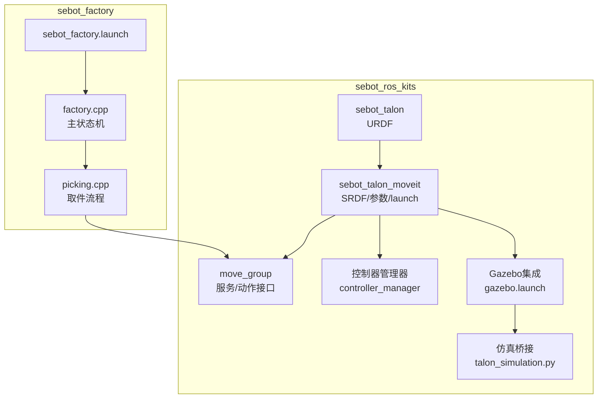
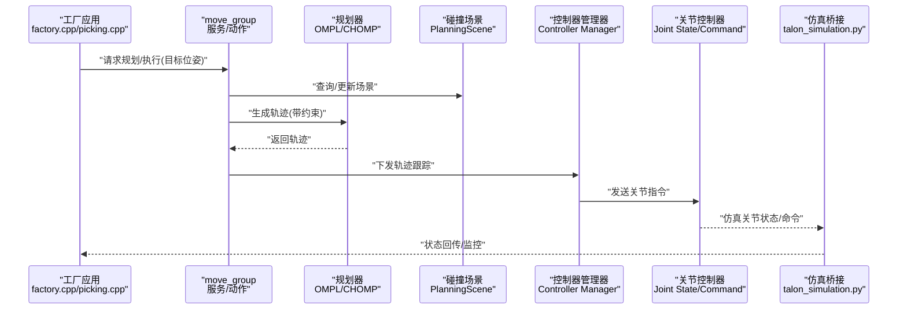
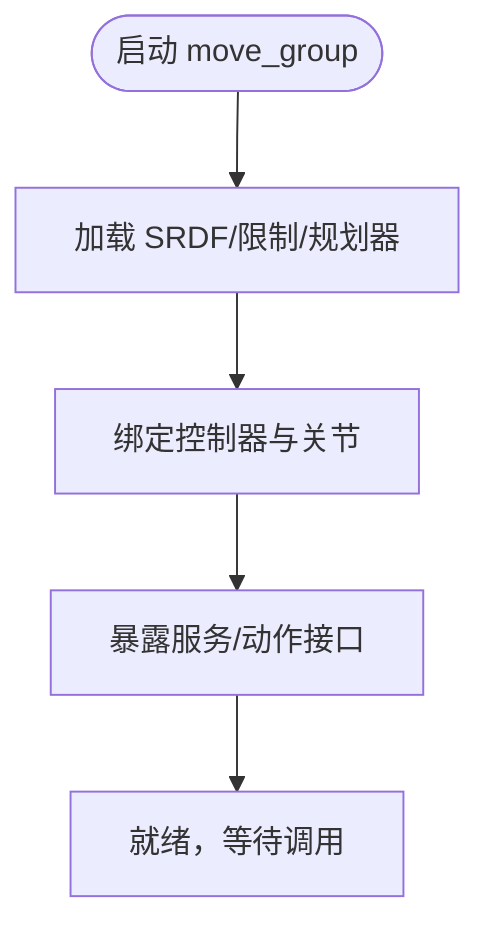
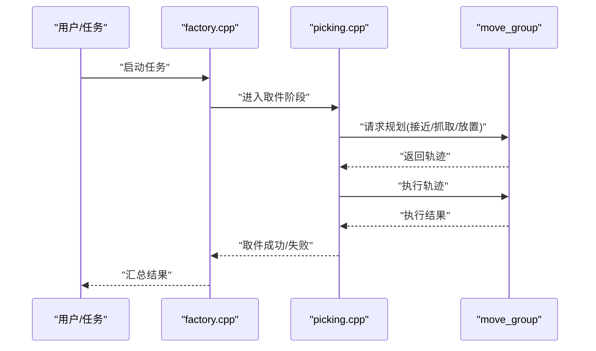
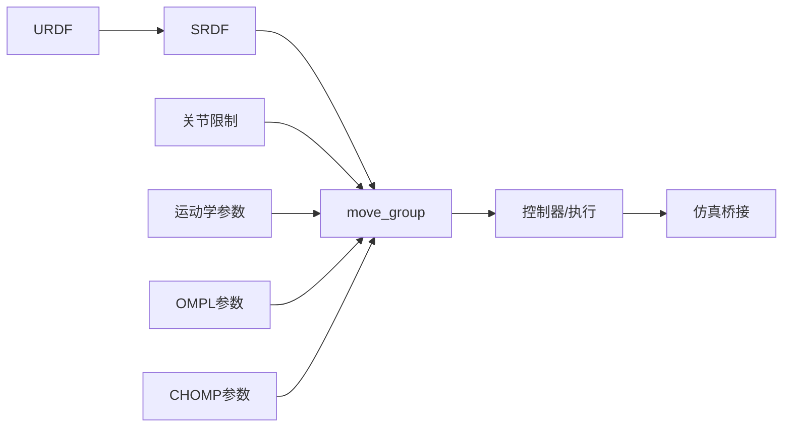

# Talon机械臂控制

<cite>
**本文引用的文件**   
- [sebot_talon.urdf](file://sebot_ros_kits/src/sebot_driver/sebot_talon/urdf/sebot_talon.urdf)
- [sebot_talon.srdf](file://sebot_ros_kits/src/sebot_driver/sebot_talon_moveit/config/sebot_talon.srdf)
- [joint_limits.yaml](file://sebot_ros_kits/src/sebot_driver/sebot_talon_moveit/config/joint_limits.yaml)
- [kinematics.yaml](file://sebot_ros_kits/src/sebot_driver/sebot_talon_moveit/config/kinematics.yaml)
- [ompl_planning.yaml](file://sebot_ros_kits/src/sebot_driver/sebot_talon_moveit/config/ompl_planning.yaml)
- [chomp_planning.yaml](file://sebot_ros_kits/src/sebot_driver/sebot_talon_moveit/config/chomp_planning.yaml)
- [ros_controllers.yaml](file://sebot_ros_kits/src/sebot_driver/sebot_talon_moveit/config/ros_controllers.yaml)
- [move_group.launch](file://sebot_ros_kits/src/sebot_driver/sebot_talon_moveit/launch/move_group.launch)
- [sebot_arm_moveit_controller_manager.launch.xml](file://sebot_ros_kits/src/sebot_driver/sebot_talon_moveit/launch/sebot_arm_moveit_controller_manager.launch.xml)
- [trajectory_execution.launch.xml](file://sebot_ros_kits/src/sebot_driver/sebot_talon_moveit/launch/trajectory_execution.launch.xml)
- [gazebo.launch](file://sebot_ros_kits/src/sebot_driver/sebot_talon_moveit/launch/gazebo.launch)
- [talon_simulation.py](file://sebot_ros_kits/src/sebot_driver/sebot_talon/scripts/talon_simulation.py)
- [sebot_factory.launch](file://sebot_factory/src/sebot_factory/launch/sebot_factory.launch)
- [factory.cpp](file://sebot_factory/src/sebot_factory/src/factory.cpp)
- [picking.cpp](file://sebot_factory/src/sebot_factory/src/picking.cpp)
</cite>

## 目录
1. [简介](#简介)
2. [项目结构](#项目结构)
3. [核心组件](#核心组件)
4. [架构总览](#架构总览)
5. [详细组件分析](#详细组件分析)
6. [依赖关系分析](#依赖关系分析)
7. [性能与调优建议](#性能与调优建议)
8. [故障排查指南](#故障排查指南)
9. [结论](#结论)
10. [附录：常用命令与接口](#附录常用命令与接口)

## 简介
本文件面向Talon机械臂控制系统，围绕MoveIt!框架集成、URDF模型配置、关节限制与碰撞检测、运动规划参数、move_group节点启动与服务接口、PID闭环控制与抓取轨迹规划、常用控制命令及常见运动学问题解决方案进行系统化说明。文档同时结合仓库中的工厂应用（sebot_factory）与机器人套件（sebot_ros_kits），给出从仿真到实机的一体化使用路径。

## 项目结构
本项目由三个相互独立的catkin工作空间组成：
- sebot_factory：上层业务应用（订单状态机、视觉取件、结算等）
- sebot_ros_kits：机器人驱动与工具包（含Talon机械臂URDF与MoveIt!配置、导航栈、SLAM等）
- sebot_ros_stdr：STDR仿真环境

Talon机械臂相关的关键位置：
- URDF模型：sebot_ros_kits/src/sebot_driver/sebot_talon/urdf/sebot_talon.urdf
- MoveIt!配置：sebot_ros_kits/src/sebot_driver/sebot_talon_moveit/config/*
- MoveIt!启动脚本：sebot_ros_kits/src/sebot_driver/sebot_talon_moveit/launch/*
- 仿真桥接脚本：sebot_ros_kits/src/sebot_driver/sebot_talon/scripts/talon_simulation.py
- 工厂应用集成入口：sebot_factory/src/sebot_factory/launch/sebot_factory.launch

图表来源
- [sebot_talon.urdf](file://sebot_ros_kits/src/sebot_driver/sebot_talon/urdf/sebot_talon.urdf)
- [sebot_talon.srdf](file://sebot_ros_kits/src/sebot_driver/sebot_talon_moveit/config/sebot_talon.srdf)
- [move_group.launch](file://sebot_ros_kits/src/sebot_driver/sebot_talon_moveit/launch/move_group.launch)
- [gazebo.launch](file://sebot_ros_kits/src/sebot_driver/sebot_talon_moveit/launch/gazebo.launch)
- [talon_simulation.py](file://sebot_ros_kits/src/sebot_driver/sebot_talon/scripts/talon_simulation.py)
- [sebot_factory.launch](file://sebot_factory/src/sebot_factory/launch/sebot_factory.launch)
- [factory.cpp](file://sebot_factory/src/sebot_factory/src/factory.cpp)
- [picking.cpp](file://sebot_factory/src/sebot_factory/src/picking.cpp)

章节来源
- [sebot_talon.urdf](file://sebot_ros_kits/src/sebot_driver/sebot_talon/urdf/sebot_talon.urdf)
- [sebot_talon.srdf](file://sebot_ros_kits/src/sebot_driver/sebot_talon_moveit/config/sebot_talon.srdf)
- [move_group.launch](file://sebot_ros_kits/src/sebot_driver/sebot_talon_moveit/launch/move_group.launch)
- [gazebo.launch](file://sebot_ros_kits/src/sebot_driver/sebot_talon_moveit/launch/gazebo.launch)
- [talon_simulation.py](file://sebot_ros_kits/src/sebot_driver/sebot_talon/scripts/talon_simulation.py)
- [sebot_factory.launch](file://sebot_factory/src/sebot_factory/launch/sebot_factory.launch)
- [factory.cpp](file://sebot_factory/src/sebot_factory/src/factory.cpp)
- [picking.cpp](file://sebot_factory/src/sebot_factory/src/picking.cpp)

## 核心组件
- URDF模型与坐标系：定义Talon各连杆、关节、传感器与末端执行器，提供机器人运动学基础。
- SRDF与碰撞体：描述自碰撞、工具坐标、虚拟碰撞体与规划组，支撑MoveIt!碰撞检测与规划。
- 关节限制与运动学：在joint_limits.yaml中限定速度/加速度/行程；kinematics.yaml配置IK求解器与容差。
- 运动规划器：OMPL与CHOMP参数分别用于采样式与优化式规划，影响成功率与实时性。
- move_group节点：统一暴露PlanningScene、MotionPlanRequest、ExecuteTrajectory等服务/动作接口。
- 控制器与执行：通过ros_controllers.yaml与controller_manager将规划结果下发至底层关节控制器。
- 仿真桥接：talon_simulation.py将ROS话题映射到仿真环境，便于无硬件调试。

章节来源
- [joint_limits.yaml](file://sebot_ros_kits/src/sebot_driver/sebot_talon_moveit/config/joint_limits.yaml)
- [kinematics.yaml](file://sebot_ros_kits/src/sebot_driver/sebot_talon_moveit/config/kinematics.yaml)
- [ompl_planning.yaml](file://sebot_ros_kits/src/sebot_driver/sebot_talon_moveit/config/ompl_planning.yaml)
- [chomp_planning.yaml](file://sebot_ros_kits/src/sebot_driver/sebot_talon_moveit/config/chomp_planning.yaml)
- [ros_controllers.yaml](file://sebot_ros_kits/src/sebot_driver/sebot_talon_moveit/config/ros_controllers.yaml)
- [move_group.launch](file://sebot_ros_kits/src/sebot_driver/sebot_talon_moveit/launch/move_group.launch)

## 架构总览
下图展示从高层应用到MoveIt!与底层控制的完整数据流。

图表来源
- [move_group.launch](file://sebot_ros_kits/src/sebot_driver/sebot_talon_moveit/launch/move_group.launch)
- [ompl_planning.yaml](file://sebot_ros_kits/src/sebot_driver/sebot_talon_moveit/config/ompl_planning.yaml)
- [chomp_planning.yaml](file://sebot_ros_kits/src/sebot_driver/sebot_talon_moveit/config/chomp_planning.yaml)
- [ros_controllers.yaml](file://sebot_ros_kits/src/sebot_driver/sebot_talon_moveit/config/ros_controllers.yaml)
- [talon_simulation.py](file://sebot_ros_kits/src/sebot_driver/sebot_talon/scripts/talon_simulation.py)
- [factory.cpp](file://sebot_factory/src/sebot_factory/src/factory.cpp)
- [picking.cpp](file://sebot_factory/src/sebot_factory/src/picking.cpp)

## 详细组件分析

### URDF模型与坐标系
- 作用：定义Talon的连杆、关节类型（revolute/prismatic）、初始位姿、惯性参数与传感器安装位置。
- 关键点：
  - 基座与末端法兰坐标系需与SRDF一致，确保正逆解正确。
  - 若包含夹爪或工具，需在URDF中声明其几何与质量，并在SRDF中作为tool_link处理。
  - 传感器（如相机/力矩）应标注frame并保证TF树连通。

章节来源
- [sebot_talon.urdf](file://sebot_ros_kits/src/sebot_driver/sebot_talon/urdf/sebot_talon.urdf)

### SRDF与碰撞检测
- 作用：定义规划组、自碰撞禁用对、工具坐标、虚拟碰撞体与传感器视锥。
- 关键点：
  - 规划组需包含所有参与运动的关节与末端link。
  - 为易碰撞部位添加简化碰撞体（box/sphere/cylinder）提升性能。
  - 设置self_collisions=false以允许合理范围内的自接触。

章节来源
- [sebot_talon.srdf](file://sebot_ros_kits/src/sebot_driver/sebot_talon_moveit/config/sebot_talon.srdf)

### 关节限制与运动学参数
- joint_limits.yaml：设定各关节的velocity/acceleration/effort与position limits，直接影响规划可行性与轨迹平滑度。
- kinematics.yaml：配置IK求解器（如KDL/TracIK/LIBKDL等）及其迭代次数、误差容差、收敛阈值。
- 建议：
  - 根据驱动器能力保守设置速度/加速度上限，避免超限报错。
  - IK容差过大导致精度下降，过小导致求解失败，需折中。

章节来源
- [joint_limits.yaml](file://sebot_ros_kits/src/sebot_driver/sebot_talon_moveit/config/joint_limits.yaml)
- [kinematics.yaml](file://sebot_ros_kits/src/sebot_driver/sebot_talon_moveit/config/kinematics.yaml)

### 运动规划器参数（OMPL/CHOMP）
- OMPL（ompl_planning.yaml）：采样式规划器，适合复杂构型与多约束场景。关键参数包括采样器类型、最大规划时间、扩展策略、邻域半径等。
- CHOMP（chomp_planning.yaml）：基于优化的轨迹平滑器，适合高维关节空间快速收敛。关键参数包括迭代次数、正则化权重、噪声强度等。
- 选择策略：
  - 首次尝试OMPL，若卡顿或失败再切换CHOMP或混合使用。
  - 调整max_time与sampling_parameters可平衡速度与成功率。

章节来源
- [ompl_planning.yaml](file://sebot_ros_kits/src/sebot_driver/sebot_talon_moveit/config/ompl_planning.yaml)
- [chomp_planning.yaml](file://sebot_ros_kits/src/sebot_driver/sebot_talon_moveit/config/chomp_planning.yaml)

### move_group节点启动与服务接口
- 启动方式：通过move_group.launch加载SRDF、规划器、控制器与rviz可视化。
- 主要服务/动作：
  - PlanningScene：发布/订阅场景更新（障碍物、物体位姿）。
  - MotionPlanService：单次规划请求（StartGoal/PathConstraints）。
  - ExecuteTrajectoryAction：执行已规划轨迹。
  - GetState、GetKinematicState：读取当前/可达状态。
- 控制器绑定：ros_controllers.yaml指定joint_trajectory_controller等，配合controller_manager完成下发。

图表来源
- [move_group.launch](file://sebot_ros_kits/src/sebot_driver/sebot_talon_moveit/launch/move_group.launch)
- [ros_controllers.yaml](file://sebot_ros_kits/src/sebot_driver/sebot_talon_moveit/config/ros_controllers.yaml)

章节来源
- [move_group.launch](file://sebot_ros_kits/src/sebot_driver/sebot_talon_moveit/launch/move_group.launch)
- [ros_controllers.yaml](file://sebot_ros_kits/src/sebot_driver/sebot_talon_moveit/config/ros_controllers.yaml)

### 控制器与执行链路
- ros_controllers.yaml：声明joint_state_controller、joint_trajectory_controller等，以及topic命名与PID参数。
- trajectory_execution.launch.xml：配置轨迹回放、插值、安全限幅与超时策略。
- 控制器管理器：负责生命周期管理、服务注册与消息路由。

章节来源
- [ros_controllers.yaml](file://sebot_ros_kits/src/sebot_driver/sebot_talon_moveit/config/ros_controllers.yaml)
- [trajectory_execution.launch.xml](file://sebot_ros_kits/src/sebot_driver/sebot_talon_moveit/launch/trajectory_execution.launch.xml)

### 仿真桥接与Gazebo集成
- gazebo.launch：启动Gazebo世界、加载URDF、连接插件。
- talon_simulation.py：将ROS话题映射到仿真关节状态/命令，实现无硬件调试。
- 建议：先仿真验证轨迹与碰撞，再迁移至实机。

章节来源
- [gazebo.launch](file://sebot_ros_kits/src/sebot_driver/sebot_talon_moveit/launch/gazebo.launch)
- [talon_simulation.py](file://sebot_ros_kits/src/sebot_driver/sebot_talon/scripts/talon_simulation.py)

### 工厂应用集成（状态机与取件流程）
- sebot_factory.launch：集中配置simulation模式、debug开关、导航超时、PID、取件距离、补扫等关键参数。
- factory.cpp：主状态机协调导航、定位、视觉、取件与结算。
- picking.cpp：封装取件子流程（接近、对准、抓取、放置），调用MoveIt!服务/动作完成轨迹规划与执行。

图表来源
- [sebot_factory.launch](file://sebot_factory/src/sebot_factory/launch/sebot_factory.launch)
- [factory.cpp](file://sebot_factory/src/sebot_factory/src/factory.cpp)
- [picking.cpp](file://sebot_factory/src/sebot_factory/src/picking.cpp)
- [move_group.launch](file://sebot_ros_kits/src/sebot_driver/sebot_talon_moveit/launch/move_group.launch)

章节来源
- [sebot_factory.launch](file://sebot_factory/src/sebot_factory/launch/sebot_factory.launch)
- [factory.cpp](file://sebot_factory/src/sebot_factory/src/factory.cpp)
- [picking.cpp](file://sebot_factory/src/sebot_factory/src/picking.cpp)

## 依赖关系分析
- URDF/SRDF是MoveIt!的基础输入，决定规划组、碰撞体与坐标系。
- 关节限制与运动学参数影响IK求解与轨迹可行性。
- 规划器参数决定搜索空间与计算开销。
- 控制器与执行链决定最终关节指令下发与稳定性。
- 仿真桥接使开发周期缩短，降低硬件风险。

图表来源
- [sebot_talon.urdf](file://sebot_ros_kits/src/sebot_driver/sebot_talon/urdf/sebot_talon.urdf)
- [sebot_talon.srdf](file://sebot_ros_kits/src/sebot_driver/sebot_talon_moveit/config/sebot_talon.srdf)
- [joint_limits.yaml](file://sebot_ros_kits/src/sebot_driver/sebot_talon_moveit/config/joint_limits.yaml)
- [kinematics.yaml](file://sebot_ros_kits/src/sebot_driver/sebot_talon_moveit/config/kinematics.yaml)
- [ompl_planning.yaml](file://sebot_ros_kits/src/sebot_driver/sebot_talon_moveit/config/ompl_planning.yaml)
- [chomp_planning.yaml](file://sebot_ros_kits/src/sebot_driver/sebot_talon_moveit/config/chomp_planning.yaml)
- [move_group.launch](file://sebot_ros_kits/src/sebot_driver/sebot_talon_moveit/launch/move_group.launch)
- [talon_simulation.py](file://sebot_ros_kits/src/sebot_driver/sebot_talon/scripts/talon_simulation.py)

## 性能与调优建议
- 规划性能：
  - 适当增大OMPL采样数与最大规划时间以提升成功率，但会延长耗时。
  - CHOMP迭代次数与正则化权重影响平滑度与收敛速度，建议逐步调参。
- 碰撞检测：
  - 用简单几何体近似复杂形状，减少BVH构建开销。
  - 合理设置self_collision与外部障碍物密度。
- 控制器与PID：
  - 先整定比例项P，再引入积分I消除稳态误差，最后加微分D抑制超调。
  - 关注关节速度/加速度限幅，避免抖动与震荡。
- 轨迹执行：
  - 检查插值步长与重规划频率，确保实时性与稳定性。
  - 在仿真环境中先行验证，再上实机。

[本节为通用指导，不直接分析具体文件]

## 故障排查指南
- 无法规划/频繁失败：
  - 检查URDF/SRDF一致性（坐标系、规划组、碰撞体）。
  - 校验joint_limits是否过紧或与实际不符。
  - 调整OMPL/CHOMP参数，增加max_time或放宽约束。
- IK求解失败：
  - 增大kinematics容差或迭代次数。
  - 检查末端目标是否在可达域内。
- 执行抖动/震荡：
  - 重新整定PID，减小P或加入D。
  - 检查控制器带宽与通信延迟。
- 仿真与实机不一致：
  - 核对talon_simulation.py映射关系与topic命名。
  - 确认URDF质量/惯性参数与真实负载匹配。

章节来源
- [sebot_talon.urdf](file://sebot_ros_kits/src/sebot_driver/sebot_talon/urdf/sebot_talon.urdf)
- [sebot_talon.srdf](file://sebot_ros_kits/src/sebot_driver/sebot_talon_moveit/config/sebot_talon.srdf)
- [joint_limits.yaml](file://sebot_ros_kits/src/sebot_driver/sebot_talon_moveit/config/joint_limits.yaml)
- [kinematics.yaml](file://sebot_ros_kits/src/sebot_driver/sebot_talon_moveit/config/kinematics.yaml)
- [ompl_planning.yaml](file://sebot_ros_kits/src/sebot_driver/sebot_talon_moveit/config/ompl_planning.yaml)
- [chomp_planning.yaml](file://sebot_ros_kits/src/sebot_driver/sebot_talon_moveit/config/chomp_planning.yaml)
- [ros_controllers.yaml](file://sebot_ros_kits/src/sebot_driver/sebot_talon_moveit/config/ros_controllers.yaml)
- [talon_simulation.py](file://sebot_ros_kits/src/sebot_driver/sebot_talon/scripts/talon_simulation.py)

## 结论
Talon机械臂控制系统以URDF/SRDF为基础，结合MoveIt!规划与控制器执行链路，形成从仿真到实机的完整闭环。通过合理配置关节限制、运动学与规划器参数，并采用稳健的PID整定与轨迹执行策略，可实现稳定高效的抓取作业。建议在仿真环境中充分验证后再迁移至实机，以降低调试成本与风险。

[本节为总结性内容，不直接分析具体文件]

## 附录：常用命令与接口
- 启动move_group：
  - 使用move_group.launch启动，加载SRDF、规划器与控制器。
- 常用服务/动作：
  - PlanningScene：发布/订阅场景更新。
  - MotionPlanService：单次规划请求。
  - ExecuteTrajectoryAction：执行轨迹。
  - GetState/GetKinematicState：读取状态。
- 工厂应用调用：
  - sebot_factory.launch集中配置仿真/调试与关键参数。
  - factory.cpp与picking.cpp封装业务流程，调用MoveIt!接口完成取件。

章节来源
- [move_group.launch](file://sebot_ros_kits/src/sebot_driver/sebot_talon_moveit/launch/move_group.launch)
- [sebot_factory.launch](file://sebot_factory/src/sebot_factory/launch/sebot_factory.launch)
- [factory.cpp](file://sebot_factory/src/sebot_factory/src/factory.cpp)
- [picking.cpp](file://sebot_factory/src/sebot_factory/src/picking.cpp)