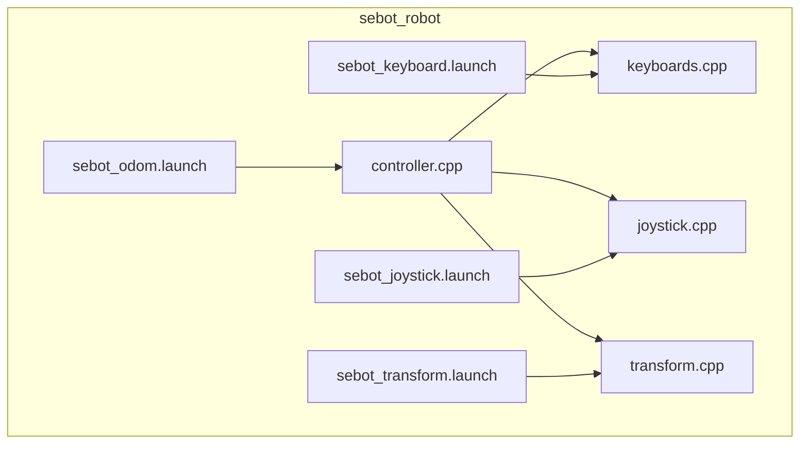
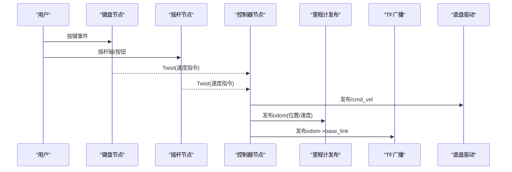
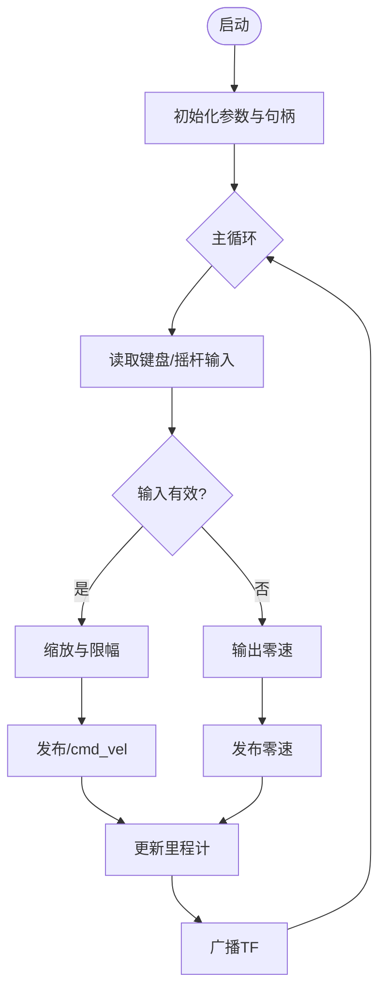
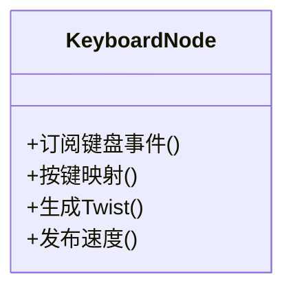
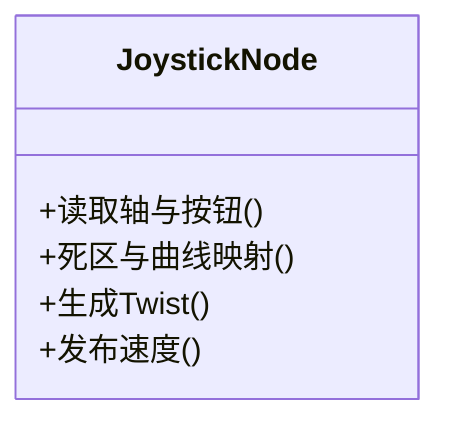
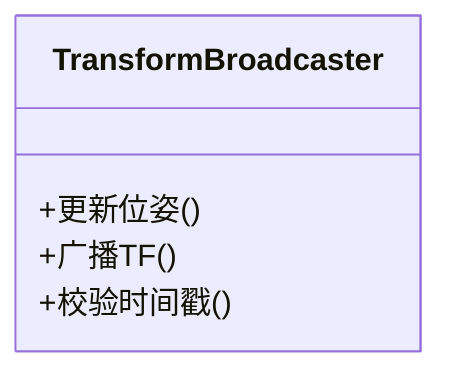
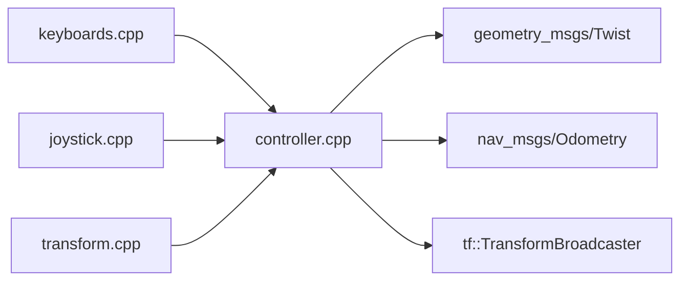

# 机器人基础控制

<cite>
**本文引用的文件**   
- [controller.cpp](file://sebot_ros_kits/src/sebot_robot/src/controller.cpp)
- [joystick.cpp](file://sebot_ros_kits/src/sebot_robot/src/joystick.cpp)
- [keyboards.cpp](file://sebot_ros_kits/src/sebot_robot/src/keyboards.cpp)
- [transform.cpp](file://sebot_ros_kits/src/sebot_robot/src/transform.cpp)
- [sebot_joystick.launch](file://sebot_ros_kits/src/sebot_robot/launch/sebot_joystick.launch)
- [sebot_keyboard.launch](file://sebot_ros_kits/src/sebot_robot/launch/sebot_keyboard.launch)
- [sebot_odom.launch](file://sebot_ros_kits/src/sebot_robot/launch/sebot_odom.launch)
- [sebot_transform.launch](file://sebot_ros_kits/src/sebot_robot/launch/sebot_transform.launch)
- [CMakeLists.txt](file://sebot_ros_kits/src/sebot_robot/CMakeLists.txt)
- [package.xml](file://sebot_ros_kits/src/sebot_robot/package.xml)
</cite>

## 目录
1. [简介](#简介)
2. [项目结构](#项目结构)
3. [核心组件](#核心组件)
4. [架构总览](#架构总览)
5. [详细组件分析](#详细组件分析)
6. [依赖关系分析](#依赖关系分析)
7. [性能与实时性](#性能与实时性)
8. [故障排查指南](#故障排查指南)
9. [结论](#结论)
10. [附录：调试与测试方法](#附录调试与测试方法)

## 简介
本文件面向“机器人基础控制模块”，聚焦于键盘与摇杆两种输入方式如何驱动机器人，并说明里程计发布、TF坐标变换以及速度指令转换的完整流程。文档同时覆盖控制器初始化、错误处理、实时性能优化要点，并提供话题监听、消息格式查看与控制延迟测试等调试方法，帮助快速定位常见控制问题。

## 项目结构
sebot_robot 包提供基础控制能力，包含以下关键内容：
- 节点源码：控制器主循环、键盘输入、摇杆输入、TF广播
- Launch 配置：分别启动键盘、摇杆、里程计、TF 广播
- 构建与依赖：CMakeLists 与 package.xml 定义编译项与ROS依赖

图表来源 
- [controller.cpp](file://sebot_ros_kits/src/sebot_robot/src/controller.cpp)
- [keyboards.cpp](file://sebot_ros_kits/src/sebot_robot/src/keyboards.cpp)
- [joystick.cpp](file://sebot_ros_kits/src/sebot_robot/src/joystick.cpp)
- [transform.cpp](file://sebot_ros_kits/src/sebot_robot/src/transform.cpp)
- [sebot_keyboard.launch](file://sebot_ros_kits/src/sebot_robot/launch/sebot_keyboard.launch)
- [sebot_joystick.launch](file://sebot_ros_kits/src/sebot_robot/launch/sebot_joystick.launch)
- [sebot_odom.launch](file://sebot_ros_kits/src/sebot_robot/launch/sebot_odom.launch)
- [sebot_transform.launch](file://sebot_ros_kits/src/sebot_robot/launch/sebot_transform.launch)

章节来源
- [CMakeLists.txt](file://sebot_ros_kits/src/sebot_robot/CMakeLists.txt)
- [package.xml](file://sebot_ros_kits/src/sebot_robot/package.xml)

## 核心组件
- 控制器（controller）：统一订阅键盘或摇杆输入，转换为Twist速度指令并发布到底盘；同时负责里程计发布与TF广播调度。
- 键盘输入（keyboards）：将键盘按键映射为线速度与角速度，支持方向键/WASD等常用键位。
- 摇杆输入（joystick）：读取Joystick设备轴与按钮，按配置映射为Twist命令，支持死区与缩放。
- TF广播（transform）：根据里程计状态发布 odom->base_link 的坐标变换，供导航与可视化使用。

章节来源
- [controller.cpp](file://sebot_ros_kits/src/sebot_robot/src/controller.cpp)
- [keyboards.cpp](file://sebot_ros_kits/src/sebot_robot/src/keyboards.cpp)
- [joystick.cpp](file://sebot_ros_kits/src/sebot_robot/src/joystick.cpp)
- [transform.cpp](file://sebot_ros_kits/src/sebot_robot/src/transform.cpp)

## 架构总览
下图展示从输入设备到速度指令与里程计/TF发布的整体数据流。

图表来源 
- [controller.cpp](file://sebot_ros_kits/src/sebot_robot/src/controller.cpp)
- [keyboards.cpp](file://sebot_ros_kits/src/sebot_robot/src/keyboards.cpp)
- [joystick.cpp](file://sebot_ros_kits/src/sebot_robot/src/joystick.cpp)
- [transform.cpp](file://sebot_ros_kits/src/sebot_robot/src/transform.cpp)

## 详细组件分析

### 控制器（controller）
- 功能职责
  - 选择输入源：通过参数或Launch切换键盘/摇杆模式。
  - 速度指令转换：对输入进行限幅、死区处理、单位换算后生成Twist。
  - 里程计发布：基于时间戳与速度积分更新odom，并发布tf。
  - 安全保护：超时停止、非法输入过滤、异常恢复。
- 关键流程
  - 初始化：加载参数、订阅输入、创建发布者。
  - 主循环：轮询输入→转换→发布cmd_vel→更新里程计→广播TF。
  - 错误处理：连接失败重试、消息丢弃策略、日志告警。

图表来源 
- [controller.cpp](file://sebot_ros_kits/src/sebot_robot/src/controller.cpp)

章节来源
- [controller.cpp](file://sebot_ros_kits/src/sebot_robot/src/controller.cpp)

### 键盘输入（keyboards）
- 映射关系
  - 方向键/WASD：前后左右移动与旋转。
  - 数字键：速度档位切换（如低速/中速/高速）。
  - 组合键：紧急停止或复位。
- 行为特性
  - 按键去抖与重复触发抑制。
  - 默认速度上限与加速度限制。
  - 无输入时自动输出零速。

图表来源 
- [keyboards.cpp](file://sebot_ros_kits/src/sebot_robot/src/keyboards.cpp)

章节来源
- [keyboards.cpp](file://sebot_ros_kits/src/sebot_robot/src/keyboards.cpp)

### 摇杆输入（joystick）
- 映射关系
  - 左摇杆X/Y：线速度vx, vy（差速底盘通常仅用vx）。
  - 右摇杆或按钮：角速度vz。
  - 按钮：模式切换、限速、急停。
- 行为特性
  - 轴死区阈值与线性/指数曲线映射。
  - 采样频率与滤波（均值/一阶低通）。
  - 断连检测与自动回零。

图表来源 
- [joystick.cpp](file://sebot_ros_kits/src/sebot_robot/src/joystick.cpp)

章节来源
- [joystick.cpp](file://sebot_ros_kits/src/sebot_robot/src/joystick.cpp)

### TF坐标变换（transform）
- 坐标系约定
  - 固定帧：odom
  - 子帧：base_link
  - 发布频率：与里程计一致或略高
- 内容
  - 平移(x,y,z)与四元数姿态(roll,pitch,yaw)。
  - 时间戳与父/子帧ID一致性校验。

图表来源 
- [transform.cpp](file://sebot_ros_kits/src/sebot_robot/src/transform.cpp)

章节来源
- [transform.cpp](file://sebot_ros_kits/src/sebot_robot/src/transform.cpp)

### 里程计发布机制
- 数据来源
  - 速度积分：由cmd_vel与dt计算位移与角度增量。
  - 可选传感器融合：IMU/编码器（若启用EKF）。
- 发布内容
  - Pose与PoseCovariance、Twist与TwistCovariance。
  - 严格的时间戳与坐标系ID。
- 误差控制
  - 数值稳定性（避免除零、溢出）。
  - 协方差合理设置，便于下游滤波器使用。

章节来源
- [controller.cpp](file://sebot_ros_kits/src/sebot_robot/src/controller.cpp)

## 依赖关系分析
- 运行时依赖
  - ROS核心：roscpp、std_msgs、geometry_msgs、sensor_msgs、nav_msgs、tf。
  - 硬件接口：键盘（系统事件）、Joystick（/dev/input/js*）。
- 构建依赖
  - CMakeLists 声明可执行目标与链接库。
  - package.xml 声明ROS包依赖与运行依赖。

图表来源 
- [controller.cpp](file://sebot_ros_kits/src/sebot_robot/src/controller.cpp)
- [keyboards.cpp](file://sebot_ros_kits/src/sebot_robot/src/keyboards.cpp)
- [joystick.cpp](file://sebot_ros_kits/src/sebot_robot/src/joystick.cpp)
- [transform.cpp](file://sebot_ros_kits/src/sebot_robot/src/transform.cpp)

章节来源
- [CMakeLists.txt](file://sebot_ros_kits/src/sebot_robot/CMakeLists.txt)
- [package.xml](file://sebot_ros_kits/src/sebot_robot/package.xml)

## 性能与实时性
- 控制周期
  - 建议10–50ms周期，保证响应性与稳定性平衡。
  - 使用高精度时钟与线程优先级提升（必要时）。
- 数据处理
  - 输入滤波：一阶低通或滑动平均，减少抖动。
  - 限幅与缓动：避免突变导致底盘失稳。
- I/O与网络
  - cmd_vel发布频率与底盘驱动匹配，避免拥塞。
  - 批量发布与最小化序列化开销。
- 资源占用
  - 单线程事件循环优先，避免阻塞操作。
  - 日志分级输出，降低高频I/O。

[本节为通用指导，不直接分析具体文件]

## 故障排查指南
- 现象：机器人不动或乱动
  - 检查/cmd_vel是否被正确发布与订阅。
  - 确认输入映射与符号方向是否正确。
  - 验证速度限幅与死区参数是否过严。
- 现象：里程计漂移或发散
  - 核对时间戳连续性与坐标系ID。
  - 检查协方差设置与积分步长。
  - 若有IMU/EKF，确认融合权重与噪声模型。
- 现象：TF报错或无法显示
  - 确认odom->base_link存在且时间戳有效。
  - 检查父/子帧命名与静态TF冲突。
- 现象：键盘/摇杆无响应
  - 权限与设备路径是否正确（/dev/input/js*）。
  - 节点是否成功订阅对应话题/设备。
  - 查看节点日志中的错误码与警告信息。

章节来源
- [controller.cpp](file://sebot_ros_kits/src/sebot_robot/src/controller.cpp)
- [keyboards.cpp](file://sebot_ros_kits/src/sebot_robot/src/keyboards.cpp)
- [joystick.cpp](file://sebot_ros_kits/src/sebot_robot/src/joystick.cpp)
- [transform.cpp](file://sebot_ros_kits/src/sebot_robot/src/transform.cpp)

## 结论
本基础控制模块以简洁清晰的节点划分实现键盘与摇杆双输入，完成速度指令转换、里程计发布与TF广播，形成稳定的底层控制闭环。通过合理的参数配置与调试手段，可在不同平台上快速适配与优化，满足比赛与工程应用需求。

[本节为总结性内容，不直接分析具体文件]

## 附录：调试与测试方法
- 话题监听
  - 使用 rqt_topic 或 rostopic echo 查看 /cmd_vel、/odom、/tf 等消息。
  - 关注时间戳、坐标系ID、协方差字段是否合理。
- 消息格式查看
  - rostopic type 与 rosmsg show 查看消息结构与字段含义。
- 控制延迟测试
  - 在键盘/摇杆节点与底盘驱动之间打点计时，统计端到端延迟分布。
  - 调整控制周期与发布频率，观察抖动与稳定性变化。
- 可视化
  - RViz 中启用 Odometry 与 TF 显示，观察轨迹与坐标系关系。
- 参数调优
  - 逐步放宽死区与限幅，观察响应与能耗变化。
  - 针对地面摩擦与负载，重新标定速度与距离比例系数。

章节来源
- [sebot_keyboard.launch](file://sebot_ros_kits/src/sebot_robot/launch/sebot_keyboard.launch)
- [sebot_joystick.launch](file://sebot_ros_kits/src/sebot_robot/launch/sebot_joystick.launch)
- [sebot_odom.launch](file://sebot_ros_kits/src/sebot_robot/launch/sebot_odom.launch)
- [sebot_transform.launch](file://sebot_ros_kits/src/sebot_robot/launch/sebot_transform.launch)