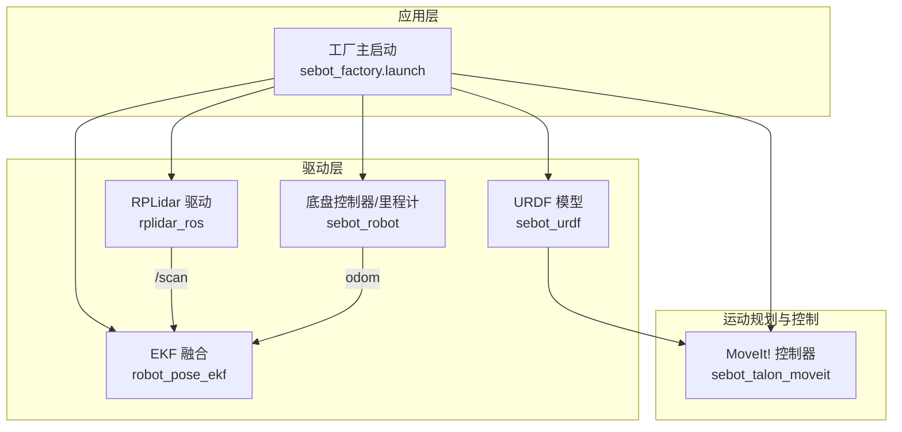
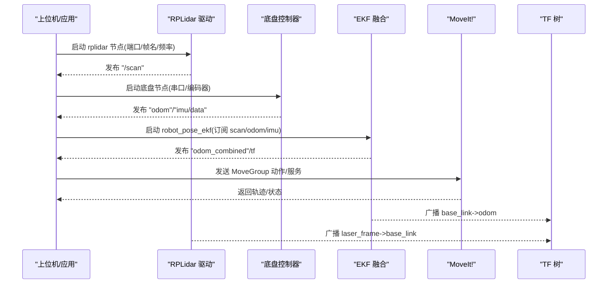
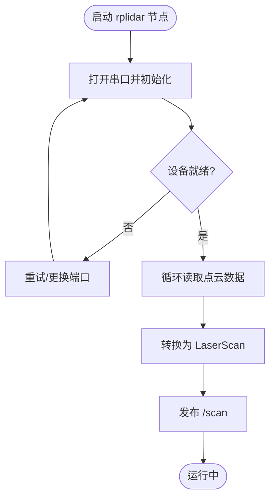
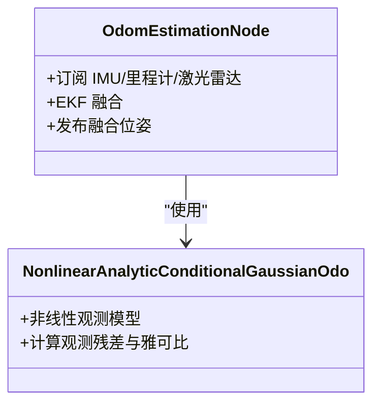
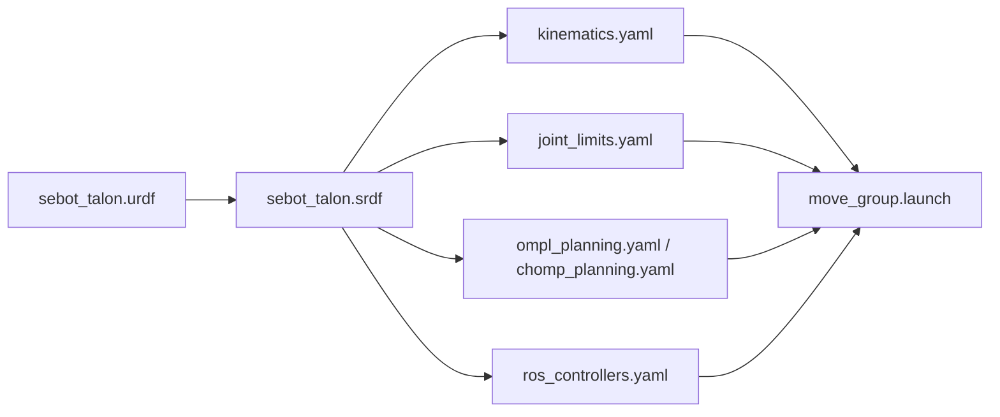
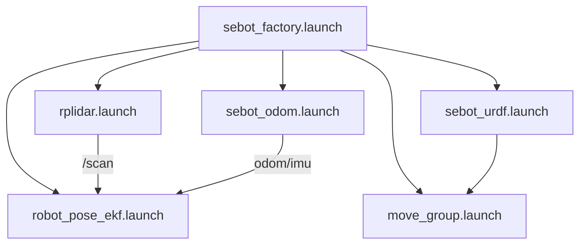

# 硬件驱动层

<cite>
**本文引用的文件**   
- [sebot_factory.launch](file://sebot_factory/src/sebot_factory/launch/sebot_factory.launch)
- [rplidar.launch](file://sebot_ros_kits/src/sebot_driver/rplidar_ros/launch/rplidar.launch)
- [view_rplidar.launch](file://sebot_ros_kits/src/sebot_driver/rplidar_ros/launch/view_rplidar.launch)
- [node.cpp](file://sebot_ros_kits/src/sebot_driver/rplidar_ros/src/node.cpp)
- [CMakeLists.txt](file://sebot_ros_kits/src/sebot_driver/rplidar_ros/CMakeLists.txt)
- [package.xml](file://sebot_ros_kits/src/sebot_driver/rplidar_ros/package.xml)
- [robot_pose_ekf.launch](file://sebot_ros_kits/src/sebot_driver/robot_pose_ekf/launch/robot_pose_ekf.launch)
- [odom_estimation_node.h](file://sebot_ros_kits/src/sebot_driver/robot_pose_ekf/include/robot_pose_ekf/odom_estimation_node.h)
- [odom_estimation_node.cpp](file://sebot_ros_kits/src/sebot_driver/robot_pose_ekf/src/odom_estimation_node.cpp)
- [nonlinearanalyticconditionalgaussianodo.h](file://sebot_ros_kits/src/sebot_driver/robot_pose_ekf/include/robot_pose_ekf/nonlinearanalyticconditionalgaussianodo.h)
- [nonlinearanalyticconditionalgaussianodo.cpp](file://sebot_ros_kits/src/sebot_driver/robot_pose_ekf/src/nonlinearanalyticconditionalgaussianodo.cpp)
- [sebot_urdf.launch](file://sebot_ros_kits/src/sebot_urdf/launch/sebot_urdf.launch)
- [sebot_talon.urdf](file://sebot_ros_kits/src/sebot_talon/urdf/sebot_talon.urdf)
- [move_group.launch](file://sebot_ros_kits/src/sebot_talon_moveit/launch/move_group.launch)
- [ros_controllers.yaml](file://sebot_ros_kits/src/sebot_talon_moveit/config/ros_controllers.yaml)
- [joint_limits.yaml](file://sebot_ros_kits/src/sebot_talon_moveit/config/joint_limits.yaml)
- [kinematics.yaml](file://sebot_ros_kits/src/sebot_talon_moveit/config/kinematics.yaml)
- [ompl_planning.yaml](file://sebot_ros_kits/src/sebot_talon_moveit/config/ompl_planning.yaml)
- [chomp_planning.yaml](file://sebot_ros_kits/src/sebot_talon_moveit/config/chomp_planning.yaml)
- [sebot_talon.srdf](file://sebot_ros_kits/src/sebot_talon_moveit/config/sebot_talon.srdf)
- [sebot_robot.launch](file://sebot_ros_kits/src/sebot_robot/launch/sebot_odom.launch)
- [controller.cpp](file://sebot_ros_kits/src/sebot_robot/src/controller.cpp)
- [transform.cpp](file://sebot_ros_kits/src/sebot_robot/src/transform.cpp)
</cite>

## 目录
1. [简介](#简介)
2. [项目结构](#项目结构)
3. [核心组件](#核心组件)
4. [架构总览](#架构总览)
5. [详细组件分析](#详细组件分析)
6. [依赖关系分析](#依赖关系分析)
7. [性能考虑](#性能考虑)
8. [故障排查指南](#故障排查指南)
9. [结论](#结论)
10. [附录](#附录)

## 简介
本文件面向硬件驱动层，聚焦以下目标：
- RPLidar 激光雷达驱动的集成方式、串口配置与点云数据发布流程
- robot_pose_ekf 姿态估计的传感器融合配置（IMU、轮式里程计、激光雷达）及参数调优建议
- Talon 机械臂的 MoveIt! 配置与运动控制接口说明
- 硬件连接图、驱动安装步骤、参数配置文件说明与常见问题解决方案
- 调试命令与性能监控方法

本项目由三个相互独立的 catkin 工作空间组成：sebot_factory（应用层）、sebot_ros_kits（机器人套件）、sebot_ros_stdr（仿真层）。导航栈、SLAM、RPLidar 驱动、robot_pose_ekf 等均为 fork 自 ROS 官方或开源项目，本文仅说明其在项目中的角色、launch 集成方式与参数定制。

## 项目结构
硬件驱动相关的关键包与文件分布如下：
- sebot_ros_kits/src/sebot_driver/rplidar_ros：RPLidar 驱动节点与 launch
- sebot_ros_kits/src/sebot_driver/robot_pose_ekf：EKF 融合节点与 launch
- sebot_ros_kits/src/sebot_talon_moveit：Talon 机械臂 MoveIt! 配置与 launch
- sebot_ros_kits/src/sebot_urdf：机器人 URDF 模型与加载 launch
- sebot_ros_kits/src/sebot_robot：底盘控制器与里程计发布（含串口通信）
- sebot_factory/src/sebot_factory/launch/sebot_factory.launch：主启动入口，统一装配各子系统

图表来源
- [sebot_factory.launch](file://sebot_factory/src/sebot_factory/launch/sebot_factory.launch)
- [rplidar.launch](file://sebot_ros_kits/src/sebot_driver/rplidar_ros/launch/rplidar.launch)
- [robot_pose_ekf.launch](file://sebot_ros_kits/src/sebot_driver/robot_pose_ekf/launch/robot_pose_ekf.launch)
- [sebot_urdf.launch](file://sebot_ros_kits/src/sebot_urdf/launch/sebot_urdf.launch)
- [move_group.launch](file://sebot_ros_kits/src/sebot_talon_moveit/launch/move_group.launch)

章节来源
- [sebot_factory.launch](file://sebot_factory/src/sebot_factory/launch/sebot_factory.launch)
- [rplidar.launch](file://sebot_ros_kits/src/sebot_driver/rplidar_ros/launch/rplidar.launch)
- [robot_pose_ekf.launch](file://sebot_ros_kits/src/sebot_driver/robot_pose_ekf/launch/robot_pose_ekf.launch)
- [sebot_urdf.launch](file://sebot_ros_kits/src/sebot_urdf/launch/sebot_urdf.launch)
- [move_group.launch](file://sebot_ros_kits/src/sebot_talon_moveit/launch/move_group.launch)

## 核心组件
- RPLidar 驱动：通过串口读取激光扫描数据，发布 /scan 消息；提供 launch 配置端口、帧名、分辨率等参数
- robot_pose_ekf：订阅 IMU、轮式里程计、激光雷达观测，输出融合后的位姿与协方差
- Talon 机械臂 MoveIt!：基于 URDF/SRDF 描述，配置关节限制、逆解、规划器与控制器
- 底盘与里程计：串口通信获取编码器/IMU 原始数据，发布 odom 与 tf

章节来源
- [node.cpp](file://sebot_ros_kits/src/sebot_driver/rplidar_ros/src/node.cpp)
- [CMakeLists.txt](file://sebot_ros_kits/src/sebot_driver/rplidar_ros/CMakeLists.txt)
- [package.xml](file://sebot_ros_kits/src/sebot_driver/rplidar_ros/package.xml)
- [odom_estimation_node.h](file://sebot_ros_kits/src/sebot_driver/robot_pose_ekf/include/robot_pose_ekf/odom_estimation_node.h)
- [odom_estimation_node.cpp](file://sebot_ros_kits/src/sebot_driver/robot_pose_ekf/src/odom_estimation_node.cpp)
- [nonlinearanalyticconditionalgaussianodo.h](file://sebot_ros_kits/src/sebot_driver/robot_pose_ekf/include/robot_pose_ekf/nonlinearanalyticconditionalgaussianodo.h)
- [nonlinearanalyticconditionalgaussianodo.cpp](file://sebot_ros_kits/src/sebot_driver/robot_pose_ekf/src/nonlinearanalyticconditionalgaussianodo.cpp)
- [sebot_talon.urdf](file://sebot_ros_kits/src/sebot_talon/urdf/sebot_talon.urdf)
- [ros_controllers.yaml](file://sebot_ros_kits/src/sebot_talon_moveit/config/ros_controllers.yaml)
- [joint_limits.yaml](file://sebot_ros_kits/src/sebot_talon_moveit/config/joint_limits.yaml)
- [kinematics.yaml](file://sebot_ros_kits/src/sebot_talon_moveit/config/kinematics.yaml)
- [ompl_planning.yaml](file://sebot_ros_kits/src/sebot_talon_moveit/config/ompl_planning.yaml)
- [chomp_planning.yaml](file://sebot_ros_kits/src/sebot_talon_moveit/config/chomp_planning.yaml)
- [sebot_talon.srdf](file://sebot_ros_kits/src/sebot_talon_moveit/config/sebot_talon.srdf)
- [controller.cpp](file://sebot_ros_kits/src/sebot_robot/src/controller.cpp)
- [transform.cpp](file://sebot_ros_kits/src/sebot_robot/src/transform.cpp)

## 架构总览
下图展示硬件驱动层在系统中的交互关系：RPLidar 驱动发布 /scan，底盘控制器发布 odom 与 IMU 数据，EKF 融合三者得到稳定位姿；MoveIt! 基于 URDF/SRDF 进行机械臂轨迹规划与执行。

图表来源
- [rplidar.launch](file://sebot_ros_kits/src/sebot_driver/rplidar_ros/launch/rplidar.launch)
- [node.cpp](file://sebot_ros_kits/src/sebot_driver/rplidar_ros/src/node.cpp)
- [sebot_robot.launch](file://sebot_ros_kits/src/sebot_robot/launch/sebot_odom.launch)
- [controller.cpp](file://sebot_ros_kits/src/sebot_robot/src/controller.cpp)
- [robot_pose_ekf.launch](file://sebot_ros_kits/src/sebot_driver/robot_pose_ekf/launch/robot_pose_ekf.launch)
- [odom_estimation_node.cpp](file://sebot_ros_kits/src/sebot_driver/robot_pose_ekf/src/odom_estimation_node.cpp)
- [move_group.launch](file://sebot_ros_kits/src/sebot_talon_moveit/launch/move_group.launch)

## 详细组件分析

### RPLidar 激光雷达驱动
- 功能要点
  - 通过串口初始化设备，设置波特率、帧格式与扫描模式
  - 循环读取点云并封装为 sensor_msgs/LaserScan，发布到 /scan
  - 支持不同型号与固件版本，自动协商参数
- 关键文件
  - 节点实现：[node.cpp](file://sebot_ros_kits/src/sebot_driver/rplidar_ros/src/node.cpp)
  - 构建与依赖：[CMakeLists.txt](file://sebot_ros_kits/src/sebot_driver/rplidar_ros/CMakeLists.txt)、[package.xml](file://sebot_ros_kits/src/sebot_driver/rplidar_ros/package.xml)
  - 启动配置：[rplidar.launch](file://sebot_ros_kits/src/sebot_driver/rplidar_ros/launch/rplidar.launch)、[view_rplidar.launch](file://sebot_ros_kits/src/sebot_driver/rplidar_ros/launch/view_rplidar.launch)
- 串口与参数
  - 端口路径、波特率、帧名、分辨率、最大距离、角度范围等均在 launch 中配置
  - 建议在低噪声环境先固定分辨率与采样数，再逐步放宽
- 数据流
  - 驱动读取 -> 转换为 LaserScan -> 发布 /scan -> EKF/SLAM/导航使用

图表来源
- [node.cpp](file://sebot_ros_kits/src/sebot_driver/rplidar_ros/src/node.cpp)
- [rplidar.launch](file://sebot_ros_kits/src/sebot_driver/rplidar_ros/launch/rplidar.launch)

章节来源
- [node.cpp](file://sebot_ros_kits/src/sebot_driver/rplidar_ros/src/node.cpp)
- [CMakeLists.txt](file://sebot_ros_kits/src/sebot_driver/rplidar_ros/CMakeLists.txt)
- [package.xml](file://sebot_ros_kits/src/sebot_driver/rplidar_ros/package.xml)
- [rplidar.launch](file://sebot_ros_kits/src/sebot_driver/rplidar_ros/launch/rplidar.launch)
- [view_rplidar.launch](file://sebot_ros_kits/src/sebot_driver/rplidar_ros/launch/view_rplidar.launch)

### robot_pose_ekf 姿态估计
- 功能要点
  - 订阅 IMU、轮式里程计、激光雷达观测（如匹配到的里程增量），输出融合位姿
  - 使用非线性解析条件高斯观测模型，提升融合精度
- 关键文件
  - 节点头/实现：[odom_estimation_node.h](file://sebot_ros_kits/src/sebot_driver/robot_pose_ekf/include/robot_pose_ekf/odom_estimation_node.h)、[odom_estimation_node.cpp](file://sebot_ros_kits/src/sebot_driver/robot_pose_ekf/src/odom_estimation_node.cpp)
  - 观测模型：[nonlinearanalyticconditionalgaussianodo.h](file://sebot_ros_kits/src/sebot_driver/robot_pose_ekf/include/robot_pose_ekf/nonlinearanalyticconditionalgaussianodo.h)、[nonlinearanalyticconditionalgaussianodo.cpp](file://sebot_ros_kits/src/sebot_driver/robot_pose_ekf/src/nonlinearanalyticconditionalgaussianodo.cpp)
  - 启动配置：[robot_pose_ekf.launch](file://sebot_ros_kits/src/sebot_driver/robot_pose_ekf/launch/robot_pose_ekf.launch)
- 参数调优建议
  - IMU 噪声协方差：根据实际标定调整，过大导致漂移，过小抑制有效信息
  - 轮式里程计协方差：考虑地面打滑与轮胎磨损，适当增大横向误差
  - 激光雷达观测：启用 scan matching 时，需合理设置匹配阈值与更新频率
  - 初始协方差与过程噪声：影响收敛速度与稳定性，建议分阶段调参
- 数据流
  - 订阅 /imu/data、/odom -> 融合 -> 发布 /odom_combined 与 tf

图表来源
- [odom_estimation_node.h](file://sebot_ros_kits/src/sebot_driver/robot_pose_ekf/include/robot_pose_ekf/odom_estimation_node.h)
- [nonlinearanalyticconditionalgaussianodo.h](file://sebot_ros_kits/src/sebot_driver/robot_pose_ekf/include/robot_pose_ekf/nonlinearanalyticconditionalgaussianodo.h)

章节来源
- [robot_pose_ekf.launch](file://sebot_ros_kits/src/sebot_driver/robot_pose_ekf/launch/robot_pose_ekf.launch)
- [odom_estimation_node.h](file://sebot_ros_kits/src/sebot_driver/robot_pose_ekf/include/robot_pose_ekf/odom_estimation_node.h)
- [odom_estimation_node.cpp](file://sebot_ros_kits/src/sebot_driver/robot_pose_ekf/src/odom_estimation_node.cpp)
- [nonlinearanalyticconditionalgaussianodo.h](file://sebot_ros_kits/src/sebot_driver/robot_pose_ekf/include/robot_pose_ekf/nonlinearanalyticconditionalgaussianodo.h)
- [nonlinearanalyticconditionalgaussianodo.cpp](file://sebot_ros_kits/src/sebot_driver/robot_pose_ekf/src/nonlinearanalyticconditionalgaussianodo.cpp)

### Talon 机械臂 MoveIt! 配置与运动控制
- 功能要点
  - 基于 URDF/SRDF 描述机械臂结构与碰撞体
  - 配置关节限制、逆解、规划器（OMPL/CHOMP）与控制器
  - 通过 MoveGroup 接口发送目标位姿/轨迹
- 关键文件
  - URDF：[sebot_talon.urdf](file://sebot_ros_kits/src/sebot_talon/urdf/sebot_talon.urdf)
  - SRDF：[sebot_talon.srdf](file://sebot_ros_kits/src/sebot_talon_moveit/config/sebot_talon.srdf)
  - 控制器与限制：[ros_controllers.yaml](file://sebot_ros_kits/src/sebot_talon_moveit/config/ros_controllers.yaml)、[joint_limits.yaml](file://sebot_ros_kits/src/sebot_talon_moveit/config/joint_limits.yaml)
  - 逆解与规划：[kinematics.yaml](file://sebot_ros_kits/src/sebot_talon_moveit/config/kinematics.yaml)、[ompl_planning.yaml](file://sebot_ros_kits/src/sebot_talon_moveit/config/ompl_planning.yaml)、[chomp_planning.yaml](file://sebot_ros_kits/src/sebot_talon_moveit/config/chomp_planning.yaml)
  - 启动：[move_group.launch](file://sebot_ros_kits/src/sebot_talon_moveit/launch/move_group.launch)
- 控制接口
  - MoveGroup Action/Service：设置目标位姿、速度/加速度限制、插值方式
  - 可结合 RViz 可视化与调试
- 数据流
  - URDF/SRDF -> MoveIt! 配置 -> 规划器生成轨迹 -> 控制器执行

图表来源
- [sebot_talon.urdf](file://sebot_ros_kits/src/sebot_talon/urdf/sebot_talon.urdf)
- [sebot_talon.srdf](file://sebot_ros_kits/src/sebot_talon_moveit/config/sebot_talon.srdf)
- [kinematics.yaml](file://sebot_ros_kits/src/sebot_talon_moveit/config/kinematics.yaml)
- [joint_limits.yaml](file://sebot_ros_kits/src/sebot_talon_moveit/config/joint_limits.yaml)
- [ompl_planning.yaml](file://sebot_ros_kits/src/sebot_talon_moveit/config/ompl_planning.yaml)
- [chomp_planning.yaml](file://sebot_ros_kits/src/sebot_talon_moveit/config/chomp_planning.yaml)
- [ros_controllers.yaml](file://sebot_ros_kits/src/sebot_talon_moveit/config/ros_controllers.yaml)
- [move_group.launch](file://sebot_ros_kits/src/sebot_talon_moveit/launch/move_group.launch)

章节来源
- [sebot_talon.urdf](file://sebot_ros_kits/src/sebot_talon/urdf/sebot_talon.urdf)
- [sebot_talon.srdf](file://sebot_ros_kits/src/sebot_talon_moveit/config/sebot_talon.srdf)
- [ros_controllers.yaml](file://sebot_ros_kits/src/sebot_talon_moveit/config/ros_controllers.yaml)
- [joint_limits.yaml](file://sebot_ros_kits/src/sebot_talon_moveit/config/joint_limits.yaml)
- [kinematics.yaml](file://sebot_ros_kits/src/sebot_talon_moveit/config/kinematics.yaml)
- [ompl_planning.yaml](file://sebot_ros_kits/src/sebot_talon_moveit/config/ompl_planning.yaml)
- [chomp_planning.yaml](file://sebot_ros_kits/src/sebot_talon_moveit/config/chomp_planning.yaml)
- [move_group.launch](file://sebot_ros_kits/src/sebot_talon_moveit/launch/move_group.launch)

### 底盘与里程计（串口通信）
- 功能要点
  - 通过串口读取编码器与 IMU 原始数据，计算并发布里程计与 tf
  - 提供键盘/手柄控制接口，便于调试
- 关键文件
  - 启动：[sebot_robot.launch](file://sebot_ros_kits/src/sebot_robot/launch/sebot_odom.launch)
  - 控制器实现：[controller.cpp](file://sebot_ros_kits/src/sebot_robot/src/controller.cpp)
  - 变换发布：[transform.cpp](file://sebot_ros_kits/src/sebot_robot/src/transform.cpp)
- 数据流
  - 串口 -> 解码 -> 里程计/IMU -> 发布 /odom、/imu/data、tf

章节来源
- [sebot_robot.launch](file://sebot_ros_kits/src/sebot_robot/launch/sebot_odom.launch)
- [controller.cpp](file://sebot_ros_kits/src/sebot_robot/src/controller.cpp)
- [transform.cpp](file://sebot_ros_kits/src/sebot_robot/src/transform.cpp)

## 依赖关系分析
- RPLidar 驱动依赖串口库与 ROS 消息类型
- EKF 融合依赖 IMU、里程计与激光雷达观测源
- MoveIt! 依赖 URDF/SRDF 与规划器/控制器配置
- 主启动 sebot_factory.launch 统一装配以上模块

图表来源
- [sebot_factory.launch](file://sebot_factory/src/sebot_factory/launch/sebot_factory.launch)
- [rplidar.launch](file://sebot_ros_kits/src/sebot_driver/rplidar_ros/launch/rplidar.launch)
- [robot_pose_ekf.launch](file://sebot_ros_kits/src/sebot_driver/robot_pose_ekf/launch/robot_pose_ekf.launch)
- [sebot_robot.launch](file://sebot_ros_kits/src/sebot_robot/launch/sebot_odom.launch)
- [sebot_urdf.launch](file://sebot_ros_kits/src/sebot_urdf/launch/sebot_urdf.launch)
- [move_group.launch](file://sebot_ros_kits/src/sebot_talon_moveit/launch/move_group.launch)

章节来源
- [sebot_factory.launch](file://sebot_factory/src/sebot_factory/launch/sebot_factory.launch)

## 性能考虑
- RPLidar
  - 降低分辨率与采样数以减少 CPU 占用
  - 合理设置最大距离与角度范围，避免无效数据
- EKF
  - 根据传感器噪声特性调整协方差矩阵，避免过拟合或发散
  - 控制激光雷达观测更新频率，平衡精度与实时性
- MoveIt!
  - 选择合适的规划器（OMPL/CHOMP）与求解时间上限
  - 限制关节速度与加速度，确保平滑与稳定
- 底盘
  - 串口波特率与缓冲区大小需匹配设备能力
  - 里程计滤波与去抖，避免高频噪声

## 故障排查指南
- RPLidar 无法连接
  - 检查串口权限与端口路径
  - 确认波特率与帧格式匹配
  - 查看驱动日志与 /scan 是否发布
- EKF 位姿漂移
  - 检查 IMU 与里程计协方差是否合理
  - 确认激光雷达观测是否有效（遮挡/反射问题）
  - 观察 tf 树是否完整且无环
- MoveIt! 规划失败
  - 校验 URDF/SRDF 碰撞体与关节限制
  - 调整规划器参数与求解时间
  - 使用 RViz 可视化轨迹与末端位姿
- 底盘无里程计
  - 检查串口通信与编码器数据
  - 确认控制器节点是否正常运行
  - 验证 tf 发布与坐标系命名

章节来源
- [node.cpp](file://sebot_ros_kits/src/sebot_driver/rplidar_ros/src/node.cpp)
- [odom_estimation_node.cpp](file://sebot_ros_kits/src/sebot_driver/robot_pose_ekf/src/odom_estimation_node.cpp)
- [move_group.launch](file://sebot_ros_kits/src/sebot_talon_moveit/launch/move_group.launch)
- [controller.cpp](file://sebot_ros_kits/src/sebot_robot/src/controller.cpp)

## 结论
本文系统梳理了硬件驱动层的 RPLidar 驱动、EKF 融合与 Talon 机械臂 MoveIt! 配置，提供了架构图、数据流与参数调优建议。通过合理的串口配置、传感器协方差设定与规划器选择，可实现稳定的定位与机械臂控制。建议在实际部署中按模块逐步验证，并结合调试工具持续优化。

## 附录
- 硬件连接图（示意）
  - RPLidar -> USB/串口 -> 主机
  - 底盘控制器 -> 串口 -> 主机
  - IMU -> I2C/串口 -> 主机
  - 机械臂 -> 控制器 -> 主机
- 驱动安装步骤
  - 编译 sebot_ros_kits 工作空间
  - 启动 sebot_factory.launch 以统一加载各模块
  - 单独测试 RPLidar、EKF、MoveIt! 与底盘
- 调试命令
  - rostopic hz /scan、/odom、/imu/data
  - rosrun rviz rviz 可视化点云与位姿
  - rosparam list 查看与修改参数
- 性能监控
  - htop/top 观察 CPU 占用
  - roswtf 检查节点健康状态
  - rosbag 录制数据用于离线分析