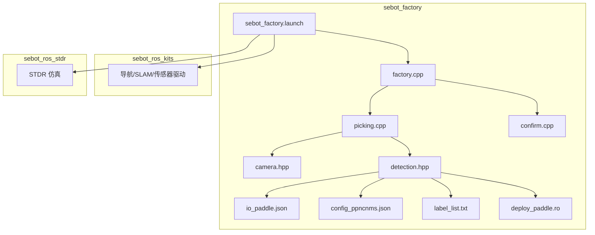
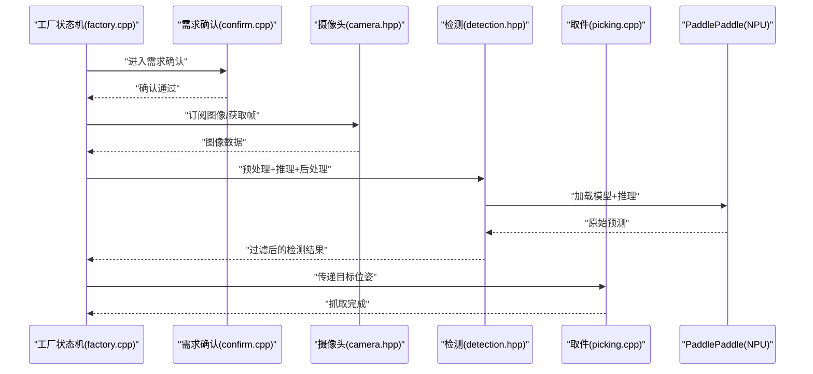
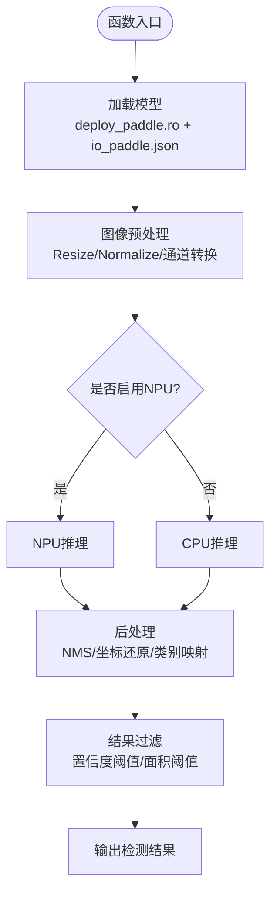
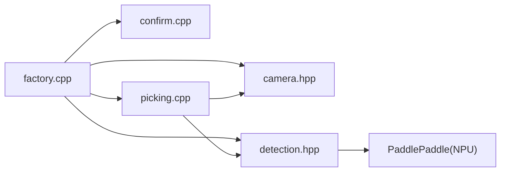

# 视觉处理系统

<cite>
**本文引用的文件**   
- [sebot_factory.launch](file://sebot_factory/src/sebot_factory/launch/sebot_factory.launch)
- [sebot_yolo.launch](file://sebot_factory/src/sebot_factory/launch/sebot_yolo.launch)
- [factory.cpp](file://sebot_factory/src/sebot_factory/src/factory.cpp)
- [picking.cpp](file://sebot_factory/src/sebot_factory/src/picking.cpp)
- [confirm.cpp](file://sebot_factory/src/sebot_factory/src/confirm.cpp)
- [camera.hpp](file://sebot_factory/src/sebot_factory/include/camera.hpp)
- [detection.hpp](file://sebot_factory/src/sebot_factory/include/detection.hpp)
- [io_paddle.json](file://sebot_factory/src/sebot_factory/res/inference/io_paddle.json)
- [config_ppncnms.json](file://sebot_factory/src/sebot_factory/res/inference/config_ppncnms.json)
- [label_list.txt](file://sebot_factory/src/sebot_factory/res/inference/label_list.txt)
- [deploy_paddle.ro](file://sebot_factory/src/sebot_factory/res/inference/deploy_paddle.ro)
</cite>

## 目录
1. [简介](#简介)
2. [项目结构](#项目结构)
3. [核心组件](#核心组件)
4. [架构总览](#架构总览)
5. [详细组件分析](#详细组件分析)
6. [依赖关系分析](#依赖关系分析)
7. [性能考虑](#性能考虑)
8. [故障排查指南](#故障排查指南)
9. [结论](#结论)
10. [附录](#附录)

## 简介
本文件面向“视觉处理系统”的完整文档，覆盖摄像头模块配置与图像采集流程、YOLO 目标检测集成（PaddlePaddle 推理引擎、模型加载与 NPU 加速）、图像预处理/后处理与检测结果过滤逻辑，以及相机标定参数、检测模型配置、置信度阈值设置与性能优化方法。同时提供视觉调试工具与常见问题解决方案，帮助开发者快速定位并解决问题。

## 项目结构
本项目由三个相互独立的 catkin 工作空间组成：
- sebot_factory：应用层业务节点（工厂订单执行、视觉检测、取件等）
- sebot_ros_kits：机器人套件（导航、SLAM、传感器驱动等）
- sebot_ros_stdr：仿真环境（STDR 仿真器与配套包）

视觉相关代码主要集中在 sebot_factory 包内，包括：
- 启动脚本：sebot_factory.launch、sebot_yolo.launch
- 业务状态机与视觉触发：factory.cpp、picking.cpp、confirm.cpp
- 视觉头文件：camera.hpp、detection.hpp
- 推理资源：io_paddle.json、config_ppncnms.json、label_list.txt、deploy_paddle.ro

图表来源
- [sebot_factory.launch](file://sebot_factory/src/sebot_factory/launch/sebot_factory.launch)
- [factory.cpp](file://sebot_factory/src/sebot_factory/src/factory.cpp)
- [picking.cpp](file://sebot_factory/src/sebot_factory/src/picking.cpp)
- [confirm.cpp](file://sebot_factory/src/sebot_factory/src/confirm.cpp)
- [camera.hpp](file://sebot_factory/src/sebot_factory/include/camera.hpp)
- [detection.hpp](file://sebot_factory/src/sebot_factory/include/detection.hpp)
- [io_paddle.json](file://sebot_factory/src/sebot_factory/res/inference/io_paddle.json)
- [config_ppncnms.json](file://sebot_factory/src/sebot_factory/res/inference/config_ppncnms.json)
- [label_list.txt](file://sebot_factory/src/sebot_factory/res/inference/label_list.txt)
- [deploy_paddle.ro](file://sebot_factory/src/sebot_factory/res/inference/deploy_paddle.ro)

章节来源
- [sebot_factory.launch](file://sebot_factory/src/sebot_factory/launch/sebot_factory.launch)
- [sebot_yolo.launch](file://sebot_factory/src/sebot_factory/launch/sebot_yolo.launch)

## 核心组件
- 摄像头模块（camera.hpp）
  - 负责相机初始化、参数配置（分辨率、帧率、曝光、白平衡等）、图像采集回调与缓存、相机标定参数读取与应用。
  - 典型接口：打开设备、订阅/发布图像话题、获取单帧、设置 ROI、切换镜头参数。
- 检测模块（detection.hpp）
  - 封装 YOLO 推理流程：图像预处理（缩放、归一化、通道转换）、PaddlePaddle 模型加载（deploy_paddle.ro、io_paddle.json、config_ppncnms.json）、NPU 加速配置、推理执行、后处理（NMS、坐标还原、类别映射 label_list.txt）。
  - 典型接口：init()、load_model()、preprocess()、infer()、postprocess()、filter_results()。
- 业务状态机（factory.cpp）
  - 主流程：上电自检 → 加载地图与 AMCL 定位 → 导航至取件台 → 需求确认（confirm.cpp）→ 视觉搜索（多帧检测确认）→ 机械臂抓取（picking.cpp）→ 导航送达并结算。
  - 视觉触发点：在确认环节后进入“视觉搜索”子状态，周期性调用 detection 模块进行多帧融合与结果稳定。
- 取件流程（picking.cpp）
  - 接收视觉检测结果，结合相机标定将像素坐标转换为机械臂坐标系，执行 PID 闭环抓取。
- 需求确认（confirm.cpp）
  - 与上层交互确认订单需求，决定是否进入视觉搜索阶段，并可输出调试信息或可视化界面开关。

章节来源
- [camera.hpp](file://sebot_factory/src/sebot_factory/include/camera.hpp)
- [detection.hpp](file://sebot_factory/src/sebot_factory/include/detection.hpp)
- [factory.cpp](file://sebot_factory/src/sebot_factory/src/factory.cpp)
- [picking.cpp](file://sebot_factory/src/sebot_factory/src/picking.cpp)
- [confirm.cpp](file://sebot_factory/src/sebot_factory/src/confirm.cpp)

## 架构总览
视觉处理系统以 ROS 为通信总线，摄像头节点发布图像，检测节点订阅图像并进行 YOLO 推理，业务状态机根据订单流程触发视觉搜索，取件节点基于检测结果控制机械臂。

图表来源
- [factory.cpp](file://sebot_factory/src/sebot_factory/src/factory.cpp)
- [confirm.cpp](file://sebot_factory/src/sebot_factory/src/confirm.cpp)
- [camera.hpp](file://sebot_factory/src/sebot_factory/include/camera.hpp)
- [detection.hpp](file://sebot_factory/src/sebot_factory/include/detection.hpp)
- [io_paddle.json](file://sebot_factory/src/sebot_factory/res/inference/io_paddle.json)
- [config_ppncnms.json](file://sebot_factory/src/sebot_factory/res/inference/config_ppncnms.json)
- [deploy_paddle.ro](file://sebot_factory/src/sebot_factory/res/inference/deploy_paddle.ro)

## 详细组件分析

### 摄像头模块（camera.hpp）
- 功能要点
  - 相机初始化与参数配置：分辨率、帧率、曝光、增益、白平衡、ROI 等。
  - 图像采集：ROS 图像话题订阅或 OpenCV 直接采集；帧缓冲与时间戳管理。
  - 标定参数：内参矩阵、畸变系数、外参（相机到基座/机械臂手眼标定），用于像素到世界坐标转换。
- 关键流程
  - 打开设备 → 设置参数 → 注册回调/拉取帧 → 输出 cv::Mat 或 sensor_msgs/Image。
- 性能建议
  - 使用多线程避免阻塞；降低分辨率或帧率以提升吞吐；启用硬件编码/解码（如支持）。
- 常见配置项
  - 设备路径、分辨率、帧率、曝光模式、自动对焦开关、ROI 区域、标定文件路径。

章节来源
- [camera.hpp](file://sebot_factory/src/sebot_factory/include/camera.hpp)

### 检测模块（detection.hpp）
- 功能要点
  - 模型加载：从 deploy_paddle.ro、io_paddle.json、config_ppncnms.json 加载 PaddlePaddle 模型与输入输出描述。
  - 预处理：Resize、Normalize、Channel 转换（RGB/BGR）、数据类型转换（FP32/INT8）。
  - 推理：选择 CPU/NPU 后端，配置线程数、批大小、内存池。
  - 后处理：NMS（非极大值抑制）、坐标还原（从特征图到原图）、类别映射（label_list.txt）。
  - 结果过滤：置信度阈值、面积阈值、类别过滤、重复框合并。
- 关键流程
  - init() → load_model() → preprocess(img) → infer(preprocessed) → postprocess(raw) → filter_results()。
- 性能建议
  - 开启 NPU 加速；减少预处理开销（GPU/OpenCV 并行）；合理设置 batch=1；关闭不必要的日志。
- 常见配置项
  - 模型路径、输入尺寸、均值/标准差、NMS 阈值、置信度阈值、类别列表路径、NPU 设备索引。

章节来源
- [detection.hpp](file://sebot_factory/src/sebot_factory/include/detection.hpp)
- [io_paddle.json](file://sebot_factory/src/sebot_factory/res/inference/io_paddle.json)
- [config_ppncnms.json](file://sebot_factory/src/sebot_factory/res/inference/config_ppncnms.json)
- [label_list.txt](file://sebot_factory/src/sebot_factory/res/inference/label_list.txt)
- [deploy_paddle.ro](file://sebot_factory/src/sebot_factory/res/inference/deploy_paddle.ro)

#### 检测流程图（算法实现）

图表来源
- [detection.hpp](file://sebot_factory/src/sebot_factory/include/detection.hpp)
- [io_paddle.json](file://sebot_factory/src/sebot_factory/res/inference/io_paddle.json)
- [config_ppncnms.json](file://sebot_factory/src/sebot_factory/res/inference/config_ppncnms.json)
- [label_list.txt](file://sebot_factory/src/sebot_factory/res/inference/label_list.txt)
- [deploy_paddle.ro](file://sebot_factory/src/sebot_factory/res/inference/deploy_paddle.ro)

### 业务状态机与视觉触发（factory.cpp）
- 主流程
  - 上电自检 → 加载地图与 AMCL 定位 → 导航至取件台 → 需求确认 → 视觉搜索（多帧检测确认）→ 机械臂抓取 → 导航送达并结算。
- 视觉触发
  - 在“需求确认”通过后进入“视觉搜索”子状态，周期性调用 detection 模块进行多帧检测，采用投票/时序一致性策略稳定结果。
- 关键参数
  - 导航超时、PID 参数、取件距离、补扫次数、debug 开关（是否显示识别界面）。

章节来源
- [factory.cpp](file://sebot_factory/src/sebot_factory/src/factory.cpp)

### 需求确认（confirm.cpp）
- 功能
  - 与上层交互确认订单需求，决定是否进入视觉搜索阶段；可输出调试信息或控制可视化界面开关。
- 集成点
  - 被 factory.cpp 调用，返回确认结果；可与 sebot_yolo.launch 中的 debug 参数联动。

章节来源
- [confirm.cpp](file://sebot_factory/src/sebot_factory/src/confirm.cpp)

### 取件流程（picking.cpp）
- 功能
  - 接收视觉检测结果，结合相机标定将像素坐标转换为机械臂坐标系，执行 PID 闭环抓取。
- 关键点
  - 坐标变换（像素→相机→基座→手爪）、抓取姿态计算、PID 参数调优、碰撞检测与安全回退。

章节来源
- [picking.cpp](file://sebot_factory/src/sebot_factory/src/picking.cpp)

### 启动与配置（sebot_factory.launch、sebot_yolo.launch）
- sebot_factory.launch
  - 控制 simulation 参数切换 STDR 仿真模式；debug 参数控制图像识别界面开关；导航超时、PID、取件距离、补扫参数等集中配置。
- sebot_yolo.launch
  - 启动 YOLO 检测节点，配置模型路径、NPU 开关、置信度阈值、NMS 阈值、标签列表路径等。

章节来源
- [sebot_factory.launch](file://sebot_factory/src/sebot_factory/launch/sebot_factory.launch)
- [sebot_yolo.launch](file://sebot_factory/src/sebot_factory/launch/sebot_yolo.launch)

## 依赖关系分析
- 模块耦合
  - factory.cpp 依赖 confirm.cpp、picking.cpp、camera.hpp、detection.hpp。
  - picking.cpp 依赖 camera.hpp（标定参数）与 detection.hpp（检测结果）。
  - detection.hpp 依赖 PaddlePaddle 推理库与模型资源文件。
- 外部依赖
  - ROS 通信（sensor_msgs/Image、tf 坐标变换）。
  - PaddlePaddle 推理引擎（NPU/CPU 后端）。
  - OpenCV（图像处理）。
- 潜在循环依赖
  - 确保 camera.hpp 与 detection.hpp 无直接互相包含；通过 factory.cpp 协调。

图表来源
- [factory.cpp](file://sebot_factory/src/sebot_factory/src/factory.cpp)
- [confirm.cpp](file://sebot_factory/src/sebot_factory/src/confirm.cpp)
- [picking.cpp](file://sebot_factory/src/sebot_factory/src/picking.cpp)
- [camera.hpp](file://sebot_factory/src/sebot_factory/include/camera.hpp)
- [detection.hpp](file://sebot_factory/src/sebot_factory/include/detection.hpp)

## 性能考虑
- 摄像头采集
  - 降低分辨率/帧率、启用硬件编解码、多线程异步采集。
- 预处理
  - GPU/OpenCV 并行、减少内存拷贝、固定输入尺寸。
- 推理
  - 启用 NPU 加速、合理设置线程数与内存池、关闭冗余日志。
- 后处理
  - 优化 NMS 实现、提前过滤低置信度框、合并相邻帧结果。
- 系统集成
  - 使用 ROS 消息压缩、避免频繁序列化、合理分配 CPU 核。

## 故障排查指南
- 无法打开相机
  - 检查设备权限、设备路径、驱动安装；查看相机参数是否正确。
- 图像黑屏或异常
  - 检查曝光/增益设置、光源条件、ROI 配置；确认时间戳同步。
- 模型加载失败
  - 校验 deploy_paddle.ro、io_paddle.json、config_ppncnms.json 路径与完整性；确认 NPU 驱动版本兼容。
- 推理速度慢
  - 启用 NPU、减少预处理开销、关闭调试输出；检查 CPU 占用与内存泄漏。
- 检测结果不稳定
  - 调整置信度阈值与 NMS 阈值；增加多帧投票与时间一致性；检查相机标定精度。
- 抓取失败
  - 检查坐标变换链（像素→相机→基座→手爪）；调优 PID 参数；增加碰撞检测与安全回退。

章节来源
- [camera.hpp](file://sebot_factory/src/sebot_factory/include/camera.hpp)
- [detection.hpp](file://sebot_factory/src/sebot_factory/include/detection.hpp)
- [factory.cpp](file://sebot_factory/src/sebot_factory/src/factory.cpp)
- [picking.cpp](file://sebot_factory/src/sebot_factory/src/picking.cpp)
- [confirm.cpp](file://sebot_factory/src/sebot_factory/src/confirm.cpp)
- [sebot_factory.launch](file://sebot_factory/src/sebot_factory/launch/sebot_factory.launch)
- [sebot_yolo.launch](file://sebot_factory/src/sebot_factory/launch/sebot_yolo.launch)

## 结论
本视觉处理系统以 ROS 为中枢，整合摄像头采集、YOLO 目标检测（PaddlePaddle+NPU）、多帧稳定与坐标变换，形成从订单确认到机械臂抓取的完整闭环。通过合理的参数配置与性能优化，可在实际场景中实现高鲁棒性与高效率的检测与抓取。

## 附录
- 关键配置文件说明
  - io_paddle.json：定义模型输入输出张量名称、形状与数据类型。
  - config_ppncnms.json：NMS 相关参数（IoU 阈值、最大输出框数等）。
  - label_list.txt：类别名称与索引映射。
  - deploy_paddle.ro：PaddlePaddle 部署模型文件。
- 常用调试工具
  - rqt_image_view：实时查看图像与标注。
  - rostopic echo/rviz：查看检测结果与坐标变换。
  - 日志级别：提高工厂与检测节点的日志等级以定位问题。