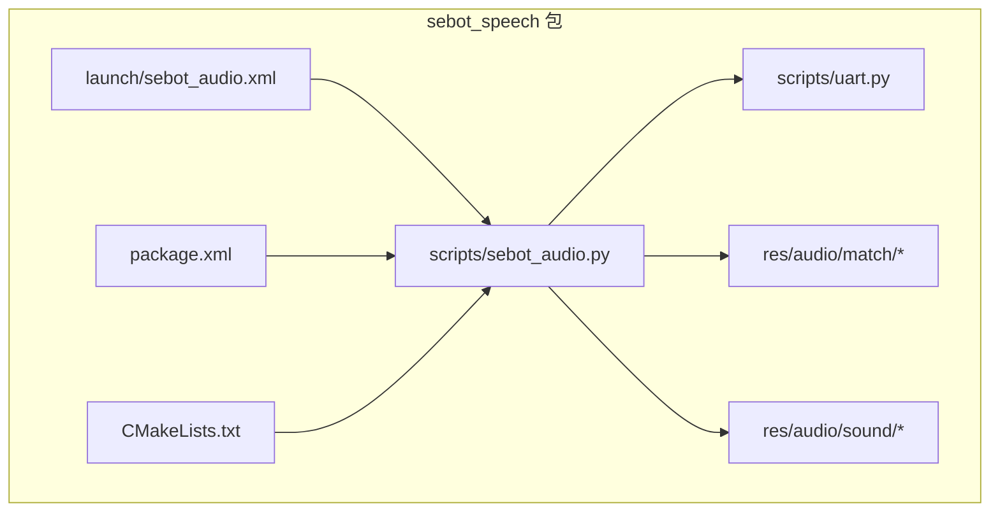
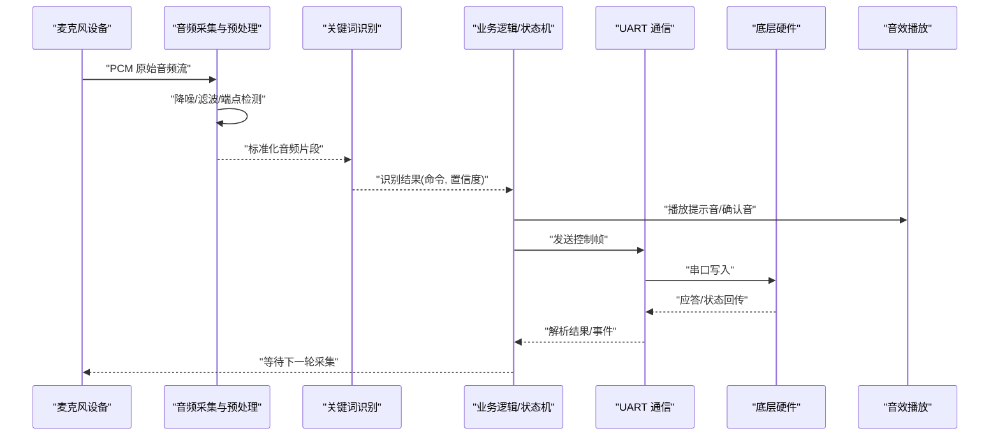
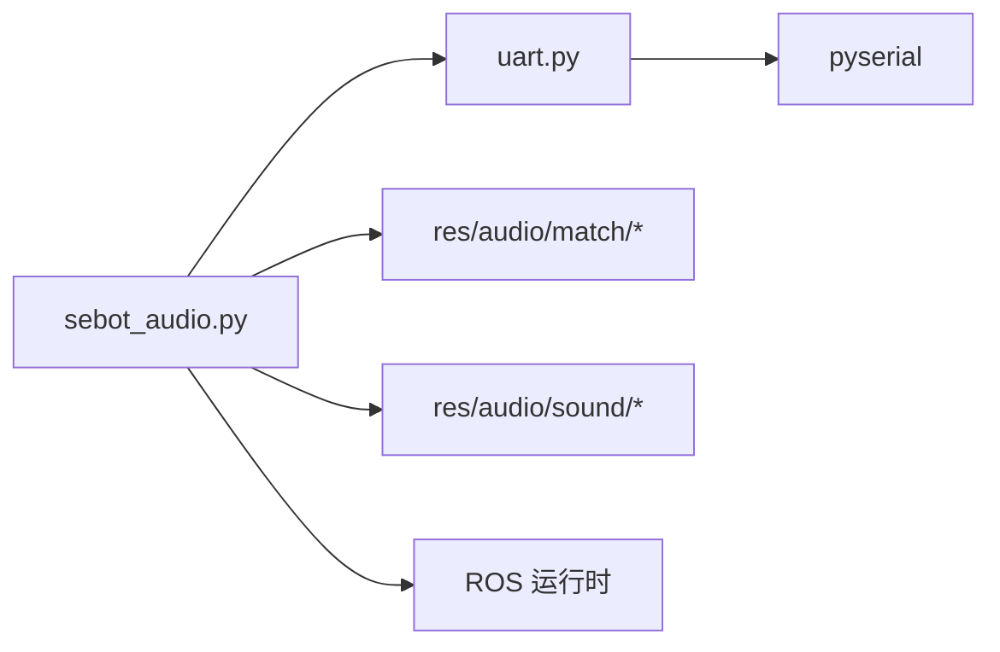
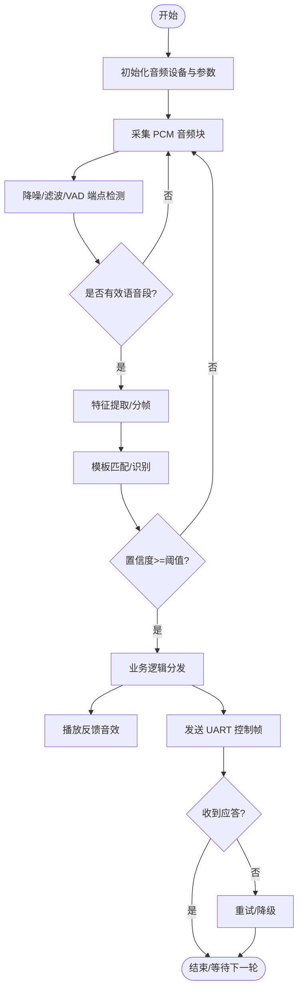

# 语音交互系统

<cite>
**本文引用的文件**   
- [sebot_audio.xml](file://sebot_ros_kits/src/sebot_speech/launch/sebot_audio.xml)
- [sebot_audio.py](file://sebot_ros_kits/src/sebot_speech/scripts/sebot_audio.py)
- [uart.py](file://sebot_ros_kits/src/sebot_speech/scripts/uart.py)
- [package.xml](file://sebot_ros_kits/src/sebot_speech/package.xml)
- [CMakeLists.txt](file://sebot_ros_kits/src/sebot_speech/CMakeLists.txt)
- [match/目录（音频匹配样本）](file://sebot_ros_kits/src/sebot_speech/res/audio/match/)
- [sound/目录（播放音效）](file://sebot_ros_kits/src/sebot_speech/res/audio/sound/)
</cite>

## 目录
1. [简介](#简介)
2. [项目结构](#项目结构)
3. [核心组件](#核心组件)
4. [架构总览](#架构总览)
5. [详细组件分析](#详细组件分析)
6. [依赖关系分析](#依赖关系分析)
7. [性能考虑](#性能考虑)
8. [故障排查指南](#故障排查指南)
9. [结论](#结论)
10. [附录](#附录)

## 简介
本语音交互系统基于 ROS 1 + Python，提供从麦克风采集、音频预处理、关键词识别到与底层硬件通过 UART 通信的完整链路。系统以 sebot_speech 包为核心，配合 launch 配置与资源文件（匹配样本与音效），实现“唤醒—识别—执行—反馈”的闭环交互。文档面向开发者与集成人员，覆盖音频处理流程、语音识别集成方式、UART 协议与数据交换机制、配置文件与阈值设置、错误处理策略，以及训练方法与优化技巧。

## 项目结构
sebot_speech 包采用“脚本+资源+启动配置”的组织方式：
- scripts：Python 主程序与 UART 通信脚本
- res/audio：音频资源（匹配样本与播放音效）
- launch：ROS 启动配置
- package.xml/CMakeLists.txt：包元数据与构建描述

图表来源
- [sebot_audio.xml](file://sebot_ros_kits/src/sebot_speech/launch/sebot_audio.xml)
- [sebot_audio.py](file://sebot_ros_kits/src/sebot_speech/scripts/sebot_audio.py)
- [uart.py](file://sebot_ros_kits/src/sebot_speech/scripts/uart.py)
- [package.xml](file://sebot_ros_kits/src/sebot_speech/package.xml)
- [CMakeLists.txt](file://sebot_ros_kits/src/sebot_speech/CMakeLists.txt)

章节来源
- [sebot_audio.xml](file://sebot_ros_kits/src/sebot_speech/launch/sebot_audio.xml)
- [sebot_audio.py](file://sebot_ros_kits/src/sebot_speech/scripts/sebot_audio.py)
- [uart.py](file://sebot_ros_kits/src/sebot_speech/scripts/uart.py)
- [package.xml](file://sebot_ros_kits/src/sebot_speech/package.xml)
- [CMakeLists.txt](file://sebot_ros_kits/src/sebot_speech/CMakeLists.txt)

## 核心组件
- 音频采集与预处理模块：负责麦克风数据采集、格式统一、噪声抑制与端点检测
- 关键词识别模块：基于模板匹配或轻量模型进行命令识别，输出识别结果与置信度
- 业务逻辑与状态机：将识别结果映射为动作指令，协调播放反馈与任务调度
- UART 通信模块：封装串口读写、帧格式解析、校验与重连机制
- 资源管理：加载匹配样本与音效，支持动态更新与缓存

章节来源
- [sebot_audio.py](file://sebot_ros_kits/src/sebot_speech/scripts/sebot_audio.py)
- [uart.py](file://sebot_ros_kits/src/sebot_speech/scripts/uart.py)

## 架构总览
整体数据流从麦克风输入开始，经预处理后进入识别引擎，识别结果驱动上层业务并触发 UART 指令下发；同时播放反馈音效完成交互闭环。

图表来源
- [sebot_audio.py](file://sebot_ros_kits/src/sebot_speech/scripts/sebot_audio.py)
- [uart.py](file://sebot_ros_kits/src/sebot_speech/scripts/uart.py)

## 详细组件分析

### 音频采集与预处理
- 功能要点
  - 设备枚举与选择：支持默认或指定声卡设备
  - 采样率与位深统一：转换为识别引擎期望格式（如 16kHz/16bit）
  - 噪声抑制与滤波：高通/低通滤波、频谱减噪、VAD 端点检测
  - 分帧与特征提取：短时能量、过零率、MFCC 等（按识别器需求）
- 关键参数
  - 采样率、缓冲区大小、VAD 阈值、滤波器系数
- 错误处理
  - 设备不可用重试、超时保护、异常捕获与降级模式

章节来源
- [sebot_audio.py](file://sebot_ros_kits/src/sebot_speech/scripts/sebot_audio.py)

### 关键词识别模块
- 功能要点
  - 模板匹配：使用 res/audio/match 下的样本进行相似度计算
  - 阈值判定：置信度高于设定阈值才视为有效识别
  - 去抖与合并：滑动窗口防误触，重复命令合并
- 关键参数
  - 匹配阈值、窗口长度、平滑因子、最大识别间隔
- 错误处理
  - 样本缺失回退、匹配失败记录、日志上报

章节来源
- [sebot_audio.py](file://sebot_ros_kits/src/sebot_speech/scripts/sebot_audio.py)
- [match/目录（音频匹配样本）](file://sebot_ros_kits/src/sebot_speech/res/audio/match/)

### 业务逻辑与状态机
- 功能要点
  - 识别结果路由：根据命令类型分发到不同子任务
  - 时序控制：等待识别、播放反馈、等待 UART 应答
  - 资源管理：按需加载/释放音频资源
- 关键参数
  - 超时时间、重试次数、优先级队列
- 错误处理
  - 超时重试、降级策略、用户提示

章节来源
- [sebot_audio.py](file://sebot_ros_kits/src/sebot_speech/scripts/sebot_audio.py)

### UART 通信模块
- 功能要点
  - 串口初始化与参数配置：波特率、数据位、停止位、校验位
  - 帧封装与解析：头标识、长度、命令码、载荷、校验和、尾标
  - 可靠性保障：CRC/Checksum 校验、重发机制、断线重连
- 关键参数
  - 端口路径、波特率、超时、重连间隔、帧大小限制
- 错误处理
  - 端口占用、权限不足、校验失败、数据截断

章节来源
- [uart.py](file://sebot_ros_kits/src/sebot_speech/scripts/uart.py)

### 资源管理与音效播放
- 功能要点
  - 音效库管理：res/audio/sound 下资源索引与缓存
  - 播放策略：阻塞/非阻塞播放、音量控制、并发冲突处理
- 关键参数
  - 播放线程数、缓冲大小、循环次数
- 错误处理
  - 文件不存在、解码失败、设备忙

章节来源
- [sebot_audio.py](file://sebot_ros_kits/src/sebot_speech/scripts/sebot_audio.py)
- [sound/目录（播放音效）](file://sebot_ros_kits/src/sebot_speech/res/audio/sound/)

### 启动配置与包元数据
- 启动配置
  - sebot_audio.xml：定义节点、参数、话题/服务绑定
- 包元数据
  - package.xml：依赖声明、可执行脚本注册
  - CMakeLists.txt：构建规则（若含 C++ 扩展）

章节来源
- [sebot_audio.xml](file://sebot_ros_kits/src/sebot_speech/launch/sebot_audio.xml)
- [package.xml](file://sebot_ros_kits/src/sebot_speech/package.xml)
- [CMakeLists.txt](file://sebot_ros_kits/src/sebot_speech/CMakeLists.txt)

## 依赖关系分析
- 内部依赖
  - sebot_audio.py 依赖 uart.py 进行串口通信
  - 两者共同依赖 res/audio 资源
- 外部依赖
  - ROS 运行时（rospy、topic/service）
  - 音频库（PyAudio/ALSA 等）
  - 串口库（pyserial）
- 耦合与解耦
  - 通过接口抽象分离采集、识别、通信层，便于替换实现

图表来源
- [sebot_audio.py](file://sebot_ros_kits/src/sebot_speech/scripts/sebot_audio.py)
- [uart.py](file://sebot_ros_kits/src/sebot_speech/scripts/uart.py)

章节来源
- [sebot_audio.py](file://sebot_ros_kits/src/sebot_speech/scripts/sebot_audio.py)
- [uart.py](file://sebot_ros_kits/src/sebot_speech/scripts/uart.py)

## 性能考虑
- 音频采集
  - 合理设置缓冲区与采样率，避免 CPU 峰值
  - 使用多线程/异步 I/O 降低阻塞
- 识别算法
  - 模板匹配需对样本做归一化与对齐
  - 滑动窗口与阈值调优平衡误识率与漏识率
- UART 通信
  - 批量写入减少系统调用开销
  - 合理超时与重连策略提升鲁棒性
- 资源管理
  - 预加载常用音效，减少 IO 延迟
  - 音频资源索引与缓存命中优化

[本节为通用指导，不直接分析具体文件]

## 故障排查指南
- 常见问题
  - 麦克风无法打开：检查权限、默认设备、采样率兼容
  - 识别率低：检查环境噪声、样本质量、阈值设置
  - UART 无响应：检查端口路径、波特率、接线与供电
  - 音效播放失败：检查文件格式、播放器后端、并发冲突
- 定位方法
  - 启用详细日志，观察采集/识别/通信阶段耗时
  - 使用工具录制回放样本验证链路
  - 单独测试串口收发与 CRC 校验
- 恢复策略
  - 自动重试与降级（关闭识别仅保留基础控制）
  - 资源热更新（替换样本与音效无需重启）

章节来源
- [sebot_audio.py](file://sebot_ros_kits/src/sebot_speech/scripts/sebot_audio.py)
- [uart.py](file://sebot_ros_kits/src/sebot_speech/scripts/uart.py)

## 结论
本语音交互系统以模块化设计实现了从采集、识别到控制的完整链路，具备可扩展性与鲁棒性。通过合理的参数配置与资源管理，可在复杂环境中稳定运行。后续可引入更先进的识别模型与自适应噪声抑制以提升效果。

[本节为总结性内容，不直接分析具体文件]

## 附录

### 音频处理流程图

图表来源
- [sebot_audio.py](file://sebot_ros_kits/src/sebot_speech/scripts/sebot_audio.py)
- [uart.py](file://sebot_ros_kits/src/sebot_speech/scripts/uart.py)

### UART 帧格式建议
- 字段说明
  - 帧头：固定标识
  - 长度：载荷长度
  - 命令码：操作类型
  - 载荷：参数数据
  - 校验和：CRC/Sum
  - 帧尾：固定标识
- 传输策略
  - 超时重发、乱序丢弃、粘包处理

章节来源
- [uart.py](file://sebot_ros_kits/src/sebot_speech/scripts/uart.py)

### 音频配置文件与阈值设置
- 配置文件位置
  - 启动参数集中定义于 launch 配置
- 关键参数
  - 采样率、缓冲区大小、VAD 阈值、匹配阈值、超时时间、重连间隔
- 修改建议
  - 先调整 VAD 阈值与滤波器，再微调匹配阈值与超时

章节来源
- [sebot_audio.xml](file://sebot_ros_kits/src/sebot_speech/launch/sebot_audio.xml)
- [sebot_audio.py](file://sebot_ros_kits/src/sebot_speech/scripts/sebot_audio.py)
- [uart.py](file://sebot_ros_kits/src/sebot_speech/scripts/uart.py)

### 语音命令词典与样本管理
- 词典组织
  - 每个命令对应一组样本文件，命名规范一致
- 样本要求
  - 清晰、无背景噪声、时长适中、语速自然
- 更新流程
  - 新增样本→索引更新→重新评估阈值→回归测试

章节来源
- [match/目录（音频匹配样本）](file://sebot_ros_kits/src/sebot_speech/res/audio/match/)
- [sebot_audio.py](file://sebot_ros_kits/src/sebot_speech/scripts/sebot_audio.py)

### 识别阈值与错误处理策略
- 阈值策略
  - 动态阈值：根据环境噪声水平自适应调整
  - 静态阈值：离线标定后固化
- 错误处理
  - 识别失败计数与告警
  - 降级模式：仅保留必要控制命令
  - 日志与遥测：记录失败原因与时序

章节来源
- [sebot_audio.py](file://sebot_ros_kits/src/sebot_speech/scripts/sebot_audio.py)

### 语音训练方法与优化技巧
- 数据采集
  - 多场景、多说话人、多语速采集
  - 标注与清洗：去除无效片段
- 模型/模板优化
  - 样本增强：加噪、混响、变速
  - 特征对齐：时域/频域对齐
- 评估与迭代
  - 混淆矩阵分析、误识/漏识案例复盘
  - A/B 测试对比不同阈值与算法

[本节为通用指导，不直接分析具体文件]

### 与底层硬件的数据交换机制
- 数据流向
  - 上位机 → UART → 控制器 → 执行器
  - 控制器 → UART → 上位机（状态/事件）
- 协议要点
  - 帧同步、校验、超时、重传
  - 事件驱动与轮询结合
- 调试手段
  - 抓包分析、逐帧打印、模拟硬件回环

章节来源
- [uart.py](file://sebot_ros_kits/src/sebot_speech/scripts/uart.py)