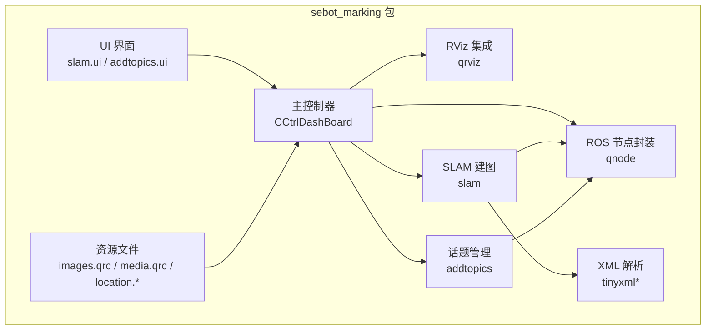
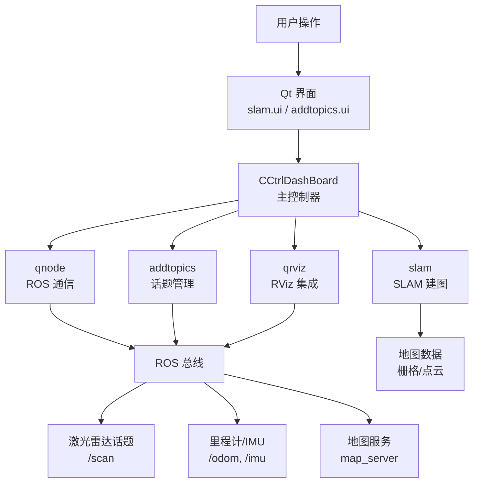
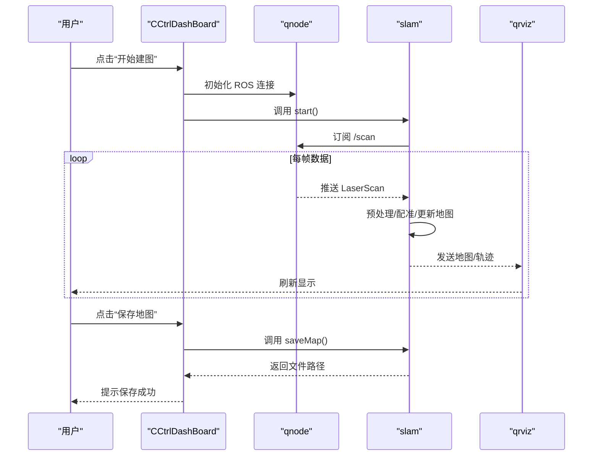
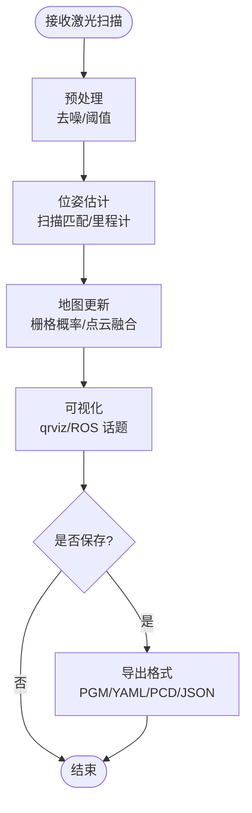
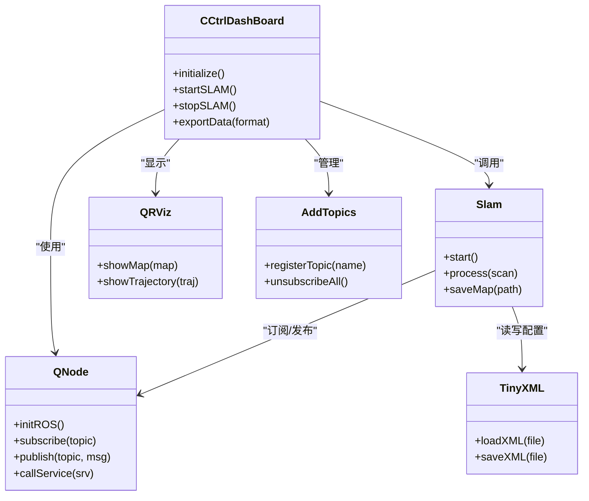

# 标注工具系统

<cite>
**本文引用的文件**   
- [sebot_marking/CMakeLists.txt](file://sebot_factory/src/sebot_marking/CMakeLists.txt)
- [sebot_marking/package.xml](file://sebot_factory/src/sebot_marking/package.xml)
- [sebot_marking/launch/sebot_marking.launch](file://sebot_factory/src/sebot_marking/launch/sebot_marking.launch)
- [sebot_marking/ui/slam.ui](file://sebot_factory/src/sebot_marking/ui/slam.ui)
- [sebot_marking/ui/addtopics.ui](file://sebot_factory/src/sebot_marking/ui/addtopics.ui)
- [sebot_marking/resources/images.qrc](file://sebot_factory/src/sebot_marking/resources/images.qrc)
- [sebot_marking/resources/media.qrc](file://sebot_factory/src/sebot_marking/resources/media.qrc)
- [sebot_marking/resources/location.yaml](file://sebot_factory/src/sebot_marking/resources/location.yaml)
- [sebot_marking/resources/location.xml](file://sebot_factory/src/sebot_marking/resources/location.xml)
- [sebot_marking/src/main.cpp](file://sebot_factory/src/sebot_marking/src/main.cpp)
- [sebot_marking/src/qnode.hpp](file://sebot_factory/src/sebot_marking/include/qnode.hpp)
- [sebot_marking/src/qnode.cpp](file://sebot_factory/src/sebot_marking/src/qnode.cpp)
- [sebot_marking/src/qrviz.hpp](file://sebot_factory/src/sebot_marking/include/qrviz.hpp)
- [sebot_marking/src/qrviz.cpp](file://sebot_factory/src/sebot_marking/src/qrviz.cpp)
- [sebot_marking/src/CCtrlDashBoard.h](file://sebot_factory/src/sebot_marking/include/CCtrlDashBoard.h)
- [sebot_marking/src/CCtrlDashBoard.cpp](file://sebot_factory/src/sebot_marking/src/CCtrlDashBoard.cpp)
- [sebot_marking/src/slam.h](file://sebot_factory/src/sebot_marking/include/slam.h)
- [sebot_marking/src/slam.cpp](file://sebot_factory/src/sebot_marking/src/slam.cpp)
- [sebot_marking/src/addtopics.h](file://sebot_factory/src/sebot_marking/include/addtopics.h)
- [sebot_marking/src/addtopics.cpp](file://sebot_factory/src/sebot_marking/src/addtopics.cpp)
- [sebot_marking/src/tinyxml.h](file://sebot_factory/src/sebot_marking/include/tinyxml.h)
- [sebot_marking/src/tinystr.h](file://sebot_factory/src/sebot_marking/include/tinystr.h)
- [sebot_marking/src/tinyxml.cpp](file://sebot_factory/src/sebot_marking/src/tinyxml.cpp)
- [sebot_marking/src/tinyxmlparser.cpp](file://sebot_factory/src/sebot_marking/src/tinyxmlparser.cpp)
- [sebot_marking/src/tinyxmlerror.cpp](file://sebot_factory/src/sebot_marking/src/tinyxmlerror.cpp)
</cite>

## 目录
1. [简介](#简介)
2. [项目结构](#项目结构)
3. [核心组件](#核心组件)
4. [架构总览](#架构总览)
5. [详细组件分析](#详细组件分析)
6. [依赖关系分析](#依赖关系分析)
7. [性能与实时性](#性能与实时性)
8. [故障排查指南](#故障排查指南)
9. [结论](#结论)
10. [附录：界面操作与配置说明](#附录界面操作与配置说明)

## 简介
本标注工具系统是一个基于 Qt 的上位机应用，用于机器人建图与数据采集标注。其核心功能包括：
- 基于 Qt 的主控制器 CCtrlDashBoard，负责界面布局、用户交互与业务编排。
- SLAM 建图模块，订阅激光雷达数据，驱动地图构建算法并实现实时可视化。
- 数据采集与管理，支持传感器数据记录、标注文件管理与多格式导出。
- 与 ROS 系统集成，通过话题订阅、服务调用与参数配置完成数据流与控制流对接。

本仓库由三个相互独立的 catkin 工作空间组成（sebot_factory 应用层、sebot_ros_kits 机器人套件、sebot_ros_stdr 仿真层），各自含 src/ 且需分别 catkin_make。自研核心代码集中在 sebot_factory 的 sebot_marking 包中，文档将以该包为分析重点。导航栈各包、rplidar_ros、robot_pose_ekf、slam_gmapping、slam_hector 以及 STDR 相关包均 fork 自 ROS 官方/开源项目，本文仅说明其在系统中的角色与集成方式，不深入内部源码实现。

## 项目结构
sebot_marking 包采用典型的 Qt + ROS 混合架构：
- UI 层：Qt Designer 生成的 .ui 文件定义主界面与对话框布局。
- 资源层：images.qrc、media.qrc 管理图标与媒体资源；location.yaml/xml 存储位置与场景信息。
- 逻辑层：CCtrlDashBoard 作为主控制器，qnode 封装 ROS 通信，qrviz 提供 RViz 集成显示，slam 实现建图与数据处理，addtopics 管理话题订阅。
- 构建与发布：CMakeLists.txt 与 package.xml 定义编译规则与依赖。

图表来源
- [sebot_marking/CMakeLists.txt](file://sebot_factory/src/sebot_marking/CMakeLists.txt)
- [sebot_marking/package.xml](file://sebot_factory/src/sebot_marking/package.xml)
- [sebot_marking/ui/slam.ui](file://sebot_factory/src/sebot_marking/ui/slam.ui)
- [sebot_marking/ui/addtopics.ui](file://sebot_factory/src/sebot_marking/ui/addtopics.ui)
- [sebot_marking/resources/images.qrc](file://sebot_factory/src/sebot_marking/resources/images.qrc)
- [sebot_marking/resources/media.qrc](file://sebot_factory/src/sebot_marking/resources/media.qrc)
- [sebot_marking/resources/location.yaml](file://sebot_factory/src/sebot_marking/resources/location.yaml)
- [sebot_marking/resources/location.xml](file://sebot_factory/src/sebot_marking/resources/location.xml)

章节来源
- [sebot_marking/CMakeLists.txt](file://sebot_factory/src/sebot_marking/CMakeLists.txt)
- [sebot_marking/package.xml](file://sebot_factory/src/sebot_marking/package.xml)
- [sebot_marking/launch/sebot_marking.launch](file://sebot_factory/src/sebot_marking/launch/sebot_marking.launch)

## 核心组件
- CCtrlDashBoard（主控制器）
  - 职责：初始化 Qt 界面、加载资源、协调 SLAM 与数据记录、处理用户事件、管理状态与日志。
  - 关键能力：界面布局控制、按钮与菜单响应、参数面板更新、错误提示与状态指示。
- qnode（ROS 通信封装）
  - 职责：创建 ROS 节点、维护句柄、订阅/发布话题、调用服务、读取/写入参数。
  - 关键能力：线程安全回调、消息队列缓冲、重连与异常恢复。
- qrviz（RViz 集成）
  - 职责：在 Qt 窗口内嵌入 RViz 或转发 ROS 可视化主题，便于实时查看点云、地图与轨迹。
- slam（SLAM 建图）
  - 职责：订阅激光雷达扫描数据，进行预处理、里程估计与地图栅格化，输出可保存的地图文件。
  - 关键能力：点云滤波、配准算法、地图增量更新、实时渲染。
- addtopics（话题管理）
  - 职责：集中注册与注销话题订阅，动态切换数据源，提供统一接口给上层使用。
- tinyxml（XML 解析）
  - 职责：读写 location.xml 等配置文件，支持路径、坐标与标注元数据的持久化。

章节来源
- [sebot_marking/src/CCtrlDashBoard.h](file://sebot_factory/src/sebot_marking/include/CCtrlDashBoard.h)
- [sebot_marking/src/CCtrlDashBoard.cpp](file://sebot_factory/src/sebot_marking/src/CCtrlDashBoard.cpp)
- [sebot_marking/src/qnode.hpp](file://sebot_factory/src/sebot_marking/include/qnode.hpp)
- [sebot_marking/src/qnode.cpp](file://sebot_factory/src/sebot_marking/src/qnode.cpp)
- [sebot_marking/src/qrviz.hpp](file://sebot_factory/src/sebot_marking/include/qrviz.hpp)
- [sebot_marking/src/qrviz.cpp](file://sebot_factory/src/sebot_marking/src/qrviz.cpp)
- [sebot_marking/src/slam.h](file://sebot_factory/src/sebot_marking/include/slam.h)
- [sebot_marking/src/slam.cpp](file://sebot_factory/src/sebot_marking/src/slam.cpp)
- [sebot_marking/src/addtopics.h](file://sebot_factory/src/sebot_marking/include/addtopics.h)
- [sebot_marking/src/addtopics.cpp](file://sebot_factory/src/sebot_marking/src/addtopics.cpp)
- [sebot_marking/src/tinyxml.h](file://sebot_factory/src/sebot_marking/include/tinyxml.h)
- [sebot_marking/src/tinyxml.cpp](file://sebot_factory/src/sebot_marking/src/tinyxml.cpp)
- [sebot_marking/src/tinyxmlparser.cpp](file://sebot_factory/src/sebot_marking/src/tinyxmlparser.cpp)
- [sebot_marking/src/tinyxmlerror.cpp](file://sebot_factory/src/sebot_marking/src/tinyxmlerror.cpp)

## 架构总览
系统以 Qt 为主界面框架，ROS 为数据总线，SLAM 为核心算法模块，形成“界面—控制—数据—算法”的分层架构。

图表来源
- [sebot_marking/src/CCtrlDashBoard.cpp](file://sebot_factory/src/sebot_marking/src/CCtrlDashBoard.cpp)
- [sebot_marking/src/qnode.cpp](file://sebot_factory/src/sebot_marking/src/qnode.cpp)
- [sebot_marking/src/qrviz.cpp](file://sebot_factory/src/sebot_marking/src/qrviz.cpp)
- [sebot_marking/src/slam.cpp](file://sebot_factory/src/sebot_marking/src/slam.cpp)
- [sebot_marking/src/addtopics.cpp](file://sebot_factory/src/sebot_marking/src/addtopics.cpp)

## 详细组件分析

### CCtrlDashBoard 主控制器
- 功能概述
  - 初始化 Qt 应用与界面，加载 images.qrc、media.qrc 资源。
  - 启动 qnode 连接 ROS，加载 location.yaml/xml 配置。
  - 管理 SLAM 生命周期：开始/停止建图、保存地图、清空缓存。
  - 管理数据采集：选择传感器话题、设置采样频率、导出 CSV/JSON/XML。
  - 提供状态栏与日志输出，处理异常与用户提示。
- 界面布局
  - 顶部菜单栏：文件、编辑、视图、工具、帮助。
  - 左侧控制面板：建图参数、采集开关、导出选项。
  - 中央显示区：RViz 嵌入或自定义画布，展示地图与轨迹。
  - 底部状态栏：运行状态、时间戳、错误信息。
- 关键流程
  - 启动流程：main.cpp → CCtrlDashBoard 构造 → 加载 UI → 初始化 qnode → 加载配置 → 进入事件循环。
  - 建图流程：用户点击“开始建图” → CCtrlDashBoard 调用 slam.start() → qnode 订阅 /scan → slam 增量更新地图 → qrviz 刷新显示。
  - 导出流程：用户选择格式 → CCtrlDashBoard 调用导出函数 → 序列化地图/标注数据 → 写入文件 → 提示成功。

图表来源
- [sebot_marking/src/main.cpp](file://sebot_factory/src/sebot_marking/src/main.cpp)
- [sebot_marking/src/CCtrlDashBoard.cpp](file://sebot_factory/src/sebot_marking/src/CCtrlDashBoard.cpp)
- [sebot_marking/src/qnode.cpp](file://sebot_factory/src/sebot_marking/src/qnode.cpp)
- [sebot_marking/src/slam.cpp](file://sebot_factory/src/sebot_marking/src/slam.cpp)
- [sebot_marking/src/qrviz.cpp](file://sebot_factory/src/sebot_marking/src/qrviz.cpp)

章节来源
- [sebot_marking/src/CCtrlDashBoard.h](file://sebot_factory/src/sebot_marking/include/CCtrlDashBoard.h)
- [sebot_marking/src/CCtrlDashBoard.cpp](file://sebot_factory/src/sebot_marking/src/CCtrlDashBoard.cpp)
- [sebot_marking/src/main.cpp](file://sebot_factory/src/sebot_marking/src/main.cpp)

### SLAM 建图模块
- 数据输入
  - 订阅激光雷达话题（如 /scan），获取距离与角度信息。
  - 可选融合 IMU/里程计，提升定位精度。
- 处理流程
  - 预处理：去噪、阈值过滤、坐标系转换。
  - 里程估计：基于扫描匹配或轮速计推算位姿变化。
  - 地图构建：栅格化占用概率更新，增量合并历史观测。
  - 可视化：将地图与轨迹发送至 qrviz 或 ROS 标准话题。
- 输出与保存
  - 支持 PGM/YAML 栅格地图、点云 PCD、标注 JSON/XML。
  - 提供清理冗余数据与压缩存储选项。

图表来源
- [sebot_marking/src/slam.h](file://sebot_factory/src/sebot_marking/include/slam.h)
- [sebot_marking/src/slam.cpp](file://sebot_factory/src/sebot_marking/src/slam.cpp)
- [sebot_marking/src/qnode.cpp](file://sebot_factory/src/sebot_marking/src/qnode.cpp)

章节来源
- [sebot_marking/src/slam.h](file://sebot_factory/src/sebot_marking/include/slam.h)
- [sebot_marking/src/slam.cpp](file://sebot_factory/src/sebot_marking/src/slam.cpp)

### 数据采集与管理
- 传感器数据记录
  - 支持多话题订阅（激光、深度、IMU、相机），按固定频率采样。
  - 数据缓冲与落盘策略：内存环形缓冲、定时写入、断点续传。
- 标注文件管理
  - 使用 location.yaml/xml 存储场景元数据（区域、坐标、标签）。
  - 提供导入/导出工具，支持批量修改与校验。
- 数据导出格式
  - 文本类：CSV、JSON、XML。
  - 地图类：PGM/YAML、PCD、PNG。
  - 标注类：YOLO TXT、COCO JSON、自定义 schema。

章节来源
- [sebot_marking/src/addtopics.cpp](file://sebot_factory/src/sebot_marking/src/addtopics.cpp)
- [sebot_marking/resources/location.yaml](file://sebot_factory/src/sebot_marking/resources/location.yaml)
- [sebot_marking/resources/location.xml](file://sebot_factory/src/sebot_marking/resources/location.xml)
- [sebot_marking/src/tinyxml.cpp](file://sebot_factory/src/sebot_marking/src/tinyxml.cpp)

### 与 ROS 系统集成
- 话题订阅
  - 激光雷达：/scan（LaserScan）
  - 里程计/IMU：/odom、/imu（Odometry、Imu）
  - 地图服务：/static_map、/get_map（OccupancyGrid）
- 服务调用
  - 地图保存：调用 map_server 的 save_map 服务。
  - 参数查询：rosparam get/set 动态调整建图参数。
- 参数配置
  - 通过 launch 文件注入参数（如分辨率、最大范围、滤波阈值）。
  - 运行时可通过 rqt_reconfigure 或命令行修改。

章节来源
- [sebot_marking/src/qnode.cpp](file://sebot_factory/src/sebot_marking/src/qnode.cpp)
- [sebot_marking/launch/sebot_marking.launch](file://sebot_factory/src/sebot_marking/launch/sebot_marking.launch)

## 依赖关系分析
- 外部依赖
  - ROS 1 核心库（roscpp、std_msgs、sensor_msgs、nav_msgs）
  - Qt 框架（QtCore、QtGui、QtWidgets、QtDesigner）
  - TinyXML（XML 解析）
- 包内依赖
  - CCtrlDashBoard 依赖 qnode、slam、qrviz、addtopics
  - slam 依赖 qnode、tinyxml
  - qrviz 依赖 ROS 可视化话题
  - addtopics 依赖 qnode

图表来源
- [sebot_marking/src/CCtrlDashBoard.h](file://sebot_factory/src/sebot_marking/include/CCtrlDashBoard.h)
- [sebot_marking/src/qnode.hpp](file://sebot_factory/src/sebot_marking/include/qnode.hpp)
- [sebot_marking/src/slam.h](file://sebot_factory/src/sebot_marking/include/slam.h)
- [sebot_marking/src/qrviz.hpp](file://sebot_factory/src/sebot_marking/include/qrviz.hpp)
- [sebot_marking/src/addtopics.h](file://sebot_factory/src/sebot_marking/include/addtopics.h)
- [sebot_marking/src/tinyxml.h](file://sebot_factory/src/sebot_marking/include/tinyxml.h)

章节来源
- [sebot_marking/CMakeLists.txt](file://sebot_factory/src/sebot_marking/CMakeLists.txt)
- [sebot_marking/package.xml](file://sebot_factory/src/sebot_marking/package.xml)

## 性能与实时性
- 数据吞吐
  - 激光雷达高频数据建议启用异步回调与线程池处理，避免阻塞 UI。
  - 地图更新采用增量合并，降低内存与 CPU 压力。
- 渲染优化
  - qrviz 使用 GPU 加速渲染，减少 Qt 主线程负担。
  - 地图分块加载与按需刷新，提升大场景流畅度。
- 存储策略
  - 数据落盘采用批写与压缩，减少 I/O 抖动。
  - 支持断点续录与自动清理过期数据。

[本节为通用指导，不涉及具体文件分析]

## 故障排查指南
- 无法连接 ROS
  - 检查 roscore 是否启动，网络主机名与端口配置是否正确。
  - 确认 qnode 初始化顺序与重连机制。
- 激光数据为空
  - 验证 /scan 话题是否存在与频率是否正常。
  - 检查传感器驱动与 TF 坐标变换。
- 地图不更新
  - 确认 SLAM 参数（分辨率、最大范围、滤波阈值）合理。
  - 查看日志中的配准失败与位姿漂移。
- 导出失败
  - 检查目标路径权限与磁盘空间。
  - 验证文件格式与 schema 一致性。

章节来源
- [sebot_marking/src/qnode.cpp](file://sebot_factory/src/sebot_marking/src/qnode.cpp)
- [sebot_marking/src/slam.cpp](file://sebot_factory/src/sebot_marking/src/slam.cpp)
- [sebot_marking/src/CCtrlDashBoard.cpp](file://sebot_factory/src/sebot_marking/src/CCtrlDashBoard.cpp)

## 结论
本标注工具系统以 Qt 为界面载体，结合 ROS 的数据总线能力，实现了高效的 SLAM 建图与数据采集标注。CCtrlDashBoard 作为主控制器协调各模块，qnode 提供稳定的 ROS 通信，slam 模块完成核心算法，qrviz 与 addtopics 增强可视化与灵活性。系统在工程实践中具备良好的可扩展性与易用性，适合机器人研发与数据集构建场景。

[本节为总结，不涉及具体文件分析]

## 附录：界面操作与配置说明
- 界面操作指南
  - 启动应用：双击可执行文件或从终端运行 sebot_marking。
  - 开始建图：点击“开始建图”，观察地图实时更新。
  - 保存地图：点击“保存地图”，选择路径与格式。
  - 导出数据：选择传感器与格式，点击“导出”。
- 配置选项说明
  - location.yaml：场景元数据、区域定义、默认参数。
  - location.xml：标注元数据、坐标与标签映射。
  - launch 参数：simulation、debug、分辨率、最大范围、滤波阈值等。
- 使用示例
  - 单场景建图：加载 location.yaml → 启动 SLAM → 移动机器人 → 保存地图。
  - 多传感器融合：订阅 /scan 与 /imu → 调整权重 → 生成高精度地图。
  - 批量标注：导入图像/点云 → 添加标签 → 导出 COCO/JSON。

章节来源
- [sebot_marking/ui/slam.ui](file://sebot_factory/src/sebot_marking/ui/slam.ui)
- [sebot_marking/ui/addtopics.ui](file://sebot_factory/src/sebot_marking/ui/addtopics.ui)
- [sebot_marking/resources/location.yaml](file://sebot_factory/src/sebot_marking/resources/location.yaml)
- [sebot_marking/resources/location.xml](file://sebot_factory/src/sebot_marking/resources/location.xml)
- [sebot_marking/launch/sebot_marking.launch](file://sebot_factory/src/sebot_marking/launch/sebot_marking.launch)