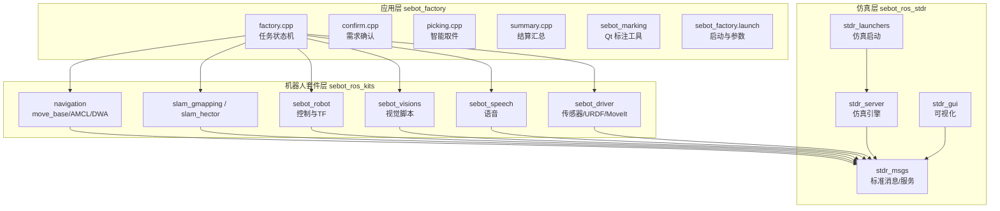
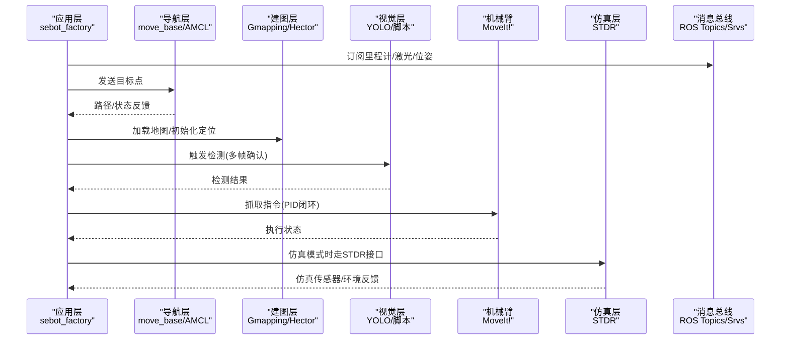
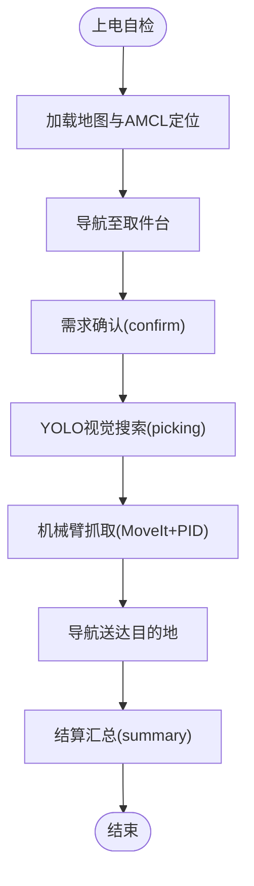
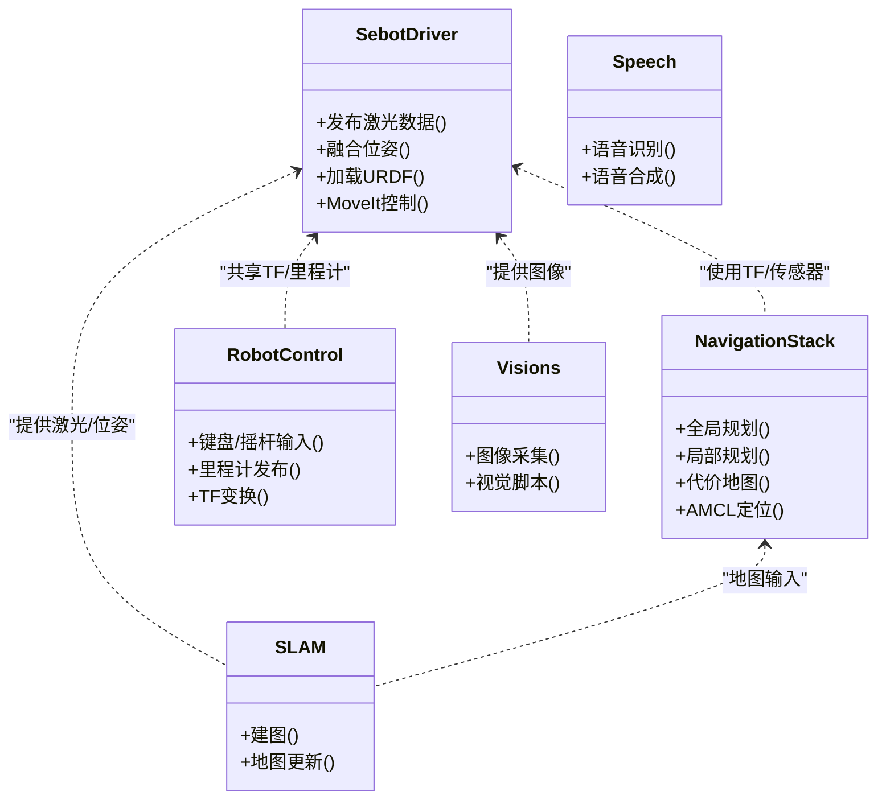
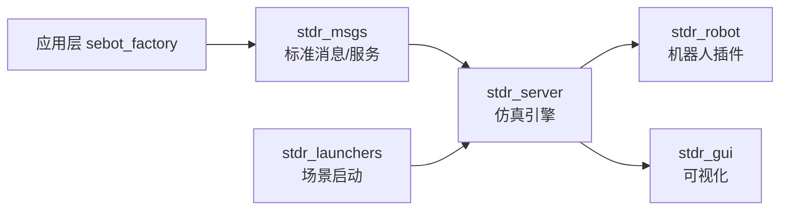
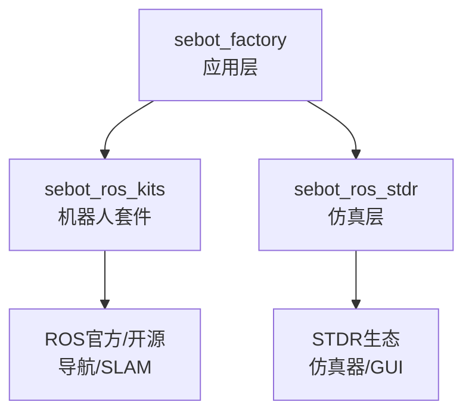

# 三层架构设计

<cite>
**本文引用的文件**   
- [sebot_factory/src/sebot_factory/CMakeLists.txt](file://sebot_factory/src/sebot_factory/CMakeLists.txt)
- [sebot_factory/src/sebot_factory/package.xml](file://sebot_factory/src/sebot_factory/package.xml)
- [sebot_factory/src/sebot_factory/launch/sebot_factory.launch](file://sebot_factory/src/sebot_factory/launch/sebot_factory.launch)
- [sebot_factory/src/sebot_factory/src/factory.cpp](file://sebot_factory/src/sebot_factory/src/factory.cpp)
- [sebot_factory/src/sebot_factory/src/confirm.cpp](file://sebot_factory/src/sebot_factory/src/confirm.cpp)
- [sebot_factory/src/sebot_factory/src/picking.cpp](file://sebot_factory/src/sebot_factory/src/picking.cpp)
- [sebot_factory/src/sebot_factory/src/summary.cpp](file://sebot_factory/src/sebot_factory/src/summary.cpp)
- [sebot_factory/src/sebot_marking/CMakeLists.txt](file://sebot_factory/src/sebot_marking/CMakeLists.txt)
- [sebot_factory/src/sebot_marking/package.xml](file://sebot_factory/src/sebot_marking/package.xml)
- [sebot_ros_kits/src/sebot_driver/rplidar_ros/package.xml](file://sebot_ros_kits/src/sebot_driver/rplidar_ros/package.xml)
- [sebot_ros_kits/src/sebot_driver/robot_pose_ekf/package.xml](file://sebot_ros_kits/src/sebot_driver/robot_pose_ekf/package.xml)
- [sebot_ros_kits/src/sebot_driver/sebot_urdf/package.xml](file://sebot_ros_kits/src/sebot_driver/sebot_urdf/package.xml)
- [sebot_ros_kits/src/sebot_driver/sebot_talon_moveit/package.xml](file://sebot_ros_kits/src/sebot_driver/sebot_talon_moveit/package.xml)
- [sebot_ros_kits/src/sebot_navigation/navigation/package.xml](file://sebot_ros_kits/src/sebot_navigation/navigation/package.xml)
- [sebot_ros_kits/src/sebot_slam/slam_gmapping/package.xml](file://sebot_ros_kits/src/sebot_slam/slam_gmapping/package.xml)
- [sebot_ros_kits/src/sebot_slam/slam_hector/package.xml](file://sebot_ros_kits/src/sebot_slam/slam_hector/package.xml)
- [sebot_ros_kits/src/sebot_robot/package.xml](file://sebot_ros_kits/src/sebot_robot/package.xml)
- [sebot_ros_kits/src/sebot_speech/package.xml](file://sebot_ros_kits/src/sebot_speech/package.xml)
- [sebot_ros_kits/src/sebot_visions/package.xml](file://sebot_ros_kits/src/sebot_visions/package.xml)
- [sebot_ros_stdr/src/sebot_stdr/stdr_msgs/package.xml](file://sebot_ros_stdr/src/sebot_stdr/stdr_msgs/package.xml)
- [sebot_ros_stdr/src/sebot_stdr/stdr_server/package.xml](file://sebot_ros_stdr/src/sebot_stdr/stdr_server/package.xml)
- [sebot_ros_stdr/src/sebot_stdr/stdr_robot/package.xml](file://sebot_ros_stdr/src/sebot_stdr/stdr_robot/package.xml)
- [sebot_ros_stdr/src/sebot_stdr/stdr_launchers/package.xml](file://sebot_ros_stdr/src/sebot_stdr/stdr_launchers/package.xml)
</cite>

## 目录
1. [简介](#简介)
2. [项目结构](#项目结构)
3. [核心组件](#核心组件)
4. [架构总览](#架构总览)
5. [详细组件分析](#详细组件分析)
6. [依赖关系分析](#依赖关系分析)
7. [性能考虑](#性能考虑)
8. [故障排查指南](#故障排查指南)
9. [结论](#结论)
10. [附录](#附录)

## 简介
本设计文档面向机器人竞赛系统的三层架构：应用层 sebot_factory、机器人套件层 sebot_ros_kits、仿真层 sebot_ros_stdr。文档围绕职责划分、构建系统、包组织、通信接口与数据交换协议展开，并通过 ROS 消息与服务实现层间解耦。同时给出扩展新功能的指导原则与最佳实践，帮助开发者快速理解与迭代系统。

## 项目结构
仓库由三个相互独立的 catkin 工作空间组成，各自包含 src/ 目录，需分别执行 catkin_make 构建。

- sebot_factory（应用层）
  - 业务主节点与任务编排：factory.cpp（状态机）、confirm.cpp（需求确认）、picking.cpp（智能取件）、summary.cpp（结算汇总）
  - 标注工具：sebot_marking（Qt 上位机，用于建图标注）
  - 资源与模型：res/model、res/inference、res/image 等
  - 启动配置：launch/sebot_factory.launch（simulation、debug 及导航/PID/超时等关键参数）

- sebot_ros_kits（机器人套件层）
  - 驱动与硬件抽象：sebot_driver（rplidar_ros、robot_pose_ekf、sebot_urdf、sebot_talon_moveit）
  - 导航与定位：sebot_navigation（move_base、AMCL、DWA、costmap_2d 等）
  - SLAM：slam_gmapping、slam_hector
  - 机器人控制与外设：sebot_robot（键盘/摇杆/里程计/TF）、sebot_speech（语音交互）、sebot_visions（视觉脚本）

- sebot_ros_stdr（仿真层）
  - STDR 仿真器与 GUI：stdr_server、stdr_gui、stdr_robot、stdr_launchers
  - 标准消息与服务：stdr_msgs（msg/srv/action）
  - 导航与地图：stdr_navigation、stdr_amcl、stdr_hector_mapping

图表来源
- [sebot_factory/src/sebot_factory/src/factory.cpp](file://sebot_factory/src/sebot_factory/src/factory.cpp)
- [sebot_factory/src/sebot_factory/launch/sebot_factory.launch](file://sebot_factory/src/sebot_factory/launch/sebot_factory.launch)
- [sebot_ros_kits/src/sebot_navigation/navigation/package.xml](file://sebot_ros_kits/src/sebot_navigation/navigation/package.xml)
- [sebot_ros_kits/src/sebot_slam/slam_gmapping/package.xml](file://sebot_ros_kits/src/sebot_slam/slam_gmapping/package.xml)
- [sebot_ros_kits/src/sebot_slam/slam_hector/package.xml](file://sebot_ros_kits/src/sebot_slam/slam_hector/package.xml)
- [sebot_ros_kits/src/sebot_robot/package.xml](file://sebot_ros_kits/src/sebot_robot/package.xml)
- [sebot_ros_kits/src/sebot_visions/package.xml](file://sebot_ros_kits/src/sebot_visions/package.xml)
- [sebot_ros_kits/src/sebot_speech/package.xml](file://sebot_ros_kits/src/sebot_speech/package.js)
- [sebot_ros_kits/src/sebot_driver/rplidar_ros/package.xml](file://sebot_ros_kits/src/sebot_driver/rplidar_ros/package.xml)
- [sebot_ros_kits/src/sebot_driver/robot_pose_ekf/package.xml](file://sebot_ros_kits/src/sebot_driver/robot_pose_ekf/package.xml)
- [sebot_ros_kits/src/sebot_driver/sebot_urdf/package.xml](file://sebot_ros_kits/src/sebot_driver/sebot_urdf/package.xml)
- [sebot_ros_kits/src/sebot_driver/sebot_talon_moveit/package.xml](file://sebot_ros_kits/src/sebot_driver/sebot_talon_moveit/package.xml)
- [sebot_ros_stdr/src/sebot_stdr/stdr_msgs/package.xml](file://sebot_ros_stdr/src/sebot_stdr/stdr_msgs/package.xml)
- [sebot_ros_stdr/src/sebot_stdr/stdr_server/package.xml](file://sebot_ros_stdr/src/sebot_stdr/stdr_server/package.xml)
- [sebot_ros_stdr/src/sebot_stdr/stdr_robot/package.xml](file://sebot_ros_stdr/src/sebot_stdr/stdr_robot/package.xml)
- [sebot_ros_stdr/src/sebot_stdr/stdr_launchers/package.xml](file://sebot_ros_stdr/src/sebot_stdr/stdr_launchers/package.xml)

章节来源
- [sebot_factory/src/sebot_factory/CMakeLists.txt](file://sebot_factory/src/sebot_factory/CMakeLists.txt)
- [sebot_factory/src/sebot_factory/package.xml](file://sebot_factory/src/sebot_factory/package.xml)
- [sebot_factory/src/sebot_marking/CMakeLists.txt](file://sebot_factory/src/sebot_marking/CMakeLists.txt)
- [sebot_factory/src/sebot_marking/package.xml](file://sebot_factory/src/sebot_marking/package.xml)

## 核心组件
- 应用层 sebot_factory
  - factory.cpp：比赛全链路状态机，串联导航、定位、视觉、机械臂抓取与结算流程；通过 launch 参数切换仿真模式与调试选项。
  - confirm.cpp：需求确认逻辑，对接订单与任务队列，触发后续动作。
  - picking.cpp：智能取件，结合视觉结果与机械臂控制完成抓取。
  - summary.cpp：结算汇总，统计任务完成情况并输出报告。
  - sebot_marking：Qt 标注工具，辅助建图与位置标注。

- 机器人套件层 sebot_ros_kits
  - sebot_driver：RPLidar 驱动、IMU/里程计 EKF 融合、URDF 描述、MoveIt! 机械臂配置。
  - sebot_navigation：基于 move_base + AMCL + DWA 的导航栈，提供全局/局部规划与代价地图。
  - sebot_slam：Gmapping/Hector 建图方案。
  - sebot_robot：键盘/摇杆控制、里程计发布、TF 变换。
  - sebot_speech：语音交互模块。
  - sebot_visions：视觉相关脚本与工具。

- 仿真层 sebot_ros_stdr
  - stdr_server：仿真引擎，提供物理、传感器与环境的仿真。
  - stdr_gui：可视化界面。
  - stdr_robot：仿真机器人插件。
  - stdr_msgs：标准消息与服务定义，供上层统一调用。
  - stdr_launchers：仿真场景一键启动。

章节来源
- [sebot_factory/src/sebot_factory/src/factory.cpp](file://sebot_factory/src/sebot_factory/src/factory.cpp)
- [sebot_factory/src/sebot_factory/src/confirm.cpp](file://sebot_factory/src/sebot_factory/src/confirm.cpp)
- [sebot_factory/src/sebot_factory/src/picking.cpp](file://sebot_factory/src/sebot_factory/src/picking.cpp)
- [sebot_factory/src/sebot_factory/src/summary.cpp](file://sebot_factory/src/sebot_factory/src/summary.cpp)
- [sebot_factory/src/sebot_marking/CMakeLists.txt](file://sebot_factory/src/sebot_marking/CMakeLists.txt)
- [sebot_ros_kits/src/sebot_driver/rplidar_ros/package.xml](file://sebot_ros_kits/src/sebot_driver/rplidar_ros/package.xml)
- [sebot_ros_kits/src/sebot_driver/robot_pose_ekf/package.xml](file://sebot_ros_kits/src/sebot_driver/robot_pose_ekf/package.xml)
- [sebot_ros_kits/src/sebot_driver/sebot_urdf/package.xml](file://sebot_ros_kits/src/sebot_driver/sebot_urdf/package.xml)
- [sebot_ros_kits/src/sebot_driver/sebot_talon_moveit/package.xml](file://sebot_ros_kits/src/sebot_driver/sebot_talon_moveit/package.xml)
- [sebot_ros_kits/src/sebot_navigation/navigation/package.xml](file://sebot_ros_kits/src/sebot_navigation/navigation/package.xml)
- [sebot_ros_kits/src/sebot_slam/slam_gmapping/package.xml](file://sebot_ros_kits/src/sebot_slam/slam_gmapping/package.xml)
- [sebot_ros_kits/src/sebot_slam/slam_hector/package.xml](file://sebot_ros_kits/src/sebot_slam/slam_hector/package.xml)
- [sebot_ros_kits/src/sebot_robot/package.xml](file://sebot_ros_kits/src/sebot_robot/package.xml)
- [sebot_ros_kits/src/sebot_speech/package.xml](file://sebot_ros_kits/src/sebot_speech/package.xml)
- [sebot_ros_kits/src/sebot_visions/package.xml](file://sebot_ros_kits/src/sebot_visions/package.xml)
- [sebot_ros_stdr/src/sebot_stdr/stdr_msgs/package.xml](file://sebot_ros_stdr/src/sebot_stdr/stdr_msgs/package.xml)
- [sebot_ros_stdr/src/sebot_stdr/stdr_server/package.xml](file://sebot_ros_stdr/src/sebot_stdr/stdr_server/package.xml)
- [sebot_ros_stdr/src/sebot_stdr/stdr_robot/package.xml](file://sebot_ros_stdr/src/sebot_stdr/stdr_robot/package.xml)
- [sebot_ros_stdr/src/sebot_stdr/stdr_launchers/package.xml](file://sebot_ros_stdr/src/sebot_stdr/stdr_launchers/package.xml)

## 架构总览
三层通过 ROS 消息与服务进行解耦通信：
- 应用层 sebot_factory 负责业务流程编排，订阅传感器与定位信息，发布运动与任务指令。
- 机器人套件层 sebot_ros_kits 提供驱动、导航、SLAM、语音与视觉能力，向上暴露标准 ROS 接口。
- 仿真层 sebot_ros_stdr 通过 stdr_msgs 与上层保持一致的接口契约，便于在仿真与真机上无缝切换。

图表来源
- [sebot_factory/src/sebot_factory/launch/sebot_factory.launch](file://sebot_factory/src/sebot_factory/launch/sebot_factory.launch)
- [sebot_ros_kits/src/sebot_navigation/navigation/package.xml](file://sebot_ros_kits/src/sebot_navigation/navigation/package.xml)
- [sebot_ros_kits/src/sebot_slam/slam_gmapping/package.xml](file://sebot_ros_kits/src/sebot_slam/slam_gmapping/package.xml)
- [sebot_ros_kits/src/sebot_slam/slam_hector/package.xml](file://sebot_ros_kits/src/sebot_slam/slam_hector/package.xml)
- [sebot_ros_kits/src/sebot_driver/sebot_talon_moveit/package.xml](file://sebot_ros_kits/src/sebot_driver/sebot_talon_moveit/package.xml)
- [sebot_ros_stdr/src/sebot_stdr/stdr_msgs/package.xml](file://sebot_ros_stdr/src/sebot_stdr/stdr_msgs/package.xml)

## 详细组件分析

### 应用层 sebot_factory
- 职责
  - 编排比赛全流程：自检 → 加载地图与 AMCL 定位 → 导航至取件台 → 需求确认 → YOLO 视觉搜索（NPU 加速 Yolov3，多帧检测确认）→ 机械臂 PID 闭环抓取 → 导航送达并结算。
  - 通过 launch 参数切换仿真模式与调试开关，统一管理导航超时、PID、取件距离、补扫等关键参数。
- 关键文件
  - factory.cpp：主状态机实现，串联各子节点与导航/视觉/机械臂流程。
  - confirm.cpp：需求确认，处理订单与任务队列。
  - picking.cpp：智能取件，协调视觉与机械臂。
  - summary.cpp：结算汇总，输出任务统计。
  - sebot_factory.launch：启动入口与参数集中管理。

图表来源
- [sebot_factory/src/sebot_factory/src/factory.cpp](file://sebot_factory/src/sebot_factory/src/factory.cpp)
- [sebot_factory/src/sebot_factory/src/confirm.cpp](file://sebot_factory/src/sebot_factory/src/confirm.cpp)
- [sebot_factory/src/sebot_factory/src/picking.cpp](file://sebot_factory/src/sebot_factory/src/picking.cpp)
- [sebot_factory/src/sebot_factory/src/summary.cpp](file://sebot_factory/src/sebot_factory/src/summary.cpp)
- [sebot_factory/src/sebot_factory/launch/sebot_factory.launch](file://sebot_factory/src/sebot_factory/launch/sebot_factory.launch)

章节来源
- [sebot_factory/src/sebot_factory/src/factory.cpp](file://sebot_factory/src/sebot_factory/src/factory.cpp)
- [sebot_factory/src/sebot_factory/src/confirm.cpp](file://sebot_factory/src/sebot_factory/src/confirm.cpp)
- [sebot_factory/src/sebot_factory/src/picking.cpp](file://sebot_factory/src/sebot_factory/src/picking.cpp)
- [sebot_factory/src/sebot_factory/src/summary.cpp](file://sebot_factory/src/sebot_factory/src/summary.cpp)
- [sebot_factory/src/sebot_factory/launch/sebot_factory.launch](file://sebot_factory/src/sebot_factory/launch/sebot_factory.launch)

### 机器人套件层 sebot_ros_kits
- 驱动与硬件抽象
  - rplidar_ros：激光雷达驱动，发布扫描数据。
  - robot_pose_ekf：IMU 与里程计融合，提升位姿估计精度。
  - sebot_urdf：机器人 URDF 描述，用于仿真与 TF 树构建。
  - sebot_talon_moveit：机械臂 MoveIt! 配置与控制器。
- 导航与 SLAM
  - navigation：move_base + AMCL + DWA，提供全局/局部规划与代价地图。
  - slam_gmapping / slam_hector：建图算法，生成与更新地图。
- 控制与外设
  - sebot_robot：键盘/摇杆控制、里程计发布、TF 变换。
  - sebot_speech：语音交互。
  - sebot_visions：视觉脚本与工具。

图表来源
- [sebot_ros_kits/src/sebot_driver/rplidar_ros/package.xml](file://sebot_ros_kits/src/sebot_driver/rplidar_ros/package.xml)
- [sebot_ros_kits/src/sebot_driver/robot_pose_ekf/package.xml](file://sebot_ros_kits/src/sebot_driver/robot_pose_ekf/package.xml)
- [sebot_ros_kits/src/sebot_driver/sebot_urdf/package.xml](file://sebot_ros_kits/src/sebot_driver/sebot_urdf/package.xml)
- [sebot_ros_kits/src/sebot_driver/sebot_talon_moveit/package.xml](file://sebot_ros_kits/src/sebot_driver/sebot_talon_moveit/package.xml)
- [sebot_ros_kits/src/sebot_navigation/navigation/package.xml](file://sebot_ros_kits/src/sebot_navigation/navigation/package.xml)
- [sebot_ros_kits/src/sebot_slam/slam_gmapping/package.xml](file://sebot_ros_kits/src/sebot_slam/slam_gmapping/package.xml)
- [sebot_ros_kits/src/sebot_slam/slam_hector/package.xml](file://sebot_ros_kits/src/sebot_slam/slam_hector/package.xml)
- [sebot_ros_kits/src/sebot_robot/package.xml](file://sebot_ros_kits/src/sebot_robot/package.xml)
- [sebot_ros_kits/src/sebot_speech/package.xml](file://sebot_ros_kits/src/sebot_speech/package.xml)
- [sebot_ros_kits/src/sebot_visions/package.xml](file://sebot_ros_kits/src/sebot_visions/package.xml)

章节来源
- [sebot_ros_kits/src/sebot_driver/rplidar_ros/package.xml](file://sebot_ros_kits/src/sebot_driver/rplidar_ros/package.xml)
- [sebot_ros_kits/src/sebot_driver/robot_pose_ekf/package.xml](file://sebot_ros_kits/src/sebot_driver/robot_pose_ekf/package.xml)
- [sebot_ros_kits/src/sebot_driver/sebot_urdf/package.xml](file://sebot_ros_kits/src/sebot_driver/sebot_urdf/package.xml)
- [sebot_ros_kits/src/sebot_driver/sebot_talon_moveit/package.xml](file://sebot_ros_kits/src/sebot_driver/sebot_talon_moveit/package.xml)
- [sebot_ros_kits/src/sebot_navigation/navigation/package.xml](file://sebot_ros_kits/src/sebot_navigation/navigation/package.xml)
- [sebot_ros_kits/src/sebot_slam/slam_gmapping/package.xml](file://sebot_ros_kits/src/sebot_slam/slam_gmapping/package.xml)
- [sebot_ros_kits/src/sebot_slam/slam_hector/package.xml](file://sebot_ros_kits/src/sebot_slam/slam_hector/package.xml)
- [sebot_ros_kits/src/sebot_robot/package.xml](file://sebot_ros_kits/src/sebot_robot/package.xml)
- [sebot_ros_kits/src/sebot_speech/package.xml](file://sebot_ros_kits/src/sebot_speech/package.xml)
- [sebot_ros_kits/src/sebot_visions/package.xml](file://sebot_ros_kits/src/sebot_visions/package.xml)

### 仿真层 sebot_ros_stdr
- 职责
  - 提供与真实硬件一致的 ROS 接口，使应用层无需修改即可在仿真环境中运行。
  - stdr_msgs 定义标准消息与服务，确保上层对仿真与真机的调用一致性。
  - stdr_server 作为仿真引擎，stdr_gui 提供可视化，stdr_robot 提供机器人插件，stdr_launchers 简化场景启动。
- 关键包
  - stdr_msgs：标准消息/服务定义。
  - stdr_server：仿真服务器。
  - stdr_robot：仿真机器人插件。
  - stdr_launchers：仿真启动器。

图表来源
- [sebot_ros_stdr/src/sebot_stdr/stdr_msgs/package.xml](file://sebot_ros_stdr/src/sebot_stdr/stdr_msgs/package.xml)
- [sebot_ros_stdr/src/sebot_stdr/stdr_server/package.xml](file://sebot_ros_stdr/src/sebot_stdr/stdr_server/package.xml)
- [sebot_ros_stdr/src/sebot_stdr/stdr_robot/package.xml](file://sebot_ros_stdr/src/sebot_stdr/stdr_robot/package.xml)
- [sebot_ros_stdr/src/sebot_stdr/stdr_launchers/package.xml](file://sebot_ros_stdr/src/sebot_stdr/stdr_launchers/package.xml)

章节来源
- [sebot_ros_stdr/src/sebot_stdr/stdr_msgs/package.xml](file://sebot_ros_stdr/src/sebot_stdr/stdr_msgs/package.xml)
- [sebot_ros_stdr/src/sebot_stdr/stdr_server/package.xml](file://sebot_ros_stdr/src/sebot_stdr/stdr_server/package.xml)
- [sebot_ros_stdr/src/sebot_stdr/stdr_robot/package.xml](file://sebot_ros_stdr/src/sebot_stdr/stdr_robot/package.xml)
- [sebot_ros_stdr/src/sebot_stdr/stdr_launchers/package.xml](file://sebot_ros_stdr/src/sebot_stdr/stdr_launchers/package.xml)

## 依赖关系分析
- 构建系统
  - 每个工作空间独立使用 catkin 构建，package.xml 声明依赖，CMakeLists.txt 定义编译规则。
  - sebot_factory 依赖 sebot_ros_kits 与 sebot_ros_stdr 提供的 ROS 接口。
- 包组织
  - 按功能划分包：驱动、导航、SLAM、语音、视觉、仿真等，保持高内聚低耦合。
- 外部依赖
  - 导航栈、SLAM、STDR 等 fork 自官方/开源项目，本项目聚焦集成与参数定制。

图表来源
- [sebot_factory/src/sebot_factory/CMakeLists.txt](file://sebot_factory/src/sebot_factory/CMakeLists.txt)
- [sebot_factory/src/sebot_factory/package.xml](file://sebot_factory/src/sebot_factory/package.xml)
- [sebot_ros_kits/src/sebot_navigation/navigation/package.xml](file://sebot_ros_kits/src/sebot_navigation/navigation/package.xml)
- [sebot_ros_kits/src/sebot_slam/slam_gmapping/package.xml](file://sebot_ros_kits/src/sebot_slam/slam_gmapping/package.xml)
- [sebot_ros_stdr/src/sebot_stdr/stdr_msgs/package.xml](file://sebot_ros_stdr/src/sebot_stdr/stdr_msgs/package.xml)

章节来源
- [sebot_factory/src/sebot_factory/CMakeLists.txt](file://sebot_factory/src/sebot_factory/CMakeLists.txt)
- [sebot_factory/src/sebot_factory/package.xml](file://sebot_factory/src/sebot_factory/package.xml)
- [sebot_ros_kits/src/sebot_navigation/navigation/package.xml](file://sebot_ros_kits/src/sebot_navigation/navigation/package.xml)
- [sebot_ros_kits/src/sebot_slam/slam_gmapping/package.xml](file://sebot_ros_kits/src/sebot_slam/slam_gmapping/package.xml)
- [sebot_ros_stdr/src/sebot_stdr/stdr_msgs/package.xml](file://sebot_ros_stdr/src/sebot_stdr/stdr_msgs/package.xml)

## 性能考虑
- 视觉推理
  - 使用 NPU 加速 YOLOv3，多帧检测确认提高鲁棒性；注意内存与算力分配，避免阻塞主线程。
- 导航与定位
  - AMCL 粒子数与代价地图分辨率需平衡精度与实时性；DWA 局部规划参数影响避障与平滑度。
- 传感器融合
  - EKF 融合 IMU 与里程计，合理设置噪声协方差，提升位姿估计稳定性。
- 机械臂控制
  - PID 闭环抓取需调参避免过冲与抖动；MoveIt 轨迹规划时间与碰撞检测开销需监控。
- 仿真与真机一致性
  - 通过 stdr_msgs 统一接口，减少仿真到真机的迁移成本；注意传感器噪声与延迟建模。

## 故障排查指南
- 启动问题
  - 检查 sebot_factory.launch 中 simulation 与 debug 参数是否正确；确认各包依赖已安装。
- 导航失败
  - 查看 AMCL 定位是否收敛；检查代价地图与障碍物层；调整 DWA 参数与全局规划器。
- 视觉误检
  - 检查 YOLO 模型与标签列表；增加多帧确认阈值；优化光照与遮挡条件。
- 机械臂抓取失败
  - 检查 MoveIt 配置与关节限制；调整 PID 参数与抓取姿态；验证 TF 树正确性。
- 仿真不一致
  - 对比 stdr_msgs 与真实驱动的消息格式；校准传感器噪声与延迟参数。

章节来源
- [sebot_factory/src/sebot_factory/launch/sebot_factory.launch](file://sebot_factory/src/sebot_factory/launch/sebot_factory.launch)
- [sebot_ros_kits/src/sebot_navigation/navigation/package.xml](file://sebot_ros_kits/src/sebot_navigation/navigation/package.xml)
- [sebot_ros_kits/src/sebot_driver/sebot_talon_moveit/package.xml](file://sebot_ros_kits/src/sebot_driver/sebot_talon_moveit/package.xml)
- [sebot_ros_stdr/src/sebot_stdr/stdr_msgs/package.xml](file://sebot_ros_stdr/src/sebot_stdr/stdr_msgs/package.xml)

## 结论
本设计通过清晰的三层架构与 ROS 消息/服务解耦，实现了应用层、机器人套件层与仿真层的职责分离与灵活组合。以 sebot_factory 为核心编排比赛流程，sebot_ros_kits 提供标准化能力，sebot_ros_stdr 保证仿真与真机一致性。遵循本文档的指导原则与最佳实践，可高效扩展新功能并保障系统稳定性。

## 附录
- 扩展新功能指导原则
  - 新增功能优先封装为独立 ROS 包，明确消息/服务接口。
  - 在 sebot_factory 中以节点或状态机方式集成，避免侵入核心流程。
  - 使用 launch 参数化配置，支持仿真与真机切换。
  - 编写单元测试与集成测试，覆盖异常路径与边界条件。
- 最佳实践
  - 保持包间松耦合，依赖最小化。
  - 统一命名规范与日志级别，便于调试与维护。
  - 定期回归测试，确保升级不影响现有功能。