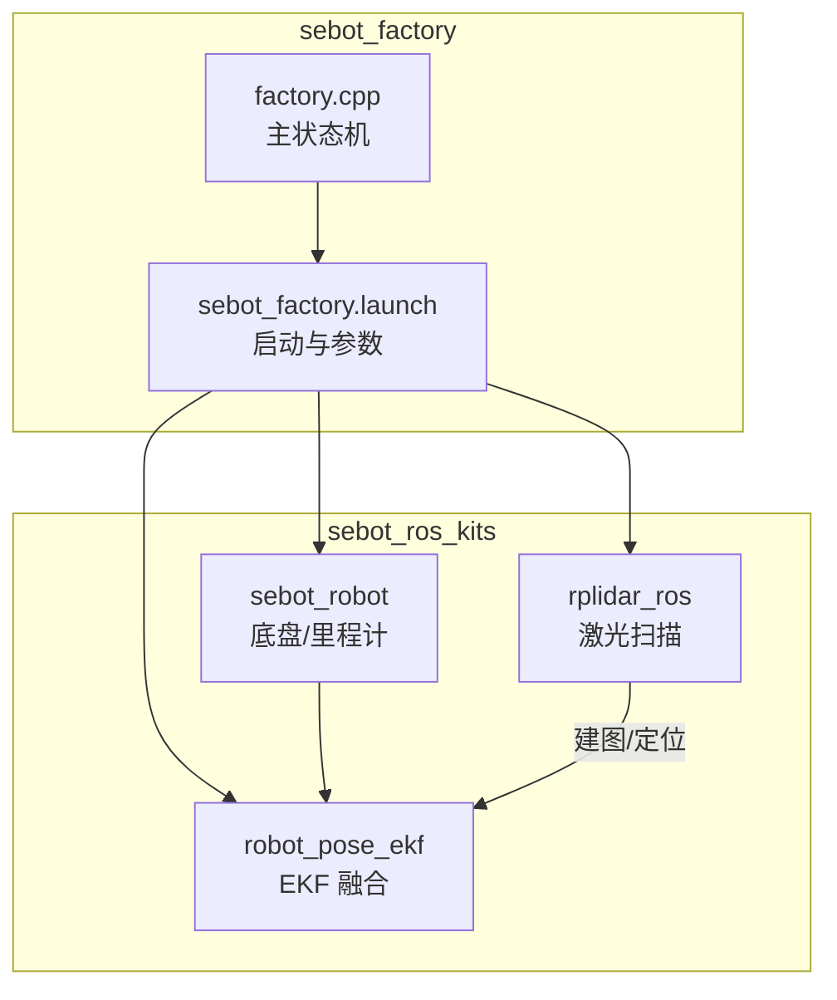
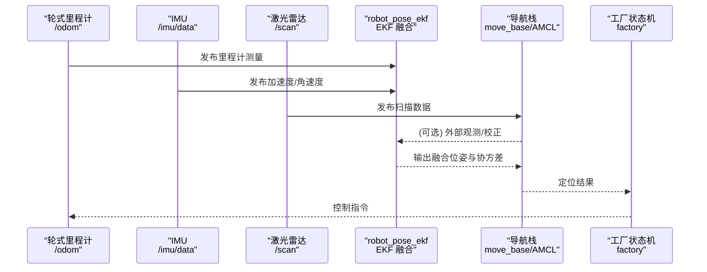
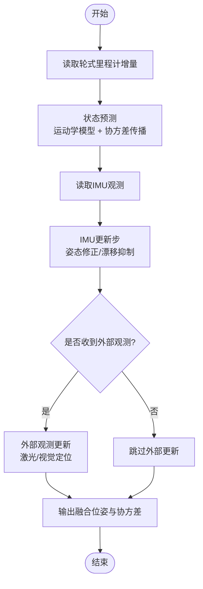
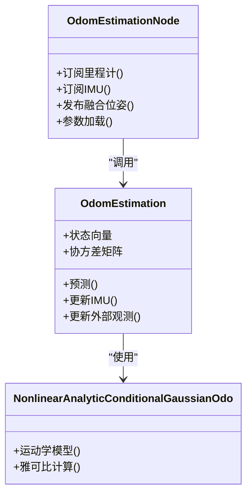
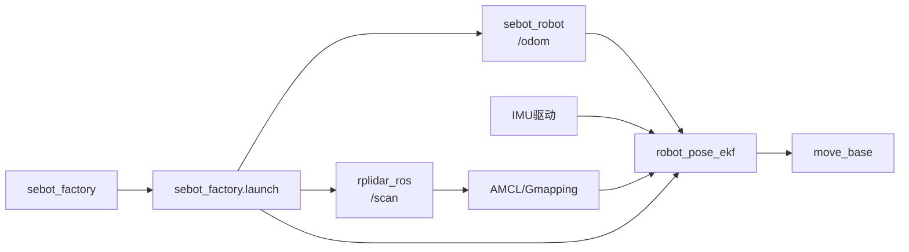

# 传感器融合策略

<cite>
**本文引用的文件**   
- [robot_pose_ekf/odom_estimation_node.cpp](file://sebot_ros_kits/src/sebot_driver/robot_pose_ekf/src/odom_estimation_node.cpp)
- [robot_pose_ekf/odom_estimation.cpp](file://sebot_ros_kits/src/sebot_driver/robot_pose_ekf/src/odom_estimation.cpp)
- [robot_pose_ekf/nonlinearanalyticconditionalgaussianodo.cpp](file://sebot_ros_kits/src/sebot_driver/robot_pose_ekf/src/nonlinearanalyticconditionalgaussianodo.cpp)
- [robot_pose_ekf/launch/robot_pose_ekf.launch](file://sebot_ros_kits/src/sebot_driver/robot_pose_ekf/launch/robot_pose_ekf.launch)
- [robot_pose_ekf/package.xml](file://sebot_ros_kits/src/sebot_driver/robot_pose_ekf/package.xml)
- [rplidar_ros/node.cpp](file://sebot_ros_kits/src/sebot_driver/rplidar_ros/src/node.cpp)
- [sebot_robot/controller.cpp](file://sebot_ros_kits/src/sebot_robot/src/controller.cpp)
- [sebot_factory/factory.cpp](file://sebot_factory/src/sebot_factory/factory.cpp)
- [sebot_factory/launch/sebot_factory.launch](file://sebot_factory/src/sebot_factory/launch/sebot_factory.launch)
</cite>

## 目录
1. [简介](#简介)
2. [项目结构](#项目结构)
3. [核心组件](#核心组件)
4. [架构总览](#架构总览)
5. [详细组件分析](#详细组件分析)
6. [依赖关系分析](#依赖关系分析)
7. [性能考量](#性能考量)
8. [故障排查指南](#故障排查指南)
9. [结论](#结论)
10. [附录：参数调优与集成指南](#附录参数调优与集成指南)

## 简介
本文件面向多传感器数据融合策略，聚焦 robot_pose_ekf 的扩展卡尔曼滤波（EKF）实现，系统阐述轮式里程计、IMU 与激光雷达数据的融合策略。文档涵盖传感器噪声模型、协方差矩阵配置、融合权重调整、不同环境下的传感器选择与故障检测机制，并提供数据流程图与参数调优指南，以及新传感器融合的集成方法。

## 项目结构
本项目由三个相互独立的 catkin 工作空间组成：
- sebot_factory：应用层业务节点与状态机
- sebot_ros_kits：机器人驱动与导航套件（含 robot_pose_ekf、rplidar_ros、slam_gmapping/hector 等）
- sebot_ros_stdr：仿真环境 STDR

在 sebot_ros_kits 中，robot_pose_ekf 负责将轮式里程计与 IMU 进行 EKF 融合；rplidar_ros 提供激光扫描数据；sebot_robot 提供底盘控制与里程计；sebot_factory 通过 launch 统一启动各模块并配置关键参数。

图表来源
- [sebot_factory/factory.cpp](file://sebot_factory/src/sebot_factory/factory.cpp)
- [sebot_factory/launch/sebot_factory.launch](file://sebot_factory/src/sebot_factory/launch/sebot_factory.launch)
- [sebot_ros_kits/src/sebot_driver/robot_pose_ekf/src/odom_estimation_node.cpp](file://sebot_ros_kits/src/sebot_driver/robot_pose_ekf/src/odom_estimation_node.cpp)
- [sebot_ros_kits/src/sebot_driver/rplidar_ros/src/node.cpp](file://sebot_ros_kits/src/sebot_driver/rplidar_ros/src/node.cpp)
- [sebot_ros_kits/src/sebot_robot/src/controller.cpp](file://sebot_ros_kits/src/sebot_robot/src/controller.cpp)

章节来源
- [sebot_factory/factory.cpp](file://sebot_factory/src/sebot_factory/factory.cpp)
- [sebot_factory/launch/sebot_factory.launch](file://sebot_factory/src/sebot_factory/launch/sebot_factory.launch)
- [sebot_ros_kits/src/sebot_driver/robot_pose_ekf/package.xml](file://sebot_ros_kits/src/sebot_driver/robot_pose_ekf/package.xml)

## 核心组件
- robot_pose_ekf：基于 EKF 的位姿估计器，订阅轮式里程计与 IMU，输出融合后的位姿与协方差。
- rplidar_ros：激光雷达驱动节点，发布 /scan 消息供 SLAM/定位使用。
- sebot_robot：底盘控制器与编码器里程计，发布 /odom。
- sebot_factory：上层业务状态机，通过 launch 统一启动与参数配置。

章节来源
- [sebot_ros_kits/src/sebot_driver/robot_pose_ekf/src/odom_estimation_node.cpp](file://sebot_ros_kits/src/sebot_driver/robot_pose_ekf/src/odom_estimation_node.cpp)
- [sebot_ros_kits/src/sebot_driver/robot_pose_ekf/src/odom_estimation.cpp](file://sebot_ros_kits/src/sebot_driver/robot_pose_ekf/src/odom_estimation.cpp)
- [sebot_ros_kits/src/sebot_driver/robot_pose_ekf/src/nonlinearanalyticconditionalgaussianodo.cpp](file://sebot_ros_kits/src/sebot_driver/robot_pose_ekf/src/nonlinearanalyticconditionalgaussianodo.cpp)
- [sebot_ros_kits/src/sebot_driver/rplidar_ros/src/node.cpp](file://sebot_ros_kits/src/sebot_driver/rplidar_ros/src/node.cpp)
- [sebot_ros_kits/src/sebot_robot/src/controller.cpp](file://sebot_ros_kits/src/sebot_robot/src/controller.cpp)

## 架构总览
下图展示从传感器到 EKF 融合再到下游导航的整体数据流。轮式里程计与 IMU 进入 EKF 进行状态更新；激光雷达用于建图与定位（如 AMCL/Gmapping），其结果可与 EKF 输出协同或作为观测输入（取决于具体配置）。

图表来源
- [sebot_ros_kits/src/sebot_driver/robot_pose_ekf/src/odom_estimation_node.cpp](file://sebot_ros_kits/src/sebot_driver/robot_pose_ekf/src/odom_estimation_node.cpp)
- [sebot_ros_kits/src/sebot_driver/rplidar_ros/src/node.cpp](file://sebot_ros_kits/src/sebot_driver/rplidar_ros/src/node.cpp)
- [sebot_factory/src/sebot_factory/factory.cpp](file://sebot_factory/src/sebot_factory/factory.cpp)

## 详细组件分析

### robot_pose_ekf EKF 算法与数据融合
- 状态向量：通常包含位姿（x, y, yaw）及可能的速度项，协方差矩阵描述不确定性。
- 预测步：基于运动学模型（轮式里程计增量）进行状态预测，传播协方差。
- 更新步：IMU 提供角速度与加速度观测，修正姿态与漂移；必要时可引入外部观测（如视觉/激光定位）。
- 非线性处理：采用解析雅可比或数值近似，保证实时性与稳定性。

图表来源
- [sebot_ros_kits/src/sebot_driver/robot_pose_ekf/src/odom_estimation.cpp](file://sebot_ros_kits/src/sebot_driver/robot_pose_ekf/src/odom_estimation.cpp)
- [sebot_ros_kits/src/sebot_driver/robot_pose_ekf/src/nonlinearanalyticconditionalgaussianodo.cpp](file://sebot_ros_kits/src/sebot_driver/robot_pose_ekf/src/nonlinearanalyticconditionalgaussianodo.cpp)

章节来源
- [sebot_ros_kits/src/sebot_driver/robot_pose_ekf/src/odom_estimation.cpp](file://sebot_ros_kits/src/sebot_driver/robot_pose_ekf/src/odom_estimation.cpp)
- [sebot_ros_kits/src/sebot_driver/robot_pose_ekf/src/nonlinearanalyticconditionalgaussianodo.cpp](file://sebot_ros_kits/src/sebot_driver/robot_pose_ekf/src/nonlinearanalyticconditionalgaussianodo.cpp)

### 传感器噪声模型与协方差配置
- 轮式里程计噪声：线性与角速度噪声随速度变化，典型为常数+速度相关项；需根据编码器分辨率与打滑情况标定。
- IMU 噪声：零偏、比例因子与白噪声；需区分静态与动态标定，避免过度信任导致发散。
- 协方差矩阵：对角为主，非对角项表示相关性；EKF 对大协方差观测自动降低权重。
- 权重调整：通过增大某传感器的协方差降低其影响，反之提高权重；建议分阶段标定与在线自适应。

章节来源
- [sebot_ros_kits/src/sebot_driver/robot_pose_ekf/src/odom_estimation_node.cpp](file://sebot_ros_kits/src/sebot_driver/robot_pose_ekf/src/odom_estimation_node.cpp)
- [sebot_ros_kits/src/sebot_driver/robot_pose_ekf/src/odom_estimation.cpp](file://sebot_ros_kits/src/sebot_driver/robot_pose_ekf/src/odom_estimation.cpp)

### 不同环境下的传感器选择策略
- 室内平滑地面：轮式里程计可靠，IMU 辅助姿态；激光雷达用于建图与定位。
- 粗糙/斜坡路面：轮式易打滑，增加 IMU 权重，必要时引入视觉/激光闭环校正。
- 动态遮挡严重：激光雷达受限，提升 IMU 与里程计权重，结合短时外推。
- 长走廊/弱纹理：激光特征不足，依赖 IMU 与里程计，谨慎使用外部观测。

章节来源
- [sebot_ros_kits/src/sebot_driver/robot_pose_ekf/src/odom_estimation_node.cpp](file://sebot_ros_kits/src/sebot_driver/robot_pose_ekf/src/odom_estimation_node.cpp)

### 故障检测与恢复机制
- 传感器失效检测：检查消息时间戳、频率、协方差异常值；超时则降级至可用传感器。
- 一致性检验：比较 EKF 输出与独立观测（如激光定位），偏差过大触发告警与回退。
- 恢复策略：逐步恢复被禁用传感器，重新校准协方差，避免突变。

章节来源
- [sebot_ros_kits/src/sebot_driver/robot_pose_ekf/src/odom_estimation_node.cpp](file://sebot_ros_kits/src/sebot_driver/robot_pose_ekf/src/odom_estimation_node.cpp)

### 数据流程与接口
- 输入：/odom（轮式里程计）、/imu/data（IMU）、可选外部观测（如 /amcl_pose）。
- 输出：融合位姿（tf 与 /odom）、协方差矩阵。
- 配置：通过 ROS 参数设置噪声、阈值、更新频率等。

章节来源
- [sebot_ros_kits/src/sebot_driver/robot_pose_ekf/src/odom_estimation_node.cpp](file://sebot_ros_kits/src/sebot_driver/robot_pose_ekf/src/odom_estimation_node.cpp)

### 类与模块关系（面向对象视角）

图表来源
- [sebot_ros_kits/src/sebot_driver/robot_pose_ekf/src/odom_estimation_node.cpp](file://sebot_ros_kits/src/sebot_driver/robot_pose_ekf/src/odom_estimation_node.cpp)
- [sebot_ros_kits/src/sebot_driver/robot_pose_ekf/src/odom_estimation.cpp](file://sebot_ros_kits/src/sebot_driver/robot_pose_ekf/src/odom_estimation.cpp)
- [sebot_ros_kits/src/sebot_driver/robot_pose_ekf/src/nonlinearanalyticconditionalgaussianodo.cpp](file://sebot_ros_kits/src/sebot_driver/robot_pose_ekf/src/nonlinearanalyticconditionalgaussianodo.cpp)

## 依赖关系分析
- robot_pose_ekf 依赖 ros 消息与 tf 坐标变换；与 rplidar_ros 无直接耦合，但可通过 AMCL/Gmapping 间接协作。
- sebot_robot 提供里程计；sebot_factory 通过 launch 管理生命周期与参数。

图表来源
- [sebot_ros_kits/src/sebot_driver/robot_pose_ekf/package.xml](file://sebot_ros_kits/src/sebot_driver/robot_pose_ekf/package.xml)
- [sebot_ros_kits/src/sebot_driver/rplidar_ros/src/node.cpp](file://sebot_ros_kits/src/sebot_driver/rplidar_ros/src/node.cpp)
- [sebot_ros_kits/src/sebot_robot/src/controller.cpp](file://sebot_ros_kits/src/sebot_robot/src/controller.cpp)
- [sebot_factory/src/sebot_factory/launch/sebot_factory.launch](file://sebot_factory/src/sebot_factory/launch/sebot_factory.launch)

章节来源
- [sebot_ros_kits/src/sebot_driver/robot_pose_ekf/package.xml](file://sebot_ros_kits/src/sebot_driver/robot_pose_ekf/package.xml)
- [sebot_ros_kits/src/sebot_driver/rplidar_ros/src/node.cpp](file://sebot_ros_kits/src/sebot_driver/rplidar_ros/src/node.cpp)
- [sebot_ros_kits/src/sebot_robot/src/controller.cpp](file://sebot_ros_kits/src/sebot_robot/src/controller.cpp)
- [sebot_factory/src/sebot_factory/launch/sebot_factory.launch](file://sebot_factory/src/sebot_factory/launch/sebot_factory.launch)

## 性能考量
- 更新频率：IMU 高频更新，里程计中频，外部观测低频；合理降采样与批处理减少计算负载。
- 协方差缩放：避免过小协方差导致滤波器过自信；过大协方差导致收敛慢。
- 数值稳定：雅可比计算注意条件数，必要时正则化。
- 内存与CPU：EKF 状态维度低，主要开销在消息处理与矩阵运算；确保线程安全与锁粒度最小化。

## 故障排查指南
- 症状：位姿漂移、抖动、发散
  - 检查 IMU 零偏与标定质量
  - 校验里程计协方差与实际打滑情况
  - 观察外部观测一致性（AMCL/Gmapping）
- 症状：融合不生效
  - 确认话题名称与时间戳同步
  - 检查 launch 参数与节点订阅关系
- 症状：延迟与丢包
  - 监控网络与串口带宽，调整缓冲与队列长度

章节来源
- [sebot_ros_kits/src/sebot_driver/robot_pose_ekf/src/odom_estimation_node.cpp](file://sebot_ros_kits/src/sebot_driver/robot_pose_ekf/src/odom_estimation_node.cpp)

## 结论
robot_pose_ekf 通过 EKF 将轮式里程计与 IMU 有效融合，结合激光雷达的外部观测可显著提升鲁棒性。合理的噪声建模与协方差配置是关键；在不同环境下动态调整权重与启用故障检测，可实现稳定可靠的位姿估计。

## 附录：参数调优与集成指南

### 参数调优要点
- 里程计噪声：依据编码器分辨率与地面条件设定；低速时减小角速度噪声，高速时增大线性噪声。
- IMU 噪声：静态标定零偏与尺度因子；动态场景适当放宽协方差。
- 外部观测：仅在一致性高时启用，避免污染状态。
- 更新阈值：设置最小增量与最大协方差阈值，防止无效更新。

章节来源
- [sebot_ros_kits/src/sebot_driver/robot_pose_ekf/src/odom_estimation_node.cpp](file://sebot_ros_kits/src/sebot_driver/robot_pose_ekf/src/odom_estimation_node.cpp)

### 新传感器融合集成方法
- 定义观测模型：确定观测函数 h(x) 与雅可比 H。
- 配置噪声：初始化观测协方差 R，按环境自适应调整。
- 接入 EKF：在更新步插入新观测，确保时序一致与时间戳对齐。
- 验证与测试：离线回放数据，评估轨迹误差与协方差合理性。

章节来源
- [sebot_ros_kits/src/sebot_driver/robot_pose_ekf/src/odom_estimation.cpp](file://sebot_ros_kits/src/sebot_driver/robot_pose_ekf/src/odom_estimation.cpp)
- [sebot_ros_kits/src/sebot_driver/robot_pose_ekf/src/nonlinearanalyticconditionalgaussianodo.cpp](file://sebot_ros_kits/src/sebot_driver/robot_pose_ekf/src/nonlinearanalyticconditionalgaussianodo.cpp)