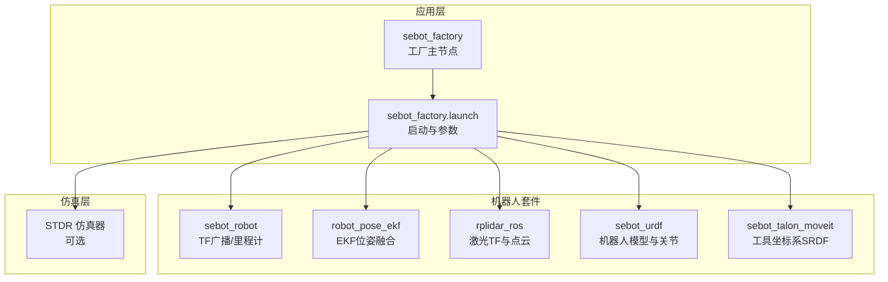
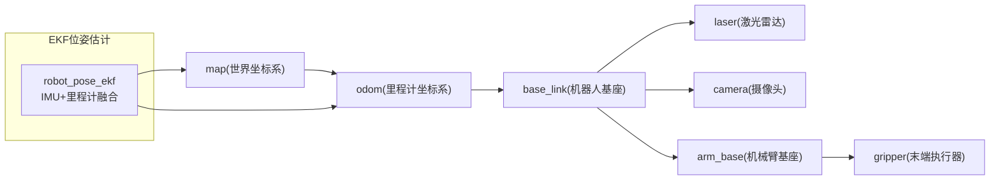
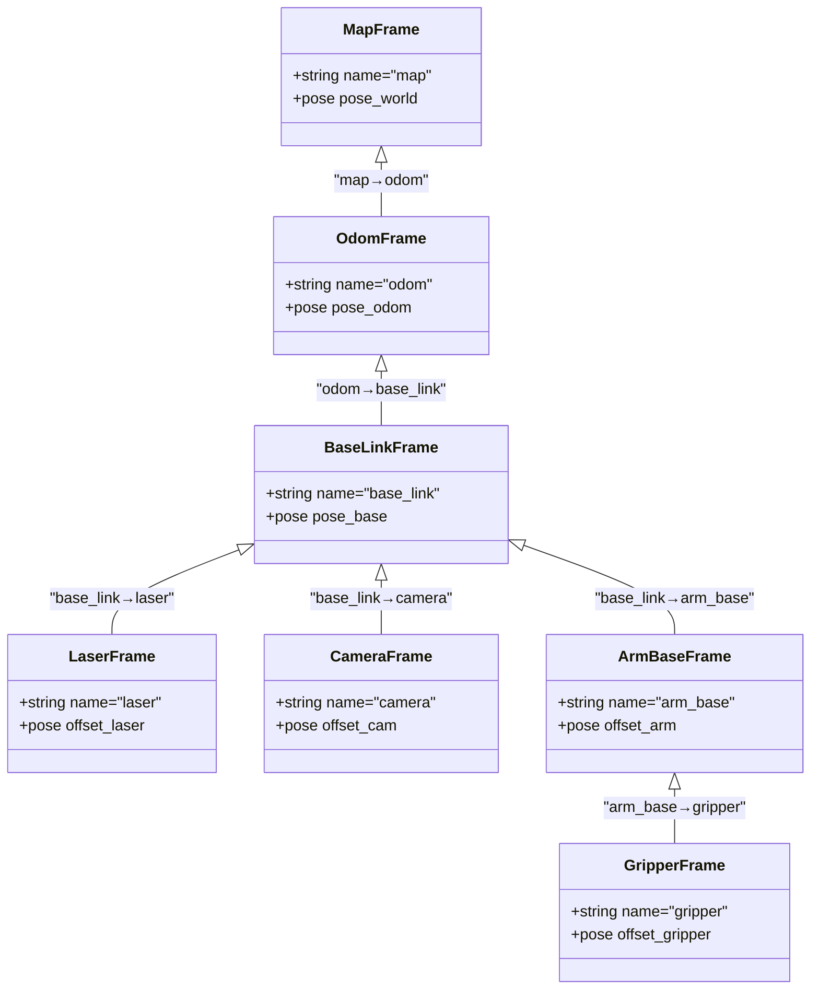
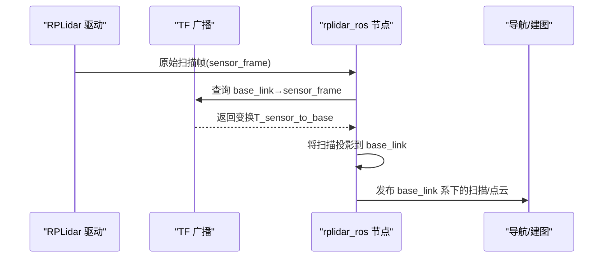
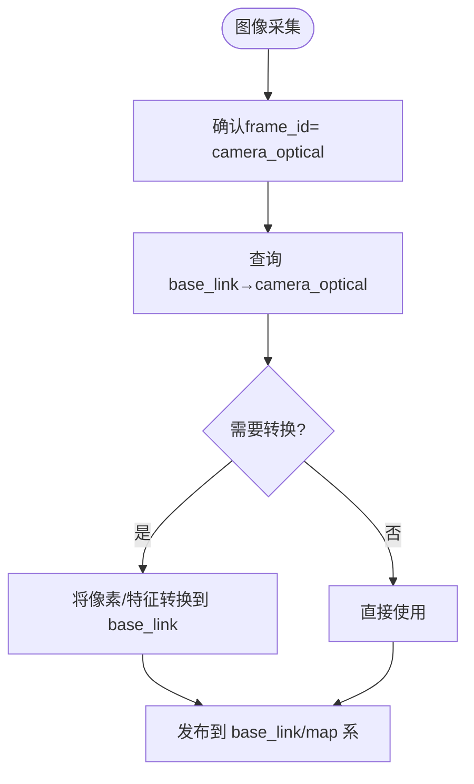
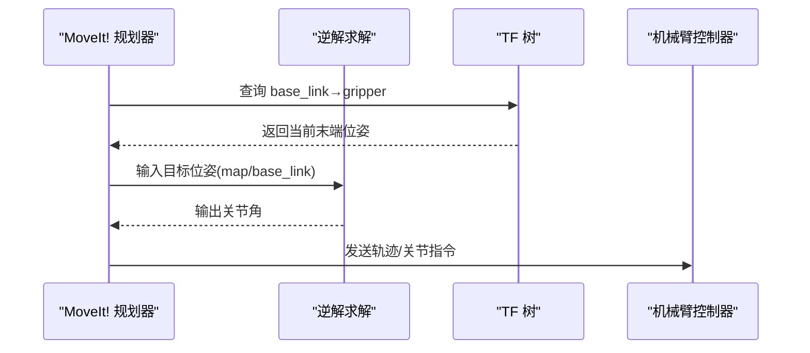
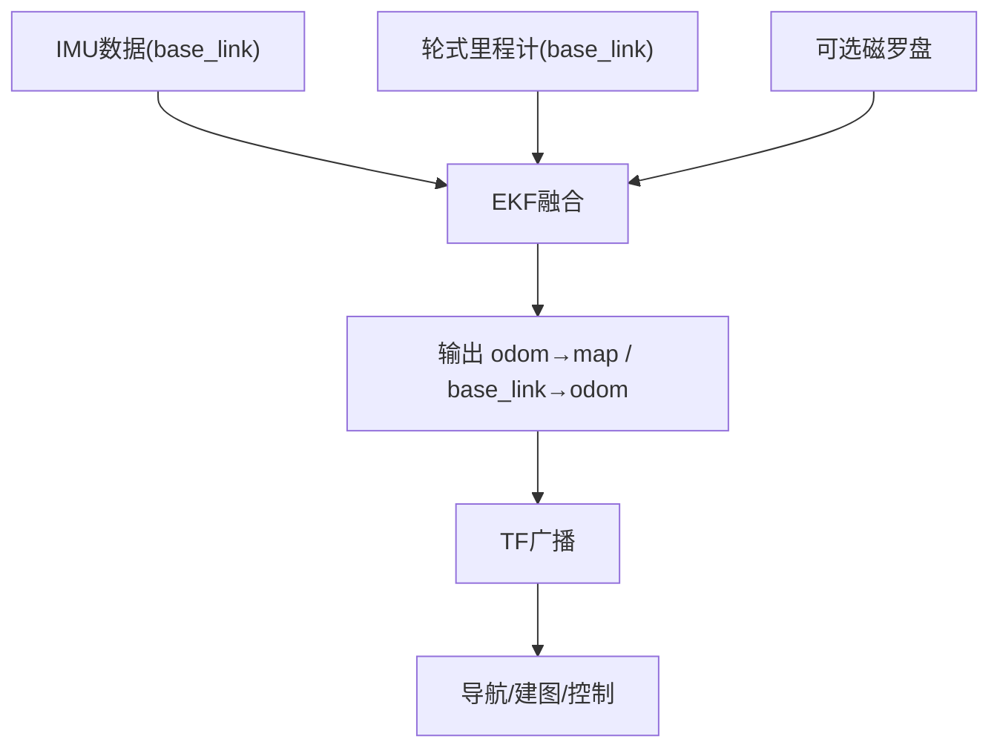
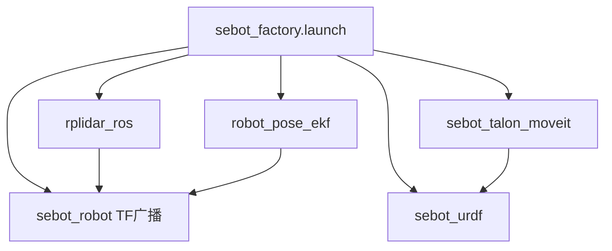

# 坐标系管理

<cite>
**本文引用的文件**   
- [sebot_robot/transform.cpp](file://sebot_ros_kits/src/sebot_robot/src/transform.cpp)
- [sebot_robot/sebot_transform.launch](file://sebot_ros_kits/src/sebot_robot/launch/sebot_transform.launch)
- [robot_pose_ekf/odom_estimation_node.cpp](file://sebot_ros_kits/src/sebot_driver/robot_pose_ekf/src/odom_estimation_node.cpp)
- [robot_pose_ekf/odom_estimation.h](file://sebot_ros_kits/src/sebot_driver/robot_pose_ekf/include/robot_pose_ekf/odom_estimation.h)
- [rplidar_ros/node.cpp](file://sebot_ros_kits/src/sebot_driver/rplidar_ros/src/node.cpp)
- [sebot_urdf.urdf](file://sebot_ros_kits/src/sebot_driver/sebot_urdf/urdf/sebot_urdf.urdf)
- [sebot_talon_moveit.srdf](file://sebot_ros_kits/src/sebot_driver/sebot_talon_moveit/config/sebot_talon.srdf)
- [sebot_factory.launch](file://sebot_factory/src/sebot_factory/launch/sebot_factory.launch)
- [factory.cpp](file://sebot_factory/src/sebot_factory/src/factory.cpp)
</cite>

## 目录
1. [简介](#简介)
2. [项目结构](#项目结构)
3. [核心组件](#核心组件)
4. [架构总览](#架构总览)
5. [详细组件分析](#详细组件分析)
6. [依赖关系分析](#依赖关系分析)
7. [性能考虑](#性能考虑)
8. [故障排查指南](#故障排查指南)
9. [结论](#结论)
10. [附录](#附录)

## 简介
本文件面向ROS坐标系变换（TF）系统，围绕世界坐标系、机器人基座坐标系、传感器坐标系与工具坐标系的层次结构进行系统化说明。文档重点覆盖：
- 激光雷达、摄像头、机械臂末端执行器的坐标变换链
- EKF姿态估计中多传感器数据的坐标对齐
- 坐标系关系图与变换矩阵计算示例
- 新传感器集成的坐标配置指导

本项目由三层catkin工作空间组成：应用层 sebot_factory、机器人套件 sebot_ros_kits、仿真层 sebot_ros_stdr。TF相关实现集中在 sebot_ros_kits 的驱动与导航栈中，业务逻辑在 sebot_factory 中通过launch与参数驱动集成。

## 项目结构
与TF体系直接相关的代码与配置主要分布在以下包：
- sebot_robot：发布底盘里程计与TF广播，提供 sebot_transform.launch
- robot_pose_ekf：EKF融合IMU、轮式里程计等，输出统一位姿到 odom/map
- rplidar_ros：将激光数据从 sensor_frame 转换至 base_link/map
- sebot_urdf：定义机器人各关节与固定连杆的URDF树，确定 base_link 与各传感器/工具的相对位姿
- sebot_talon_moveit：MoveIt! SRDF 定义工具坐标系（如 gripper）与 base_link 的关系
- sebot_factory：顶层launch与业务节点，负责启动顺序、参数加载与状态机

图表来源
- [sebot_factory.launch](file://sebot_factory/src/sebot_factory/launch/sebot_factory.launch)
- [sebot_robot/sebot_transform.launch](file://sebot_ros_kits/src/sebot_robot/launch/sebot_transform.launch)
- [robot_pose_ekf/odom_estimation_node.cpp](file://sebot_ros_kits/src/sebot_driver/robot_pose_ekf/src/odom_estimation_node.cpp)
- [rplidar_ros/node.cpp](file://sebot_ros_kits/src/sebot_driver/rplidar_ros/src/node.cpp)
- [sebot_urdf.urdf](file://sebot_ros_kits/src/sebot_driver/sebot_urdf/urdf/sebot_urdf.urdf)
- [sebot_talon_moveit.srdf](file://sebot_ros_kits/src/sebot_driver/sebot_talon_moveit/config/sebot_talon.srdf)

章节来源
- [sebot_factory.launch](file://sebot_factory/src/sebot_factory/launch/sebot_factory.launch)
- [sebot_robot/sebot_transform.launch](file://sebot_ros_kits/src/sebot_robot/launch/sebot_transform.launch)

## 核心组件
- TF广播与监听：sebot_robot 负责发布 base_link→odom 或 map→base_link 的静态/动态变换；rplidar_ros 发布 sensor→base_link 的静态变换；move_group 根据 SRDF 维护 tool frame。
- EKF位姿估计：robot_pose_ekf 订阅 IMU、轮式里程计等，输出统一的 odom 或 map 位姿，供导航与感知使用。
- URDF/SRDF：sebot_urdf 定义 base_link 与各传感器/关节的固定关系；sebot_talon_moveit 定义 gripper/tool 与 base_link 的关系，供 MoveIt! 使用。
- 启动与参数：sebot_factory.launch 统一启动上述节点并注入关键参数（如 simulation、debug、超时、PID、补扫等）。

章节来源
- [sebot_robot/src/transform.cpp](file://sebot_ros_kits/src/sebot_robot/src/transform.cpp)
- [sebot_ros_kits/src/sebot_driver/robot_pose_ekf/src/odom_estimation_node.cpp](file://sebot_ros_kits/src/sebot_driver/robot_pose_ekf/src/odom_estimation_node.cpp)
- [sebot_ros_kits/src/sebot_driver/rplidar_ros/src/node.cpp](file://sebot_ros_kits/src/sebot_driver/rplidar_ros/src/node.cpp)
- [sebot_ros_kits/src/sebot_driver/sebot_urdf/urdf/sebot_urdf.urdf](file://sebot_ros_kits/src/sebot_driver/sebot_urdf/urdf/sebot_urdf.urdf)
- [sebot_ros_kits/src/sebot_driver/sebot_talon_moveit/config/sebot_talon.srdf](file://sebot_ros_kits/src/sebot_driver/sebot_talon_moveit/config/sebot_talon.srdf)
- [sebot_factory/src/sebot_factory/launch/sebot_factory.launch](file://sebot_factory/src/sebot_factory/launch/sebot_factory.launch)

## 架构总览
下图展示TF树与数据流：map→odom→base_link→各传感器/工具，EKF融合输出统一位姿，激光/视觉/机械臂均基于该树完成坐标对齐。

图表来源
- [sebot_robot/src/transform.cpp](file://sebot_ros_kits/src/sebot_robot/src/transform.cpp)
- [sebot_ros_kits/src/sebot_driver/robot_pose_ekf/src/odom_estimation_node.cpp](file://sebot_ros_kits/src/sebot_driver/robot_pose_ekf/src/odom_estimation_node.cpp)
- [sebot_ros_kits/src/sebot_driver/rplidar_ros/src/node.cpp](file://sebot_ros_kits/src/sebot_driver/rplidar_ros/src/node.cpp)
- [sebot_ros_kits/src/sebot_driver/sebot_urdf/urdf/sebot_urdf.urdf](file://sebot_ros_kits/src/sebot_driver/sebot_urdf/urdf/sebot_urdf.urdf)
- [sebot_ros_kits/src/sebot_driver/sebot_talon_moveit/config/sebot_talon.srdf](file://sebot_ros_kits/src/sebot_driver/sebot_talon_moveit/config/sebot_talon.srdf)

## 详细组件分析

### 坐标系层次与TF树
- 世界坐标系 map：全局地图参考系，AMCL/建图输出在此系下。
- 里程计坐标系 odom：局部运动学参考系，EKF输出常为 odom→map 或 base_link→odom。
- 机器人基座 base_link：机器人本体参考系，所有传感器与关节相对其安装。
- 传感器坐标系：
  - laser：激光雷达中心，通常沿X轴朝前，Z轴向上。
  - camera：相机光心，通常X右、Y下、Z前（OpenCV约定），需与ROS标准一致。
- 工具坐标系：
  - arm_base/gripper：机械臂基座与夹爪，随关节运动变化。

图表来源
- [sebot_ros_kits/src/sebot_driver/sebot_urdf/urdf/sebot_urdf.urdf](file://sebot_ros_kits/src/sebot_driver/sebot_urdf/urdf/sebot_urdf.urdf)
- [sebot_ros_kits/src/sebot_driver/sebot_talon_moveit/config/sebot_talon.srdf](file://sebot_ros_kits/src/sebot_driver/sebot_talon_moveit/config/sebot_talon.srdf)

章节来源
- [sebot_ros_kits/src/sebot_driver/sebot_urdf/urdf/sebot_urdf.urdf](file://sebot_ros_kits/src/sebot_driver/sebot_urdf/urdf/sebot_urdf.urdf)
- [sebot_ros_kits/src/sebot_driver/sebot_talon_moveit/config/sebot_talon.srdf](file://sebot_ros_kits/src/sebot_driver/sebot_talon_moveit/config/sebot_talon.srdf)

### 激光雷达坐标变换链
- 数据路径：sensor_frame(laser) → base_link → odom/map
- 关键点：
  - rplidar_ros 发布 laser→base_link 的静态TF（安装偏移与朝向）
  - transform.cpp 或 EKF 输出 base_link→odom 或 map→base_link
  - 点云/扫描在 base_link 系下进行配准与代价地图构建

图表来源
- [sebot_ros_kits/src/sebot_driver/rplidar_ros/src/node.cpp](file://sebot_ros_kits/src/sebot_driver/rplidar_ros/src/node.cpp)
- [sebot_ros_kits/src/sebot_driver/sebot_urdf/urdf/sebot_urdf.urdf](file://sebot_ros_kits/src/sebot_driver/sebot_urdf/urdf/sebot_urdf.urdf)

章节来源
- [sebot_ros_kits/src/sebot_driver/rplidar_ros/src/node.cpp](file://sebot_ros_kits/src/sebot_driver/rplidar_ros/src/node.cpp)

### 摄像头坐标变换链
- 数据路径：camera_optical → base_link → odom/map
- 关键点：
  - 相机光学坐标系需与ROS标准一致（X右、Y下、Z前）
  - 若标定板/外参给出的是 camera_link→base_link，则需在TF树中补充 camera_optical→camera_link 的旋转（通常为Z轴翻转）
  - 视觉算法通常在 camera_optical 系处理，结果再回转到 base_link/map

章节来源
- [sebot_ros_kits/src/sebot_driver/sebot_urdf/urdf/sebot_urdf.urdf](file://sebot_ros_kits/src/sebot_driver/sebot_urdf/urdf/sebot_urdf.urdf)

### 机械臂末端执行器坐标变换链
- 数据路径：gripper → arm_base → base_link → odom/map
- 关键点：
  - SRDF 定义 gripper 与 arm_base/base_link 的初始关系
  - MoveIt! 根据关节状态实时计算末端位姿
  - 抓取任务需在 base_link 或 map 系下发目标，再由逆解得到关节指令

图表来源
- [sebot_ros_kits/src/sebot_driver/sebot_talon_moveit/config/sebot_talon.srdf](file://sebot_ros_kits/src/sebot_driver/sebot_talon_moveit/config/sebot_talon.srdf)

章节来源
- [sebot_ros_kits/src/sebot_driver/sebot_talon_moveit/config/sebot_talon.srdf](file://sebot_ros_kits/src/sebot_driver/sebot_talon_moveit/config/sebot_talon.srdf)

### EKF姿态估计中的多传感器坐标对齐
- 输入源：IMU（加速度/角速度）、轮式里程计、可选磁罗盘
- 输出：统一的 odom→map 或 base_link→odom 位姿
- 对齐要点：
  - IMU 的 frame_id 必须与 base_link 一致或可查TF
  - 里程计的 frame_id 应为 base_link，且时间戳与TF同步
  - EKF 内部对噪声协方差与观测频率进行加权融合

图表来源
- [sebot_ros_kits/src/sebot_driver/robot_pose_ekf/src/odom_estimation_node.cpp](file://sebot_ros_kits/src/sebot_driver/robot_pose_ekf/src/odom_estimation_node.cpp)
- [sebot_ros_kits/src/sebot_driver/robot_pose_ekf/include/robot_pose_ekf/odom_estimation.h](file://sebot_ros_kits/src/sebot_driver/robot_pose_ekf/include/robot_pose_ekf/odom_estimation.h)

章节来源
- [sebot_ros_kits/src/sebot_driver/robot_pose_ekf/src/odom_estimation_node.cpp](file://sebot_ros_kits/src/sebot_driver/robot_pose_ekf/src/odom_estimation_node.cpp)
- [sebot_ros_kits/src/sebot_driver/robot_pose_ekf/include/robot_pose_ekf/odom_estimation.h](file://sebot_ros_kits/src/sebot_driver/robot_pose_ekf/include/robot_pose_ekf/odom_estimation.h)

### 变换矩阵计算示例（概念性）
- 已知：
  - T_map_odom：map→odom 的齐次变换矩阵
  - T_odom_base：odom→base_link 的齐次变换矩阵
  - T_base_laser：base_link→laser 的固定安装矩阵
- 求：T_map_laser = T_map_odom × T_odom_base × T_base_laser
- 注意：
  - 乘法规则为左乘（按坐标系链从右到左组合）
  - 时间戳需对齐，必要时做插值
  - 方向与单位制需一致（弧度、米）

章节来源
- [sebot_ros_kits/src/sebot_driver/rplidar_ros/src/node.cpp](file://sebot_ros_kits/src/sebot_driver/rplidar_ros/src/node.cpp)
- [sebot_ros_kits/src/sebot_driver/robot_pose_ekf/src/odom_estimation_node.cpp](file://sebot_ros_kits/src/sebot_driver/robot_pose_ekf/src/odom_estimation_node.cpp)

### 新传感器集成的坐标配置指导
- 步骤：
  1) 在 URDF 中添加 link/joint，定义 sensor→base_link 的固定位姿（平移与四元数/欧拉角）
  2) 确保传感器驱动发布的 frame_id 与 URDF 一致
  3) 若存在光学坐标系（如相机），补充 optical→link 的旋转
  4) 检查 TF 树：rosrun tf view_frames 验证链路完整无环
  5) 在 launch 中加载参数，确保时间同步与频率合理
- 常见错误：
  - frame_id 不一致导致无法查询TF
  - 安装方向错误（如Z轴朝上/朝下混淆）
  - 时间戳不同步导致变换抖动

章节来源
- [sebot_ros_kits/src/sebot_driver/sebot_urdf/urdf/sebot_urdf.urdf](file://sebot_ros_kits/src/sebot_driver/sebot_urdf/urdf/sebot_urdf.urdf)
- [sebot_factory/src/sebot_factory/launch/sebot_factory.launch](file://sebot_factory/src/sebot_factory/launch/sebot_factory.launch)

## 依赖关系分析
- 启动依赖：sebot_factory.launch 启动 sebot_robot、robot_pose_ekf、rplidar_ros、URDF 与 MoveIt! 相关节点
- 运行时依赖：
  - rplidar_ros 依赖 TF 树（sensor→base_link）
  - robot_pose_ekf 依赖 IMU/里程计消息与TF一致性
  - MoveIt! 依赖 SRDF 定义的 tool frame
- 潜在循环：避免重复定义同一TF或错误的父子关系

图表来源
- [sebot_factory/src/sebot_factory/launch/sebot_factory.launch](file://sebot_factory/src/sebot_factory/launch/sebot_factory.launch)
- [sebot_ros_kits/src/sebot_robot/launch/sebot_transform.launch](file://sebot_ros_kits/src/sebot_robot/launch/sebot_transform.launch)

章节来源
- [sebot_factory/src/sebot_factory/launch/sebot_factory.launch](file://sebot_factory/src/sebot_factory/launch/sebot_factory.launch)
- [sebot_ros_kits/src/sebot_robot/launch/sebot_transform.launch](file://sebot_ros_kits/src/sebot_robot/launch/sebot_transform.launch)

## 性能考虑
- TF广播频率：建议≥10Hz，避免下游订阅者延迟
- 时间同步：确保IMU、里程计、激光的时间戳接近，必要时启用时钟同步
- 变换缓存：合理使用tf_buffer，减少频繁查询开销
- 滤波与降采样：对高频IMU或点云进行适当滤波，降低CPU占用

## 故障排查指南
- 症状：rviz中TF树断裂或报错
  - 排查：检查各驱动frame_id与URDF是否一致；查看 rosbag 回放时TF是否稳定
- 症状：激光点云漂移或错位
  - 排查：确认laser→base_link安装参数；检查EKF输出的odom/map位姿是否异常
- 症状：机械臂抓取偏差
  - 排查：核对gripper与base_link的SRDF定义；检查逆解与末端标定
- 症状：EKF发散
  - 排查：调整IMU/里程计噪声协方差；检查传感器频率与时间戳

章节来源
- [sebot_ros_kits/src/sebot_driver/robot_pose_ekf/src/odom_estimation_node.cpp](file://sebot_ros_kits/src/sebot_driver/robot_pose_ekf/src/odom_estimation_node.cpp)
- [sebot_ros_kits/src/sebot_driver/rplidar_ros/src/node.cpp](file://sebot_ros_kits/src/sebot_driver/rplidar_ros/src/node.cpp)
- [sebot_ros_kits/src/sebot_driver/sebot_urdf/urdf/sebot_urdf.urdf](file://sebot_ros_kits/src/sebot_driver/sebot_urdf/urdf/sebot_urdf.urdf)
- [sebot_ros_kits/src/sebot_driver/sebot_talon_moveit/config/sebot_talon.srdf](file://sebot_ros_kits/src/sebot_driver/sebot_talon_moveit/config/sebot_talon.srdf)

## 结论
通过清晰的TF树与严格的坐标对齐，本项目实现了激光、视觉与机械臂在多传感器环境下的协同。EKF融合提供稳定的位姿基准，URDF/SRDF保证几何一致性，launch统一管理启动与参数。新增传感器应遵循“先定frame、再校TF、后验数据”的流程，确保系统鲁棒性与可维护性。

## 附录
- 常用命令：
  - rosrun tf view_frames：生成TF树PDF
  - rosrun tf tf_monitor：查看TF延迟与频率
  - rostopic echo /tf：查看变换消息
- 关键参数位置：
  - sebot_factory.launch：simulation、debug、导航超时、PID、取件距离、补扫等
  - sebot_transform.launch：TF广播频率与topic映射
  - robot_pose_ekf：IMU/里程计权重与协方差

章节来源
- [sebot_factory/src/sebot_factory/launch/sebot_factory.launch](file://sebot_factory/src/sebot_factory/launch/sebot_factory.launch)
- [sebot_factory/src/sebot_factory/src/factory.cpp](file://sebot_factory/src/sebot_factory/src/factory.cpp)
- [sebot_ros_kits/src/sebot_robot/launch/sebot_transform.launch](file://sebot_ros_kits/src/sebot_robot/launch/sebot_transform.launch)