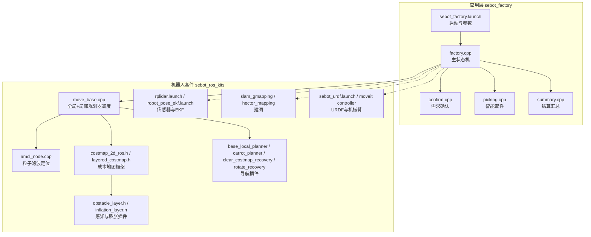
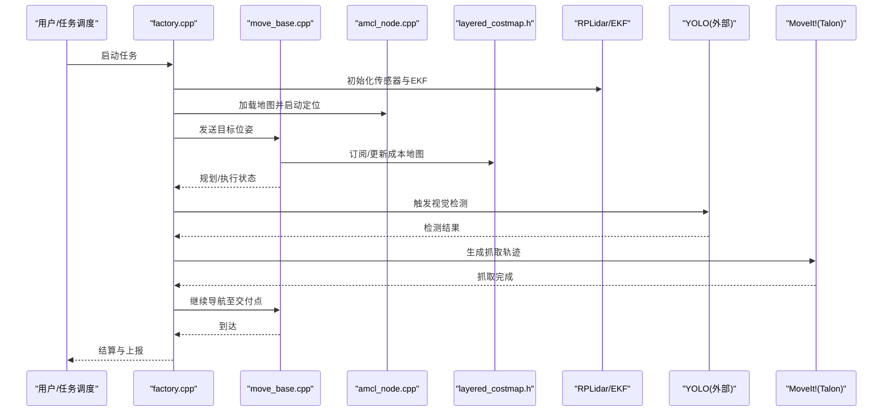
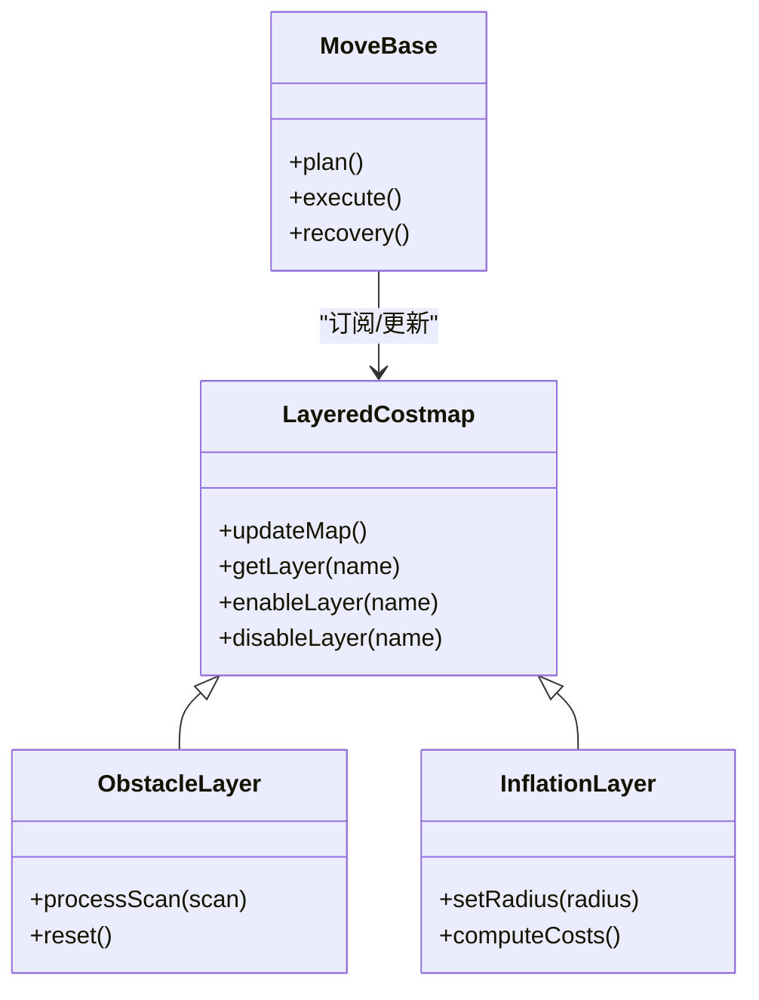
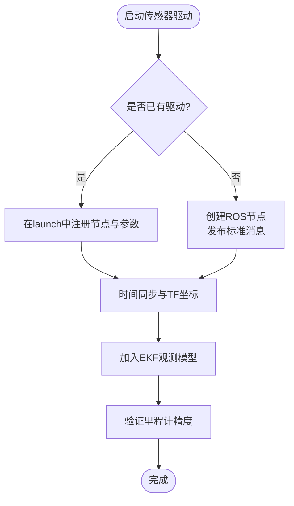
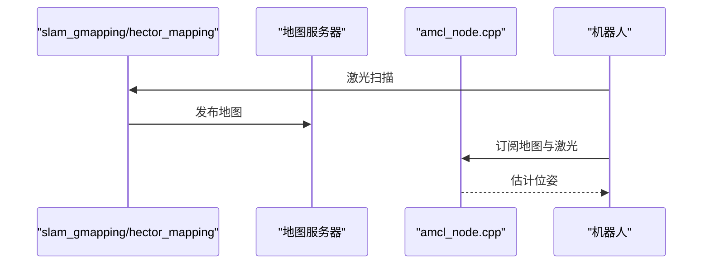
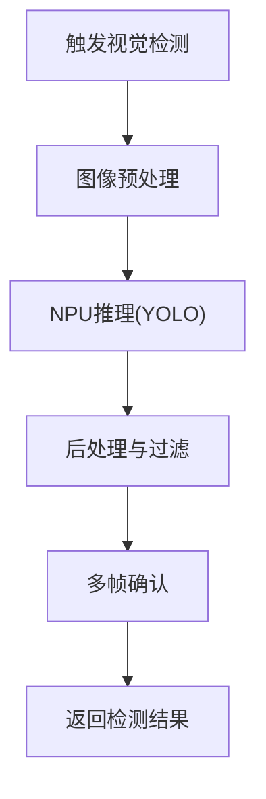
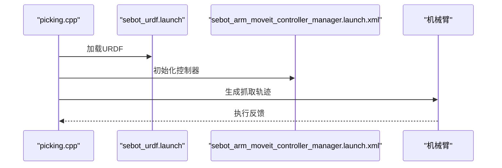
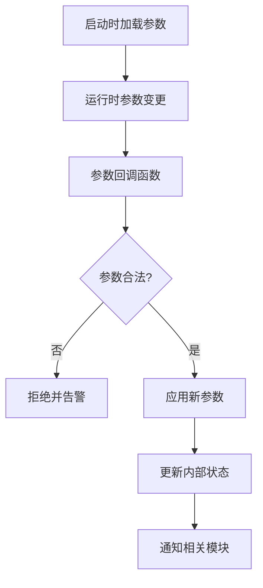
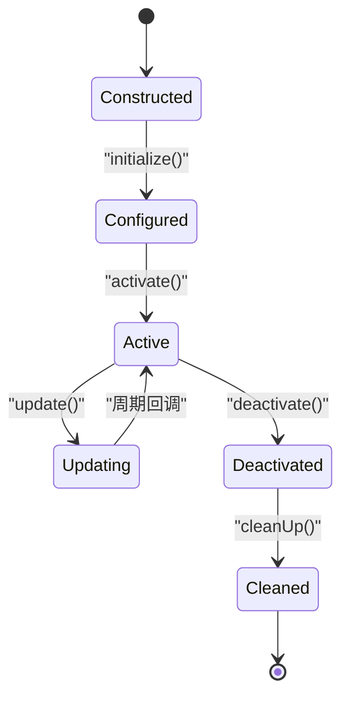
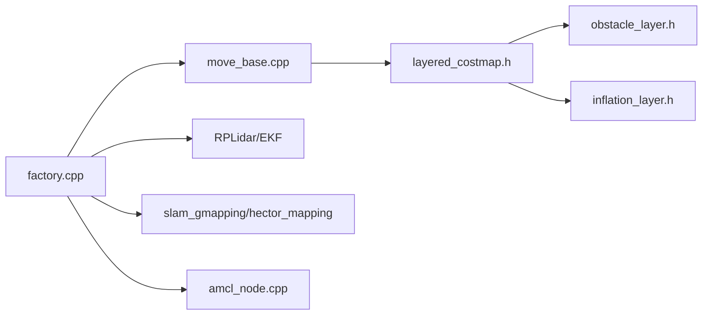

# 扩展机制

<cite>
**本文引用的文件**   
- [factory.cpp](file://sebot_factory/src/sebot_factory/src/factory.cpp)
- [confirm.cpp](file://sebot_factory/src/sebot_factory/src/confirm.cpp)
- [picking.cpp](file://sebot_factory/src/sebot_factory/src/picking.cpp)
- [summary.cpp](file://sebot_factory/src/sebot_factory/src/summary.cpp)
- [sebot_factory.launch](file://sebot_factory/src/sebot_factory/launch/sebot_factory.launch)
- [CMakeLists.txt](file://sebot_factory/src/sebot_factory/CMakeLists.txt)
- [package.xml](file://sebot_factory/src/sebot_factory/package.xml)
- [amcl_node.cpp](file://sebot_ros_kits/src/sebot_navigation/amcl/src/amcl_node.cpp)
- [move_base.cpp](file://sebot_ros_kits/src/sebot_navigation/move_base/src/move_base.cpp)
- [costmap_2d_ros.h](file://sebot_ros_kits/src/sebot_navigation/costmap_2d/include/costmap_2d/costmap_2d_ros.h)
- [layered_costmap.h](file://sebot_ros_kits/src/sebot_navigation/costmap_2d/include/costmap_2d/layered_costmap.h)
- [obstacle_layer.h](file://sebot_ros_kits/src/sebot_navigation/costmap_2d/include/costmap_2d/obstacle_layer.h)
- [inflation_layer.h](file://sebot_ros_kits/src/sebot_navigation/costmap_2d/include/costmap_2d/inflation_layer.h)
- [blp_plugin.xml](file://sebot_ros_kits/src/sebot_navigation/base_local_planner/blp_plugin.xml)
- [bgp_plugin.xml](file://sebot_ros_kits/src/sebot_navigation/carrot_planner/bgp_plugin.xml)
- [ccr_plugin.xml](file://sebot_ros_kits/src/sebot_navigation/clear_costmap_recovery/ccr_plugin.xml)
- [rotate_plugin.xml](file://sebot_ros_kits/src/sebot_navigation/rotate_recovery/rotate_plugin.xml)
- [robot_pose_ekf.launch](file://sebot_ros_kits/src/sebot_driver/robot_pose_ekf/launch/robot_pose_ekf.launch)
- [rplidar.launch](file://sebot_ros_kits/src/sebot_driver/rplidar_ros/launch/rplidar.launch)
- [slam_gmapping.launch](file://sebot_ros_kits/src/sebot_slam/slam_gmapping/slam_gmapping/launch/slam_gmapping.launch)
- [hector_mapping.launch](file://sebot_ros_kits/src/sebot_slam/slam_hector/hector_mapping/launch/hector_mapping.launch)
- [sebot_urdf.launch](file://sebot_ros_kits/src/sebot_driver/sebot_urdf/launch/sebot_urdf.launch)
- [sebot_arm_moveit_controller_manager.launch.xml](file://sebot_ros_kits/src/sebot_driver/sebot_talon_moveit/launch/sebot_arm_moveit_controller_manager.launch.xml)
- [qnode.hpp](file://sebot_factory/src/sebot_marking/include/qnode.hpp)
- [main.cpp](file://sebot_factory/src/sebot_marking/src/main.cpp)
- [controller.cpp](file://sebot_ros_kits/src/sebot_robot/src/controller.cpp)
- [transform.cpp](file://sebot_ros_kits/src/sebot_robot/src/transform.cpp)
</cite>

## 目录
1. [简介](#简介)
2. [项目结构](#项目结构)
3. [核心组件](#核心组件)
4. [架构总览](#架构总览)
5. [详细组件分析](#详细组件分析)
6. [依赖关系分析](#依赖关系分析)
7. [性能考虑](#性能考虑)
8. [故障排查指南](#故障排查指南)
9. [结论](#结论)
10. [附录](#附录)

## 简介
本文件面向“系统扩展机制”，聚焦于 ROS 插件体系在本项目中的使用方式与最佳实践，覆盖动态库加载、接口定义、生命周期管理；并给出如何添加新的传感器驱动、导航算法、视觉处理模块的完整路径。同时说明配置文件热重载与参数动态调整方法，提供插件开发模板与调试手段，以及性能优化与内存管理建议。

本项目由三个相互独立的 catkin 工作空间组成：应用层 sebot_factory、机器人套件 sebot_ros_kits、仿真层 sebot_ros_stdr。文档以 sebot_factory 的业务状态机为核心，结合 sebot_ros_kits 中的导航栈、传感器驱动与 SLAM 包，构建可扩展、可插拔的系统架构。

## 项目结构
- 三层工作空间
  - sebot_factory：业务主流程（订单、确认、取件、结算）与 Qt 标注工具
  - sebot_ros_kits：ROS 官方/开源导航栈、传感器驱动、SLAM、MoveIt! 集成
  - sebot_ros_stdr：STDR 仿真环境及示例
- 关键入口与配置
  - 启动入口：sebot_factory.launch（含 simulation、debug 等开关）
  - 业务节点：factory.cpp（主状态机）、confirm.cpp、picking.cpp、summary.cpp
  - 导航栈：move_base + AMCL + DWA，成本地图分层插件化
  - 传感器：RPLidar、IMU、里程计 EKF 融合
  - 机械臂：MoveIt!（Talon）

图表来源
- [sebot_factory.launch](file://sebot_factory/src/sebot_factory/launch/sebot_factory.launch)
- [factory.cpp](file://sebot_factory/src/sebot_factory/src/factory.cpp)
- [move_base.cpp](file://sebot_ros_kits/src/sebot_navigation/move_base/src/move_base.cpp)
- [amcl_node.cpp](file://sebot_ros_kits/src/sebot_navigation/amcl/src/amcl_node.cpp)
- [costmap_2d_ros.h](file://sebot_ros_kits/src/sebot_navigation/costmap_2d/include/costmap_2d/costmap_2d_ros.h)
- [layered_costmap.h](file://sebot_ros_kits/src/sebot_navigation/costmap_2d/include/costmap_2d/layered_costmap.h)
- [obstacle_layer.h](file://sebot_ros_kits/src/sebot_navigation/costmap_2d/include/costmap_2d/obstacle_layer.h)
- [inflation_layer.h](file://sebot_ros_kits/src/sebot_navigation/costmap_2d/include/costmap_2d/inflation_layer.h)
- [blp_plugin.xml](file://sebot_ros_kits/src/sebot_navigation/base_local_planner/blp_plugin.xml)
- [bgp_plugin.xml](file://sebot_ros_kits/src/sebot_navigation/carrot_planner/bgp_plugin.xml)
- [ccr_plugin.xml](file://sebot_ros_kits/src/sebot_navigation/clear_costmap_recovery/ccr_plugin.xml)
- [rotate_plugin.xml](file://sebot_ros_kits/src/sebot_navigation/rotate_recovery/rotate_plugin.xml)
- [rplidar.launch](file://sebot_ros_kits/src/sebot_driver/rplidar_ros/launch/rplidar.launch)
- [robot_pose_ekf.launch](file://sebot_ros_kits/src/sebot_driver/robot_pose_ekf/launch/robot_pose_ekf.launch)
- [slam_gmapping.launch](file://sebot_ros_kits/src/sebot_slam/slam_gmapping/slam_gmapping/launch/slam_gmapping.launch)
- [hector_mapping.launch](file://sebot_ros_kits/src/sebot_slam/slam_hector/hector_mapping/launch/hector_mapping.launch)
- [sebot_urdf.launch](file://sebot_ros_kits/src/sebot_driver/sebot_urdf/launch/sebot_urdf.launch)
- [sebot_arm_moveit_controller_manager.launch.xml](file://sebot_ros_kits/src/sebot_driver/sebot_talon_moveit/launch/sebot_arm_moveit_controller_manager.launch.xml)

章节来源
- [sebot_factory.launch](file://sebot_factory/src/sebot_factory/launch/sebot_factory.launch)
- [factory.cpp](file://sebot_factory/src/sebot_factory/src/factory.cpp)
- [CMakeLists.txt](file://sebot_factory/src/sebot_factory/CMakeLists.txt)
- [package.xml](file://sebot_factory/src/sebot_factory/package.xml)

## 核心组件
- 业务主状态机（factory.cpp）
  - 负责上电自检、加载地图与定位、按订单导航至取件台、需求确认、YOLO 视觉搜索、机械臂抓取、送达与结算的全链路编排
  - 通过 ROS 参数与服务/动作接口与导航栈、传感器、视觉、机械臂交互
- 需求确认（confirm.cpp）
  - 与上层任务或用户交互，校验订单信息与环境条件
- 智能取件（picking.cpp）
  - 协调视觉检测与机械臂控制，完成闭环抓取
- 结算汇总（summary.cpp）
  - 统计与上报任务结果，写入日志/数据库

章节来源
- [factory.cpp](file://sebot_factory/src/sebot_factory/src/factory.cpp)
- [confirm.cpp](file://sebot_factory/src/sebot_factory/src/confirm.cpp)
- [picking.cpp](file://sebot_factory/src/sebot_factory/src/picking.cpp)
- [summary.cpp](file://sebot_factory/src/sebot_factory/src/summary.cpp)

## 架构总览
- 插件式导航栈
  - move_base 作为调度中心，通过 XML 插件声明加载全局/局部规划器与恢复行为
  - costmap_2d 采用分层架构，支持障碍物层、静态层、膨胀层等插件组合
- 传感器与定位
  - RPLidar 提供激光扫描，IMU 与轮速计经 EKF 融合输出里程计
  - AMCL 基于激光与地图进行粒子滤波定位
- 建图与可视化
  - Gmapping/Hector 提供 SLAM 建图能力
  - MoveIt! 管理 URDF 模型与机械臂轨迹规划
- 启动与参数
  - sebot_factory.launch 统一装配各子系统，提供 simulation/debug 等运行开关与关键参数

图表来源
- [factory.cpp](file://sebot_factory/src/sebot_factory/src/factory.cpp)
- [move_base.cpp](file://sebot_ros_kits/src/sebot_navigation/move_base/src/move_base.cpp)
- [amcl_node.cpp](file://sebot_ros_kits/src/sebot_navigation/amcl/src/amcl_node.cpp)
- [layered_costmap.h](file://sebot_ros_kits/src/sebot_navigation/costmap_2d/include/costmap_2d/layered_costmap.h)
- [rplidar.launch](file://sebot_ros_kits/src/sebot_driver/rplidar_ros/launch/rplidar.launch)
- [robot_pose_ekf.launch](file://sebot_ros_kits/src/sebot_driver/robot_pose_ekf/launch/robot_pose_ekf.launch)
- [sebot_arm_moveit_controller_manager.launch.xml](file://sebot_ros_kits/src/sebot_driver/sebot_talon_moveit/launch/sebot_arm_moveit_controller_manager.launch.xml)

## 详细组件分析

### 导航栈插件体系（move_base + costmap_2d）
- 插件声明与加载
  - 全局规划器：carrot_planner（bgp_plugin.xml）
  - 局部规划器：base_local_planner（blp_plugin.xml）
  - 恢复行为：clear_costmap_recovery（ccr_plugin.xml）、rotate_recovery（rotate_plugin.xml）
- 成本地图分层
  - layered_costmap 维护多图层，obstacle_layer 注入激光数据，inflation_layer 生成代价场
  - costmap_2d_ros 提供 ROS 服务/参数接口，便于运行时调整

图表来源
- [layered_costmap.h](file://sebot_ros_kits/src/sebot_navigation/costmap_2d/include/costmap_2d/layered_costmap.h)
- [obstacle_layer.h](file://sebot_ros_kits/src/sebot_navigation/costmap_2d/include/costmap_2d/obstacle_layer.h)
- [inflation_layer.h](file://sebot_ros_kits/src/sebot_navigation/costmap_2d/include/costmap_2d/inflation_layer.h)
- [move_base.cpp](file://sebot_ros_kits/src/sebot_navigation/move_base/src/move_base.cpp)

章节来源
- [blp_plugin.xml](file://sebot_ros_kits/src/sebot_navigation/base_local_planner/blp_plugin.xml)
- [bgp_plugin.xml](file://sebot_ros_kits/src/sebot_navigation/carrot_planner/bgp_plugin.xml)
- [ccr_plugin.xml](file://sebot_ros_kits/src/sebot_navigation/clear_costmap_recovery/ccr_plugin.xml)
- [rotate_plugin.xml](file://sebot_ros_kits/src/sebot_navigation/rotate_recovery/rotate_plugin.xml)
- [costmap_2d_ros.h](file://sebot_ros_kits/src/sebot_navigation/costmap_2d/include/costmap_2d/costmap_2d_ros.h)
- [layered_costmap.h](file://sebot_ros_kits/src/sebot_navigation/costmap_2d/include/costmap_2d/layered_costmap.h)
- [obstacle_layer.h](file://sebot_ros_kits/src/sebot_navigation/costmap_2d/include/costmap_2d/obstacle_layer.h)
- [inflation_layer.h](file://sebot_ros_kits/src/sebot_navigation/costmap_2d/include/costmap_2d/inflation_layer.h)
- [move_base.cpp](file://sebot_ros_kits/src/sebot_navigation/move_base/src/move_base.cpp)

### 传感器驱动扩展（RPLidar + IMU + EKF）
- 传感器接入
  - RPLidar 通过 rplidar.launch 启动，发布激光扫描话题
  - IMU 与轮速计经 robot_pose_ekf 融合为里程计
- 扩展新传感器驱动
  - 遵循 ROS 标准消息类型（sensor_msgs/LaserScan、sensor_msgs/Imu 等）
  - 在 launch 中声明节点与参数，确保时间同步与坐标系正确
  - 将新数据源加入 EKF 配置，提升定位鲁棒性

章节来源
- [rplidar.launch](file://sebot_ros_kits/src/sebot_driver/rplidar_ros/launch/rplidar.launch)
- [robot_pose_ekf.launch](file://sebot_ros_kits/src/sebot_driver/robot_pose_ekf/launch/robot_pose_ekf.launch)

### 建图与定位（Gmapping/Hector + AMCL）
- 建图
  - slam_gmapping / hector_mapping 根据激光数据构建栅格地图
  - 通过对应 launch 启动，输出 map 话题与 TF
- 定位
  - amcl_node 订阅地图与激光，估计机器人位姿
  - 初始位姿可通过 RViz 设置或 API 设定

图表来源
- [slam_gmapping.launch](file://sebot_ros_kits/src/sebot_slam/slam_gmapping/slam_gmapping/launch/slam_gmapping.launch)
- [hector_mapping.launch](file://sebot_ros_kits/src/sebot_slam/slam_hector/hector_mapping/launch/hector_mapping.launch)
- [amcl_node.cpp](file://sebot_ros_kits/src/sebot_navigation/amcl/src/amcl_node.cpp)

章节来源
- [slam_gmapping.launch](file://sebot_ros_kits/src/sebot_slam/slam_gmapping/slam_gmapping/launch/slam_gmapping.launch)
- [hector_mapping.launch](file://sebot_ros_kits/src/sebot_slam/slam_hector/hector_mapping/launch/hector_mapping.launch)
- [amcl_node.cpp](file://sebot_ros_kits/src/sebot_navigation/amcl/src/amcl_node.cpp)

### 视觉处理模块（YOLO NPU 加速）
- 集成方式
  - 通过独立节点或服务暴露图像输入与检测结果
  - 工厂状态机在合适时机触发检测，多帧确认降低误检
- 扩展新视觉算法
  - 定义统一的输入/输出接口（图像、边界框、置信度）
  - 在 factory.cpp 的状态机中插入调用逻辑

章节来源
- [factory.cpp](file://sebot_factory/src/sebot_factory/src/factory.cpp)

### 机械臂与 MoveIt! 集成
- URDF 与控制器
  - sebot_urdf.launch 加载机器人模型
  - sebot_arm_moveit_controller_manager.launch.xml 配置 MoveIt! 控制器
- 抓取流程
  - picking.cpp 协调视觉结果与 MoveIt! 轨迹规划，实现闭环抓取

图表来源
- [sebot_urdf.launch](file://sebot_ros_kits/src/sebot_driver/sebot_urdf/launch/sebot_urdf.launch)
- [sebot_arm_moveit_controller_manager.launch.xml](file://sebot_ros_kits/src/sebot_driver/sebot_talon_moveit/launch/sebot_arm_moveit_controller_manager.launch.xml)
- [picking.cpp](file://sebot_factory/src/sebot_factory/src/picking.cpp)

章节来源
- [sebot_urdf.launch](file://sebot_ros_kits/src/sebot_driver/sebot_urdf/launch/sebot_urdf.launch)
- [sebot_arm_moveit_controller_manager.launch.xml](file://sebot_ros_kits/src/sebot_driver/sebot_talon_moveit/launch/sebot_arm_moveit_controller_manager.launch.xml)
- [picking.cpp](file://sebot_factory/src/sebot_factory/src/picking.cpp)

### 参数系统与热重载
- 参数来源
  - launch 文件中声明参数，rosparam 加载到参数服务器
  - 运行时可通过 rosparam set 或 rqt_reconfigure 动态调整
- 热重载策略
  - 在节点内监听参数变化回调，增量更新内部状态
  - 对导航参数（如超时、PID、取件距离、补扫）提供安全边界检查

章节来源
- [sebot_factory.launch](file://sebot_factory/src/sebot_factory/launch/sebot_factory.launch)

### 插件开发模板与生命周期
- 导航插件模板
  - 继承 nav_core 接口，实现 initialize、cleanUp、setPlan、computeVelocityCommands 等方法
  - 在 blp_plugin.xml/bgp_plugin.xml 中声明类名与库路径
- 成本地图层插件模板
  - 继承 costmap_2d::Layer，实现 configure、activate、deactivate、updateBounds、raytraceFreeArea、raytraceObstacleArea 等
- 生命周期
  - 构造 → configure（参数加载）→ activate（订阅/发布）→ update（周期性）→ deactivate → cleanUp

章节来源
- [blp_plugin.xml](file://sebot_ros_kits/src/sebot_navigation/base_local_planner/blp_plugin.xml)
- [bgp_plugin.xml](file://sebot_ros_kits/src/sebot_navigation/carrot_planner/bgp_plugin.xml)
- [ccr_plugin.xml](file://sebot_ros_kits/src/sebot_navigation/clear_costmap_recovery/ccr_plugin.xml)
- [rotate_plugin.xml](file://sebot_ros_kits/src/sebot_navigation/rotate_recovery/rotate_plugin.xml)
- [layered_costmap.h](file://sebot_ros_kits/src/sebot_navigation/costmap_2d/include/costmap_2d/layered_costmap.h)

### 调试方法与工具
- 日志与可视化
  - rosbag 录制关键话题，RViz 可视化地图、轨迹、TF
  - rqt_console 查看实时日志，rqt_plot 观察信号曲线
- 单元测试与仿真
  - 在 unit/ 下编写针对状态机分支的测试用例
  - STDR 仿真环境下快速验证参数与行为

章节来源
- [sebot_factory.launch](file://sebot_factory/src/sebot_factory/launch/sebot_factory.launch)

## 依赖关系分析
- 应用层与导航栈耦合点
  - factory.cpp 通过 move_base 的动作/服务接口下发目标与查询状态
  - costmap_2d 通过 ROS 参数与话题与传感器联动
- 传感器与 EKF
  - rplidar.launch 与 robot_pose_ekf.launch 共同决定里程计质量
- 建图与定位
  - slam_gmapping/hector_mapping 与 amcl_node 协同工作

图表来源
- [factory.cpp](file://sebot_factory/src/sebot_factory/src/factory.cpp)
- [move_base.cpp](file://sebot_ros_kits/src/sebot_navigation/move_base/src/move_base.cpp)
- [layered_costmap.h](file://sebot_ros_kits/src/sebot_navigation/costmap_2d/include/costmap_2d/layered_costmap.h)
- [obstacle_layer.h](file://sebot_ros_kits/src/sebot_navigation/costmap_2d/include/costmap_2d/obstacle_layer.h)
- [inflation_layer.h](file://sebot_ros_kits/src/sebot_navigation/costmap_2d/include/costmap_2d/inflation_layer.h)
- [amcl_node.cpp](file://sebot_ros_kits/src/sebot_navigation/amcl/src/amcl_node.cpp)
- [slam_gmapping.launch](file://sebot_ros_kits/src/sebot_slam/slam_gmapping/slam_gmapping/launch/slam_gmapping.launch)
- [hector_mapping.launch](file://sebot_ros_kits/src/sebot_slam/slam_hector/hector_mapping/launch/hector_mapping.launch)
- [rplidar.launch](file://sebot_ros_kits/src/sebot_driver/rplidar_ros/launch/rplidar.launch)
- [robot_pose_ekf.launch](file://sebot_ros_kits/src/sebot_driver/robot_pose_ekf/launch/robot_pose_ekf.launch)

章节来源
- [factory.cpp](file://sebot_factory/src/sebot_factory/src/factory.cpp)
- [move_base.cpp](file://sebot_ros_kits/src/sebot_navigation/move_base/src/move_base.cpp)
- [layered_costmap.h](file://sebot_ros_kits/src/sebot_navigation/costmap_2d/include/costmap_2d/layered_costmap.h)
- [amcl_node.cpp](file://sebot_ros_kits/src/sebot_navigation/amcl/src/amcl_node.cpp)

## 性能考虑
- 导航性能
  - 合理设置 costmap 分辨率与更新频率，避免过高计算开销
  - 局部规划器采样步长与时间窗口调优，平衡平滑性与响应速度
- 传感器与 EKF
  - 激光扫描频率与噪声模型匹配，EKF 观测协方差调参
- 视觉推理
  - NPU 批处理与缓存策略，减少 CPU-GPU/NPU 数据传输
- 内存管理
  - 避免频繁分配大对象，使用环形缓冲与零拷贝传输
  - 及时释放资源，防止内存泄漏

[本节为通用指导，不直接分析具体文件]

## 故障排查指南
- 常见问题
  - 定位漂移：检查地图与激光对齐、AMCL 粒子数与重采样阈值
  - 碰撞或震荡：调整膨胀半径与局部规划器参数，检查障碍物层更新
  - 抓取失败：确认视觉检测结果置信度与机械臂轨迹可行性
- 诊断步骤
  - 使用 rosbag 回放关键话题，定位时序问题
  - 通过 rqt_reconfigure 动态调整参数，观察效果
  - 在 unit/ 下复现问题并补充测试用例

章节来源
- [amcl_node.cpp](file://sebot_ros_kits/src/sebot_navigation/amcl/src/amcl_node.cpp)
- [move_base.cpp](file://sebot_ros_kits/src/sebot_navigation/move_base/src/move_base.cpp)
- [layered_costmap.h](file://sebot_ros_kits/src/sebot_navigation/costmap_2d/include/costmap_2d/layered_costmap.h)

## 结论
本项目通过 ROS 插件体系实现了高度可扩展的导航与感知架构。以 factory.cpp 为主状态机，结合 move_base、costmap_2d、AMCL、SLAM、传感器驱动与 MoveIt!，形成完整的机器人任务流水线。通过 XML 插件声明与分层成本地图，新增传感器、导航算法与视觉模块具备清晰的扩展路径。配合参数热重载与完善的调试工具，可在保证稳定性的前提下快速迭代与优化。

[本节为总结，不直接分析具体文件]

## 附录
- 插件开发清单
  - 明确接口与消息类型
  - 编写插件实现与 XML 声明
  - 在 launch 中注册与参数化
  - 单元测试与仿真验证
- 常用命令
  - roscore、roslaunch、rosbag record/play、rqt_reconfigure、rviz
- 参考文件
  - 启动与参数：sebot_factory.launch
  - 导航插件：blp_plugin.xml、bgp_plugin.xml、ccr_plugin.xml、rotate_plugin.xml
  - 传感器与 EKF：rplidar.launch、robot_pose_ekf.launch
  - 建图与定位：slam_gmapping.launch、hector_mapping.launch、amcl_node.cpp
  - 机械臂：sebot_urdf.launch、sebot_arm_moveit_controller_manager.launch.xml

章节来源
- [sebot_factory.launch](file://sebot_factory/src/sebot_factory/launch/sebot_factory.launch)
- [blp_plugin.xml](file://sebot_ros_kits/src/sebot_navigation/base_local_planner/blp_plugin.xml)
- [bgp_plugin.xml](file://sebot_ros_kits/src/sebot_navigation/carrot_planner/bgp_plugin.xml)
- [ccr_plugin.xml](file://sebot_ros_kits/src/sebot_navigation/clear_costmap_recovery/ccr_plugin.xml)
- [rotate_plugin.xml](file://sebot_ros_kits/src/sebot_navigation/rotate_recovery/rotate_plugin.xml)
- [rplidar.launch](file://sebot_ros_kits/src/sebot_driver/rplidar_ros/launch/rplidar.launch)
- [robot_pose_ekf.launch](file://sebot_ros_kits/src/sebot_driver/robot_pose_ekf/launch/robot_pose_ekf.launch)
- [slam_gmapping.launch](file://sebot_ros_kits/src/sebot_slam/slam_gmapping/slam_gmapping/launch/slam_gmapping.launch)
- [hector_mapping.launch](file://sebot_ros_kits/src/sebot_slam/slam_hector/hector_mapping/launch/hector_mapping.launch)
- [amcl_node.cpp](file://sebot_ros_kits/src/sebot_navigation/amcl/src/amcl_node.cpp)
- [sebot_urdf.launch](file://sebot_ros_kits/src/sebot_driver/sebot_urdf/launch/sebot_urdf.launch)
- [sebot_arm_moveit_controller_manager.launch.xml](file://sebot_ros_kits/src/sebot_driver/sebot_talon_moveit/launch/sebot_arm_moveit_controller_manager.launch.xml)