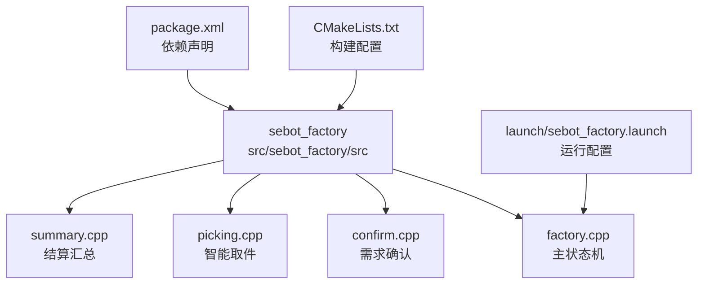
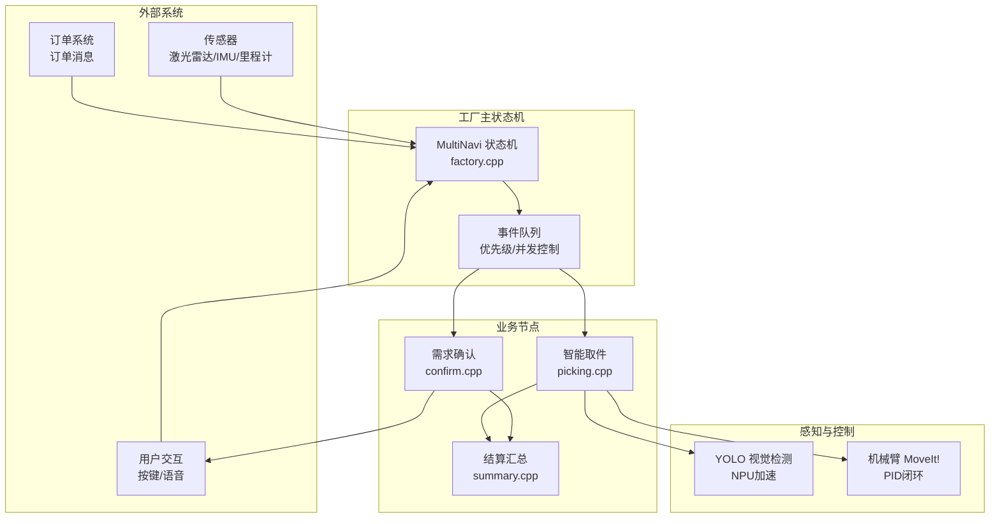
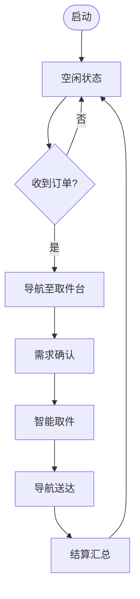
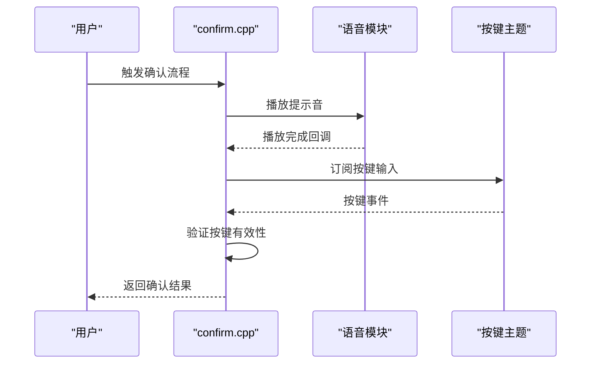
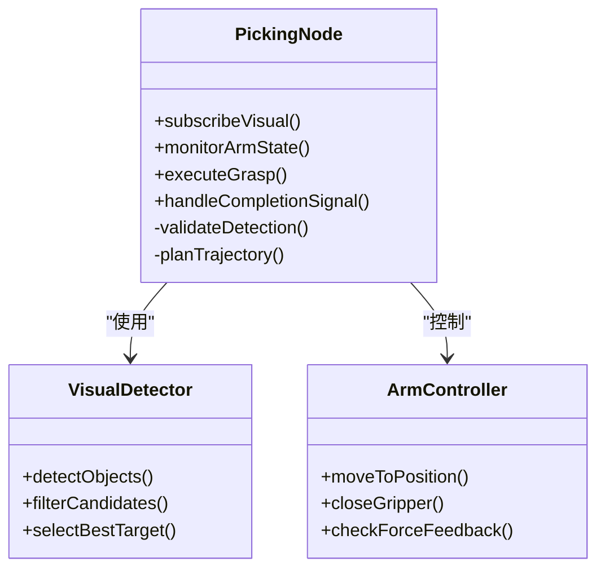
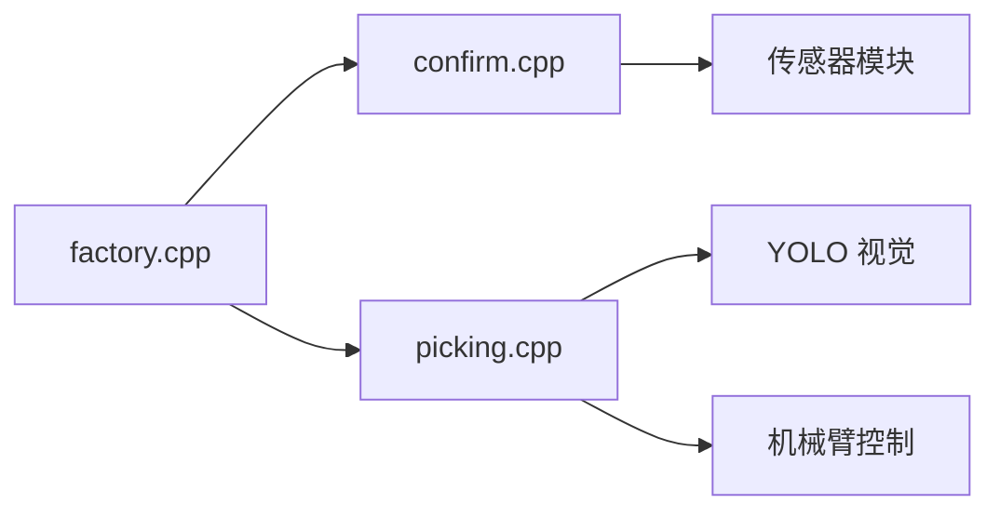

# 事件处理机制

<cite>
**本文引用的文件**   
- [factory.cpp](file://sebot_factory/src/sebot_factory/src/factory.cpp)
- [confirm.cpp](file://sebot_factory/src/sebot_factory/src/confirm.cpp)
- [picking.cpp](file://sebot_factory/src/sebot_factory/src/picking.cpp)
- [summary.cpp](file://sebot_factory/src/sebot_factory/src/summary.cpp)
- [sebot_factory.launch](file://sebot_factory/src/sebot_factory/launch/sebot_factory.launch)
- [CMakeLists.txt](file://sebot_factory/src/sebot_factory/CMakeLists.txt)
- [package.xml](file://sebot_factory/src/sebot_factory/package.xml)
</cite>

## 目录
1. [简介](#简介)
2. [项目结构](#项目结构)
3. [核心组件](#核心组件)
4. [架构总览](#架构总览)
5. [详细组件分析](#详细组件分析)
6. [依赖关系分析](#依赖关系分析)
7. [性能考量](#性能考量)
8. [故障排查指南](#故障排查指南)
9. [结论](#结论)
10. [附录：自定义事件扩展指南](#附录自定义事件扩展指南)

## 简介
本文件面向 MultiNavi 状态机的事件处理机制，聚焦 sebot_factory 包中的工厂主流程与关键业务节点。文档围绕以下目标展开：
- 解释 factory.cpp 中 ROS 订阅者与服务调用如何驱动订单接收、传感器数据监听与用户交互等事件；
- 说明 confirm.cpp 的需求确认事件处理，包括语音反馈、按键输入与用户确认流程；
- 阐述 picking.cpp 的取件事件处理，涵盖视觉检测结果、机械臂状态与抓取完成信号；
- 梳理事件队列管理、优先级处理与并发控制机制；
- 提供自定义事件添加的接口与使用示例，便于在现有状态机上扩展新事件类型。

## 项目结构
sebot_factory 为应用层核心包，负责工厂场景下的订单执行、需求确认、智能取件与结算汇总。其源码位于 src/sebot_factory/src，包含四个主要节点：
- factory.cpp：工厂主状态机（MultiNavi），协调各子任务与外部系统；
- confirm.cpp：需求确认，处理语音提示、按键输入与用户确认；
- picking.cpp：智能取件，对接视觉检测与机械臂控制；
- summary.cpp：结算汇总，统计并输出任务结果。

此外，launch 配置集中管理仿真模式、调试开关与导航参数；CMakeLists.txt 与 package.xml 定义构建与依赖。

**图表来源** 
- [sebot_factory.launch](file://sebot_factory/src/sebot_factory/launch/sebot_factory.launch)
- [CMakeLists.txt](file://sebot_factory/src/sebot_factory/CMakeLists.txt)
- [package.xml](file://sebot_factory/src/sebot_factory/package.xml)

**章节来源**
- [sebot_factory.launch](file://sebot_factory/src/sebot_factory/launch/sebot_factory.launch)
- [CMakeLists.txt](file://sebot_factory/src/sebot_factory/CMakeLists.txt)
- [package.xml](file://sebot_factory/src/sebot_factory/package.xml)

## 核心组件
- 工厂主状态机（factory.cpp）
  - 角色：作为 MultiNavi 状态机的中枢，订阅订单、传感器与用户交互事件，调度 confirm 与 picking 子任务，并在完成后进入结算阶段。
  - 关键点：ROS 订阅者用于接收订单消息与传感器数据；服务调用用于触发视觉检测与机械臂动作；事件队列与优先级确保多源事件有序处理。
- 需求确认（confirm.cpp）
  - 角色：在取件前进行需求确认，通过语音反馈引导用户操作，监听按键输入并等待用户确认。
  - 关键点：语音模块回调、按键主题订阅、确认状态标志位与超时保护。
- 智能取件（picking.cpp）
  - 角色：基于 YOLO 视觉检测结果定位目标，结合机械臂 PID 闭环控制完成抓取。
  - 关键点：视觉检测结果订阅、机械臂状态监控、抓取完成信号与失败重试策略。
- 结算汇总（summary.cpp）
  - 角色：汇总任务执行结果，输出统计信息，供上层系统或日志系统消费。
  - 关键点：结果聚合、统计指标计算、结果发布。

**章节来源**
- [factory.cpp](file://sebot_factory/src/sebot_factory/src/factory.cpp)
- [confirm.cpp](file://sebot_factory/src/sebot_factory/src/confirm.cpp)
- [picking.cpp](file://sebot_factory/src/sebot_factory/src/picking.cpp)
- [summary.cpp](file://sebot_factory/src/sebot_factory/src/summary.cpp)

## 架构总览
下图展示了 MultiNavi 状态机与各子系统之间的交互关系，包括订单来源、传感器数据、用户交互、视觉检测与机械臂控制。

**图表来源** 
- [factory.cpp](file://sebot_factory/src/sebot_factory/src/factory.cpp)
- [confirm.cpp](file://sebot_factory/src/sebot_factory/src/confirm.cpp)
- [picking.cpp](file://sebot_factory/src/sebot_factory/src/picking.cpp)
- [summary.cpp](file://sebot_factory/src/sebot_factory/src/summary.cpp)

## 详细组件分析

### 工厂主状态机（factory.cpp）
- 事件来源与订阅
  - 订单接收：订阅订单主题，解析订单内容并生成内部事件入队。
  - 传感器数据：订阅激光雷达、IMU、里程计等主题，融合后更新机器人状态。
  - 用户交互：订阅按键与语音反馈主题，将用户意图转换为状态机事件。
- 服务调用
  - 视觉检测：调用 YOLO 服务获取检测结果，用于取件定位。
  - 机械臂控制：调用 MoveIt! 服务规划轨迹并执行抓取动作。
- 事件队列与优先级
  - 采用优先级队列，高优先级事件（如紧急停止、用户取消）优先处理。
  - 并发控制：对同一资源的操作加锁，避免竞争条件。
- 状态转换
  - 从空闲到待命，再到导航、确认、取件、送达、结算等状态流转。
  - 每个状态内维护事件处理逻辑与超时保护。

**图表来源** 
- [factory.cpp](file://sebot_factory/src/sebot_factory/src/factory.cpp)

**章节来源**
- [factory.cpp](file://sebot_factory/src/sebot_factory/src/factory.cpp)

### 需求确认（confirm.cpp）
- 语音反馈
  - 播放提示音或语音指令，引导用户进行操作。
  - 通过语音模块回调确认播放完成，避免阻塞主循环。
- 按键输入
  - 订阅按键主题，解析按键码并映射为用户确认事件。
  - 支持长按、短按等组合键，提升交互灵活性。
- 用户确认流程
  - 等待用户确认信号，设置超时时间防止死锁。
  - 确认成功后进入下一状态，否则返回重试或取消。

**图表来源** 
- [confirm.cpp](file://sebot_factory/src/sebot_factory/src/confirm.cpp)

**章节来源**
- [confirm.cpp](file://sebot_factory/src/sebot_factory/src/confirm.cpp)

### 智能取件（picking.cpp）
- 视觉检测结果
  - 订阅 YOLO 检测结果，过滤低置信度目标，选择最佳候选。
  - 多帧检测确认，提高定位准确性。
- 机械臂状态
  - 监控机械臂关节位置、速度、力矩等状态，确保运动安全。
  - 使用 PID 闭环控制，实现精准抓取。
- 抓取完成信号
  - 检测夹爪闭合状态或力反馈，判断抓取是否成功。
  - 失败时触发重试或报警，记录错误日志。

**图表来源** 
- [picking.cpp](file://sebot_factory/src/sebot_factory/src/picking.cpp)

**章节来源**
- [picking.cpp](file://sebot_factory/src/sebot_factory/src/picking.cpp)

### 结算汇总（summary.cpp）
- 结果聚合
  - 收集各阶段执行结果，如导航耗时、取件成功率、异常次数等。
- 统计指标计算
  - 计算平均耗时、成功率、失败率等关键指标。
- 结果发布
  - 将统计结果发布到主题或写入日志文件，供上层系统消费。

**章节来源**
- [summary.cpp](file://sebot_factory/src/sebot_factory/src/summary.cpp)

## 依赖关系分析
- 内部依赖
  - factory.cpp 依赖 confirm.cpp 与 picking.cpp 提供的功能接口。
  - confirm.cpp 与 picking.cpp 均依赖底层传感器与控制模块。
- 外部依赖
  - ROS 通信：主题订阅、服务调用、参数服务器。
  - 视觉检测：YOLO NPU 加速库。
  - 机械臂控制：MoveIt! 框架与 PID 控制器。
- 潜在循环依赖
  - 通过接口抽象与事件解耦避免循环依赖。

**图表来源** 
- [factory.cpp](file://sebot_factory/src/sebot_factory/src/factory.cpp)
- [confirm.cpp](file://sebot_factory/src/sebot_factory/src/confirm.cpp)
- [picking.cpp](file://sebot_factory/src/sebot_factory/src/picking.cpp)

**章节来源**
- [factory.cpp](file://sebot_factory/src/sebot_factory/src/factory.cpp)
- [confirm.cpp](file://sebot_factory/src/sebot_factory/src/confirm.cpp)
- [picking.cpp](file://sebot_factory/src/sebot_factory/src/picking.cpp)

## 性能考量
- 事件队列优化
  - 使用优先级队列减少高优先级事件延迟。
  - 限制队列长度，防止内存溢出。
- 并发控制
  - 对共享资源加锁，避免竞态条件。
  - 使用异步回调减少阻塞。
- 视觉检测加速
  - 利用 NPU 加速 YOLO 推理，降低 CPU 负载。
  - 多帧检测确认平衡精度与实时性。
- 机械臂控制
  - PID 参数调优，提高抓取稳定性。
  - 轨迹规划优化，减少运动抖动。

## 故障排查指南
- 常见问题
  - 订单未接收：检查订单主题订阅与消息格式。
  - 视觉检测失败：调整置信度阈值，检查光照条件。
  - 机械臂抓取失败：检查夹爪状态与力反馈阈值。
- 调试技巧
  - 启用 debug 参数显示图像识别界面。
  - 查看日志文件定位错误堆栈。
  - 使用 rostopic 与 rosservice 手动测试接口。

**章节来源**
- [sebot_factory.launch](file://sebot_factory/src/sebot_factory/launch/sebot_factory.launch)

## 结论
MultiNavi 状态机通过工厂主状态机协调订单、传感器与用户交互事件，结合需求确认与智能取件业务节点，实现了完整的工厂自动化流程。事件队列管理与优先级处理确保了系统的实时性与稳定性。通过合理设计接口与解耦依赖，系统具备良好的可扩展性与可维护性。

## 附录：自定义事件扩展指南
- 步骤
  - 定义事件结构体，包含事件类型、优先级与数据载荷。
  - 在事件队列中添加新事件类型的处理逻辑。
  - 在状态机中注册事件处理器，处理新事件并触发状态转换。
- 示例
  - 新增“紧急停止”事件：优先级最高，立即中断当前任务并进入安全状态。
  - 新增“人工干预”事件：暂停自动流程，等待操作员确认。
- 注意事项
  - 确保事件数据结构一致，避免解析错误。
  - 处理异常事件，防止系统崩溃。
  - 测试新事件的边界条件与并发场景。

**章节来源**
- [factory.cpp](file://sebot_factory/src/sebot_factory/src/factory.cpp)
- [confirm.cpp](file://sebot_factory/src/sebot_factory/src/confirm.cpp)
- [picking.cpp](file://sebot_factory/src/sebot_factory/src/picking.cpp)