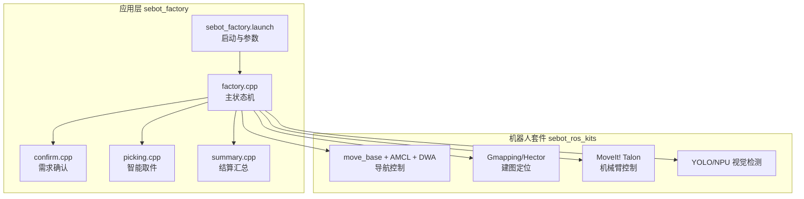
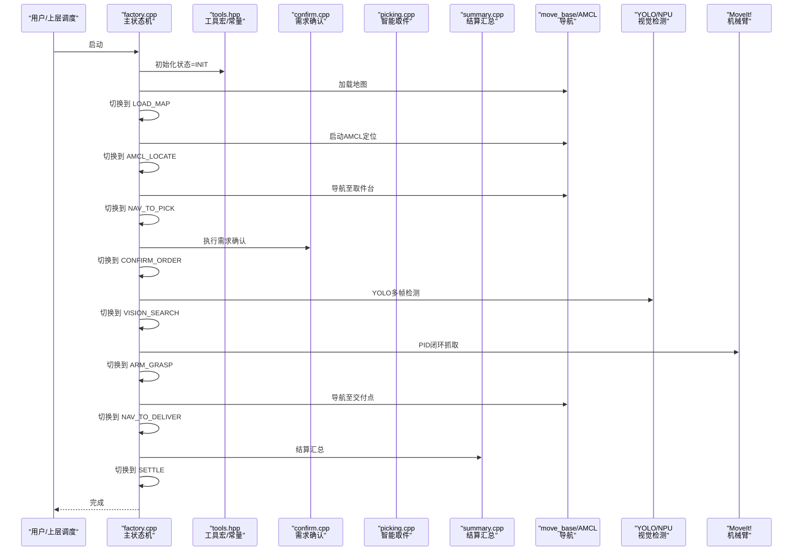
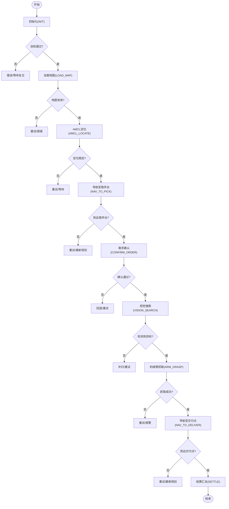
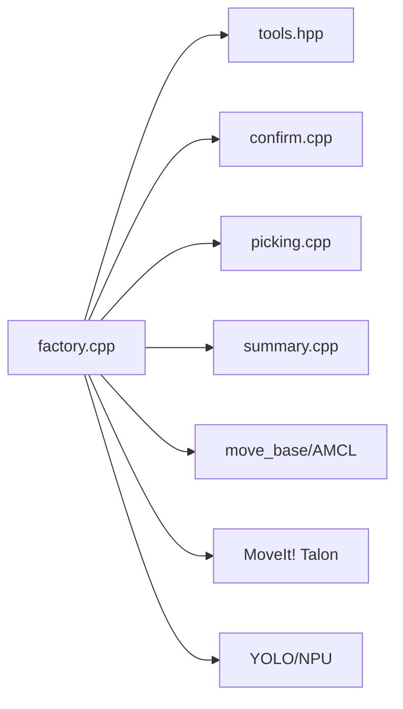

# 状态定义与枚举

<cite>
**本文引用的文件**   
- [factory.cpp](file://sebot_factory/src/sebot_factory/src/factory.cpp)
- [tools.hpp](file://sebot_factory/src/sebot_factory/include/tools.hpp)
- [confirm.cpp](file://sebot_factory/src/sebot_factory/src/confirm.cpp)
- [picking.cpp](file://sebot_factory/src/sebot_factory/src/picking.cpp)
- [summary.cpp](file://sebot_factory/src/sebot_factory/src/summary.cpp)
- [sebot_factory.launch](file://sebot_factory/src/sebot_factory/launch/sebot_factory.launch)
</cite>

## 目录
1. [简介](#简介)
2. [项目结构](#项目结构)
3. [核心组件](#核心组件)
4. [架构总览](#架构总览)
5. [详细组件分析](#详细组件分析)
6. [依赖关系分析](#依赖关系分析)
7. [性能考虑](#性能考虑)
8. [故障排查指南](#故障排查指南)
9. [结论](#结论)
10. [附录：扩展新状态的指南](#附录扩展新状态的指南)

## 简介
本文件聚焦于 MultiNavi 状态机中的“状态定义与枚举”，围绕 sebot_factory 包中的 factory.cpp 与 tools.hpp，系统梳理所有业务状态（如 INIT、LOAD_MAP、AMCL_LOCATE、NAV_TO_PICK、CONFIRM_ORDER、VISION_SEARCH、ARM_GRASP、NAV_TO_DELIVER、SETTLE 等）的职责、触发条件与转换规则；同时说明工具函数与宏定义如何支撑状态机运行，并给出状态机的初始化流程、默认状态设置机制以及扩展新状态的实践指南。

## 项目结构
- 应用层 sebot_factory：实现送件主流程的状态机（factory.cpp）、需求确认（confirm.cpp）、智能取件（picking.cpp）、结算汇总（summary.cpp），以及 launch 配置与资源。
- 机器人套件 sebot_ros_kits：提供导航栈、传感器驱动、SLAM、语音、视觉等能力。
- 仿真层 sebot_ros_stdr：提供 STDR 仿真环境及集成。

图表来源 
- [factory.cpp](file://sebot_factory/src/sebot_factory/src/factory.cpp)
- [tools.hpp](file://sebot_factory/src/sebot_factory/include/tools.hpp)
- [sebot_factory.launch](file://sebot_factory/src/sebot_factory/launch/sebot_factory.launch)

章节来源
- [factory.cpp](file://sebot_factory/src/sebot_factory/src/factory.cpp)
- [tools.hpp](file://sebot_factory/src/sebot_factory/include/tools.hpp)
- [sebot_factory.launch](file://sebot_factory/src/sebot_factory/launch/sebot_factory.launch)

## 核心组件
- 状态枚举与常量：集中定义在 tools.hpp，供 factory.cpp 使用，确保状态名与转换宏一致。
- 主状态机：factory.cpp 中实现状态切换逻辑、事件监听、超时处理与错误恢复。
- 子任务节点：confirm.cpp、picking.cpp、summary.cpp 作为子状态或回调模块，被主状态机调度。
- 启动与参数：sebot_factory.launch 负责加载地图、AMCL、导航参数、PID、超时阈值、是否仿真等关键开关。

章节来源
- [tools.hpp](file://sebot_factory/src/sebot_factory/include/tools.hpp)
- [factory.cpp](file://sebot_factory/src/sebot_factory/src/factory.cpp)
- [confirm.cpp](file://sebot_factory/src/sebot_factory/src/confirm.cpp)
- [picking.cpp](file://sebot_factory/src/sebot_factory/src/picking.cpp)
- [summary.cpp](file://sebot_factory/src/sebot_factory/src/summary.cpp)
- [sebot_factory.launch](file://sebot_factory/src/sebot_factory/launch/sebot_factory.launch)

## 架构总览
MultiNavi 状态机以工厂订单执行为主线，贯穿“自检→加载地图→AMCL定位→导航至取件台→需求确认→视觉搜索→机械臂抓取→导航送达→结算”的完整链路。各阶段通过工具宏进行状态切换，子任务节点返回成功/失败/重试信号，驱动状态机前进或回退。

图表来源 
- [factory.cpp](file://sebot_factory/src/sebot_factory/src/factory.cpp)
- [tools.hpp](file://sebot_factory/src/sebot_factory/include/tools.hpp)
- [confirm.cpp](file://sebot_factory/src/sebot_factory/src/confirm.cpp)
- [picking.cpp](file://sebot_factory/src/sebot_factory/src/picking.cpp)
- [summary.cpp](file://sebot_factory/src/sebot_factory/src/summary.cpp)

## 详细组件分析

### 状态枚举与职责
以下状态由 tools.hpp 定义并在 factory.cpp 中使用，每个状态对应一个明确的业务阶段与输入输出约束。

- INIT（初始化）
  - 职责：系统上电自检、订阅必要话题、加载基础参数、准备后续阶段。
  - 触发条件：程序启动后进入；自检通过后切换到 LOAD_MAP。
  - 退出条件：自检完成且资源就绪。

- LOAD_MAP（加载地图）
  - 职责：加载静态地图与服务端配置，校验地图有效性。
  - 触发条件：INIT 自检通过。
  - 退出条件：地图加载成功，切换到 AMCL_LOCATE。

- AMCL_LOCATE（AMCL定位）
  - 职责：启动 AMCL，等待位姿收敛或达到置信度阈值。
  - 触发条件：地图加载成功。
  - 退出条件：定位稳定，切换到 NAV_TO_PICK。

- NAV_TO_PICK（导航至取件台）
  - 职责：调用 move_base 规划路径并执行，到达取件区域。
  - 触发条件：AMCL 定位成功。
  - 退出条件：到达目标附近，切换到 CONFIRM_ORDER。

- CONFIRM_ORDER（需求确认）
  - 职责：与 confirm.cpp 协作，确认订单内容与取件位置。
  - 触发条件：到达取件台。
  - 退出条件：确认成功，切换到 VISION_SEARCH；失败则重试或回退。

- VISION_SEARCH（视觉搜索）
  - 职责：调用 YOLO/NPU 进行多帧检测，判定目标存在性。
  - 触发条件：订单确认通过。
  - 退出条件：检测到目标，切换到 ARM_GRASP；未检测到则补扫或重试。

- ARM_GRASP（机械臂抓取）
  - 职责：MoveIt! 轨迹规划与 PID 闭环控制，完成抓取。
  - 触发条件：视觉确认目标。
  - 退出条件：抓取成功，切换到 NAV_TO_DELIVER；失败则重试或报警。

- NAV_TO_DELIVER（导航至交付点）
  - 职责：规划并执行到交付点的导航。
  - 触发条件：抓取成功。
  - 退出条件：到达交付点，切换到 SETTLE。

- SETTLE（结算汇总）
  - 职责：调用 summary.cpp 进行订单结算、日志记录、上报结果。
  - 触发条件：到达交付点。
  - 退出条件：结算完成，回到空闲或结束流程。

章节来源
- [tools.hpp](file://sebot_factory/src/sebot_factory/include/tools.hpp)
- [factory.cpp](file://sebot_factory/src/sebot_factory/src/factory.cpp)
- [confirm.cpp](file://sebot_factory/src/sebot_factory/src/confirm.cpp)
- [picking.cpp](file://sebot_factory/src/sebot_factory/src/picking.cpp)
- [summary.cpp](file://sebot_factory/src/sebot_factory/src/summary.cpp)

### 工具函数与宏定义（tools.hpp）
- 状态常量与枚举
  - 定义所有状态名称与数值，保证跨模块一致性。
  - 建议为每个状态提供可读字符串映射，便于日志与调试。

- 状态转换宏
  - 封装 set_state(new_state)、check_timeout(state, timeout)、log_transition(from, to) 等常用操作。
  - 统一错误码与异常路径，避免分散的条件判断。

- 辅助函数
  - 参数读取与校验（如导航超时、PID 增益、取件距离、补扫次数）。
  - 事件发布/订阅封装（如订单事件、视觉检测结果、抓取状态）。
  - 安全保护（如互斥锁、状态只读快照、重入保护）。

章节来源
- [tools.hpp](file://sebot_factory/src/sebot_factory/include/tools.hpp)

### 状态机初始化流程与默认状态
- 初始化步骤
  - 加载配置文件（launch 参数、ROS 参数服务器）。
  - 订阅必要话题（里程计、激光、IMU、订单、视觉、抓取状态）。
  - 初始化工具模块（状态枚举、宏、日志、定时器）。
  - 设置默认状态为 INIT，并执行自检。

- 默认状态设置机制
  - 通过 tools.hpp 提供的 set_default_state() 或等价接口设置初始状态。
  - 自检失败时保持在 INIT 或进入 ERROR 状态（若定义），并上报诊断信息。

章节来源
- [factory.cpp](file://sebot_factory/src/sebot_factory/src/factory.cpp)
- [tools.hpp](file://sebot_factory/src/sebot_factory/include/tools.hpp)
- [sebot_factory.launch](file://sebot_factory/src/sebot_factory/launch/sebot_factory.launch)

### 状态转换流程图（算法视角）

图表来源 
- [factory.cpp](file://sebot_factory/src/sebot_factory/src/factory.cpp)
- [tools.hpp](file://sebot_factory/src/sebot_factory/include/tools.hpp)

## 依赖关系分析
- 内部依赖
  - factory.cpp 依赖 tools.hpp 的状态枚举与转换宏。
  - confirm.cpp、picking.cpp、summary.cpp 作为子任务被主状态机调用。
- 外部依赖
  - move_base 与 AMCL：用于全局/局部规划与定位。
  - MoveIt!：用于机械臂轨迹规划与控制。
  - YOLO/NPU：用于视觉目标检测。
  - 传感器：RPLidar、IMU、里程计经 EKF 融合。

图表来源 
- [factory.cpp](file://sebot_factory/src/sebot_factory/src/factory.cpp)
- [tools.hpp](file://sebot_factory/src/sebot_factory/include/tools.hpp)
- [confirm.cpp](file://sebot_factory/src/sebot_factory/src/confirm.cpp)
- [picking.cpp](file://sebot_factory/src/sebot_factory/src/picking.cpp)
- [summary.cpp](file://sebot_factory/src/sebot_factory/src/summary.cpp)

章节来源
- [factory.cpp](file://sebot_factory/src/sebot_factory/src/factory.cpp)
- [tools.hpp](file://sebot_factory/src/sebot_factory/include/tools.hpp)

## 性能考虑
- 状态切换开销：尽量批量更新状态与日志，减少频繁 I/O。
- 导航与定位：合理设置 AMCL 粒子数与局部代价地图分辨率，平衡精度与延迟。
- 视觉检测：多帧检测采用滑动窗口与置信度累积，降低误检率。
- 机械臂控制：PID 参数需在线整定，避免过冲与震荡。
- 超时与重试：为每个状态设置合理超时，避免长时间阻塞。

[本节为通用指导，不直接分析具体文件]

## 故障排查指南
- 常见问题
  - 地图加载失败：检查地图路径与权限，确认 map_server 正常。
  - AMCL 定位不收敛：调整粒子数、观测模型与初始位姿。
  - 导航超时：检查障碍物、代价地图与规划器参数。
  - 视觉检测失败：检查相机标定、光照与 NPU 模型版本。
  - 抓取失败：检查夹爪状态、PID 参数与目标位姿。
- 诊断手段
  - 启用 debug 模式（launch 参数），查看图像识别界面与日志。
  - 使用 rosbag 回放与 rqt 可视化定位与路径。
  - 检查状态机日志与转换宏输出，定位卡滞状态。

章节来源
- [sebot_factory.launch](file://sebot_factory/src/sebot_factory/launch/sebot_factory.launch)
- [factory.cpp](file://sebot_factory/src/sebot_factory/src/factory.cpp)
- [tools.hpp](file://sebot_factory/src/sebot_factory/include/tools.hpp)

## 结论
通过对 tools.hpp 与 factory.cpp 的系统分析，明确了 MultiNavi 状态机中各状态的定义、职责与转换规则，并结合子任务节点与外部依赖构建了完整的业务流程。遵循本文档的扩展指南，可在保持系统一致性的前提下安全地添加新状态与功能。

[本节为总结，不直接分析具体文件]

## 附录：扩展新状态的指南
- 新增状态步骤
  1. 在 tools.hpp 中添加状态枚举值与字符串映射。
  2. 在 factory.cpp 的状态处理分支中增加该状态的初始化、执行与退出逻辑。
  3. 定义触发条件与超时策略，使用 tools.hpp 的转换宏进行状态切换。
  4. 如需子任务，新建独立节点（参考 confirm.cpp、picking.cpp、summary.cpp），并通过 ROS 服务/动作与主状态机交互。
  5. 在 sebot_factory.launch 中补充相关参数（如超时、阈值、开关）。
- 最佳实践
  - 保持状态原子性与幂等性，避免重复执行副作用。
  - 统一错误码与日志格式，便于追踪与调试。
  - 对关键路径加入重试与降级策略，提升鲁棒性。
  - 单元测试覆盖状态转换边界条件与异常路径。

章节来源
- [tools.hpp](file://sebot_factory/src/sebot_factory/include/tools.hpp)
- [factory.cpp](file://sebot_factory/src/sebot_factory/src/factory.cpp)
- [confirm.cpp](file://sebot_factory/src/sebot_factory/src/confirm.cpp)
- [picking.cpp](file://sebot_factory/src/sebot_factory/src/picking.cpp)
- [summary.cpp](file://sebot_factory/src/sebot_factory/src/summary.cpp)
- [sebot_factory.launch](file://sebot_factory/src/sebot_factory/launch/sebot_factory.launch)