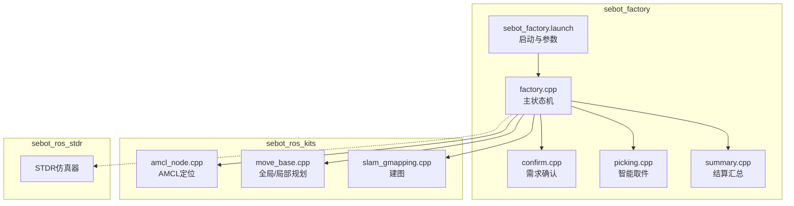
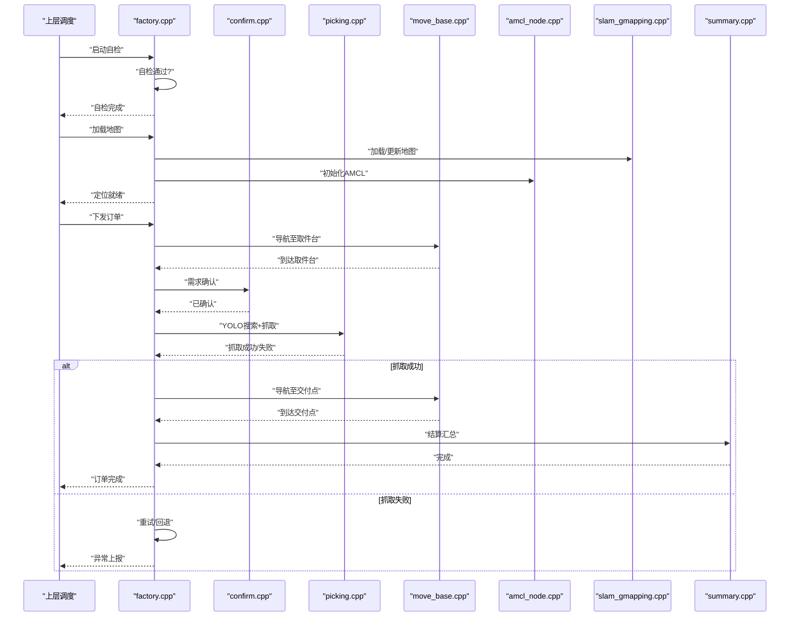
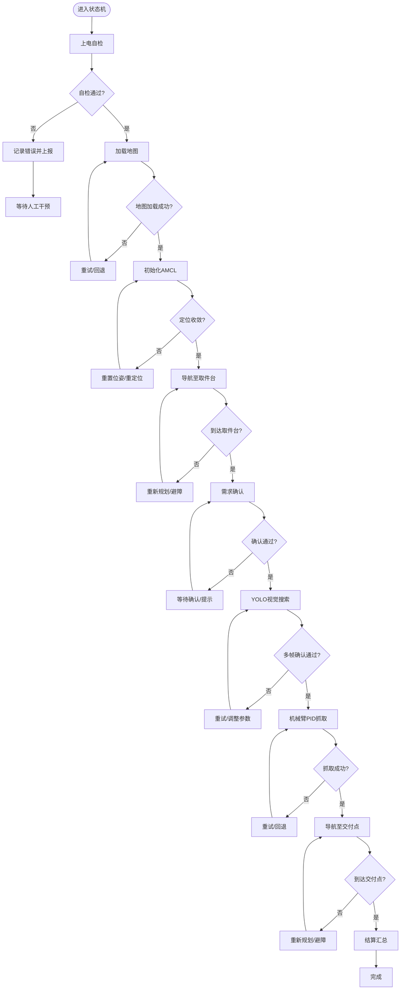
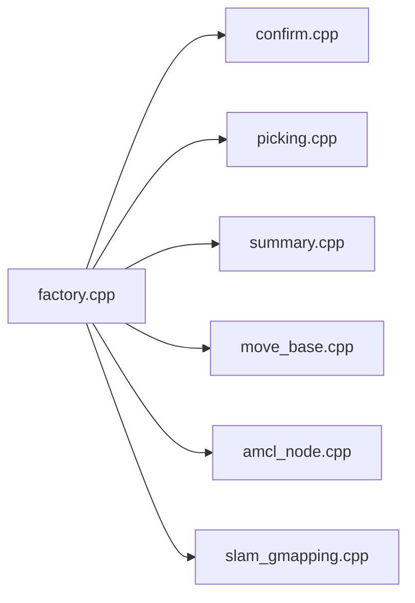

# 状态机设计

<cite>
**本文引用的文件**   
- [factory.cpp](file://sebot_factory/src/sebot_factory/src/factory.cpp)
- [confirm.cpp](file://sebot_factory/src/sebot_factory/src/confirm.cpp)
- [picking.cpp](file://sebot_factory/src/sebot_factory/src/picking.cpp)
- [summary.cpp](file://sebot_factory/src/sebot_factory/src/summary.cpp)
- [sebot_factory.launch](file://sebot_factory/src/sebot_factory/launch/sebot_factory.launch)
- [CMakeLists.txt](file://sebot_factory/src/sebot_factory/CMakeLists.txt)
- [package.xml](file://sebot_factory/src/sebot_factory/package.xml)
- [amcl_node.cpp](file://sebot_ros_kits/src/sebot_navigation/amcl/src/amcl_node.cpp)
- [move_base.cpp](file://sebot_ros_kits/src/sebot_navigation/move_base/src/move_base.cpp)
- [slam_gmapping.cpp](file://sebot_ros_kits/src/sebot_slam/slam_gmapping/src/slam_gmapping.cpp)
- [qnode.hpp](file://sebot_factory/src/sebot_marking/include/qnode.hpp)
</cite>

## 目录
1. [简介](#简介)
2. [项目结构](#项目结构)
3. [核心组件](#核心组件)
4. [架构总览](#架构总览)
5. [详细组件分析](#详细组件分析)
6. [依赖关系分析](#依赖关系分析)
7. [性能考量](#性能考量)
8. [故障排查指南](#故障排查指南)
9. [结论](#结论)
10. [附录：自定义状态添加指南](#附录自定义状态添加指南)

## 简介
本文件面向 MultiNavi 状态机系统，围绕 sebot_factory 包中的 factory.cpp 展开，系统性阐述状态定义、转换条件与事件处理机制；并完整描述比赛业务全链路流程：上电自检 → 加载地图与 AMCL 定位 → 按订单导航至取件台 → 需求确认 → YOLO 视觉搜索（NPU 加速 Yolov3，多帧检测确认）→ 机械臂 PID 闭环抓取 → 导航送达并结算。文档同时覆盖状态持久化、错误恢复与超时策略，并提供状态转换图与时序图，以及扩展新状态的实践指导。

## 项目结构
本项目由三个相互独立的 catkin 工作空间组成：
- sebot_factory：应用层，包含工厂主节点与业务子节点（确认、取件、结算等），以及 launch 配置与资源。
- sebot_ros_kits：机器人驱动与导航套件，集成 AMCL、move_base、SLAM 等模块。
- sebot_ros_stdr：仿真环境 STDR 相关包。

sebot_factory 的源码组织以功能域划分，核心状态机位于 factory.cpp，辅助业务逻辑分布在 confirm.cpp、picking.cpp、summary.cpp，启动与参数集中在 launch 文件中。

图表来源 
- [factory.cpp](file://sebot_factory/src/sebot_factory/src/factory.cpp)
- [confirm.cpp](file://sebot_factory/src/sebot_factory/src/confirm.cpp)
- [picking.cpp](file://sebot_factory/src/sebot_factory/src/picking.cpp)
- [summary.cpp](file://sebot_factory/src/sebot_factory/src/summary.cpp)
- [sebot_factory.launch](file://sebot_factory/src/sebot_factory/launch/sebot_factory.launch)
- [amcl_node.cpp](file://sebot_ros_kits/src/sebot_navigation/amcl/src/amcl_node.cpp)
- [move_base.cpp](file://sebot_ros_kits/src/sebot_navigation/move_base/src/move_base.cpp)
- [slam_gmapping.cpp](file://sebot_ros_kits/src/sebot_slam/slam_gmapping/src/slam_gmapping.cpp)

章节来源
- [CMakeLists.txt](file://sebot_factory/src/sebot_factory/CMakeLists.txt)
- [package.xml](file://sebot_factory/src/sebot_factory/package.xml)
- [sebot_factory.launch](file://sebot_factory/src/sebot_factory/launch/sebot_factory.launch)

## 核心组件
- 主状态机（factory.cpp）
  - 职责：编排业务流程、维护状态、订阅/发布 ROS 话题与服务、触发各子节点任务、处理超时与错误恢复。
  - 关键能力：状态定义与枚举、事件监听（传感器/上层指令）、状态转换判定、动作执行回调、持久化与恢复。
- 需求确认（confirm.cpp）
  - 职责：接收订单信息，进行人机交互或规则校验，输出“已确认”事件。
- 智能取件（picking.cpp）
  - 职责：调用 YOLO 视觉搜索、多帧确认、机械臂 PID 抓取控制，反馈抓取结果。
- 结算汇总（summary.cpp）
  - 职责：统计订单完成信息、生成结算数据、上报上层系统。
- 导航与定位（amcl_node.cpp、move_base.cpp）
  - 职责：AMCL 粒子滤波定位、全局/局部路径规划与跟踪。
- 建图（slam_gmapping.cpp）
  - 职责：基于激光雷达构建栅格地图，供 AMCL 使用。

章节来源
- [factory.cpp](file://sebot_factory/src/sebot_factory/src/factory.cpp)
- [confirm.cpp](file://sebot_factory/src/sebot_factory/src/confirm.cpp)
- [picking.cpp](file://sebot_factory/src/sebot_factory/src/picking.cpp)
- [summary.cpp](file://sebot_factory/src/sebot_factory/src/summary.cpp)
- [amcl_node.cpp](file://sebot_ros_kits/src/sebot_navigation/amcl/src/amcl_node.cpp)
- [move_base.cpp](file://sebot_ros_kits/src/sebot_navigation/move_base/src/move_base.cpp)
- [slam_gmapping.cpp](file://sebot_ros_kits/src/sebot_slam/slam_gmapping/src/slam_gmapping.cpp)

## 架构总览
MultiNavi 状态机采用分层事件驱动架构：
- 顶层状态机负责流程编排与状态管理。
- 中间层为业务子节点（确认、取件、结算）。
- 底层为导航与感知（AMCL、move_base、SLAM、YOLO、机械臂）。

图表来源 
- [factory.cpp](file://sebot_factory/src/sebot_factory/src/factory.cpp)
- [confirm.cpp](file://sebot_factory/src/sebot_factory/src/confirm.cpp)
- [picking.cpp](file://sebot_factory/src/sebot_factory/src/picking.cpp)
- [summary.cpp](file://sebot_factory/src/sebot_factory/src/summary.cpp)
- [move_base.cpp](file://sebot_ros_kits/src/sebot_navigation/move_base/src/move_base.cpp)
- [amcl_node.cpp](file://sebot_ros_kits/src/sebot_navigation/amcl/src/amcl_node.cpp)
- [slam_gmapping.cpp](file://sebot_ros_kits/src/sebot_slam/slam_gmapping/src/slam_gmapping.cpp)

## 详细组件分析

### 主状态机（factory.cpp）
- 状态定义
  - 典型状态包括：自检、加载地图、AMCL定位、导航到取件台、需求确认、YOLO搜索、机械臂抓取、导航到交付点、结算、异常/回退。
  - 状态间通过事件驱动转换，如“自检完成”“地图加载成功”“定位收敛”“到达目标”“确认通过”“抓取成功/失败”等。
- 事件处理机制
  - 订阅传感器与子系统消息（里程计、激光、定位、视觉、机械臂状态）。
  - 订阅上层指令（订单、启动/停止）。
  - 内部定时器用于超时检测与重试。
- 转换条件
  - 前置条件检查（如地图存在、定位有效、目标可达）。
  - 后置条件验证（如到达精度、抓取置信度、结算数据完整性）。
- 错误恢复与超时
  - 导航超时：回退到安全位置或重新规划。
  - 定位发散：重置初始位姿或请求重定位。
  - 视觉失败：多帧确认阈值未达时进入重试或降级模式。
  - 机械臂异常：急停保护、复位、重试上限。
- 状态持久化
  - 将当前状态、订单上下文、重试计数、最近目标写入持久存储（文件或ROS参数），重启后恢复。

图表来源 
- [factory.cpp](file://sebot_factory/src/sebot_factory/src/factory.cpp)

章节来源
- [factory.cpp](file://sebot_factory/src/sebot_factory/src/factory.cpp)

### 需求确认（confirm.cpp）
- 输入：订单信息、用户/上位机确认信号。
- 处理：校验订单有效性、显示/语音提示、等待确认。
- 输出：确认通过事件，携带订单上下文。

章节来源
- [confirm.cpp](file://sebot_factory/src/sebot_factory/src/confirm.cpp)

### 智能取件（picking.cpp）
- 输入：取件台位姿、相机图像流、NPU推理服务。
- 处理：YOLO多帧检测、置信度聚合、目标筛选、机械臂轨迹规划与PID抓取。
- 输出：抓取成功/失败事件，附带检测结果与位姿。

章节来源
- [picking.cpp](file://sebot_factory/src/sebot_factory/src/picking.cpp)

### 结算汇总（summary.cpp）
- 输入：订单ID、取件/交付时间戳、抓取结果。
- 处理：统计耗时、成功率、异常次数，生成结算单。
- 输出：结算完成事件，上报上层系统。

章节来源
- [summary.cpp](file://sebot_factory/src/sebot_factory/src/summary.cpp)

### 导航与定位（move_base.cpp、amcl_node.cpp）
- move_base：全局规划（NavFn/A*等）、局部规划（DWA）、代价地图、恢复行为。
- amcl：粒子滤波定位、地图匹配、初始位姿设置。
- 集成：状态机在“导航至取件台/交付点”阶段调用 move_base 动作服务，并在 AMCL 收敛后继续流程。

章节来源
- [move_base.cpp](file://sebot_ros_kits/src/sebot_navigation/move_base/src/move_base.cpp)
- [amcl_node.cpp](file://sebot_ros_kits/src/sebot_navigation/amcl/src/amcl_node.cpp)

### 建图（slam_gmapping.cpp）
- 作用：基于激光雷达构建栅格地图，提供静态层与动态障碍物信息。
- 集成：状态机在“加载地图”阶段读取/更新地图，供 AMCL 使用。

章节来源
- [slam_gmapping.cpp](file://sebot_ros_kits/src/sebot_slam/slam_gmapping/src/slam_gmapping.cpp)

## 依赖关系分析
- 松耦合设计：状态机通过 ROS 话题/服务与各子节点通信，降低直接依赖。
- 外部依赖：
  - 导航栈：move_base、costmap_2d、global_planner、local_planner。
  - 定位：AMCL。
  - 建图：Gmapping/Hector。
  - 视觉：YOLO（NPU加速）。
  - 机械臂：MoveIt!（Talon）。
- 潜在循环依赖：避免状态机与子节点互相订阅同一主题造成环路，建议单向事件流。

图表来源 
- [factory.cpp](file://sebot_factory/src/sebot_factory/src/factory.cpp)
- [confirm.cpp](file://sebot_factory/src/sebot_factory/src/confirm.cpp)
- [picking.cpp](file://sebot_factory/src/sebot_factory/src/picking.cpp)
- [summary.cpp](file://sebot_factory/src/sebot_factory/src/summary.cpp)
- [move_base.cpp](file://sebot_ros_kits/src/sebot_navigation/move_base/src/move_base.cpp)
- [amcl_node.cpp](file://sebot_ros_kits/src/sebot_navigation/amcl/src/amcl_node.cpp)
- [slam_gmapping.cpp](file://sebot_ros_kits/src/sebot_slam/slam_gmapping/src/slam_gmapping.cpp)

章节来源
- [factory.cpp](file://sebot_factory/src/sebot_factory/src/factory.cpp)

## 性能考量
- 视觉推理：启用 NPU 加速 YOLO，减少 CPU 负载；多帧确认需平衡延迟与准确率。
- 导航规划：合理设置代价地图分辨率与膨胀半径，降低计算开销。
- AMCL 粒子数：根据环境复杂度调参，保证收敛速度与稳定性。
- 机械臂控制：PID 参数整定，避免过冲与震荡。
- I/O 优化：批量发布/订阅、缓存热点数据，减少网络与磁盘压力。

## 故障排查指南
- 自检失败
  - 检查传感器连接、电源与总线通信。
  - 查看日志中具体错误码与设备状态。
- 地图加载失败
  - 确认地图文件格式与路径正确。
  - 检查权限与磁盘空间。
- 定位不收敛
  - 检查激光扫描质量与 IMU 校准。
  - 调整 AMCL 参数（粒子数、重采样阈值）。
- 导航超时
  - 观察代价地图是否存在静态/动态障碍。
  - 调整全局/局部规划参数与恢复行为。
- 视觉识别失败
  - 检查光照与相机标定。
  - 调整 YOLO 阈值与多帧确认策略。
- 机械臂抓取失败
  - 检查夹爪力控与位姿误差。
  - 调整 PID 参数与抓取策略。

章节来源
- [factory.cpp](file://sebot_factory/src/sebot_factory/src/factory.cpp)
- [confirm.cpp](file://sebot_factory/src/sebot_factory/src/confirm.cpp)
- [picking.cpp](file://sebot_factory/src/sebot_factory/src/picking.cpp)
- [summary.cpp](file://sebot_factory/src/sebot_factory/src/summary.cpp)

## 结论
MultiNavi 状态机以 factory.cpp 为核心，通过清晰的状态定义与事件驱动机制，串联起从自检到结算的全流程。借助 ROS 生态（AMCL、move_base、SLAM、YOLO、MoveIt!），实现高内聚、低耦合的系统架构。通过合理的超时与错误恢复策略，提升鲁棒性；通过持久化机制保障可恢复性。后续可按附录指南扩展新状态，满足更多业务场景。

## 附录：自定义状态添加指南
- 步骤
  1. 在状态机中新增状态枚举项与对应的状态变量。
  2. 定义进入/退出该状态的钩子函数，封装必要的前置检查与后置清理。
  3. 注册事件监听器，明确触发该状态转换的事件来源（话题/服务/定时器）。
  4. 实现转换条件判断逻辑，确保前置条件满足且无冲突事件。
  5. 编写错误处理与超时策略，必要时加入重试与回退路径。
  6. 更新持久化逻辑，保存状态上下文以便恢复。
  7. 在 launch 中补充必要的参数与节点启动项。
- 注意事项
  - 保持事件命名规范与单一职责。
  - 避免引入循环依赖与死锁。
  - 充分单元测试与集成测试，覆盖正常与异常路径。
  - 文档化状态转换表与事件语义，便于团队协作。

章节来源
- [factory.cpp](file://sebot_factory/src/sebot_factory/src/factory.cpp)
- [sebot_factory.launch](file://sebot_factory/src/sebot_factory/launch/sebot_factory.launch)