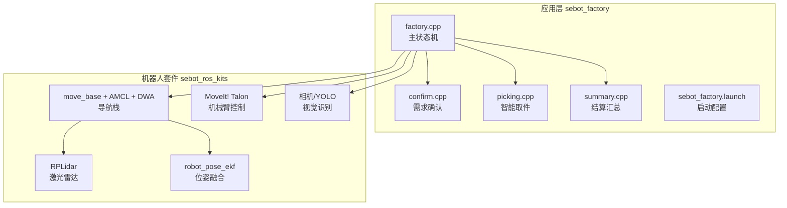
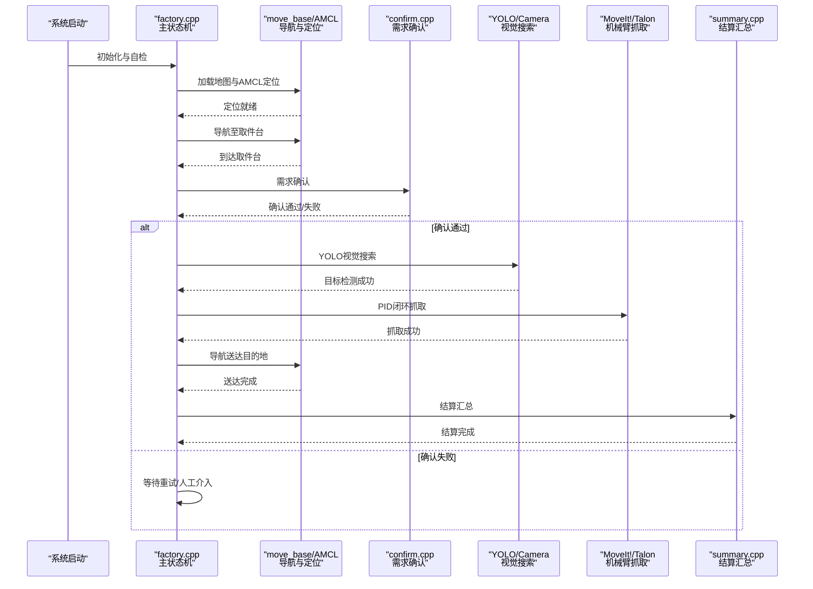
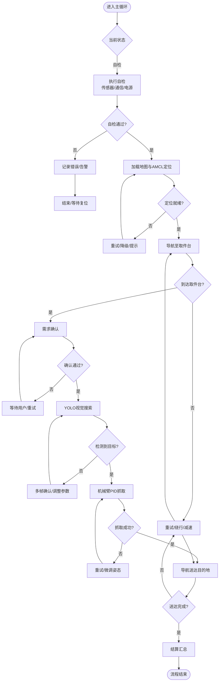
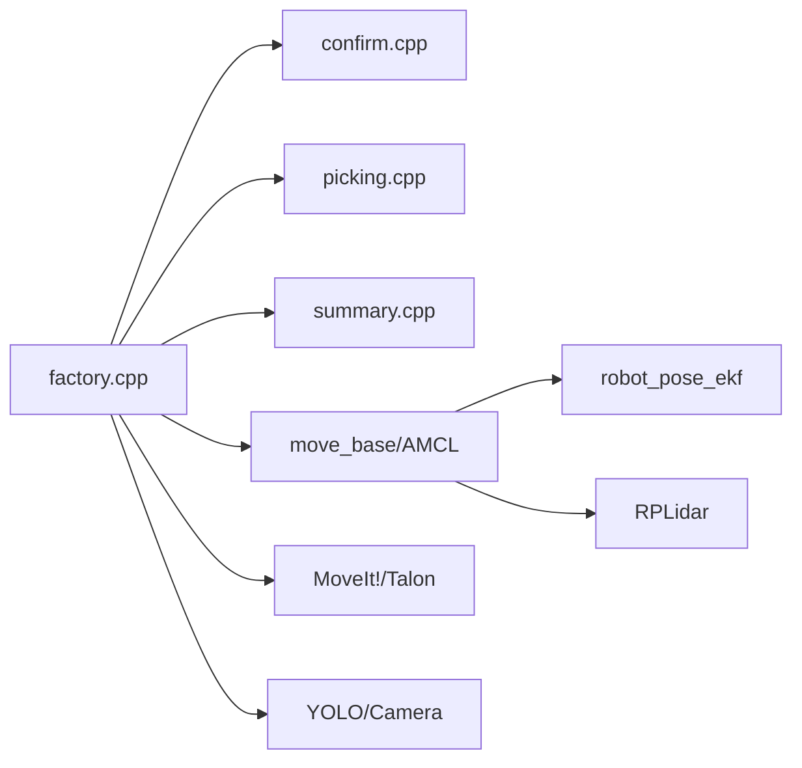

# 状态转换逻辑

<cite>
**本文引用的文件**   
- [factory.cpp](file://sebot_factory/src/sebot_factory/src/factory.cpp)
- [confirm.cpp](file://sebot_factory/src/sebot_factory/src/confirm.cpp)
- [picking.cpp](file://sebot_factory/src/sebot_factory/src/picking.cpp)
- [summary.cpp](file://sebot_factory/src/sebot_factory/src/summary.cpp)
- [sebot_factory.launch](file://sebot_factory/src/sebot_factory/launch/sebot_factory.launch)
</cite>

## 目录
1. [简介](#简介)
2. [项目结构](#项目结构)
3. [核心组件](#核心组件)
4. [架构总览](#架构总览)
5. [详细组件分析](#详细组件分析)
6. [依赖关系分析](#依赖关系分析)
7. [性能考量](#性能考量)
8. [故障排查指南](#故障排查指南)
9. [结论](#结论)
10. [附录](#附录)

## 简介
本文件聚焦 MultiNavi 状态机在 sebot_factory 中的转换逻辑，围绕 factory.cpp 的 switch-case 主循环、条件判断与异常处理机制展开。文档完整描述业务链路：上电自检 → 加载地图与 AMCL 定位 → 按订单导航至取件台 → 需求确认 → YOLO 视觉搜索 → 机械臂抓取 → 导航送达并结算。对每个状态的触发条件、前置检查、后置处理、超时处理、错误恢复与回退机制进行系统化说明，并提供状态转换图与时序图，帮助读者快速理解与排障。

## 项目结构
本项目由三个相互独立的 catkin 工作空间组成：
- sebot_factory（应用层）：包含工厂任务状态机与业务节点（factory、confirm、picking、summary），以及 launch 配置。
- sebot_ros_kits（机器人套件）：驱动、传感器、导航栈等基础能力。
- sebot_ros_stdr（仿真层）：STDR 仿真环境与工具链。

本节重点为 sebot_factory 包内的核心源码与启动配置，它们共同构成 MultiNavi 状态机的运行环境。

图表来源
- [factory.cpp](file://sebot_factory/src/sebot_factory/src/factory.cpp)
- [sebot_factory.launch](file://sebot_factory/src/sebot_factory/launch/sebot_factory.launch)

章节来源
- [sebot_factory.launch](file://sebot_factory/src/sebot_factory/launch/sebot_factory.launch)

## 核心组件
- factory.cpp：MultiNavi 主状态机入口，使用 switch-case 管理各业务阶段的状态流转，协调导航、视觉、机械臂与结算模块。
- confirm.cpp：负责需求确认流程，包括语音/界面交互与校验。
- picking.cpp：实现 YOLO 视觉搜索与机械臂 PID 闭环抓取。
- summary.cpp：完成订单结算与结果上报。
- sebot_factory.launch：集中配置仿真模式、调试开关、导航超时、PID 参数、取件距离、补扫策略等关键运行参数。

章节来源
- [factory.cpp](file://sebot_factory/src/sebot_factory/src/factory.cpp)
- [confirm.cpp](file://sebot_factory/src/sebot_factory/src/confirm.cpp)
- [picking.cpp](file://sebot_factory/src/sebot_factory/src/picking.cpp)
- [summary.cpp](file://sebot_factory/src/sebot_factory/src/summary.cpp)
- [sebot_factory.launch](file://sebot_factory/src/sebot_factory/launch/sebot_factory.launch)

## 架构总览
下图展示 MultiNavi 状态机与各子系统之间的交互关系。factory.cpp 作为调度中枢，依据当前状态与事件驱动调用下游服务，并在异常或超时时执行回退与恢复。

图表来源
- [factory.cpp](file://sebot_factory/src/sebot_factory/src/factory.cpp)
- [confirm.cpp](file://sebot_factory/src/sebot_factory/src/confirm.cpp)
- [picking.cpp](file://sebot_factory/src/sebot_factory/src/picking.cpp)
- [summary.cpp](file://sebot_factory/src/sebot_factory/src/summary.cpp)

## 详细组件分析

### factory.cpp 状态机主循环与转换逻辑
- 状态定义与切换：采用 switch-case 结构组织各业务阶段，如“自检”“加载地图与定位”“导航至取件台”“需求确认”“视觉搜索”“机械臂抓取”“导航送达”“结算”。每个 case 内包含前置检查、动作执行、结果判定与状态跳转。
- 条件判断：基于传感器反馈、导航状态、视觉检测结果、机械臂状态与用户交互结果进行分支决策。
- 异常处理：对超时、通信失败、设备不可用、定位漂移、检测置信度不足等情况进行捕获，进入回退或重试路径。
- 超时与回退：为长耗时操作（导航、视觉、抓取）设置超时阈值；失败时尝试重跑、降级策略（如降低速度、扩大搜索范围）、或回退到上一安全状态。
- 日志与可观测性：记录关键事件与错误码，便于问题定位与性能分析。

图表来源
- [factory.cpp](file://sebot_factory/src/sebot_factory/src/factory.cpp)

章节来源
- [factory.cpp](file://sebot_factory/src/sebot_factory/src/factory.cpp)

### confirm.cpp 需求确认流程
- 输入：订单信息、用户指令或界面选择。
- 处理：校验订单有效性、资源可用性、时间窗口；必要时进行语音提示或界面确认。
- 输出：确认通过/失败信号，供主状态机决定后续流程。
- 异常：超时、用户取消、冲突订单等，需返回明确错误码以便上层处理。

章节来源
- [confirm.cpp](file://sebot_factory/src/sebot_factory/src/confirm.cpp)

### picking.cpp 视觉搜索与抓取
- 视觉搜索：调用 YOLO（NPU 加速 Yolov3），支持多帧检测确认，提高鲁棒性；根据置信度与位置估计生成抓取点。
- 抓取控制：MoveIt! 规划轨迹，结合 PID 闭环控制末端执行器，确保稳定抓取。
- 异常处理：检测失败、遮挡、光照变化、模型漂移等；提供重试、参数自适应与降级策略。

章节来源
- [picking.cpp](file://sebot_factory/src/sebot_factory/src/picking.cpp)

### summary.cpp 结算汇总
- 功能：统计任务执行结果、资源消耗、异常次数，生成结算报告。
- 接口：向外部系统上报订单状态、完成时间与质量指标。
- 异常：数据不一致、上报失败等，需重试与本地持久化。

章节来源
- [summary.cpp](file://sebot_factory/src/sebot_factory/src/summary.cpp)

### sebot_factory.launch 关键参数
- simulation：切换 STDR 仿真模式，便于离线测试与调试。
- debug：控制图像识别界面开关，辅助视觉算法调参。
- 导航超时：全局或分阶段的导航超时阈值，防止卡死。
- PID 参数：机械臂抓取与运动控制的增益与限幅。
- 取件距离：接近目标的容差与停止条件。
- 补扫策略：定位不确定时的局部建图或重定位策略。

章节来源
- [sebot_factory.launch](file://sebot_factory/src/sebot_factory/launch/sebot_factory.launch)

## 依赖关系分析
- factory.cpp 依赖 confirm、picking、summary 三个业务节点，并通过 ROS 服务/动作/话题与 move_base、AMCL、MoveIt!、YOLO 等子系统交互。
- 导航依赖 EKF 位姿融合与激光雷达数据；视觉依赖相机与 NPU 推理；机械臂依赖 MoveIt! 与底层关节控制。
- 启动配置集中管理参数，避免硬编码，提升可维护性与可移植性。

图表来源
- [factory.cpp](file://sebot_factory/src/sebot_factory/src/factory.cpp)
- [sebot_factory.launch](file://sebot_factory/src/sebot_factory/launch/sebot_factory.launch)

章节来源
- [factory.cpp](file://sebot_factory/src/sebot_factory/src/factory.cpp)
- [sebot_factory.launch](file://sebot_factory/src/sebot_factory/launch/sebot_factory.launch)

## 性能考量
- 导航路径规划与局部避障：合理设置全局与局部代价地图更新频率，减少计算开销。
- 视觉推理：利用 NPU 加速与多帧确认平衡精度与延迟；必要时降低分辨率或裁剪 ROI。
- 机械臂控制：PID 参数整定避免过冲与振荡；轨迹平滑减少抖动。
- 资源监控：CPU/GPU/内存占用监控，避免瓶颈；关键路径加日志与计时。

[本节为通用指导，不直接分析具体文件]

## 故障排查指南
- 自检失败：检查传感器连接、电源状态、通信端口；查看自检日志的错误码。
- 定位失败：确认地图加载成功、AMCL 参数合理、激光数据正常；必要时触发补扫或重定位。
- 导航超时：检查路径是否被阻塞、代价地图是否异常、速度限制是否过低；启用绕行或降级策略。
- 视觉检测失败：调整光照与角度、增加多帧确认、检查模型版本与标签列表；必要时回退到备用模型。
- 抓取失败：检查夹爪力度、目标姿态、碰撞检测；微调抓取点与轨迹。
- 结算异常：核对订单数据一致性、上报接口连通性；启用本地缓存与重试。

章节来源
- [factory.cpp](file://sebot_factory/src/sebot_factory/src/factory.cpp)
- [confirm.cpp](file://sebot_factory/src/sebot_factory/src/confirm.cpp)
- [picking.cpp](file://sebot_factory/src/sebot_factory/src/picking.cpp)
- [summary.cpp](file://sebot_factory/src/sebot_factory/src/summary.cpp)
- [sebot_factory.launch](file://sebot_factory/src/sebot_factory/launch/sebot_factory.launch)

## 结论
MultiNavi 状态机以 factory.cpp 为核心，通过清晰的 switch-case 结构与完善的异常处理机制，实现了从自检到结算的全链路自动化。配合 confirm、picking、summary 等子模块与导航、视觉、机械臂等子系统，系统在复杂环境中具备较强的鲁棒性与可恢复性。合理的参数配置与监控手段是保障稳定运行的关键。

[本节为总结性内容，不直接分析具体文件]

## 附录
- 建议的调试流程：开启 debug 模式 → 观察视觉界面与日志 → 逐步验证各状态转换 → 定位问题根因。
- 推荐的性能基线：导航成功率、平均耗时、视觉检测准确率、抓取成功率、结算上报成功率。
- 扩展方向：引入更鲁棒的感知模型、动态任务优先级、多机协作与云端调度。

[本节为补充信息，不直接分析具体文件]