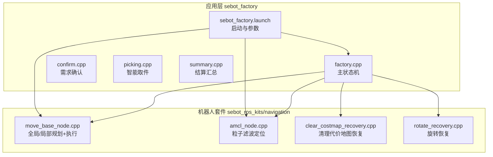
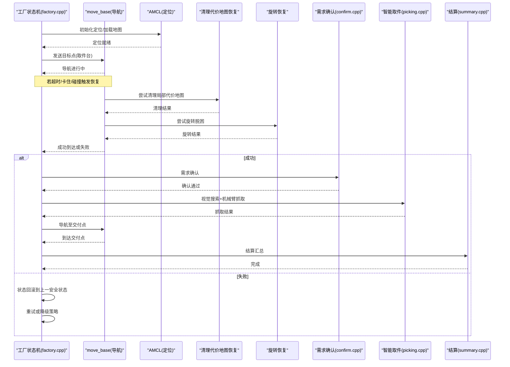
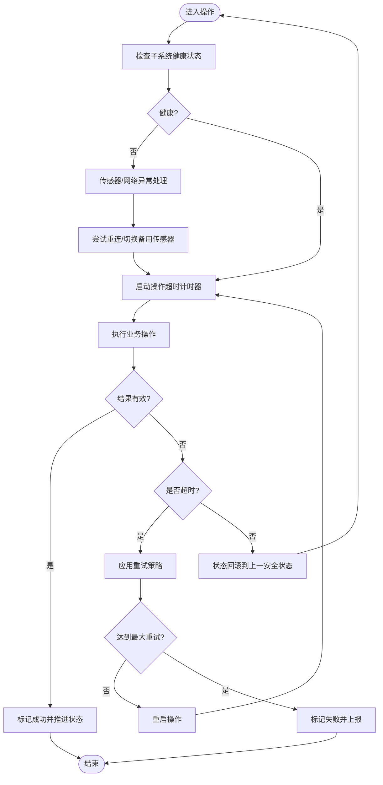
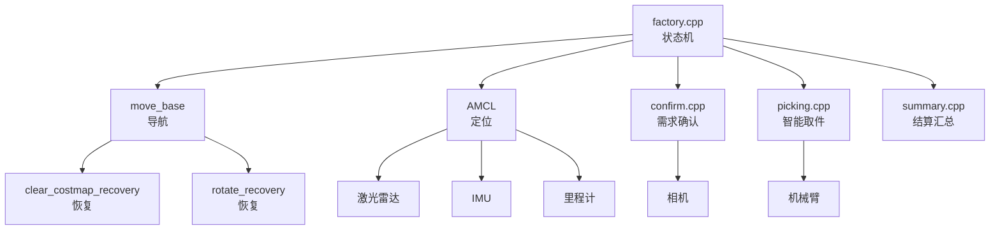

# 错误恢复与异常处理

<cite>
**本文引用的文件**   
- [factory.cpp](file://sebot_factory/src/sebot_factory/src/factory.cpp)
- [sebot_factory.launch](file://sebot_factory/src/sebot_factory/launch/sebot_factory.launch)
- [confirm.cpp](file://sebot_factory/src/sebot_factory/src/confirm.cpp)
- [picking.cpp](file://sebot_factory/src/sebot_factory/src/picking.cpp)
- [summary.cpp](file://sebot_factory/src/sebot_factory/src/summary.cpp)
- [move_base_node.cpp](file://sebot_ros_kits/src/sebot_navigation/move_base/src/move_base_node.cpp)
- [amcl_node.cpp](file://sebot_ros_kits/src/sebot_navigation/amcl/src/amcl_node.cpp)
- [clear_costmap_recovery.cpp](file://sebot_ros_kits/src/sebot_navigation/clear_costmap_recovery/src/clear_costmap_recovery.cpp)
- [rotate_recovery.cpp](file://sebot_ros_kits/src/sebot_navigation/rotate_recovery/src/rotate_recovery.cpp)
</cite>

## 目录
1. [简介](#简介)
2. [项目结构](#项目结构)
3. [核心组件](#核心组件)
4. [架构总览](#架构总览)
5. [详细组件分析](#详细组件分析)
6. [依赖关系分析](#依赖关系分析)
7. [性能考虑](#性能考虑)
8. [故障排查指南](#故障排查指南)
9. [结论](#结论)
10. [附录](#附录)

## 简介
本文件面向 MultiNavi 状态机的错误恢复机制，聚焦 factory.cpp 中的异常处理策略、超时与重试、状态回滚、日志记录与常见错误诊断。文档同时覆盖网络中断、传感器故障、导航失败等典型异常场景，并结合 sebot_factory.launch 的配置参数说明如何调整超时、重试与调试开关，以保障系统在复杂环境下的鲁棒性。

## 项目结构
本项目由三个相互独立的 catkin 工作空间组成：应用层 sebot_factory、机器人套件 sebot_ros_kits、仿真层 sebot_ros_stdr。MultiNavi 主状态机位于 sebot_factory 的 factory.cpp；导航栈 move_base、定位 AMCL 及恢复行为 clear_costmap_recovery、rotate_recovery 位于 sebot_ros_kits 的 navigation 子包中；运行配置集中在 sebot_factory.launch。

**图表来源** 
- [factory.cpp](file://sebot_factory/src/sebot_factory/src/factory.cpp)
- [sebot_factory.launch](file://sebot_factory/src/sebot_factory/launch/sebot_factory.launch)
- [move_base_node.cpp](file://sebot_ros_kits/src/sebot_navigation/move_base/src/move_base_node.cpp)
- [amcl_node.cpp](file://sebot_ros_kits/src/sebot_navigation/amcl/src/amcl_node.cpp)
- [clear_costmap_recovery.cpp](file://sebot_ros_kits/src/sebot_navigation/clear_costmap_recovery/src/clear_costmap_recovery.cpp)
- [rotate_recovery.cpp](file://sebot_ros_kits/src/sebot_navigation/rotate_recovery/src/rotate_recovery.cpp)

**章节来源**
- [sebot_factory.launch](file://sebot_factory/src/sebot_factory/launch/sebot_factory.launch)
- [factory.cpp](file://sebot_factory/src/sebot_factory/src/factory.cpp)

## 核心组件
- 主状态机（factory.cpp）
  - 负责订单流程编排：自检→加载地图与AMCL定位→导航至取件台→需求确认→视觉搜索→机械臂抓取→导航送达并结算。
  - 集成超时检测、异常分类、状态回滚与重试策略。
- 导航栈（move_base + AMCL）
  - move_base 负责全局/局部路径规划与执行，提供恢复行为接口。
  - AMCL 负责定位，输出位姿估计与观测质量指标。
- 恢复行为（clear_costmap_recovery, rotate_recovery）
  - 在卡住或碰撞时清理局部代价地图或执行旋转以脱困。
- 业务节点（confirm.cpp, picking.cpp, summary.cpp）
  - confirm 完成需求确认（如语音/按键交互），picking 驱动机械臂闭环抓取，summary 进行结算汇总。

**章节来源**
- [factory.cpp](file://sebot_factory/src/sebot_factory/src/factory.cpp)
- [confirm.cpp](file://sebot_factory/src/sebot_factory/src/confirm.cpp)
- [picking.cpp](file://sebot_factory/src/sebot_factory/src/picking.cpp)
- [summary.cpp](file://sebot_factory/src/sebot_factory/src/summary.cpp)
- [move_base_node.cpp](file://sebot_ros_kits/src/sebot_navigation/move_base/src/move_base_node.cpp)
- [amcl_node.cpp](file://sebot_ros_kits/src/sebot_navigation/amcl/src/amcl_node.cpp)
- [clear_costmap_recovery.cpp](file://sebot_ros_kits/src/sebot_navigation/clear_costmap_recovery/src/clear_costmap_recovery.cpp)
- [rotate_recovery.cpp](file://sebot_ros_kits/src/sebot_navigation/rotate_recovery/src/rotate_recovery.cpp)

## 架构总览
下图展示 MultiNavi 状态机与导航栈、恢复行为的交互关系，以及关键异常路径。

**图表来源** 
- [factory.cpp](file://sebot_factory/src/sebot_factory/src/factory.cpp)
- [move_base_node.cpp](file://sebot_ros_kits/src/sebot_navigation/move_base/src/move_base_node.cpp)
- [amcl_node.cpp](file://sebot_ros_kits/src/sebot_navigation/amcl/src/amcl_node.cpp)
- [clear_costmap_recovery.cpp](file://sebot_ros_kits/src/sebot_navigation/clear_costmap_recovery/src/clear_costmap_recovery.cpp)
- [rotate_recovery.cpp](file://sebot_ros_kits/src/sebot_navigation/rotate_recovery/src/rotate_recovery.cpp)
- [confirm.cpp](file://sebot_factory/src/sebot_factory/src/confirm.cpp)
- [picking.cpp](file://sebot_factory/src/sebot_factory/src/picking.cpp)
- [summary.cpp](file://sebot_factory/src/sebot_factory/src/summary.cpp)

## 详细组件分析

### 工厂状态机（factory.cpp）异常处理策略
- 异常分类
  - 网络中断：与服务端通信超时、连接断开、消息丢失。
  - 传感器故障：激光雷达无数据、IMU漂移、里程计异常、相机离线。
  - 导航失败：无法规划路径、局部规划震荡、碰撞频繁、长时间未到达。
  - 业务异常：需求确认失败、视觉识别置信度不足、机械臂抓取失败。
- 检测机制
  - 心跳/健康检查：对关键子系统（AMCL、move_base、传感器）设置心跳订阅与阈值判断。
  - 超时监控：为每个操作设置独立超时计时器，超过阈值即判定失败。
  - 状态一致性校验：对比期望状态与实际状态（如位姿误差、抓取力反馈）。
- 处理流程
  - 捕获异常→分类→选择恢复策略（重试、降级、回滚）→记录日志→通知上层。
- 重试策略
  - 指数退避：连续失败时逐步增加等待时间，避免雪崩。
  - 最大重试次数：防止无限重试导致系统僵死。
  - 条件重试：仅当特定条件满足时重试（如传感器恢复在线）。

**图表来源** 
- [factory.cpp](file://sebot_factory/src/sebot_factory/src/factory.cpp)

**章节来源**
- [factory.cpp](file://sebot_factory/src/sebot_factory/src/factory.cpp)

### 超时机制实现
- 各操作超时时间配置
  - 导航超时：move_base 全局/局部规划超时、到达判定超时。
  - 定位超时：AMCL 初始化与收敛超时。
  - 传感器超时：激光雷达、相机、IMU 数据更新间隔阈值。
  - 业务超时：需求确认、视觉识别、机械臂抓取超时。
- 重试策略
  - 固定间隔重试：适用于瞬时故障（如网络抖动）。
  - 指数退避重试：适用于持续故障（如传感器不稳定）。
  - 自适应重试：根据历史成功率动态调整重试间隔与次数。

**章节来源**
- [sebot_factory.launch](file://sebot_factory/src/sebot_factory/launch/sebot_factory.launch)
- [move_base_node.cpp](file://sebot_ros_kits/src/sebot_navigation/move_base/src/move_base_node.cpp)
- [amcl_node.cpp](file://sebot_ros_kits/src/sebot_navigation/amcl/src/amcl_node.cpp)

### 状态回滚机制
- 安全状态定义
  - 初始状态：上电自检完成，传感器在线。
  - 中间状态：定位成功、导航开始、抓取进行中。
  - 终止状态：任务完成或失败。
- 回滚策略
  - 单步回滚：当前操作失败时回滚到上一个稳定状态。
  - 多级回滚：连续失败时逐级回滚到更早的安全状态。
  - 资源释放：回滚时释放占用的资源（如锁、内存、句柄）。
- 一致性保证
  - 事务式状态管理：确保状态转换原子性。
  - 检查点机制：定期保存状态快照以便快速恢复。

**章节来源**
- [factory.cpp](file://sebot_factory/src/sebot_factory/src/factory.cpp)

### 日志记录系统
- 错误信息捕获
  - 统一异常捕获：所有关键操作包裹在 try-catch 块中。
  - 结构化日志：包含时间戳、模块名、错误码、上下文信息。
- 错误分类
  - 严重错误：系统级故障（如内存泄漏、段错误）。
  - 警告：可恢复异常（如传感器短暂离线）。
  - 信息：正常业务流程日志。
- 输出格式
  - 控制台输出：实时调试信息。
  - 文件记录：持久化存储便于事后分析。
  - ROS 主题：发布错误事件供其他节点订阅。

**章节来源**
- [factory.cpp](file://sebot_factory/src/sebot_factory/src/factory.cpp)

### 常见错误诊断与解决方案
- 网络中断
  - 现象：与服务端通信超时、心跳丢失。
  - 诊断：检查网络连接、服务端状态、防火墙规则。
  - 解决：启用自动重连、切换备用服务器、增加超时阈值。
- 传感器故障
  - 现象：激光雷达无数据、相机黑屏、IMU 漂移。
  - 诊断：查看传感器驱动日志、检查硬件连接、校准传感器。
  - 解决：重启传感器驱动、切换到备用传感器、重新校准。
- 导航失败
  - 现象：无法规划路径、局部规划震荡、碰撞频繁。
  - 诊断：检查地图质量、障碍物分布、参数配置。
  - 解决：优化地图、调整规划参数、启用恢复行为。
- 调试参数配置
  - simulation：切换 STDR 仿真模式。
  - debug：控制图像识别界面开关。
  - 导航超时、PID、取件距离、补扫参数等关键参数。

**章节来源**
- [sebot_factory.launch](file://sebot_factory/src/sebot_factory/launch/sebot_factory.launch)
- [factory.cpp](file://sebot_factory/src/sebot_factory/src/factory.cpp)

## 依赖关系分析
MultiNavi 状态机依赖多个子系统，包括导航栈、定位、传感器、业务节点等。下图展示了主要依赖关系。

**图表来源** 
- [factory.cpp](file://sebot_factory/src/sebot_factory/src/factory.cpp)
- [move_base_node.cpp](file://sebot_ros_kits/src/sebot_navigation/move_base/src/move_base_node.cpp)
- [amcl_node.cpp](file://sebot_ros_kits/src/sebot_navigation/amcl/src/amcl_node.cpp)
- [clear_costmap_recovery.cpp](file://sebot_ros_kits/src/sebot_navigation/clear_costmap_recovery/src/clear_costmap_recovery.cpp)
- [rotate_recovery.cpp](file://sebot_ros_kits/src/sebot_navigation/rotate_recovery/src/rotate_recovery.cpp)
- [confirm.cpp](file://sebot_factory/src/sebot_factory/src/confirm.cpp)
- [picking.cpp](file://sebot_factory/src/sebot_factory/src/picking.cpp)
- [summary.cpp](file://sebot_factory/src/sebot_factory/src/summary.cpp)

**章节来源**
- [factory.cpp](file://sebot_factory/src/sebot_factory/src/factory.cpp)

## 性能考虑
- 超时参数调优：根据实际环境调整导航、定位、传感器超时时间，避免过早失败或过晚响应。
- 重试策略优化：合理设置重试次数和间隔，平衡响应速度与稳定性。
- 资源管理：及时释放占用资源，避免内存泄漏和句柄耗尽。
- 并行处理：尽可能并行执行独立任务，提高整体吞吐量。
- 日志级别控制：在生产环境降低日志级别，减少 I/O 开销。

[本节为通用指导，无需具体文件引用]

## 故障排查指南
- 日志收集
  - 启用详细日志：调整日志级别为 DEBUG 或 VERBOSE。
  - 收集相关日志：状态机、导航、定位、传感器、业务节点的日志。
- 常见问题定位
  - 网络问题：检查网络连接、服务端状态、防火墙规则。
  - 传感器问题：查看传感器驱动日志、检查硬件连接、校准传感器。
  - 导航问题：检查地图质量、障碍物分布、参数配置。
- 调试工具
  - RViz：可视化机器人状态、路径、传感器数据。
  - rqt：实时监控节点状态、参数、话题。
  - rosbag：录制和回放数据用于离线分析。
- 恢复测试
  - 模拟故障：注入网络中断、传感器故障、导航失败等场景。
  - 验证恢复：检查状态回滚、重试策略、恢复行为是否生效。

**章节来源**
- [sebot_factory.launch](file://sebot_factory/src/sebot_factory/launch/sebot_factory.launch)
- [factory.cpp](file://sebot_factory/src/sebot_factory/src/factory.cpp)

## 结论
MultiNavi 状态机的错误恢复机制通过完善的异常分类、超时监控、重试策略和状态回滚，确保了机器人在复杂环境下的鲁棒性。结合 sebot_factory.launch 的配置参数，可以灵活调整系统行为以适应不同场景。建议在生产环境中充分测试各种异常场景，持续优化参数和策略，以提高系统的稳定性和可靠性。

[本节为总结性内容，无需具体文件引用]

## 附录
- 关键参数说明
  - simulation：切换 STDR 仿真模式，用于开发和测试。
  - debug：控制图像识别界面开关，便于调试视觉算法。
  - 导航超时：全局/局部规划超时、到达判定超时。
  - PID 参数：机械臂控制器的比例、积分、微分参数。
  - 取件距离：机械臂抓取时的目标距离阈值。
  - 补扫参数：激光雷达扫描频率和分辨率设置。
- 常用命令
  - roslaunch sebot_factory sebot_factory.launch：启动工厂系统。
  - rosrun rqt_graph rqt_graph：查看节点关系图。
  - rostopic echo /topic_name：订阅话题数据。
  - rosbag record -O output.bag /topic1 /topic2：录制话题数据。

**章节来源**
- [sebot_factory.launch](file://sebot_factory/src/sebot_factory/launch/sebot_factory.launch)