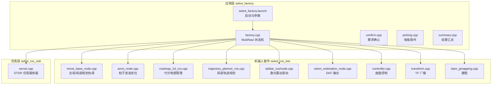
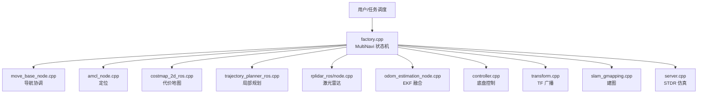
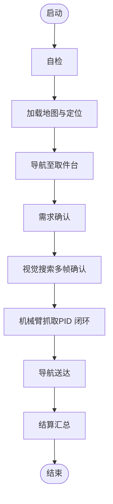
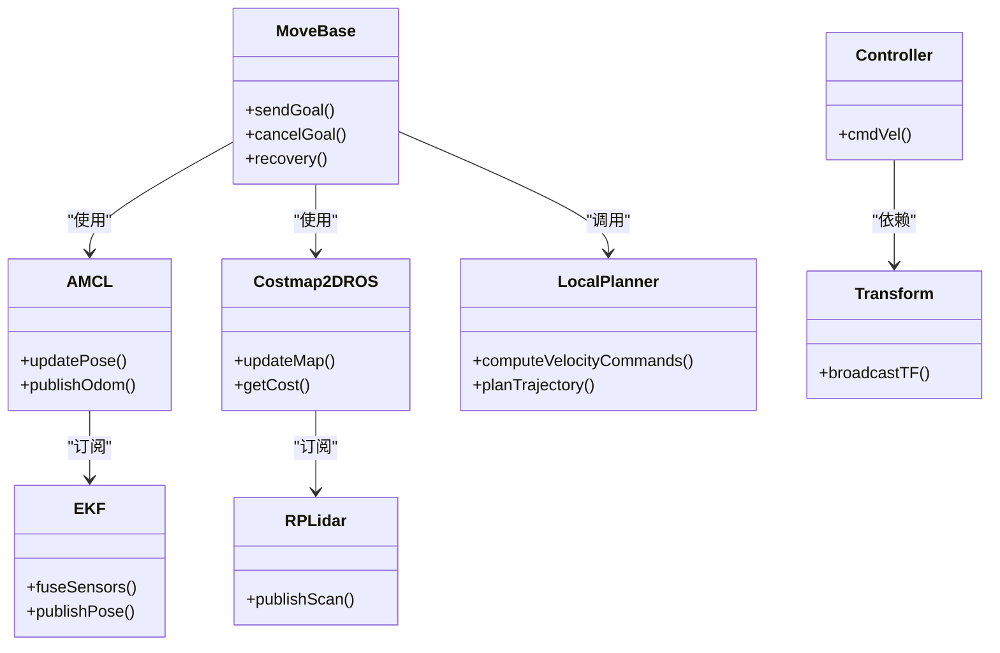
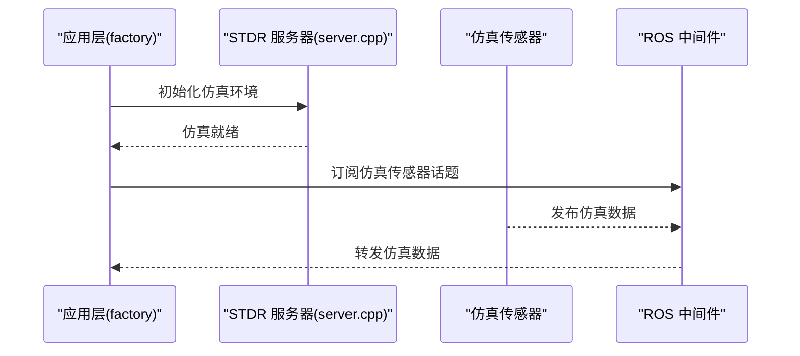
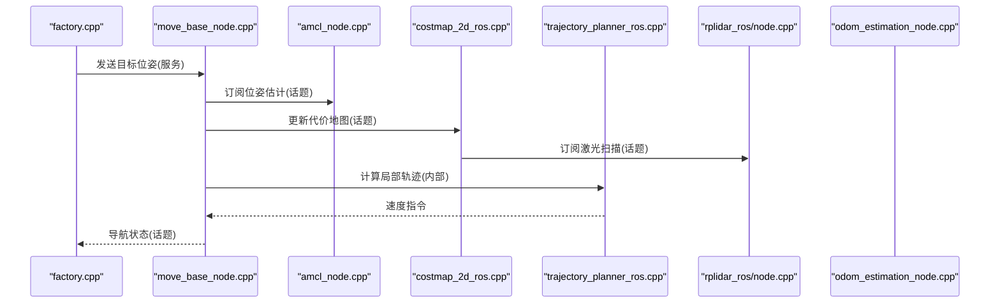
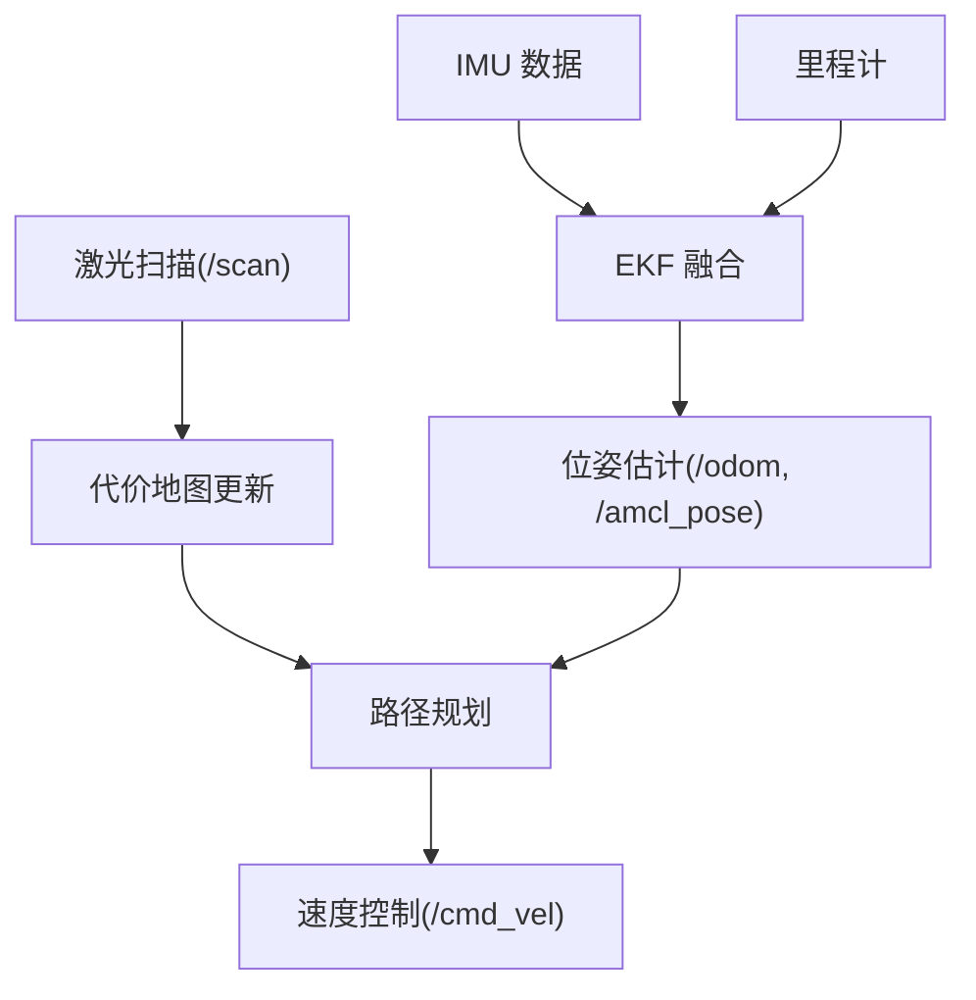
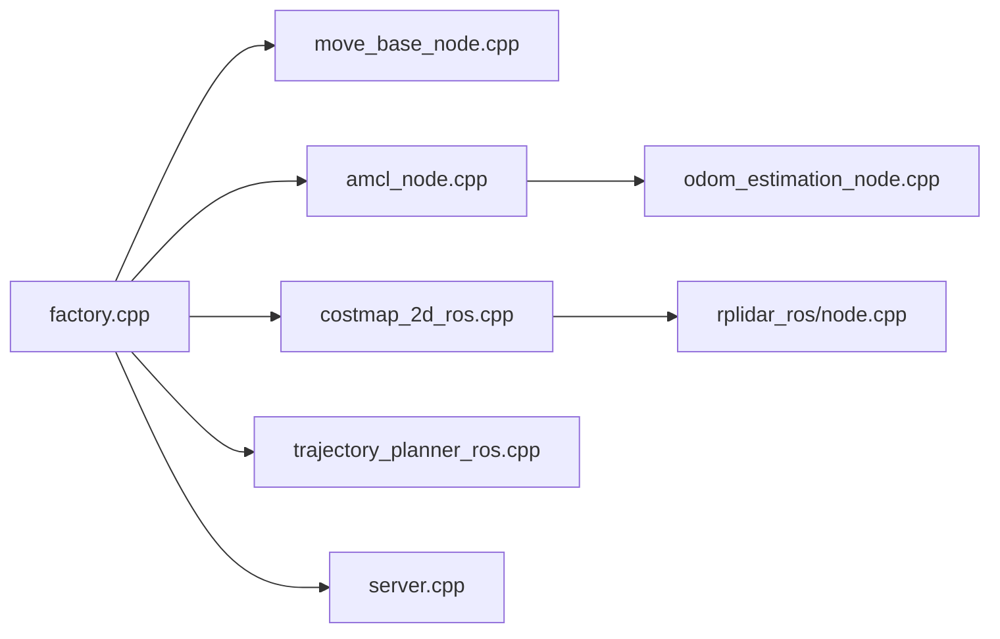

# 系统架构设计

<cite>
**本文引用的文件**   
- [sebot_factory/src/sebot_factory/factory.cpp](file://sebot_factory/src/sebot_factory/factory.cpp)
- [sebot_factory/src/sebot_factory/confirm.cpp](file://sebot_factory/src/sebot_factory/confirm.cpp)
- [sebot_factory/src/sebot_factory/picking.cpp](file://sebot_factory/src/sebot_factory/picking.cpp)
- [sebot_factory/src/sebot_factory/summary.cpp](file://sebot_factory/src/sebot_factory/summary.cpp)
- [sebot_factory/src/sebot_factory/launch/sebot_factory.launch](file://sebot_factory/src/sebot_factory/launch/sebot_factory.launch)
- [sebot_marking/src/main.cpp](file://sebot_marking/src/main.cpp)
- [sebot_robot/src/controller.cpp](file://sebot_robot/src/controller.cpp)
- [sebot_robot/src/transform.cpp](file://sebot_robot/src/transform.cpp)
- [sebot_navigation/move_base/src/move_base_node.cpp](file://sebot_navigation/move_base/src/move_base_node.cpp)
- [sebot_navigation/amcl/src/amcl_node.cpp](file://sebot_navigation/amcl/src/amcl_node.cpp)
- [sebot_navigation/costmap_2d/src/costmap_2d_ros.cpp](file://sebot_navigation/costmap_2d/src/costmap_2d_ros.cpp)
- [sebot_navigation/base_local_planner/src/trajectory_planner_ros.cpp](file://sebot_navigation/base_local_planner/src/trajectory_planner_ros.cpp)
- [sebot_driver/rplidar_ros/src/node.cpp](file://sebot_driver/rplidar_ros/src/node.cpp)
- [sebot_driver/robot_pose_ekf/src/odom_estimation_node.cpp](file://sebot_driver/robot_pose_ekf/src/odom_estimation_node.cpp)
- [sebot_slam/slam_gmapping/slam_gmapping/slam_gmapping.cpp](file://sebot_slam/slam_gmapping/slam_gmapping/slam_gmapping.cpp)
- [sebot_ros_stdr/stdr_server/src/server.cpp](file://sebot_ros_stdr/stdr_server/src/server.cpp)
</cite>

## 目录
1. [引言](#引言)
2. [项目结构](#项目结构)
3. [核心组件](#核心组件)
4. [架构总览](#架构总览)
5. [详细组件分析](#详细组件分析)
6. [依赖关系分析](#依赖关系分析)
7. [性能考量](#性能考量)
8. [故障排查指南](#故障排查指南)
9. [结论](#结论)
10. [附录](#附录)

## 引言
本仓库由三个相互独立的 catkin 工作空间组成：应用层 sebot_factory、机器人套件 sebot_ros_kits、仿真层 sebot_ros_stdr。比赛业务全链路为「上电自检 → 加载地图与 AMCL 定位 → 按订单导航至取件台 → 需求确认 → YOLO 视觉搜索（NPU 加速 Yolov3，多帧检测确认）→ 机械臂 PID 闭环抓取 → 导航送达并结算」。主状态机基于 MultiNavi 实现于应用层 factory.cpp，通过 ROS 节点间的话题、服务与参数进行通信，结合 TF 坐标系变换与传感器数据融合，形成高内聚、低耦合的模块化系统。

## 项目结构
- 应用层 sebot_factory
  - 核心业务节点：factory（状态机）、confirm（需求确认）、picking（智能取件）、summary（结算汇总）
  - 启动配置：sebot_factory.launch（simulation 切换 STDR 仿真模式、debug 控制图像识别界面开关；导航超时、PID、取件距离、补扫等关键参数集中配置）
- 机器人套件 sebot_ros_kits
  - 驱动与硬件抽象：rplidar_ros（激光雷达）、robot_pose_ekf（里程计/EKF 融合）、sebot_robot（底盘控制器、TF 广播）
  - 导航栈：move_base + AMCL + DWA/local planner + costmap_2d + map_server
  - SLAM：slam_gmapping / slam_hector
  - 语音与视觉：sebot_speech、sebot_visions
- 仿真层 sebot_ros_stdr
  - stdr_server 提供物理仿真环境，stdr_* 包集成 AMCL、MoveIt!、导航与 GUI

**图表来源** 
- [sebot_factory/src/sebot_factory/factory.cpp](file://sebot_factory/src/sebot_factory/factory.cpp)
- [sebot_factory/src/sebot_factory/launch/sebot_factory.launch](file://sebot_factory/src/sebot_factory/launch/sebot_factory.launch)
- [sebot_navigation/move_base/src/move_base_node.cpp](file://sebot_navigation/move_base/src/move_base_node.cpp)
- [sebot_navigation/amcl/src/amcl_node.cpp](file://sebot_navigation/amcl/src/amcl_node.cpp)
- [sebot_navigation/costmap_2d/src/costmap_2d_ros.cpp](file://sebot_navigation/costmap_2d/src/costmap_2d_ros.cpp)
- [sebot_navigation/base_local_planner/src/trajectory_planner_ros.cpp](file://sebot_navigation/base_local_planner/src/trajectory_planner_ros.cpp)
- [sebot_driver/rplidar_ros/src/node.cpp](file://sebot_driver/rplidar_ros/src/node.cpp)
- [sebot_driver/robot_pose_ekf/src/odom_estimation_node.cpp](file://sebot_driver/robot_pose_ekf/src/odom_estimation_node.cpp)
- [sebot_robot/src/controller.cpp](file://sebot_robot/src/controller.cpp)
- [sebot_robot/src/transform.cpp](file://sebot_robot/src/transform.cpp)
- [sebot_slam/slam_gmapping/slam_gmapping/slam_gmapping.cpp](file://sebot_slam/slam_gmapping/slam_gmapping/slam_gmapping.cpp)
- [sebot_ros_stdr/stdr_server/src/server.cpp](file://sebot_ros_stdr/stdr_server/src/server.cpp)

**章节来源**
- [sebot_factory/src/sebot_factory/launch/sebot_factory.launch](file://sebot_factory/src/sebot_factory/launch/sebot_factory.launch)

## 核心组件
- 应用层状态机（MultiNavi）
  - 负责业务流程编排：自检、加载地图、AMCL 定位、导航到取件台、需求确认、视觉搜索、机械臂抓取、送达与结算
  - 通过 ROS 参数与话题/服务与底层模块交互
- 机器人套件
  - 驱动层：激光雷达、IMU、里程计、底盘控制器、TF 广播
  - 导航层：move_base 协调全局/局部规划，AMCL 定位，costmap_2d 代价地图，DWA 局部规划
  - SLAM：Gmapping/Hector 建图
- 仿真层
  - STDR 仿真服务器提供物理环境与传感器仿真，便于开发与调试

**章节来源**
- [sebot_factory/src/sebot_factory/factory.cpp](file://sebot_factory/src/sebot_factory/factory.cpp)
- [sebot_navigation/move_base/src/move_base_node.cpp](file://sebot_navigation/move_base/src/move_base_node.cpp)
- [sebot_navigation/amcl/src/amcl_node.cpp](file://sebot_navigation/amcl/src/amcl_node.cpp)
- [sebot_navigation/costmap_2d/src/costmap_2d_ros.cpp](file://sebot_navigation/costmap_2d/src/costmap_2d_ros.cpp)
- [sebot_navigation/base_local_planner/src/trajectory_planner_ros.cpp](file://sebot_navigation/base_local_planner/src/trajectory_planner_ros.cpp)
- [sebot_driver/rplidar_ros/src/node.cpp](file://sebot_driver/rplidar_ros/src/node.cpp)
- [sebot_driver/robot_pose_ekf/src/odom_estimation_node.cpp](file://sebot_driver/robot_pose_ekf/src/odom_estimation_node.cpp)
- [sebot_robot/src/controller.cpp](file://sebot_robot/src/controller.cpp)
- [sebot_robot/src/transform.cpp](file://sebot_robot/src/transform.cpp)
- [sebot_slam/slam_gmapping/slam_gmapping/slam_gmapping.cpp](file://sebot_slam/slam_gmapping/slam_gmapping/slam_gmapping.cpp)
- [sebot_ros_stdr/stdr_server/src/server.cpp](file://sebot_ros_stdr/stdr_server/src/server.cpp)

## 架构总览
系统采用三层架构：应用层（状态机与业务编排）、机器人套件（驱动与导航）、仿真层（STDR）。各层通过 ROS 通信机制解耦，支持热插拔与扩展。

**图表来源** 
- [sebot_factory/src/sebot_factory/factory.cpp](file://sebot_factory/src/sebot_factory/factory.cpp)
- [sebot_navigation/move_base/src/move_base_node.cpp](file://sebot_navigation/move_base/src/move_base_node.cpp)
- [sebot_navigation/amcl/src/amcl_node.cpp](file://sebot_navigation/amcl/src/amcl_node.cpp)
- [sebot_navigation/costmap_2d/src/costmap_2d_ros.cpp](file://sebot_navigation/costmap_2d/src/costmap_2d_ros.cpp)
- [sebot_navigation/base_local_planner/src/trajectory_planner_ros.cpp](file://sebot_navigation/base_local_planner/src/trajectory_planner_ros.cpp)
- [sebot_driver/rplidar_ros/src/node.cpp](file://sebot_driver/rplidar_ros/src/node.cpp)
- [sebot_driver/robot_pose_ekf/src/odom_estimation_node.cpp](file://sebot_driver/robot_pose_ekf/src/odom_estimation_node.cpp)
- [sebot_robot/src/controller.cpp](file://sebot_robot/src/controller.cpp)
- [sebot_robot/src/transform.cpp](file://sebot_robot/src/transform.cpp)
- [sebot_slam/slam_gmapping/slam_gmapping/slam_gmapping.cpp](file://sebot_slam/slam_gmapping/slam_gmapping/slam_gmapping.cpp)
- [sebot_ros_stdr/stdr_server/src/server.cpp](file://sebot_ros_stdr/stdr_server/src/server.cpp)

## 详细组件分析

### 应用层状态机（MultiNavi）与业务流程控制
- 设计理念
  - 以状态机驱动业务流程，每个状态对应一个子任务（自检、定位、导航、确认、视觉、抓取、结算）
  - 使用 ROS 参数与话题/服务进行跨节点通信，保持松耦合
- 关键流程
  - 上电自检：检查传感器、通信、资源可用性
  - 加载地图与 AMCL 定位：读取地图、初始化粒子滤波
  - 导航至取件台：调用 move_base 发送目标位姿
  - 需求确认：confirm 节点订阅相关话题，验证任务条件
  - 视觉搜索：YOLO 多帧检测确认，阈值判定
  - 机械臂抓取：PID 闭环控制，力控与位置反馈
  - 导航送达与结算：summary 节点统计与上报
- 扩展点
  - 新增状态或子任务时，仅需在状态机中注册新状态与回调，并通过 ROS 接口与子系统交互

**图表来源** 
- [sebot_factory/src/sebot_factory/factory.cpp](file://sebot_factory/src/sebot_factory/factory.cpp)
- [sebot_factory/src/sebot_factory/confirm.cpp](file://sebot_factory/src/sebot_factory/confirm.cpp)
- [sebot_factory/src/sebot_factory/picking.cpp](file://sebot_factory/src/sebot_factory/picking.cpp)
- [sebot_factory/src/sebot_factory/summary.cpp](file://sebot_factory/src/sebot_factory/summary.cpp)

**章节来源**
- [sebot_factory/src/sebot_factory/factory.cpp](file://sebot_factory/src/sebot_factory/factory.cpp)
- [sebot_factory/src/sebot_factory/confirm.cpp](file://sebot_factory/src/sebot_factory/confirm.cpp)
- [sebot_factory/src/sebot_factory/picking.cpp](file://sebot_factory/src/sebot_factory/picking.cpp)
- [sebot_factory/src/sebot_factory/summary.cpp](file://sebot_factory/src/sebot_factory/summary.cpp)

### 机器人套件的模块化设计
- 驱动层
  - rplidar_ros：发布激光扫描话题，供代价地图与 SLAM 使用
  - robot_pose_ekf：融合 IMU 与里程计，输出稳定位姿估计
  - sebot_robot.controller：接收速度指令，驱动底盘
  - sebot_robot.transform：广播 TF 树，统一坐标系
- 导航层
  - move_base：协调全局/局部规划器，处理恢复行为
  - AMCL：基于激光与地图的粒子滤波定位
  - costmap_2d：维护静态/动态/膨胀层代价地图
  - base_local_planner（DWA）：生成局部轨迹并评估安全性
- SLAM
  - slam_gmapping：基于激光的实时建图，输出栅格地图
- 扩展点
  - 替换传感器驱动或规划器时，只需遵循 ROS 接口规范，无需修改上层状态机

**图表来源** 
- [sebot_navigation/move_base/src/move_base_node.cpp](file://sebot_navigation/move_base/src/move_base_node.cpp)
- [sebot_navigation/amcl/src/amcl_node.cpp](file://sebot_navigation/amcl/src/amcl_node.cpp)
- [sebot_navigation/costmap_2d/src/costmap_2d_ros.cpp](file://sebot_navigation/costmap_2d/src/costmap_2d_ros.cpp)
- [sebot_navigation/base_local_planner/src/trajectory_planner_ros.cpp](file://sebot_navigation/base_local_planner/src/trajectory_planner_ros.cpp)
- [sebot_driver/rplidar_ros/src/node.cpp](file://sebot_driver/rplidar_ros/src/node.cpp)
- [sebot_driver/robot_pose_ekf/src/odom_estimation_node.cpp](file://sebot_driver/robot_pose_ekf/src/odom_estimation_node.cpp)
- [sebot_robot/src/controller.cpp](file://sebot_robot/src/controller.cpp)
- [sebot_robot/src/transform.cpp](file://sebot_robot/src/transform.cpp)

**章节来源**
- [sebot_driver/rplidar_ros/src/node.cpp](file://sebot_driver/rplidar_ros/src/node.cpp)
- [sebot_driver/robot_pose_ekf/src/odom_estimation_node.cpp](file://sebot_driver/robot_pose_ekf/src/odom_estimation_node.cpp)
- [sebot_robot/src/controller.cpp](file://sebot_robot/src/controller.cpp)
- [sebot_robot/src/transform.cpp](file://sebot_robot/src/transform.cpp)
- [sebot_navigation/move_base/src/move_base_node.cpp](file://sebot_navigation/move_base/src/move_base_node.cpp)
- [sebot_navigation/amcl/src/amcl_node.cpp](file://sebot_navigation/amcl/src/amcl_node.cpp)
- [sebot_navigation/costmap_2d/src/costmap_2d_ros.cpp](file://sebot_navigation/costmap_2d/src/costmap_2d_ros.cpp)
- [sebot_navigation/base_local_planner/src/trajectory_planner_ros.cpp](file://sebot_navigation/base_local_planner/src/trajectory_planner_ros.cpp)

### 仿真层的插件机制（STDR）
- 角色与职责
  - stdr_server 提供物理引擎与传感器仿真，支持多种机器人模型与环境
  - 通过插件机制加载不同传感器、机器人动力学与场景资源
- 集成方式
  - 在 launch 中启用 simulation 参数切换 STDR 模式，应用层无需改动
  - 通过 stdr_msgs 定义消息与服务，与 ROS 生态无缝对接

**图表来源** 
- [sebot_ros_stdr/stdr_server/src/server.cpp](file://sebot_ros_stdr/stdr_server/src/server.cpp)

**章节来源**
- [sebot_ros_stdr/stdr_server/src/server.cpp](file://sebot_ros_stdr/stdr_server/src/server.cpp)

### ROS 节点间通信架构（话题、服务、参数）
- 话题（Topics）
  - 激光扫描：/scan（rplidar_ros）
  - 里程计/位姿：/odom、/amcl_pose（EKF、AMCL）
  - 控制指令：/cmd_vel（controller）
  - 视觉结果：/detection、/confirmation（confirm/picking）
- 服务（Services）
  - 导航目标：move_base 的 Goal/Cancel
  - 地图服务：/static_map、/get_map（map_server）
- 参数（Parameters）
  - 导航超时、PID 增益、取件距离、补扫策略、仿真模式、debug 开关等集中在 launch 配置

**图表来源** 
- [sebot_factory/src/sebot_factory/factory.cpp](file://sebot_factory/src/sebot_factory/factory.cpp)
- [sebot_navigation/move_base/src/move_base_node.cpp](file://sebot_navigation/move_base/src/move_base_node.cpp)
- [sebot_navigation/amcl/src/amcl_node.cpp](file://sebot_navigation/amcl/src/amcl_node.cpp)
- [sebot_navigation/costmap_2d/src/costmap_2d_ros.cpp](file://sebot_navigation/costmap_2d/src/costmap_2d_ros.cpp)
- [sebot_navigation/base_local_planner/src/trajectory_planner_ros.cpp](file://sebot_navigation/base_local_planner/src/trajectory_planner_ros.cpp)
- [sebot_driver/rplidar_ros/src/node.cpp](file://sebot_driver/rplidar_ros/src/node.cpp)
- [sebot_driver/robot_pose_ekf/src/odom_estimation_node.cpp](file://sebot_driver/robot_pose_ekf/src/odom_estimation_node.cpp)

**章节来源**
- [sebot_factory/src/sebot_factory/launch/sebot_factory.launch](file://sebot_factory/src/sebot_factory/launch/sebot_factory.launch)

### 坐标系变换（TF）与传感器数据融合
- TF 树
  - base_link → odom → map（EKF 与 AMCL 共同维护）
  - 传感器框架（如 laser、camera）通过 transform 广播
- 数据融合
  - EKF 融合 IMU 与里程计，提高位姿稳定性
  - AMCL 利用激光与地图修正定位漂移
  - costmap_2d 将激光数据转换为障碍物代价

**图表来源** 
- [sebot_robot/src/transform.cpp](file://sebot_robot/src/transform.cpp)
- [sebot_driver/robot_pose_ekf/src/odom_estimation_node.cpp](file://sebot_driver/robot_pose_ekf/src/odom_estimation_node.cpp)
- [sebot_navigation/costmap_2d/src/costmap_2d_ros.cpp](file://sebot_navigation/costmap_2d/src/costmap_2d_ros.cpp)
- [sebot_navigation/amcl/src/amcl_node.cpp](file://sebot_navigation/amcl/src/amcl_node.cpp)

**章节来源**
- [sebot_robot/src/transform.cpp](file://sebot_robot/src/transform.cpp)
- [sebot_driver/robot_pose_ekf/src/odom_estimation_node.cpp](file://sebot_driver/robot_pose_ekf/src/odom_estimation_node.cpp)
- [sebot_navigation/costmap_2d/src/costmap_2d_ros.cpp](file://sebot_navigation/costmap_2d/src/costmap_2d_ros.cpp)
- [sebot_navigation/amcl/src/amcl_node.cpp](file://sebot_navigation/amcl/src/amcl_node.cpp)

### 建图与标注工具（sebot_marking）
- Qt 上位机用于地图标注与可视化，辅助构建高精度地图
- 与 SLAM 流程配合，提升建图质量与一致性

**章节来源**
- [sebot_marking/src/main.cpp](file://sebot_marking/src/main.cpp)
- [sebot_slam/slam_gmapping/slam_gmapping/slam_gmapping.cpp](file://sebot_slam/slam_gmapping/slam_gmapping/slam_gmapping.cpp)

## 依赖关系分析
- 应用层依赖导航栈与驱动层，通过 ROS 接口解耦
- 导航栈依赖传感器与 TF，成本地图与规划器可替换
- 仿真层通过插件机制扩展，不影响应用层逻辑

**图表来源** 
- [sebot_factory/src/sebot_factory/factory.cpp](file://sebot_factory/src/sebot_factory/factory.cpp)
- [sebot_navigation/move_base/src/move_base_node.cpp](file://sebot_navigation/move_base/src/move_base_node.cpp)
- [sebot_navigation/amcl/src/amcl_node.cpp](file://sebot_navigation/amcl/src/amcl_node.cpp)
- [sebot_navigation/costmap_2d/src/costmap_2d_ros.cpp](file://sebot_navigation/costmap_2d/src/costmap_2d_ros.cpp)
- [sebot_navigation/base_local_planner/src/trajectory_planner_ros.cpp](file://sebot_navigation/base_local_planner/src/trajectory_planner_ros.cpp)
- [sebot_driver/rplidar_ros/src/node.cpp](file://sebot_driver/rplidar_ros/src/node.cpp)
- [sebot_driver/robot_pose_ekf/src/odom_estimation_node.cpp](file://sebot_driver/robot_pose_ekf/src/odom_estimation_node.cpp)
- [sebot_ros_stdr/stdr_server/src/server.cpp](file://sebot_ros_stdr/stdr_server/src/server.cpp)

**章节来源**
- [sebot_factory/src/sebot_factory/factory.cpp](file://sebot_factory/src/sebot_factory/factory.cpp)
- [sebot_navigation/move_base/src/move_base_node.cpp](file://sebot_navigation/move_base/src/move_base_node.cpp)
- [sebot_navigation/amcl/src/amcl_node.cpp](file://sebot_navigation/amcl/src/amcl_node.cpp)
- [sebot_navigation/costmap_2d/src/costmap_2d_ros.cpp](file://sebot_navigation/costmap_2d/src/costmap_2d_ros.cpp)
- [sebot_navigation/base_local_planner/src/trajectory_planner_ros.cpp](file://sebot_navigation/base_local_planner/src/trajectory_planner_ros.cpp)
- [sebot_driver/rplidar_ros/src/node.cpp](file://sebot_driver/rplidar_ros/src/node.cpp)
- [sebot_driver/robot_pose_ekf/src/odom_estimation_node.cpp](file://sebot_driver/robot_pose_ekf/src/odom_estimation_node.cpp)
- [sebot_ros_stdr/stdr_server/src/server.cpp](file://sebot_ros_stdr/stdr_server/src/server.cpp)

## 性能考量
- 传感器频率与延迟
  - 激光雷达与 IMU 的高频数据需合理缓冲与降采样，避免阻塞
- 规划器计算开销
  - 局部规划器（DWA）在高动态场景中需平衡精度与实时性
- 内存与 CPU
  - 代价地图分辨率与视野范围影响内存占用；SLAM 建图过程需监控 CPU 负载
- 仿真模式
  - STDR 仿真可降低硬件依赖，但需注意仿真与实机的时间同步与延迟差异

[本节为通用指导，不直接分析具体文件]

## 故障排查指南
- 常见问题
  - 定位漂移：检查 AMCL 参数与激光数据质量，确认 TF 树正确
  - 碰撞或停滞：调整 costmap_2d 膨胀半径与局部规划器参数
  - 抓取失败：校准机械臂坐标与视觉标定，优化 PID 参数
- 诊断工具
  - rosbag 录制与回放，rviz 可视化 TF 与代价地图
  - 日志级别与 debug 开关（launch 中配置）

**章节来源**
- [sebot_factory/src/sebot_factory/launch/sebot_factory.launch](file://sebot_factory/src/sebot_factory/launch/sebot_factory.launch)

## 结论
本系统通过三层架构与 ROS 通信机制实现了高内聚、低耦合的模块化设计。应用层状态机清晰编排业务流程，机器人套件提供稳定的驱动与导航能力，仿真层支持快速迭代与测试。开发者可通过扩展点与插件机制轻松添加新功能模块，满足竞赛与工程化需求。

[本节为总结，不直接分析具体文件]

## 附录
- 关键参数说明（示例）
  - simulation：切换 STDR 仿真模式
  - debug：控制图像识别界面开关
  - 导航超时、PID 增益、取件距离、补扫策略等均在 launch 中配置

**章节来源**
- [sebot_factory/src/sebot_factory/launch/sebot_factory.launch](file://sebot_factory/src/sebot_factory/launch/sebot_factory.launch)