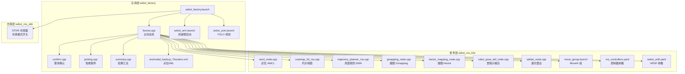
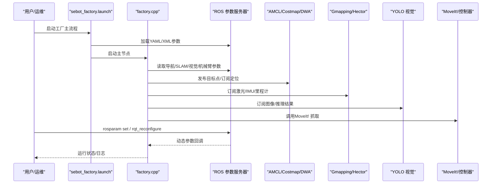
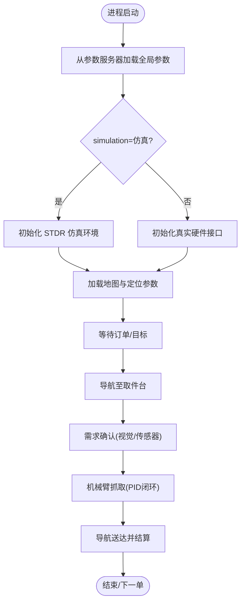
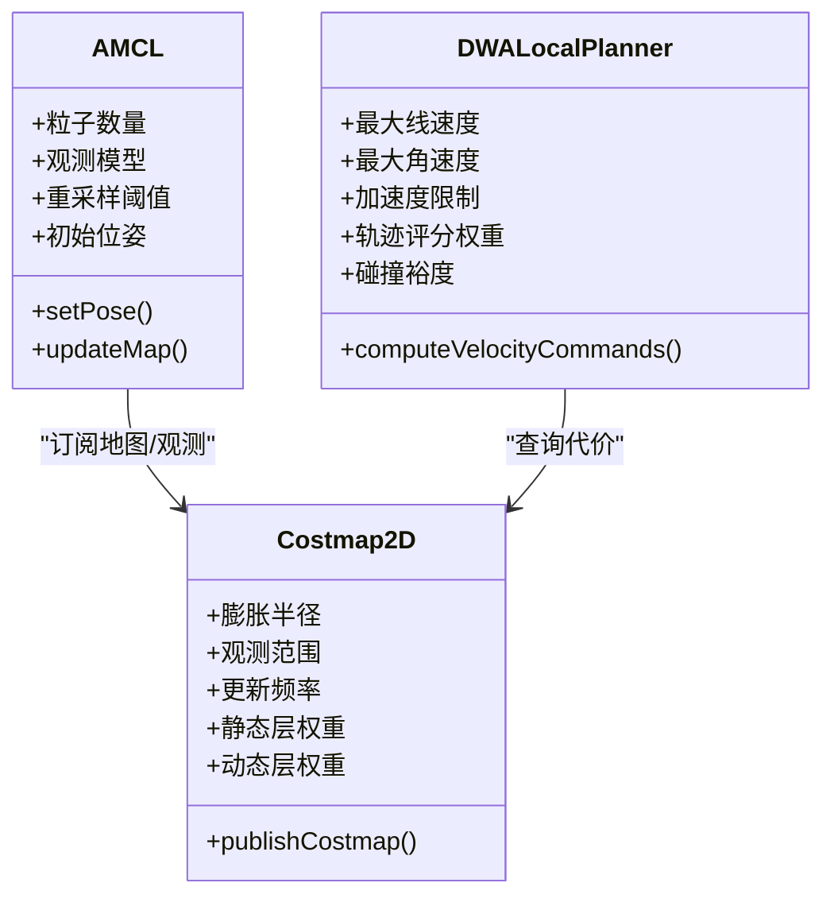
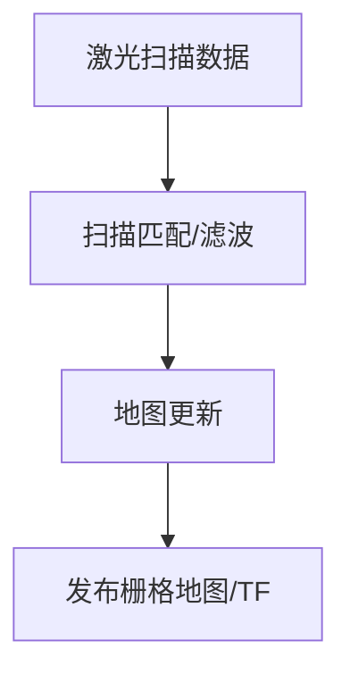
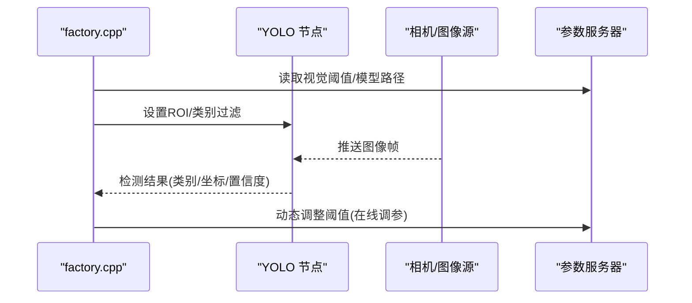
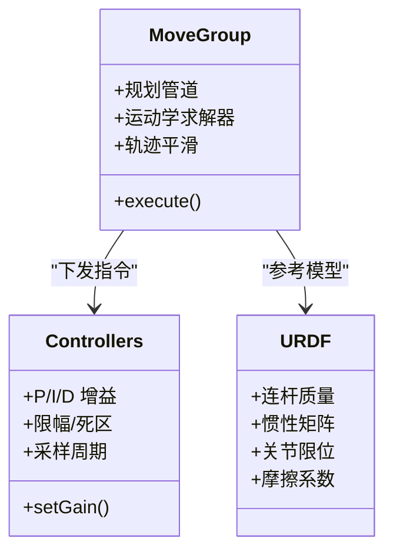
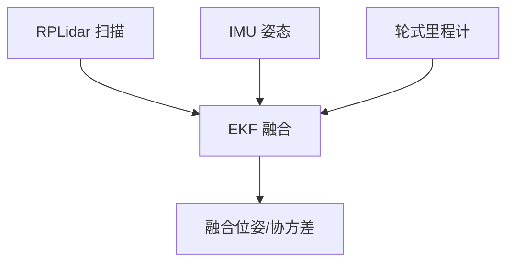
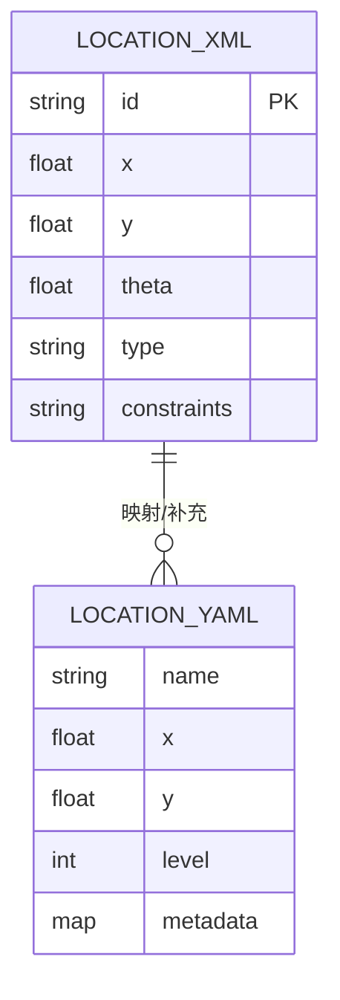
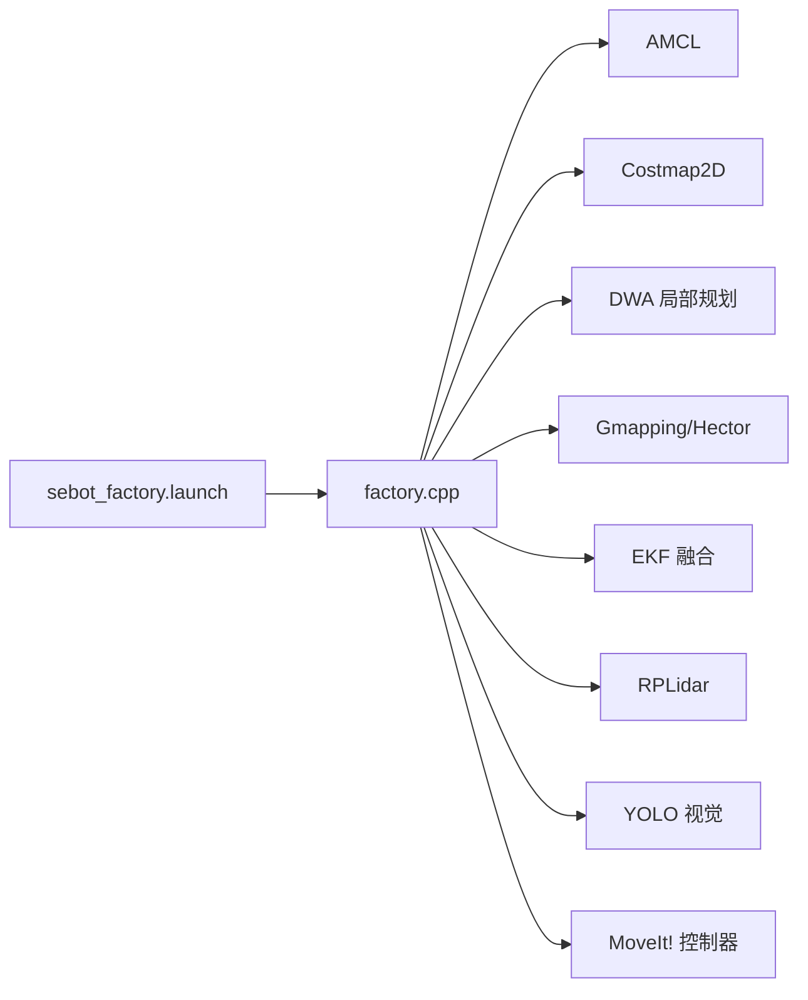

# 参数管理

<cite>
**本文引用的文件**   
- [sebot_factory.launch](file://sebot_factory/src/sebot_factory/launch/sebot_factory.launch)
- [factory.cpp](file://sebot_factory/src/sebot_factory/src/factory.cpp)
- [confirm.cpp](file://sebot_factory/src/sebot_factory/src/confirm.cpp)
- [picking.cpp](file://sebot_factory/src/sebot_factory/src/picking.cpp)
- [summary.cpp](file://sebot_factory/src/sebot_factory/src/summary.cpp)
- [sebot_arm.launch](file://sebot_factory/src/sebot_factory/launch/sebot_arm.launch)
- [sebot_yolo.launch](file://sebot_factory/src/sebot_factory/launch/sebot_yolo.launch)
- [location.xml](file://sebot_factory/src/sebot_factory/res/model_backup_20260704_160947/location.xml)
- [location.yaml](file://sebot_marking/src/sebot_marking/resources/location.yaml)
- [sebot_urdf.yaml](file://sebot_ros_kits/src/sebot_urdf/config/sebot_urdf.yaml)
- [move_group.launch](file://sebot_ros_kits/src/sebot_talon_moveit/launch/move_group.launch)
- [ros_controllers.yaml](file://sebot_ros_kits/src/sebot_talon_moveit/config/ros_controllers.yaml)
- [amcl_node.cpp](file://sebot_ros_kits/src/sebot_navigation/amcl/src/amcl_node.cpp)
- [costmap_2d_ros.cpp](file://sebot_ros_kits/src/sebot_navigation/costmap_2d/src/costmap_2d_ros.cpp)
- [trajectory_planner_ros.cpp](file://sebot_ros_kits/src/sebot_navigation/base_local_planner/src/trajectory_planner_ros.cpp)
- [gmapping_node.cpp](file://sebot_ros_kits/src/sebot_slam/slam_gmapping/slam_gmapping/gmapping_node.cpp)
- [hector_mapping_node.cpp](file://sebot_ros_kits/src/sebot_slam/slam_hector/hector_mapping/src/hector_mapping_node.cpp)
- [robot_pose_ekf_node.cpp](file://sebot_ros_kits/src/sebot_driver/robot_pose_ekf/src/odom_estimation_node.cpp)
- [rplidar_node.cpp](file://sebot_ros_kits/src/sebot_driver/rplidar_ros/src/node.cpp)
</cite>

## 目录
1. [简介](#简介)
2. [项目结构](#项目结构)
3. [核心组件](#核心组件)
4. [架构总览](#架构总览)
5. [详细组件分析](#详细组件分析)
6. [依赖关系分析](#依赖关系分析)
7. [性能与调优](#性能与调优)
8. [故障排查指南](#故障排查指南)
9. [结论](#结论)
10. [附录：参数清单与示例](#附录参数清单与示例)

## 简介
本文件面向 ROS 参数管理系统，聚焦工厂管理系统中的参数组织与加载机制。内容覆盖导航、SLAM、视觉识别、机械臂控制等关键配置项；说明 YAML/XML 配置文件格式、ROS 参数服务器使用方式以及动态参数重加载流程；并提供仿真模式切换、调试参数与性能优化参数的详细说明与使用示例。

## 项目结构
本项目由三个相互独立的 catkin 工作空间组成：
- sebot_factory（应用层）：业务主节点与任务编排、参数加载与状态机
- sebot_ros_kits（机器人套件）：驱动、导航栈、SLAM、MoveIt! 等基础能力
- sebot_ros_stdr（仿真层）：STDR 仿真器与配套 launch/参数

图表来源
- [sebot_factory.launch](file://sebot_factory/src/sebot_factory/launch/sebot_factory.launch)
- [factory.cpp](file://sebot_factory/src/sebot_factory/src/factory.cpp)
- [amcl_node.cpp](file://sebot_ros_kits/src/sebot_navigation/amcl/src/amcl_node.cpp)
- [costmap_2d_ros.cpp](file://sebot_ros_kits/src/sebot_navigation/costmap_2d/src/costmap_2d_ros.cpp)
- [trajectory_planner_ros.cpp](file://sebot_ros_kits/src/sebot_navigation/base_local_planner/src/trajectory_planner_ros.cpp)
- [gmapping_node.cpp](file://sebot_ros_kits/src/sebot_slam/slam_gmapping/slam_gmapping/gmapping_node.cpp)
- [hector_mapping_node.cpp](file://sebot_ros_kits/src/sebot_slam/slam_hector/hector_mapping/src/hector_mapping_node.cpp)
- [robot_pose_ekf_node.cpp](file://sebot_ros_kits/src/sebot_driver/robot_pose_ekf/src/odom_estimation_node.cpp)
- [rplidar_node.cpp](file://sebot_ros_kits/src/sebot_driver/rplidar_ros/src/node.cpp)
- [move_group.launch](file://sebot_ros_kits/src/sebot_talon_moveit/launch/move_group.launch)
- [ros_controllers.yaml](file://sebot_ros_kits/src/sebot_talon_moveit/config/ros_controllers.yaml)
- [sebot_urdf.yaml](file://sebot_ros_kits/src/sebot_urdf/config/sebot_urdf.yaml)

章节来源
- [sebot_factory.launch](file://sebot_factory/src/sebot_factory/launch/sebot_factory.launch)
- [factory.cpp](file://sebot_factory/src/sebot_factory/src/factory.cpp)

## 核心组件
- 应用层主节点（factory.cpp）：实现“上电自检 → 加载地图与 AMCL 定位 → 按订单导航至取件台 → 需求确认 → YOLO 视觉搜索 → 机械臂抓取 → 导航送达并结算”的完整状态机，集中读取并下发各子系统参数。
- 需求确认（confirm.cpp）：基于传感器/图像进行订单需求校验，受调试与阈值参数控制。
- 智能取件（picking.cpp）：调用 MoveIt! 完成轨迹规划与执行，受 PID、关节限位、速度加速度等参数影响。
- 结算汇总（summary.cpp）：统计任务指标并输出日志/服务响应。
- 启动入口（sebot_factory.launch）：统一装配各子模块，设置 simulation/debug 等全局开关，注入导航、SLAM、视觉、机械臂相关参数。

章节来源
- [factory.cpp](file://sebot_factory/src/sebot_factory/src/factory.cpp)
- [confirm.cpp](file://sebot_factory/src/sebot_factory/src/confirm.cpp)
- [picking.cpp](file://sebot_factory/src/sebot_factory/src/picking.cpp)
- [summary.cpp](file://sebot_factory/src/sebot_factory/src/summary.cpp)
- [sebot_factory.launch](file://sebot_factory/src/sebot_factory/launch/sebot_factory.launch)

## 架构总览
参数系统以 ROS 参数服务器为中心，通过 launch 文件集中声明，C++ 节点在初始化时 ros::param::get / set 拉取或写入，运行时可通过 rosparam 命令或 rqt_reconfigure 动态更新。

图表来源
- [sebot_factory.launch](file://sebot_factory/src/sebot_factory/launch/sebot_factory.launch)
- [factory.cpp](file://sebot_factory/src/sebot_factory/src/factory.cpp)
- [amcl_node.cpp](file://sebot_ros_kits/src/sebot_navigation/amcl/src/amcl_node.cpp)
- [costmap_2d_ros.cpp](file://sebot_ros_kits/src/sebot_navigation/costmap_2d/src/costmap_2d_ros.cpp)
- [trajectory_planner_ros.cpp](file://sebot_ros_kits/src/sebot_navigation/base_local_planner/src/trajectory_planner_ros.cpp)
- [gmapping_node.cpp](file://sebot_ros_kits/src/sebot_slam/slam_gmapping/slam_gmapping/gmapping_node.cpp)
- [hector_mapping_node.cpp](file://sebot_ros_kits/src/sebot_slam/slam_hector/hector_mapping/src/hector_mapping_node.cpp)
- [move_group.launch](file://sebot_ros_kits/src/sebot_talon_moveit/launch/move_group.launch)

## 详细组件分析

### 工厂主流程与参数加载（factory.cpp）
- 负责从参数服务器读取导航超时、PID、取件距离、补扫策略、仿真模式、调试开关等关键参数。
- 根据订单与当前位姿，组合导航目标、视觉检测窗口、机械臂动作序列。
- 提供参数监听回调，支持运行时调整行为（如提高/降低阈值、切换仿真）。

图表来源
- [factory.cpp](file://sebot_factory/src/sebot_factory/src/factory.cpp)
- [sebot_factory.launch](file://sebot_factory/src/sebot_factory/launch/sebot_factory.launch)

章节来源
- [factory.cpp](file://sebot_factory/src/sebot_factory/src/factory.cpp)

### 导航参数（AMCL + Costmap + DWA）
- AMCL 定位：粒子数、观测模型、重采样阈值、初始位姿分布等。
- 代价地图：膨胀半径、观测范围、更新频率、静态/动态层权重。
- 局部规划（DWA）：最大线/角速度、加速度限制、轨迹评分权重、碰撞裕度。

图表来源
- [amcl_node.cpp](file://sebot_ros_kits/src/sebot_navigation/amcl/src/amcl_node.cpp)
- [costmap_2d_ros.cpp](file://sebot_ros_kits/src/sebot_navigation/costmap_2d/src/costmap_2d_ros.cpp)
- [trajectory_planner_ros.cpp](file://sebot_ros_kits/src/sebot_navigation/base_local_planner/src/trajectory_planner_ros.cpp)

章节来源
- [amcl_node.cpp](file://sebot_ros_kits/src/sebot_navigation/amcl/src/amcl_node.cpp)
- [costmap_2d_ros.cpp](file://sebot_ros_kits/src/sebot_navigation/costmap_2d/src/costmap_2d_ros.cpp)
- [trajectory_planner_ros.cpp](file://sebot_ros_kits/src/sebot_navigation/base_local_planner/src/trajectory_planner_ros.cpp)

### SLAM 参数（Gmapping / Hector）
- Gmapping：激光扫描间隔、粒子数、地图分辨率、更新阈值。
- Hector：扫描匹配参数、时间同步、地图分辨率、收敛条件。

图表来源
- [gmapping_node.cpp](file://sebot_ros_kits/src/sebot_slam/slam_gmapping/slam_gmapping/gmapping_node.cpp)
- [hector_mapping_node.cpp](file://sebot_ros_kits/src/sebot_slam/slam_hector/hector_mapping/src/hector_mapping_node.cpp)

章节来源
- [gmapping_node.cpp](file://sebot_ros_kits/src/sebot_slam/slam_gmapping/slam_gmapping/gmapping_node.cpp)
- [hector_mapping_node.cpp](file://sebot_ros_kits/src/sebot_slam/slam_hector/hector_mapping/src/hector_mapping_node.cpp)

### 视觉识别参数（YOLO）
- 推理引擎路径、模型文件、标签列表、置信度阈值、NMS 阈值、多帧融合策略、ROI 区域、图像分辨率与帧率。
- 与 factory.cpp 联动：根据订单类别与位置动态调整 ROI 与阈值。

图表来源
- [sebot_yolo.launch](file://sebot_factory/src/sebot_factory/launch/sebot_yolo.launch)
- [factory.cpp](file://sebot_factory/src/sebot_factory/src/factory.cpp)

章节来源
- [sebot_yolo.launch](file://sebot_factory/src/sebot_factory/launch/sebot_yolo.launch)
- [factory.cpp](file://sebot_factory/src/sebot_factory/src/factory.cpp)

### 机械臂控制参数（MoveIt! / 控制器）
- MoveIt! 规划管道、运动学求解器、轨迹平滑、插值步长。
- 控制器 PID：比例/积分/微分增益、限幅、死区、采样周期。
- URDF 参数：连杆质量、惯性矩阵、关节限位、摩擦系数。

图表来源
- [move_group.launch](file://sebot_ros_kits/src/sebot_talon_moveit/launch/move_group.launch)
- [ros_controllers.yaml](file://sebot_ros_kits/src/sebot_talon_moveit/config/ros_controllers.yaml)
- [sebot_urdf.yaml](file://sebot_ros_kits/src/sebot_urdf/config/sebot_urdf.yaml)

章节来源
- [move_group.launch](file://sebot_ros_kits/src/sebot_talon_moveit/launch/move_group.launch)
- [ros_controllers.yaml](file://sebot_ros_kits/src/sebot_talon_moveit/config/ros_controllers.yaml)
- [sebot_urdf.yaml](file://sebot_ros_kits/src/sebot_urdf/config/sebot_urdf.yaml)

### 传感器与里程计融合（RPLidar + IMU + EKF）
- RPLidar：串口/网络地址、波特率、扫描频率、坐标系。
- IMU：校准偏移、噪声方差、协方差矩阵。
- EKF：融合权重、观测噪声、一致性检查。

图表来源
- [rplidar_node.cpp](file://sebot_ros_kits/src/sebot_driver/rplidar_ros/src/node.cpp)
- [robot_pose_ekf_node.cpp](file://sebot_ros_kits/src/sebot_driver/robot_pose_ekf/src/odom_estimation_node.cpp)

章节来源
- [rplidar_node.cpp](file://sebot_ros_kits/src/sebot_driver/rplidar_ros/src/node.cpp)
- [robot_pose_ekf_node.cpp](file://sebot_ros_kits/src/sebot_driver/robot_pose_ekf/src/odom_estimation_node.cpp)

### 点位与布局配置（XML/YAML）
- location.xml：定义取件/放置点位、相对位姿、可达性约束。
- location.yaml：标注工具生成的二维坐标与层级信息，便于上层解析。

图表来源
- [location.xml](file://sebot_factory/src/sebot_factory/res/model_backup_20260704_160947/location.xml)
- [location.yaml](file://sebot_marking/src/sebot_marking/resources/location.yaml)

章节来源
- [location.xml](file://sebot_factory/src/sebot_factory/res/model_backup_20260704_160947/location.xml)
- [location.yaml](file://sebot_marking/src/sebot_marking/resources/location.yaml)

## 依赖关系分析
- 启动依赖：sebot_factory.launch 依赖 move_group.launch、sebot_yolo.launch、导航/SLAM 相关 launch。
- 参数依赖：factory.cpp 依赖 AMCL/Costmap/DWA/Gmapping/Hector/EKF/RPLidar/MoveIt! 的参数命名空间。
- 运行时耦合：视觉与取件强耦合（检测结果触发抓取），导航与定位强耦合（AMCL 精度影响路径质量）。

图表来源
- [sebot_factory.launch](file://sebot_factory/src/sebot_factory/launch/sebot_factory.launch)
- [factory.cpp](file://sebot_factory/src/sebot_factory/src/factory.cpp)
- [amcl_node.cpp](file://sebot_ros_kits/src/sebot_navigation/amcl/src/amcl_node.cpp)
- [costmap_2d_ros.cpp](file://sebot_ros_kits/src/sebot_navigation/costmap_2d/src/costmap_2d_ros.cpp)
- [trajectory_planner_ros.cpp](file://sebot_ros_kits/src/sebot_navigation/base_local_planner/src/trajectory_planner_ros.cpp)
- [gmapping_node.cpp](file://sebot_ros_kits/src/sebot_slam/slam_gmapping/slam_gmapping/gmapping_node.cpp)
- [hector_mapping_node.cpp](file://sebot_ros_kits/src/sebot_slam/slam_hector/hector_mapping/src/hector_mapping_node.cpp)
- [robot_pose_ekf_node.cpp](file://sebot_ros_kits/src/sebot_driver/robot_pose_ekf/src/odom_estimation_node.cpp)
- [rplidar_node.cpp](file://sebot_ros_kits/src/sebot_driver/rplidar_ros/src/node.cpp)
- [move_group.launch](file://sebot_ros_kits/src/sebot_talon_moveit/launch/move_group.launch)

章节来源
- [sebot_factory.launch](file://sebot_factory/src/sebot_factory/launch/sebot_factory.launch)
- [factory.cpp](file://sebot_factory/src/sebot_factory/src/factory.cpp)

## 性能与调优
- 导航性能
  - AMCL 粒子数与重采样阈值：平衡定位精度与计算开销。
  - 代价地图更新频率与膨胀半径：避免频繁重建与过度保守。
  - DWA 轨迹采样步长与评分权重：提升局部避障效率与平滑度。
- SLAM 性能
  - Gmapping/Hector 地图分辨率与更新阈值：兼顾实时性与精度。
  - 激光扫描间隔与滤波：减少噪声与冗余计算。
- 视觉识别
  - 推理分辨率与帧率：降低分辨率可提速但可能损失小目标检测。
  - 置信度与 NMS 阈值：抑制误检与重复框。
  - 多帧融合策略：提高鲁棒性但增加延迟。
- 机械臂控制
  - PID 增益与限幅：避免超调与震荡，保证抓取稳定性。
  - 轨迹插值步长与平滑：减少抖动与能耗。
- 传感器融合
  - EKF 观测噪声与权重：提升位姿估计一致性。
  - RPLidar 扫描频率与 IMU 采样率：确保时序对齐与融合效果。

[本节为通用指导，不直接分析具体文件]

## 故障排查指南
- 启动失败
  - 检查 sebot_factory.launch 中 simulation/debug 开关是否正确。
  - 确认各子模块 launch 文件路径与参数命名空间一致。
- 定位漂移
  - 调整 AMCL 粒子数与观测模型参数；检查激光与 IMU 标定。
  - 增大代价地图膨胀半径以避免贴壁。
- 建图发散
  - 降低 Gmapping/Hector 地图分辨率与更新阈值；检查激光数据质量。
- 视觉误检
  - 上调置信度阈值；缩小 ROI；启用多帧融合。
- 抓取不稳
  - 调整 MoveIt! 轨迹平滑与控制器 PID；检查 URDF 惯性与限位。
- 动态参数无效
  - 确认节点是否注册了参数回调；使用 rosparam list 查看命名空间。

章节来源
- [sebot_factory.launch](file://sebot_factory/src/sebot_factory/launch/sebot_factory.launch)
- [factory.cpp](file://sebot_factory/src/sebot_factory/src/factory.cpp)
- [amcl_node.cpp](file://sebot_ros_kits/src/sebot_navigation/amcl/src/amcl_node.cpp)
- [costmap_2d_ros.cpp](file://sebot_ros_kits/src/sebot_navigation/costmap_2d/src/costmap_2d_ros.cpp)
- [gmapping_node.cpp](file://sebot_ros_kits/src/sebot_slam/slam_gmapping/slam_gmapping/gmapping_node.cpp)
- [hector_mapping_node.cpp](file://sebot_ros_kits/src/sebot_slam/slam_hector/hector_mapping/src/hector_mapping_node.cpp)
- [move_group.launch](file://sebot_ros_kits/src/sebot_talon_moveit/launch/move_group.launch)
- [ros_controllers.yaml](file://sebot_ros_kits/src/sebot_talon_moveit/config/ros_controllers.yaml)

## 结论
本参数管理体系以 launch 文件为入口、ROS 参数服务器为核心、C++ 节点为执行主体，贯穿导航、SLAM、视觉与机械臂全链路。通过合理的参数组织与动态重加载机制，可在仿真与真机之间快速切换，并在运行期灵活调优，保障工厂任务的稳定与高效。

[本节为总结，不直接分析具体文件]

## 附录：参数清单与示例
- 全局开关
  - simulation：true/false，切换 STDR 仿真模式
  - debug：true/false，开启图像识别界面与调试可视化
- 导航参数（AMCL/Costmap/DWA）
  - amcl/particles：粒子数量
  - costmap/inflation_radius：膨胀半径
  - dwa/max_vel_x, max_vel_theta：最大线/角速度
- SLAM 参数（Gmapping/Hector）
  - gmapping/map_resolution：地图分辨率
  - hector/update_frequency：更新频率
- 视觉参数（YOLO）
  - yolo/confidence_threshold：置信度阈值
  - yolo/nms_threshold：NMS 阈值
  - yolo/roi_x, roi_y, roi_w, roi_h：ROI 区域
- 机械臂参数（MoveIt!/控制器/URDF）
  - controllers/P, I, D：PID 增益
  - urdf/joint_limits/min, max：关节限位
- 传感器参数（RPLidar/EKF）
  - rplidar/baud_rate：波特率
  - ekf/observation_noise：观测噪声

章节来源
- [sebot_factory.launch](file://sebot_factory/src/sebot_factory/launch/sebot_factory.launch)
- [amcl_node.cpp](file://sebot_ros_kits/src/sebot_navigation/amcl/src/amcl_node.cpp)
- [costmap_2d_ros.cpp](file://sebot_ros_kits/src/sebot_navigation/costmap_2d/src/costmap_2d_ros.cpp)
- [trajectory_planner_ros.cpp](file://sebot_ros_kits/src/sebot_navigation/base_local_planner/src/trajectory_planner_ros.cpp)
- [gmapping_node.cpp](file://sebot_ros_kits/src/sebot_slam/slam_gmapping/slam_gmapping/gmapping_node.cpp)
- [hector_mapping_node.cpp](file://sebot_ros_kits/src/sebot_slam/slam_hector/hector_mapping/src/hector_mapping_node.cpp)
- [sebot_yolo.launch](file://sebot_factory/src/sebot_factory/launch/sebot_yolo.launch)
- [move_group.launch](file://sebot_ros_kits/src/sebot_talon_moveit/launch/move_group.launch)
- [ros_controllers.yaml](file://sebot_ros_kits/src/sebot_talon_moveit/config/ros_controllers.yaml)
- [sebot_urdf.yaml](file://sebot_ros_kits/src/sebot_urdf/config/sebot_urdf.yaml)
- [rplidar_node.cpp](file://sebot_ros_kits/src/sebot_driver/rplidar_ros/src/node.cpp)
- [robot_pose_ekf_node.cpp](file://sebot_ros_kits/src/sebot_driver/robot_pose_ekf/src/odom_estimation_node.cpp)