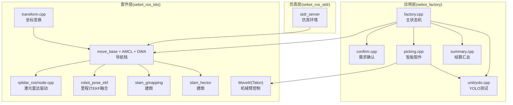
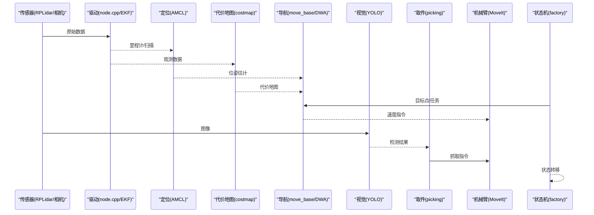
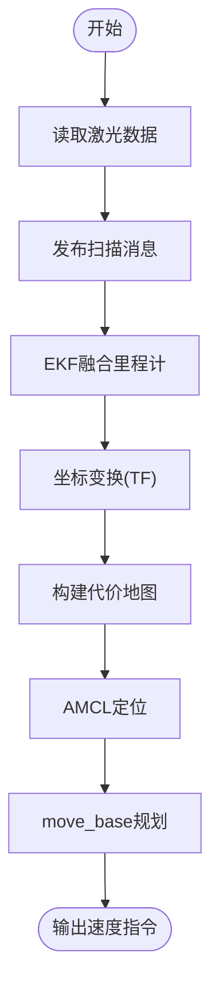
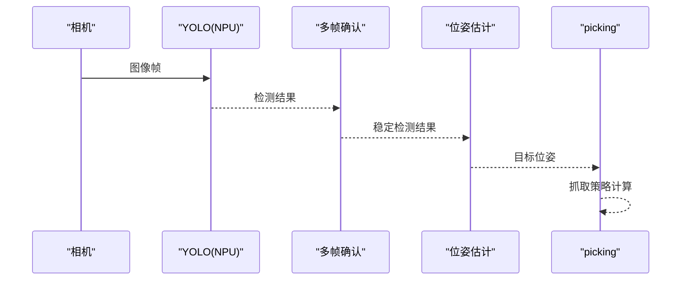
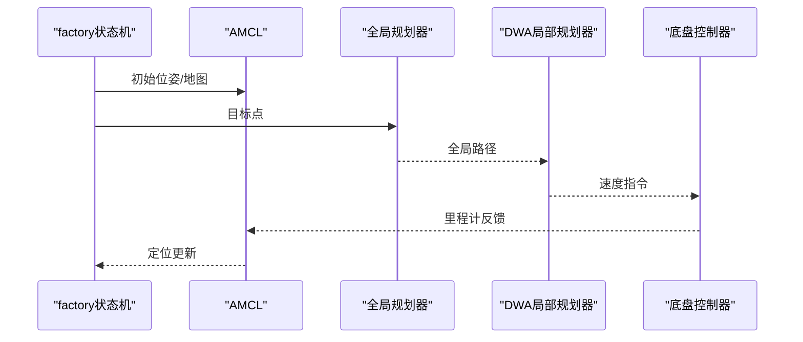
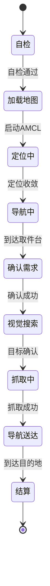
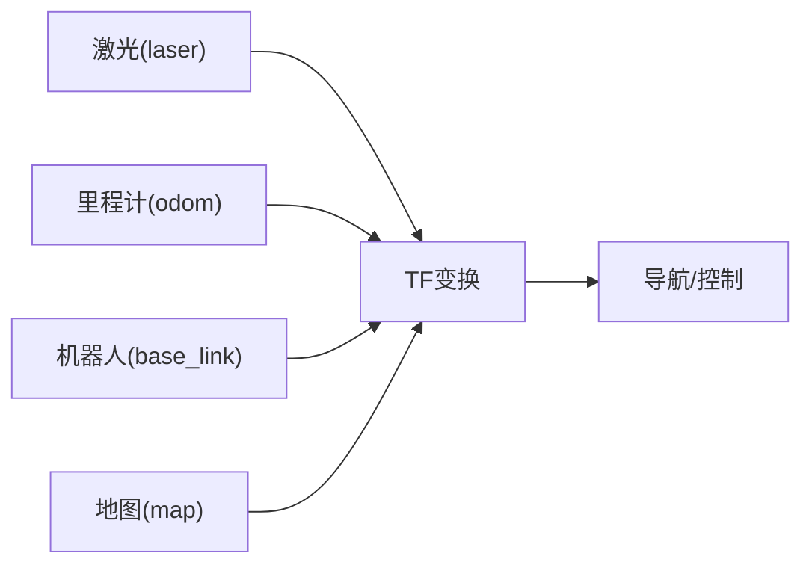
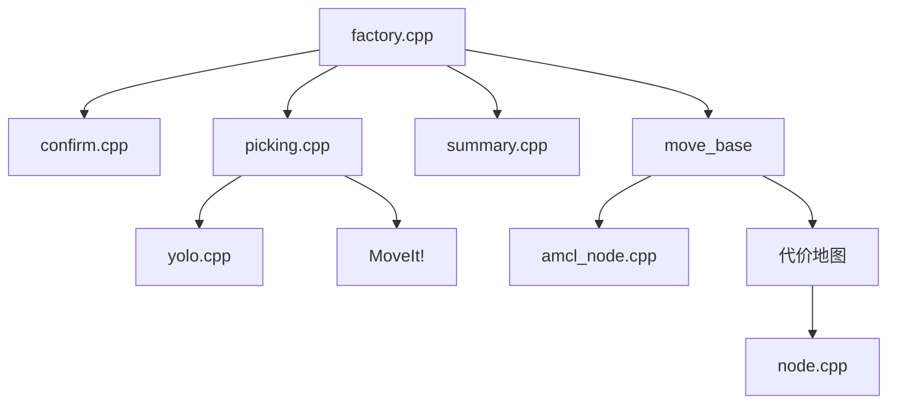

# 数据流分析

<cite>
**本文引用的文件**   
- [sebot_factory.launch](file://sebot_factory/launch/sebot_factory.launch)
- [factory.cpp](file://sebot_factory/src/factory.cpp)
- [confirm.cpp](file://sebot_factory/src/confirm.cpp)
- [picking.cpp](file://sebot_factory/src/picking.cpp)
- [summary.cpp](file://sebot_factory/src/summary.cpp)
- [yolo.cpp](file://sebot_factory/unit/yolo.cpp)
- [arm.hpp](file://sebot_factory/include/arm.hpp)
- [camera.hpp](file://sebot_factory/include/camera.hpp)
- [detection.hpp](file://sebot_factory/include/detection.hpp)
- [robot_pose_ekf.launch](file://sebot_ros_kits/src/sebot_driver/robot_pose_ekf/launch/robot_pose_ekf.launch)
- [node.cpp](file://sebot_ros_kits/src/sebot_driver/rplidar_ros/src/node.cpp)
- [amcl_node.cpp](file://sebot_ros_kits/src/sebot_navigation/amcl/src/amcl_node.cpp)
- [move_base](file://sebot_ros_kits/src/sebot_navigation/move_base)
- [gmapping](file://sebot_ros_kits/src/sebot_slam/slam_gmapping)
- [hector_mapping](file://sebot_ros_kits/src/sebot_slam/slam_hector)
- [sebot_urdf.launch](file://sebot_ros_kits/src/sebot_robot/launch/sebot_urdf.launch)
- [transform.cpp](file://sebot_ros_kits/src/sebot_robot/src/transform.cpp)
- [stdr_server](file://sebot_ros_stdr/src/stdr_server)
</cite>

## 目录
1. [引言](#引言)
2. [项目结构](#项目结构)
3. [核心组件](#核心组件)
4. [架构总览](#架构总览)
5. [详细组件分析](#详细组件分析)
6. [依赖关系分析](#依赖关系分析)
7. [性能考量](#性能考量)
8. [故障排查指南](#故障排查指南)
9. [结论](#结论)
10. [附录](#附录)

## 引言
本文件面向机器人竞赛系统的数据流，围绕“传感器数据采集 → 感知与融合 → 定位与建图 → 导航规划 → 视觉识别 → 机械臂控制 → 业务状态机”的完整链路进行系统化说明。重点覆盖：
- 激光雷达数据流（采集、滤波、坐标变换、代价地图构建）
- 视觉识别数据流（图像采集、NPU加速检测、多帧确认）
- 导航规划数据流（AMCL定位、全局/局部规划、DWA执行）
- 业务状态数据流（订单驱动的状态机、需求确认、取件、结算）

文档同时提供时序图、组件交互图、关键参数与监控方法，以及调试与优化建议，帮助读者快速定位问题并提升系统稳定性与实时性。

## 项目结构
本项目由三个相互独立的 catkin 工作空间组成：
- sebot_factory：应用层，包含工厂业务主节点、需求确认、智能取件、结算汇总及YOLO单元测试等
- sebot_ros_kits：机器人套件层，包含驱动（RPLidar）、EKF里程计、MoveIt!机械臂、导航栈（AMCL/DWA/move_base）、SLAM（Gmapping/Hector）等
- sebot_ros_stdr：仿真层，STDR仿真服务器与各配套包

启动入口集中在 sebot_factory/launch/sebot_factory.launch，通过 simulation 参数切换 STDR 仿真模式，debug 参数控制视觉界面开关；导航超时、PID、取件距离、补扫等关键参数均在此配置。

图表来源
- [sebot_factory.launch](file://sebot_factory/launch/sebot_factory.launch)
- [factory.cpp](file://sebot_factory/src/factory.cpp)
- [node.cpp](file://sebot_ros_kits/src/sebot_driver/rplidar_ros/src/node.cpp)
- [amcl_node.cpp](file://sebot_ros_kits/src/sebot_navigation/amcl/src/amcl_node.cpp)
- [move_base](file://sebot_ros_kits/src/sebot_navigation/move_base)
- [gmapping](file://sebot_ros_kits/src/sebot_slam/slam_gmapping)
- [hector_mapping](file://sebot_ros_kits/src/sebot_slam/slam_hector)
- [transform.cpp](file://sebot_ros_kits/src/sebot_robot/src/transform.cpp)
- [stdr_server](file://sebot_ros_stdr/src/stdr_server)

章节来源
- [sebot_factory.launch](file://sebot_factory/launch/sebot_factory.launch)

## 核心组件
- 主状态机 factory.cpp：按订单驱动“自检→加载地图与定位→导航至取件台→需求确认→视觉搜索→抓取→送达→结算”，协调各子节点与ROS话题/服务
- 需求确认 confirm.cpp：与用户交互或外部信号确认任务需求，触发后续流程
- 智能取件 picking.cpp：结合视觉检测结果与机械臂控制，完成闭环抓取
- 结算汇总 summary.cpp：统计订单信息，输出结果
- YOLO单元 yolo.cpp：调用NPU加速模型进行目标检测，支持多帧确认策略
- 传感器与驱动：RPLidar驱动 node.cpp 发布点云/扫描；robot_pose_ekf 融合IMU与轮速计得到稳定里程计
- 导航栈 move_base + AMCL + DWA：全局路径规划与局部避障
- 建图模块：Gmapping/Hector 根据激光数据生成栅格地图
- 坐标变换 transform.cpp：维护坐标系转换，确保传感器、机器人本体与地图坐标系一致
- 仿真 stdr_server：在STDR环境中提供传感器与环境的仿真数据

章节来源
- [factory.cpp](file://sebot_factory/src/factory.cpp)
- [confirm.cpp](file://sebot_factory/src/confirm.cpp)
- [picking.cpp](file://sebot_factory/src/picking.cpp)
- [summary.cpp](file://sebot_factory/src/summary.cpp)
- [yolo.cpp](file://sebot_factory/unit/yolo.cpp)
- [node.cpp](file://sebot_ros_kits/src/sebot_driver/rplidar_ros/src/node.cpp)
- [robot_pose_ekf.launch](file://sebot_ros_kits/src/sebot_driver/robot_pose_ekf/launch/robot_pose_ekf.launch)
- [amcl_node.cpp](file://sebot_ros_kits/src/sebot_navigation/amcl/src/amcl_node.cpp)
- [move_base](file://sebot_ros_kits/src/sebot_navigation/move_base)
- [gmapping](file://sebot_ros_kits/src/sebot_slam/slam_gmapping)
- [hector_mapping](file://sebot_ros_kits/src/sebot_slam/slam_hector)
- [transform.cpp](file://sebot_ros_kits/src/sebot_robot/src/transform.cpp)
- [stdr_server](file://sebot_ros_stdr/src/stdr_server)

## 架构总览
从传感器到控制的端到端数据流如下：
- 激光雷达数据流：RPLidar驱动发布扫描/点云 → EKF融合里程计 → AMCL粒子滤波定位 → costmap_2d构建代价地图 → move_base全局/局部规划 → DWA执行速度指令
- 视觉识别数据流：相机采集图像 → NPU加速YOLO检测 → 多帧确认过滤误检 → 目标位姿估计 → 传递给picking进行抓取
- 导航规划数据流：地图加载 → AMCL初始化定位 → 目标点下发 → 全局路径规划 → 局部轨迹生成与执行 → 到达判定
- 业务状态数据流：factory状态机驱动各阶段，confirm确认需求，picking执行抓取，summary汇总结算

图表来源
- [node.cpp](file://sebot_ros_kits/src/sebot_driver/rplidar_ros/src/node.cpp)
- [robot_pose_ekf.launch](file://sebot_ros_kits/src/sebot_driver/robot_pose_ekf/launch/robot_pose_ekf.launch)
- [amcl_node.cpp](file://sebot_ros_kits/src/sebot_navigation/amcl/src/amcl_node.cpp)
- [move_base](file://sebot_ros_kits/src/sebot_navigation/move_base)
- [yolo.cpp](file://sebot_factory/unit/yolo.cpp)
- [picking.cpp](file://sebot_factory/src/picking.cpp)
- [factory.cpp](file://sebot_factory/src/factory.cpp)

## 详细组件分析

### 激光雷达数据流
- 采集与发布：RPLidar驱动读取硬件数据，发布激光扫描消息
- 滤波与融合：robot_pose_ekf 将IMU与轮速计融合，输出稳定的里程计
- 坐标变换：transform.cpp 维护 base_link 与 laser、odom、map 之间的TF树
- 代价地图构建：costmap_2d 订阅扫描与里程计，更新障碍物层与膨胀层
- 定位与规划：AMCL 使用扫描匹配粒子滤波定位；move_base 基于全局/局部规划器生成轨迹

图表来源
- [node.cpp](file://sebot_ros_kits/src/sebot_driver/rplidar_ros/src/node.cpp)
- [robot_pose_ekf.launch](file://sebot_ros_kits/src/sebot_driver/robot_pose_ekf/launch/robot_pose_ekf.launch)
- [transform.cpp](file://sebot_ros_kits/src/sebot_robot/src/transform.cpp)
- [amcl_node.cpp](file://sebot_ros_kits/src/sebot_navigation/amcl/src/amcl_node.cpp)
- [move_base](file://sebot_ros_kits/src/sebot_navigation/move_base)

章节来源
- [node.cpp](file://sebot_ros_kits/src/sebot_driver/rplidar_ros/src/node.cpp)
- [robot_pose_ekf.launch](file://sebot_ros_kits/src/sebot_driver/robot_pose_ekf/launch/robot_pose_ekf.launch)
- [transform.cpp](file://sebot_ros_kits/src/sebot_robot/src/transform.cpp)
- [amcl_node.cpp](file://sebot_ros_kits/src/sebot_navigation/amcl/src/amcl_node.cpp)
- [move_base](file://sebot_ros_kits/src/sebot_navigation/move_base)

### 视觉识别数据流
- 图像采集：相机节点获取RGB图像
- NPU加速检测：YOLO模型推理，输出目标类别与边界框
- 多帧确认：对连续帧检测结果进行一致性校验，降低误检率
- 位姿估计：结合相机标定与深度信息（如有）估算目标相对位姿
- 传递结果：将检测结果与位姿发送给picking进行抓取

图表来源
- [yolo.cpp](file://sebot_factory/unit/yolo.cpp)
- [picking.cpp](file://sebot_factory/src/picking.cpp)

章节来源
- [yolo.cpp](file://sebot_factory/unit/yolo.cpp)
- [picking.cpp](file://sebot_factory/src/picking.cpp)

### 导航规划数据流
- 地图加载：map_server 加载栅格地图
- 定位初始化：AMCL 使用先验位姿或全局定位
- 目标下发：上层状态机发送目标点
- 全局规划：A*/Dijkstra等算法生成全局路径
- 局部规划：DWA生成可执行轨迹并规避动态障碍
- 执行与反馈：速度指令下发至底盘，里程计反馈位置更新

图表来源
- [amcl_node.cpp](file://sebot_ros_kits/src/sebot_navigation/amcl/src/amcl_node.cpp)
- [move_base](file://sebot_ros_kits/src/sebot_navigation/move_base)

章节来源
- [amcl_node.cpp](file://sebot_ros_kits/src/sebot_navigation/amcl/src/amcl_node.cpp)
- [move_base](file://sebot_ros_kits/src/sebot_navigation/move_base)

### 业务状态数据流
- 上电自检：检查传感器、通信、电源等状态
- 加载地图与定位：启动map_server与AMCL，等待定位收敛
- 导航至取件台：根据订单目标点规划路径
- 需求确认：confirm节点与用户或外部系统确认任务细节
- 视觉搜索：YOLO检测目标，多帧确认后进入抓取
- 抓取与送达：picking协调机械臂抓取，导航送至目的地
- 结算汇总：summary节点统计并输出结果

图表来源
- [factory.cpp](file://sebot_factory/src/factory.cpp)
- [confirm.cpp](file://sebot_factory/src/confirm.cpp)
- [picking.cpp](file://sebot_factory/src/picking.cpp)
- [summary.cpp](file://sebot_factory/src/summary.cpp)

章节来源
- [factory.cpp](file://sebot_factory/src/factory.cpp)
- [confirm.cpp](file://sebot_factory/src/confirm.cpp)
- [picking.cpp](file://sebot_factory/src/picking.cpp)
- [summary.cpp](file://sebot_factory/src/summary.cpp)

### 坐标变换与数据对齐
- TF树维护：base_link、laser、odom、map等坐标系间的变换
- 时间同步：确保传感器数据与位姿在同一时间戳下处理
- 标定参数：相机内参、外参与激光安装偏移需准确

图表来源
- [transform.cpp](file://sebot_ros_kits/src/sebot_robot/src/transform.cpp)

章节来源
- [transform.cpp](file://sebot_ros_kits/src/sebot_robot/src/transform.cpp)

## 依赖关系分析
- 应用层依赖套件层提供的传感器驱动、导航与机械臂控制接口
- 导航栈依赖里程计、激光扫描与地图
- 视觉模块依赖相机与NPU推理能力
- 仿真层为开发测试提供替代数据源

图表来源
- [factory.cpp](file://sebot_factory/src/factory.cpp)
- [confirm.cpp](file://sebot_factory/src/confirm.cpp)
- [picking.cpp](file://sebot_factory/src/picking.cpp)
- [summary.cpp](file://sebot_factory/src/summary.cpp)
- [yolo.cpp](file://sebot_factory/unit/yolo.cpp)
- [amcl_node.cpp](file://sebot_ros_kits/src/sebot_navigation/amcl/src/amcl_node.cpp)
- [node.cpp](file://sebot_ros_kits/src/sebot_driver/rplidar_ros/src/node.cpp)
- [move_base](file://sebot_ros_kits/src/sebot_navigation/move_base)

章节来源
- [factory.cpp](file://sebot_factory/src/factory.cpp)
- [confirm.cpp](file://sebot_factory/src/confirm.cpp)
- [picking.cpp](file://sebot_factory/src/picking.cpp)
- [summary.cpp](file://sebot_factory/src/summary.cpp)
- [yolo.cpp](file://sebot_factory/unit/yolo.cpp)
- [amcl_node.cpp](file://sebot_ros_kits/src/sebot_navigation/amcl/src/amcl_node.cpp)
- [node.cpp](file://sebot_ros_kits/src/sebot_driver/rplidar_ros/src/node.cpp)
- [move_base](file://sebot_ros_kits/src/sebot_navigation/move_base)

## 性能考量
- 传感器频率与延迟：RPLidar与相机频率需与导航周期匹配，避免数据堆积
- EKF融合参数：IMU噪声与轮速计偏差影响定位精度，需在线调参
- AMCL粒子数与重采样阈值：平衡定位精度与计算开销
- 代价地图分辨率与膨胀半径：高分辨率提高精度但增加内存与计算量
- DWA参数：速度采样步长、加速度限制影响轨迹质量与实时性
- YOLO推理：NPU利用率与缓存策略，多帧确认窗口长度影响响应时间
- 状态机超时：导航超时、确认超时需合理设置，避免死锁

[本节为通用指导，不直接分析具体文件]

## 故障排查指南
- 无激光数据：检查RPLidar驱动是否启动、串口权限、topic发布是否正常
- 定位发散：查看AMCL日志，调整粒子数与观测模型参数，确保TF正确
- 无法构建地图：确认Gmapping/Hector参数与激光数据同步，检查静态层与动态层配置
- 视觉误检：调整YOLO阈值与多帧确认策略，检查相机标定与光照条件
- 抓取失败：检查机械臂运动学参数、末端工具标定与碰撞检测
- 状态卡住：检查factory状态机事件触发逻辑与超时设置

章节来源
- [factory.cpp](file://sebot_factory/src/factory.cpp)
- [confirm.cpp](file://sebot_factory/src/confirm.cpp)
- [picking.cpp](file://sebot_factory/src/picking.cpp)
- [summary.cpp](file://sebot_factory/src/summary.cpp)
- [yolo.cpp](file://sebot_factory/unit/yolo.cpp)
- [amcl_node.cpp](file://sebot_ros_kits/src/sebot_navigation/amcl/src/amcl_node.cpp)
- [node.cpp](file://sebot_ros_kits/src/sebot_driver/rplidar_ros/src/node.cpp)

## 结论
本系统以factory状态机为核心，整合激光、视觉、导航与机械臂控制，形成完整的订单驱动自动化流程。通过合理的参数配置与监控手段，可实现稳定高效的运行。建议在开发过程中优先保证TF与时间同步，逐步调优AMCL与DWA参数，并结合多帧确认提升视觉鲁棒性。

[本节为总结，不直接分析具体文件]

## 附录
- 关键启动参数（位于 sebot_factory/launch/sebot_factory.launch）：
  - simulation：切换STDR仿真模式
  - debug：控制视觉界面开关
  - 导航超时、PID、取件距离、补扫参数等
- 常用调试命令：
  - rostopic list / rqt_graph 查看节点与话题
  - rosparam get/set 调整运行时参数
  - rviz 可视化传感器数据与路径

章节来源
- [sebot_factory.launch](file://sebot_factory/launch/sebot_factory.launch)