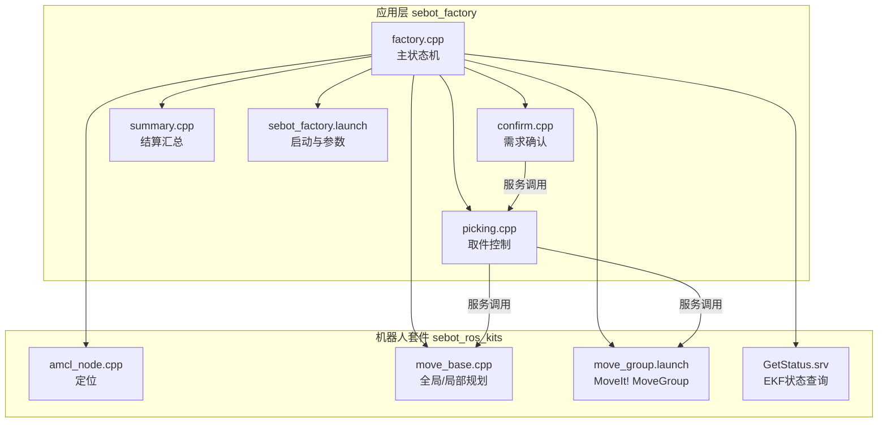
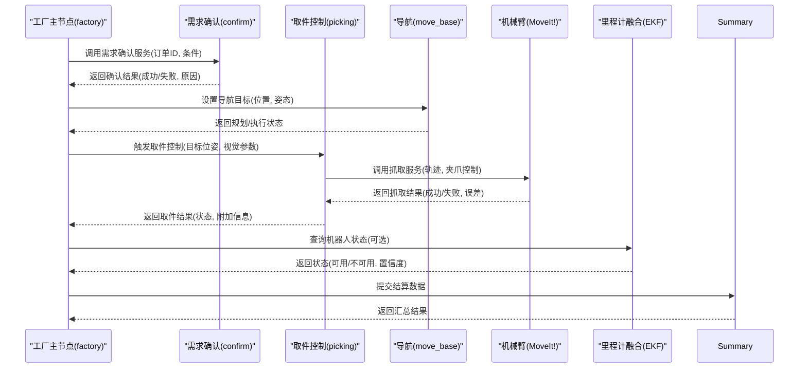
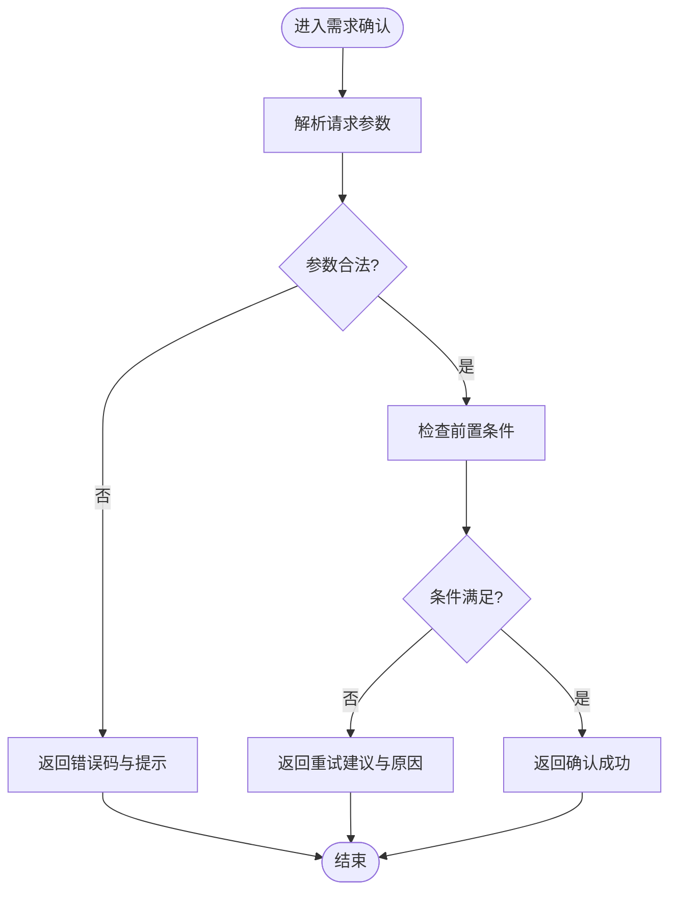
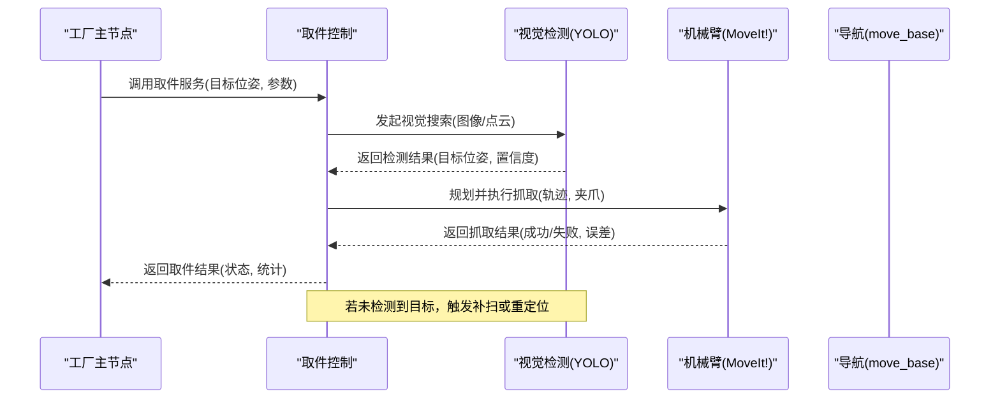
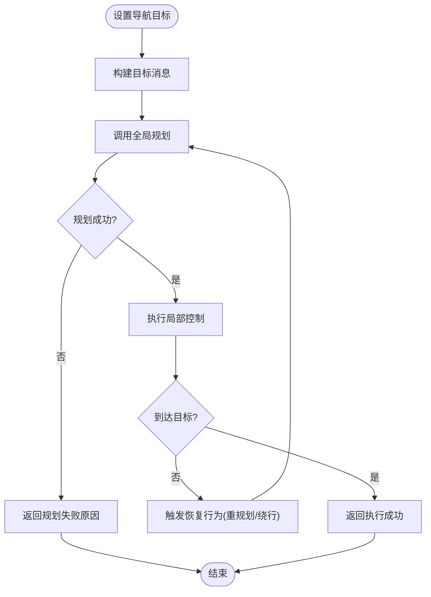
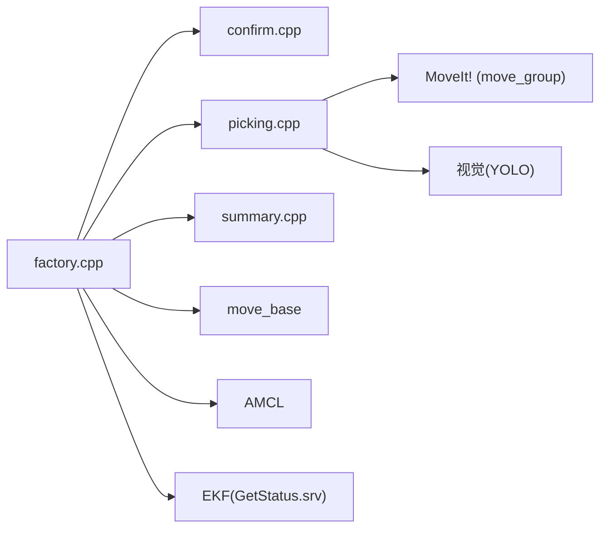

# 服务调用

<cite>
**本文引用的文件**   
- [factory.cpp](file://sebot_factory/src/sebot_factory/src/factory.cpp)
- [confirm.cpp](file://sebot_factory/src/sebot_factory/src/confirm.cpp)
- [picking.cpp](file://sebot_factory/src/sebot_factory/src/picking.cpp)
- [summary.cpp](file://sebot_factory/src/sebot_factory/src/summary.cpp)
- [sebot_factory.launch](file://sebot_factory/src/sebot_factory/launch/sebot_factory.launch)
- [GetStatus.srv](file://sebot_ros_kits/src/sebot_driver/robot_pose_ekf/srv/GetStatus.srv)
- [move_group.launch](file://sebot_ros_kits/src/sebot_driver/sebot_talon_moveit/launch/move_group.launch)
- [amcl_node.cpp](file://sebot_ros_kits/src/sebot_navigation/amcl/src/amcl_node.cpp)
- [move_base.cpp](file://sebot_ros_kits/src/sebot_navigation/move_base/src/move_base.cpp)
</cite>

## 目录
1. [简介](#简介)
2. [项目结构](#项目结构)
3. [核心组件](#核心组件)
4. [架构总览](#架构总览)
5. [详细组件分析](#详细组件分析)
6. [依赖关系分析](#依赖关系分析)
7. [性能与超时策略](#性能与超时策略)
8. [故障排查指南](#故障排查指南)
9. [结论](#结论)
10. [附录：自定义服务开发指南](#附录自定义服务开发指南)

## 简介
本文件面向工厂管理系统中的ROS服务调用机制，聚焦同步通信模式下的关键业务接口：需求确认服务、取件控制服务、导航目标设置服务等。文档覆盖服务请求/响应格式、错误处理机制与超时策略，并给出MoveIt!服务接口与导航服务调用的实现要点与最佳实践。为便于不同背景读者理解，内容从高层架构逐步深入到具体调用流程与参数配置。

## 项目结构
本项目由三个相互独立的 catkin 工作空间组成：
- sebot_factory（应用层）：包含工厂主状态机、需求确认、智能取件、结算汇总等核心节点与服务调用逻辑。
- sebot_ros_kits（机器人套件）：包含驱动、导航栈、SLAM、MoveIt!等基础能力包。
- sebot_ros_stdr（仿真层）：STDR仿真环境相关包，用于离线验证与调试。

在 sebot_factory 中，核心业务节点位于 src/sebot_factory/src 下，启动与运行参数集中在 launch/sebot_factory.launch。导航与定位能力来自 sebot_ros_kits 的 amcl、move_base 与 move_group（MoveIt!）。

图表来源 
- [factory.cpp](file://sebot_factory/src/sebot_factory/src/factory.cpp)
- [confirm.cpp](file://sebot_factory/src/sebot_factory/src/confirm.cpp)
- [picking.cpp](file://sebot_factory/src/sebot_factory/src/picking.cpp)
- [summary.cpp](file://sebot_factory/src/sebot_factory/src/summary.cpp)
- [sebot_factory.launch](file://sebot_factory/src/sebot_factory/launch/sebot_factory.launch)
- [amcl_node.cpp](file://sebot_ros_kits/src/sebot_navigation/amcl/src/amcl_node.cpp)
- [move_base.cpp](file://sebot_ros_kits/src/sebot_navigation/move_base/src/move_base.cpp)
- [move_group.launch](file://sebot_ros_kits/src/sebot_driver/sebot_talon_moveit/launch/move_group.launch)
- [GetStatus.srv](file://sebot_ros_kits/src/sebot_driver/robot_pose_ekf/srv/GetStatus.srv)

章节来源
- [sebot_factory.launch](file://sebot_factory/src/sebot_factory/launch/sebot_factory.launch)

## 核心组件
- factory.cpp：工厂主状态机，协调订单执行流程，串联导航、视觉、机械臂与结算等子任务，并通过ROS服务进行同步交互。
- confirm.cpp：需求确认服务提供者/调用者，负责与上层或外部系统确认订单细节与执行条件。
- picking.cpp：取件控制服务，封装视觉搜索、抓取动作与取件结果反馈。
- summary.cpp：结算汇总服务，汇总执行结果并输出统计信息。

这些组件通过ROS服务接口进行同步通信，确保业务流程的可控性与可观测性。

章节来源
- [factory.cpp](file://sebot_factory/src/sebot_factory/src/factory.cpp)
- [confirm.cpp](file://sebot_factory/src/sebot_factory/src/confirm.cpp)
- [picking.cpp](file://sebot_factory/src/sebot_factory/src/picking.cpp)
- [summary.cpp](file://sebot_factory/src/sebot_factory/src/summary.cpp)

## 架构总览
工厂管理系统的同步通信以“服务-客户端”为核心，关键调用链如下：
- 导航目标设置：客户端向 move_base 发送 SetPlan/SetGoal 等服务，等待规划与执行完成。
- 需求确认：confirm 节点提供/调用服务，返回确认结果与附加信息。
- 取件控制：picking 节点调用视觉与机械臂服务，串行执行检测、抓取与结果上报。
- 结算汇总：summary 节点聚合各阶段结果，生成最终报告。

图表来源 
- [factory.cpp](file://sebot_factory/src/sebot_factory/src/factory.cpp)
- [confirm.cpp](file://sebot_factory/src/sebot_factory/src/confirm.cpp)
- [picking.cpp](file://sebot_factory/src/sebot_factory/src/picking.cpp)
- [move_base.cpp](file://sebot_ros_kits/src/sebot_navigation/move_base/src/move_base.cpp)
- [move_group.launch](file://sebot_ros_kits/src/sebot_driver/sebot_talon_moveit/launch/move_group.launch)
- [GetStatus.srv](file://sebot_ros_kits/src/sebot_driver/robot_pose_ekf/srv/GetStatus.srv)

## 详细组件分析

### 需求确认服务（confirm）
- 角色：对外暴露或调用需求确认服务，校验订单合法性与前置条件。
- 典型输入：订单标识、任务类型、约束条件（时间窗口、资源可用性）。
- 典型输出：确认码、提示信息、后续步骤建议。
- 错误处理：对非法输入返回明确错误码；对资源不足返回重试建议。
- 超时策略：设置合理的服务超时，避免阻塞上游调度。

图表来源 
- [confirm.cpp](file://sebot_factory/src/sebot_factory/src/confirm.cpp)

章节来源
- [confirm.cpp](file://sebot_factory/src/sebot_factory/src/confirm.cpp)

### 取件控制服务（picking）
- 角色：整合视觉检测与机械臂抓取，形成端到端的取件流程。
- 典型输入：目标位姿、视觉模型参数、抓取容差。
- 典型输出：抓取结果、误差统计、异常信息。
- 错误处理：视觉未检测到目标时回退策略（补扫/重定位）；抓取失败时重试或报警。
- 超时策略：分阶段设置超时（检测、抓取、放置），整体超时保护。

图表来源 
- [picking.cpp](file://sebot_factory/src/sebot_factory/src/picking.cpp)
- [move_group.launch](file://sebot_ros_kits/src/sebot_driver/sebot_talon_moveit/launch/move_group.launch)

章节来源
- [picking.cpp](file://sebot_factory/src/sebot_factory/src/picking.cpp)

### 导航目标设置服务（move_base）
- 角色：接收全局/局部导航目标，返回规划与执行状态。
- 典型输入：目标位姿（x, y, theta）、代价地图参数、规划器选择。
- 典型输出：规划是否成功、执行状态、到达判定。
- 错误处理：路径不可达时返回失败原因；动态障碍物导致重规划。
- 超时策略：全局规划超时、局部控制超时、取消与恢复策略。

图表来源 
- [move_base.cpp](file://sebot_ros_kits/src/sebot_navigation/move_base/src/move_base.cpp)

章节来源
- [move_base.cpp](file://sebot_ros_kits/src/sebot_navigation/move_base/src/move_base.cpp)

### 结算汇总服务（summary）
- 角色：汇总订单执行结果，生成统计与日志。
- 典型输入：各阶段结果（导航、视觉、抓取、放置）。
- 典型输出：汇总报告、成功率、耗时统计、异常记录。
- 错误处理：对缺失数据进行告警与补偿计算。
- 超时策略：汇总过程应快速完成，避免影响主循环。

章节来源
- [summary.cpp](file://sebot_factory/src/sebot_factory/src/summary.cpp)

### 工厂主状态机（factory）
- 角色：编排订单执行流程，协调各服务调用与状态转换。
- 典型流程：自检 → 加载地图与定位 → 导航至取件台 → 需求确认 → 视觉搜索 → 机械臂抓取 → 导航送达 → 结算汇总。
- 错误处理：跨阶段错误统一捕获与上报，支持回滚与重试。
- 超时策略：全链路超时保护，关键阶段单独超时配置。

章节来源
- [factory.cpp](file://sebot_factory/src/sebot_factory/src/factory.cpp)

## 依赖关系分析
- 工厂主节点依赖 confirm、picking、summary 等子节点提供的服务。
- picking 依赖 MoveIt!（move_group）与视觉模块（YOLO）的服务。
- 导航依赖 move_base 与 AMCL 的定位与规划能力。
- 里程计融合（EKF）提供机器人状态查询服务（GetStatus.srv）。

图表来源 
- [factory.cpp](file://sebot_factory/src/sebot_factory/src/factory.cpp)
- [confirm.cpp](file://sebot_factory/src/sebot_factory/src/confirm.cpp)
- [picking.cpp](file://sebot_factory/src/sebot_factory/src/picking.cpp)
- [summary.cpp](file://sebot_factory/src/sebot_factory/src/summary.cpp)
- [move_group.launch](file://sebot_ros_kits/src/sebot_driver/sebot_talon_moveit/launch/move_group.launch)
- [amcl_node.cpp](file://sebot_ros_kits/src/sebot_navigation/amcl/src/amcl_node.cpp)
- [move_base.cpp](file://sebot_ros_kits/src/sebot_navigation/move_base/src/move_base.cpp)
- [GetStatus.srv](file://sebot_ros_kits/src/sebot_driver/robot_pose_ekf/srv/GetStatus.srv)

章节来源
- [factory.cpp](file://sebot_factory/src/sebot_factory/src/factory.cpp)
- [get_status.srv](file://sebot_ros_kits/src/sebot_driver/robot_pose_ekf/srv/GetStatus.srv)

## 性能与超时策略
- 服务超时：为每个关键服务设置合理的超时阈值，避免长阻塞；对网络与I/O敏感的服务采用指数退避重试。
- 规划与执行：move_base 的全局/局部规划需分别配置超时与重规划频率；AMCL 定位收敛时间影响导航启动速度。
- 视觉与抓取：YOLO 多帧检测需平衡精度与延迟；抓取失败的重试次数与间隔应可配置。
- 资源竞争：并发服务调用时需加锁或队列化，避免资源冲突与死锁。
- 监控与诊断：记录服务调用耗时、失败率与错误码，便于性能分析与优化。

[本节为通用指导，不直接分析具体文件]

## 故障排查指南
- 服务无响应：检查服务是否存在、端口与命名空间是否正确；查看 ROS 日志与节点状态。
- 导航失败：确认地图与定位是否正常；检查代价地图与规划参数；观察 move_base 的恢复行为。
- 视觉未检测到目标：调整光照与相机参数；增加补扫次数；检查 YOLO 模型与标签。
- 抓取失败：检查机械臂轨迹与夹爪力控；确认目标位姿与容差；查看 MoveIt! 的错误日志。
- EKF 状态不可用：检查传感器数据与融合参数；确认 IMU 与轮式里程计校准。

章节来源
- [amcl_node.cpp](file://sebot_ros_kits/src/sebot_navigation/amcl/src/amcl_node.cpp)
- [move_base.cpp](file://sebot_ros_kits/src/sebot_navigation/move_base/src/move_base.cpp)
- [move_group.launch](file://sebot_ros_kits/src/sebot_driver/sebot_talon_moveit/launch/move_group.launch)
- [GetStatus.srv](file://sebot_ros_kits/src/sebot_driver/robot_pose_ekf/srv/GetStatus.srv)

## 结论
工厂管理系统的服务调用以同步通信为主，围绕需求确认、取件控制与导航目标设置三大核心接口展开。通过合理的服务设计、错误处理与超时策略，可实现稳定可靠的自动化流程。MoveIt! 与导航服务的集成提供了强大的运动与规划能力，配合视觉与里程计融合，形成完整的工厂作业闭环。

[本节为总结性内容，不直接分析具体文件]

## 附录：自定义服务开发指南
- 定义服务接口：在服务文件中声明请求与响应字段，保持语义清晰与可扩展性。
- 提供服务端实现：在服务回调中完成业务逻辑，处理输入校验、异常分支与返回值。
- 编写客户端调用：使用 roscpp 或服务客户端接口，设置超时与重试策略，捕获并处理错误。
- 注册与发布：在节点初始化时注册服务，确保命名空间与版本兼容。
- 测试与验证：编写单元测试与集成测试，覆盖正常路径与异常路径；模拟超时与失败场景。
- 最佳实践：
  - 服务响应尽量轻量，复杂结果通过话题异步上报。
  - 错误码与提示信息标准化，便于上层统一处理。
  - 关键服务增加日志与指标采集，支持在线诊断。
  - 对长时间运行的服务考虑改为 Action 或话题流式返回。

[本节为通用指导，不直接分析具体文件]