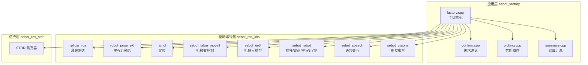
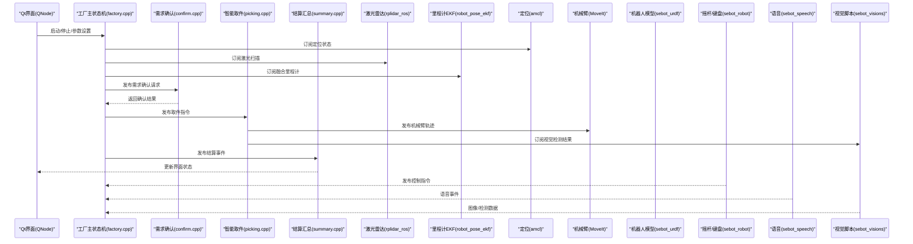
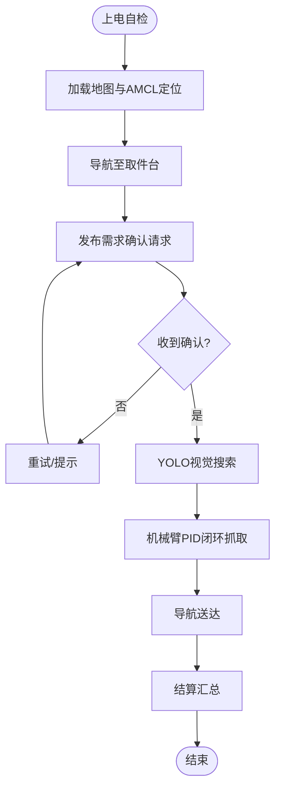
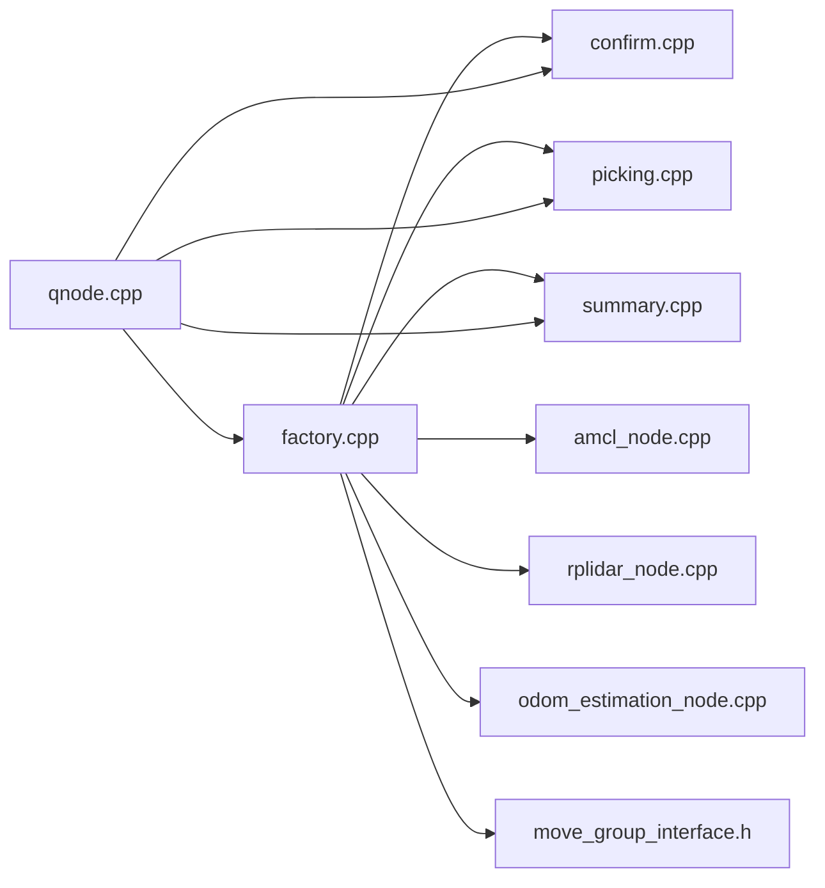

# 话题通信

<cite>
**本文引用的文件**   
- [sebot_factory.launch](file://sebot_factory/src/sebot_factory/launch/sebot_factory.launch)
- [factory.cpp](file://sebot_factory/src/sebot_factory/src/factory.cpp)
- [confirm.cpp](file://sebot_factory/src/sebot_factory/src/confirm.cpp)
- [picking.cpp](file://sebot_factory/src/sebot_factory/src/picking.cpp)
- [summary.cpp](file://sebot_factory/src/sebot_factory/src/summary.cpp)
- [qnode.hpp](file://sebot_marking/include/qnode.hpp)
- [qnode.cpp](file://sebot_marking/src/qnode.cpp)
- [addtopics.h](file://sebot_marking/include/addtopics.h)
- [addtopics.cpp](file://sebot_marking/src/addtopics.cpp)
- [slam.h](file://sebot_marking/include/slam.h)
- [slam.cpp](file://sebot_marking/src/slam.cpp)
- [rplidar_node.cpp](file://sebot_ros_kits/src/sebot_driver/rplidar_ros/src/node.cpp)
- [odom_estimation_node.cpp](file://sebot_ros_kits/src/sebot_driver/robot_pose_ekf/src/odom_estimation_node.cpp)
- [amcl_node.cpp](file://sebot_ros_kits/src/sebot_navigation/amcl/src/amcl_node.cpp)
- [move_group_interface.h](file://sebot_ros_kits/src/sebot_driver/sebot_talon_moveit/include/move_group_interface.h)
- [sebot_urdf.launch](file://sebot_ros_kits/src/sebot_driver/sebot_urdf/launch/sebot_urdf.launch)
- [sebot_joystick.launch](file://sebot_ros_kits/src/sebot_robot/launch/sebot_joystick.launch)
- [sebot_keyboard.launch](file://sebot_ros_kits/src/sebot_robot/launch/sebot_keyboard.launch)
- [sebot_odom.launch](file://sebot_ros_kits/src/sebot_robot/launch/sebot_odom.launch)
- [sebot_transform.launch](file://sebot_ros_kits/src/sebot_robot/launch/sebot_transform.launch)
- [sebot_audio.xml](file://sebot_ros_kits/src/sebot_speech/launch/sebot_audio.xml)
- [joyStick.py](file://sebot_ros_kits/src/sebot_visions/scripts/joyStick.py)
- [sebotCollection.py](file://sebot_ros_kits/src/sebot_visions/scripts/sebotCollection.py)
</cite>

## 目录
1. [简介](#简介)
2. [项目结构](#项目结构)
3. [核心组件](#核心组件)
4. [架构总览](#架构总览)
5. [详细组件分析](#详细组件分析)
6. [依赖关系分析](#依赖关系分析)
7. [性能与频率配置](#性能与频率配置)
8. [故障排查指南](#故障排查指南)
9. [结论](#结论)
10. [附录：自定义话题开发示例与调试方法](#附录自定义话题开发示例与调试方法)

## 简介
本技术文档围绕ROS话题通信机制，结合工厂管理系统中的多节点协作，系统阐述传感器数据流（激光雷达、摄像头、IMU）、控制指令流（运动控制、机械臂操作）与业务状态同步（订单状态、导航状态）的发布订阅模式。文档同时覆盖消息类型定义、数据格式规范、通信频率配置，以及QNode在Qt界面与ROS节点间的桥接实现，并提供自定义话题的完整开发与调试方法。

## 项目结构
本项目由三个相互独立的catkin工作空间组成：
- sebot_factory：应用层业务节点（工厂主状态机、需求确认、智能取件、结算汇总等）
- sebot_ros_kits：机器人驱动与导航套件（激光雷达、EKF里程计、AMCL定位、MoveIt机械臂、URDF模型、键盘/摇杆输入等）
- sebot_ros_stdr：仿真环境（STDR仿真器与配套工具）

各工作空间均包含src/目录，需分别进行catkin_make编译。文档重点分析sebot_factory、sebot_marking、sebot_robot、sebot_speech、sebot_visions等包的话题交互。

图表来源
- [sebot_factory.launch](file://sebot_factory/src/sebot_factory/launch/sebot_factory.launch)
- [factory.cpp](file://sebot_factory/src/sebot_factory/src/factory.cpp)
- [rplidar_node.cpp](file://sebot_ros_kits/src/sebot_driver/rplidar_ros/src/node.cpp)
- [odom_estimation_node.cpp](file://sebot_ros_kits/src/sebot_driver/robot_pose_ekf/src/odom_estimation_node.cpp)
- [amcl_node.cpp](file://sebot_ros_kits/src/sebot_navigation/amcl/src/amcl_node.cpp)
- [move_group_interface.h](file://sebot_ros_kits/src/sebot_driver/sebot_talon_moveit/include/move_group_interface.h)
- [sebot_urdf.launch](file://sebot_ros_kits/src/sebot_driver/sebot_urdf/launch/sebot_urdf.launch)
- [sebot_joystick.launch](file://sebot_ros_kits/src/sebot_robot/launch/sebot_joystick.launch)
- [sebot_keyboard.launch](file://sebot_ros_kits/src/sebot_robot/launch/sebot_keyboard.launch)
- [sebot_odom.launch](file://sebot_ros_kits/src/sebot_robot/launch/sebot_odom.launch)
- [sebot_transform.launch](file://sebot_ros_kits/src/sebot_robot/launch/sebot_transform.launch)
- [sebot_audio.xml](file://sebot_ros_kits/src/sebot_speech/launch/sebot_audio.xml)
- [joyStick.py](file://sebot_ros_kits/src/sebot_visions/scripts/joyStick.py)
- [sebotCollection.py](file://sebot_ros_kits/src/sebot_visions/scripts/sebotCollection.py)

章节来源
- [sebot_factory.launch](file://sebot_factory/src/sebot_factory/launch/sebot_factory.launch)

## 核心组件
- 工厂主状态机（factory.cpp）：协调订单处理流程，驱动导航、确认、取件、结算等业务阶段，通过ROS话题与传感器、导航、机械臂等子系统交互。
- 需求确认（confirm.cpp）：接收并处理用户或系统的需求确认信号，触发后续动作。
- 智能取件（picking.cpp）：基于视觉与机械臂协同完成抓取任务。
- 结算汇总（summary.cpp）：统计订单执行结果，输出结算信息。
- Qt桥接（QNode）：连接Qt界面与ROS节点，提供UI与底层ROS通信的桥梁。
- 传感器与驱动：激光雷达（rplidar_ros）、里程计EKF（robot_pose_ekf）、AMCL定位、MoveIt机械臂控制、URDF模型、摇杆/键盘输入、语音交互、视觉脚本等。

章节来源
- [factory.cpp](file://sebot_factory/src/sebot_factory/src/factory.cpp)
- [confirm.cpp](file://sebot_factory/src/sebot_factory/src/confirm.cpp)
- [picking.cpp](file://sebot_factory/src/sebot_factory/src/picking.cpp)
- [summary.cpp](file://sebot_factory/src/sebot_factory/src/summary.cpp)
- [qnode.hpp](file://sebot_marking/include/qnode.hpp)
- [qnode.cpp](file://sebot_marking/src/qnode.cpp)

## 架构总览
整体架构采用ROS话题总线，各节点通过发布/订阅模式解耦。工厂主状态机作为协调者，订阅传感器数据与导航状态，发布控制指令；传感器与驱动节点负责数据采集与设备控制；Qt界面通过QNode桥接进行人机交互与监控。

图表来源
- [factory.cpp](file://sebot_factory/src/sebot_factory/src/factory.cpp)
- [confirm.cpp](file://sebot_factory/src/sebot_factory/src/confirm.cpp)
- [picking.cpp](file://sebot_factory/src/sebot_factory/src/picking.cpp)
- [summary.cpp](file://sebot_factory/src/sebot_factory/src/summary.cpp)
- [rplidar_node.cpp](file://sebot_ros_kits/src/sebot_driver/rplidar_ros/src/node.cpp)
- [odom_estimation_node.cpp](file://sebot_ros_kits/src/sebot_driver/robot_pose_ekf/src/odom_estimation_node.cpp)
- [amcl_node.cpp](file://sebot_ros_kits/src/sebot_navigation/amcl/src/amcl_node.cpp)
- [move_group_interface.h](file://sebot_ros_kits/src/sebot_driver/sebot_talon_moveit/include/move_group_interface.h)
- [sebot_urdf.launch](file://sebot_ros_kits/src/sebot_driver/sebot_urdf/launch/sebot_urdf.launch)
- [sebot_joystick.launch](file://sebot_ros_kits/src/sebot_robot/launch/sebot_joystick.launch)
- [sebot_keyboard.launch](file://sebot_ros_kits/src/sebot_robot/launch/sebot_keyboard.launch)
- [sebot_audio.xml](file://sebot_ros_kits/src/sebot_speech/launch/sebot_audio.xml)
- [joyStick.py](file://sebot_ros_kits/src/sebot_visions/scripts/joyStick.py)
- [sebotCollection.py](file://sebot_ros_kits/src/sebot_visions/scripts/sebotCollection.py)

## 详细组件分析

### 工厂主状态机（factory.cpp）
- 职责：管理订单生命周期，协调导航、确认、取件、结算等阶段。
- 话题交互：订阅激光雷达、IMU、里程计、定位状态；发布运动控制、机械臂指令、业务状态。
- 关键逻辑：基于MultiNavi的状态机实现，支持超时、重试、补扫等策略。

图表来源
- [factory.cpp](file://sebot_factory/src/sebot_factory/src/factory.cpp)

章节来源
- [factory.cpp](file://sebot_factory/src/sebot_factory/src/factory.cpp)

### 需求确认（confirm.cpp）
- 职责：处理来自工厂主状态机的确认请求，返回确认结果。
- 话题交互：订阅确认请求话题，发布确认响应话题。
- 关键逻辑：验证条件（如位置、安全），返回布尔或状态码。

章节来源
- [confirm.cpp](file://sebot_factory/src/sebot_factory/src/confirm.cpp)

### 智能取件（picking.cpp）
- 职责：协调视觉检测与机械臂抓取，确保精准取件。
- 话题交互：订阅视觉检测结果，发布机械臂轨迹指令。
- 关键逻辑：多帧检测确认、PID闭环控制、碰撞检测。

章节来源
- [picking.cpp](file://sebot_factory/src/sebot_factory/src/picking.cpp)

### 结算汇总（summary.cpp）
- 职责：统计订单执行结果，输出结算信息。
- 话题交互：订阅业务状态话题，发布结算结果。
- 关键逻辑：累计成功/失败次数，生成报告。

章节来源
- [summary.cpp](file://sebot_factory/src/sebot_factory/src/summary.cpp)

### Qt桥接（QNode）
- 职责：连接Qt界面与ROS节点，提供UI与底层ROS通信的桥梁。
- 话题交互：订阅ROS话题，更新UI；接收UI事件，发布ROS命令。
- 关键逻辑：线程安全的消息传递、事件回调、错误处理。

章节来源
- [qnode.hpp](file://sebot_marking/include/qnode.hpp)
- [qnode.cpp](file://sebot_marking/src/qnode.cpp)

### 传感器与驱动
- 激光雷达（rplidar_ros）：发布激光扫描数据，用于建图与避障。
- 里程计EKF（robot_pose_ekf）：融合轮式里程计与IMU，提供更准确的位姿估计。
- AMCL定位：基于激光扫描与地图进行粒子滤波定位。
- MoveIt机械臂：发布轨迹指令，控制机械臂运动。
- URDF模型：描述机器人几何与关节信息。
- 摇杆/键盘输入：发布控制指令，用于手动控制。
- 语音交互：处理语音事件，触发相应动作。
- 视觉脚本：处理图像数据，执行目标检测。

章节来源
- [rplidar_node.cpp](file://sebot_ros_kits/src/sebot_driver/rplidar_ros/src/node.cpp)
- [odom_estimation_node.cpp](file://sebot_ros_kits/src/sebot_driver/robot_pose_ekf/src/odom_estimation_node.cpp)
- [amcl_node.cpp](file://sebot_ros_kits/src/sebot_navigation/amcl/src/amcl_node.cpp)
- [move_group_interface.h](file://sebot_ros_kits/src/sebot_driver/sebot_talon_moveit/include/move_group_interface.h)
- [sebot_urdf.launch](file://sebot_ros_kits/src/sebot_driver/sebot_urdf/launch/sebot_urdf.launch)
- [sebot_joystick.launch](file://sebot_ros_kits/src/sebot_robot/launch/sebot_joystick.launch)
- [sebot_keyboard.launch](file://sebot_ros_kits/src/sebot_robot/launch/sebot_keyboard.launch)
- [sebot_audio.xml](file://sebot_ros_kits/src/sebot_speech/launch/sebot_audio.xml)
- [joyStick.py](file://sebot_ros_kits/src/sebot_visions/scripts/joyStick.py)
- [sebotCollection.py](file://sebot_ros_kits/src/sebot_visions/scripts/sebotCollection.py)

## 依赖关系分析
各组件通过ROS话题松耦合，依赖关系清晰：
- 工厂主状态机依赖导航、传感器、机械臂等子系统。
- Qt界面依赖QNode进行ROS通信。
- 传感器与驱动节点独立运行，提供数据或服务。

图表来源
- [factory.cpp](file://sebot_factory/src/sebot_factory/src/factory.cpp)
- [confirm.cpp](file://sebot_factory/src/sebot_factory/src/confirm.cpp)
- [picking.cpp](file://sebot_factory/src/sebot_factory/src/picking.cpp)
- [summary.cpp](file://sebot_factory/src/sebot_factory/src/summary.cpp)
- [amcl_node.cpp](file://sebot_ros_kits/src/sebot_navigation/amcl/src/amcl_node.cpp)
- [rplidar_node.cpp](file://sebot_ros_kits/src/sebot_driver/rplidar_ros/src/node.cpp)
- [odom_estimation_node.cpp](file://sebot_ros_kits/src/sebot_driver/robot_pose_ekf/src/odom_estimation_node.cpp)
- [move_group_interface.h](file://sebot_ros_kits/src/sebot_driver/sebot_talon_moveit/include/move_group_interface.h)
- [qnode.cpp](file://sebot_marking/src/qnode.cpp)

章节来源
- [factory.cpp](file://sebot_factory/src/sebot_factory/src/factory.cpp)
- [qnode.cpp](file://sebot_marking/src/qnode.cpp)

## 性能与频率配置
- 通信频率：根据传感器与算法需求配置，如激光雷达高频扫描、视觉检测中频处理、控制指令低频发送。
- 缓冲区大小：避免消息积压，合理设置队列长度。
- 资源占用：优化数据处理算法，减少CPU与内存占用。
- 网络带宽：图像数据压缩传输，避免阻塞。

章节来源
- [sebot_factory.launch](file://sebot_factory/src/sebot_factory/launch/sebot_factory.launch)

## 故障排查指南
- 话题未连接：使用rosnode list检查节点状态，rostopic info查看话题信息。
- 数据延迟：调整缓冲区大小，优化数据处理逻辑。
- 控制失效：检查控制指令格式与频率，确认机械臂状态。
- 定位漂移：校准传感器，调整AMCL参数。
- 界面无响应：检查QNode线程状态，确认ROS通信正常。

章节来源
- [qnode.cpp](file://sebot_marking/src/qnode.cpp)
- [amcl_node.cpp](file://sebot_ros_kits/src/sebot_navigation/amcl/src/amcl_node.cpp)
- [move_group_interface.h](file://sebot_ros_kits/src/sebot_driver/sebot_talon_moveit/include/move_group_interface.h)

## 结论
本技术文档系统阐述了ROS话题通信机制在工厂管理系统中的应用，涵盖传感器数据流、控制指令流与业务状态同步的实现细节。通过模块化设计与松耦合架构，实现了高效稳定的机器人控制系统。未来可进一步优化通信效率与算法性能，提升系统可靠性。

## 附录：自定义话题开发示例与调试方法
- 定义消息类型：在msg目录下创建.msg文件，定义数据结构。
- 编译消息：在CMakeLists.txt中添加message_generation依赖，生成头文件。
- 发布消息：在节点中使用Publisher发布自定义消息。
- 订阅消息：在节点中使用Subscriber订阅自定义消息。
- 调试方法：使用rostopic echo查看消息内容，rosbag记录与分析数据。

章节来源
- [addtopics.h](file://sebot_marking/include/addtopics.h)
- [addtopics.cpp](file://sebot_marking/src/addtopics.cpp)
- [slam.h](file://sebot_marking/include/slam.h)
- [slam.cpp](file://sebot_marking/src/slam.cpp)