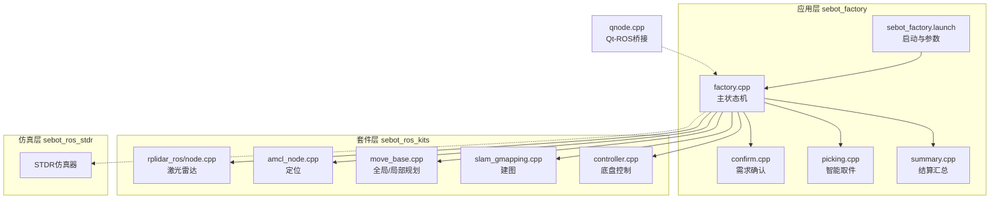
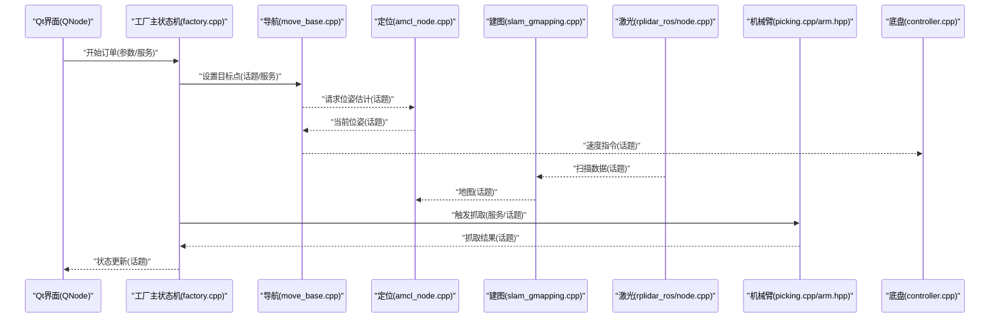
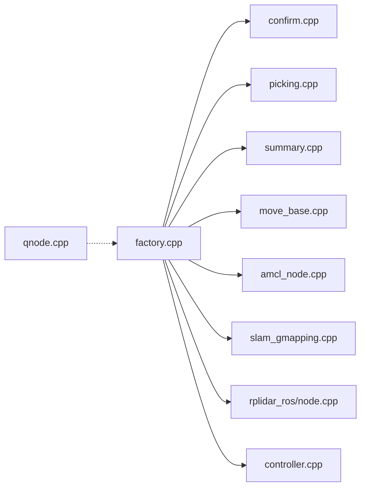

# 通信机制

<cite>
**本文引用的文件**   
- [sebot_factory/src/sebot_factory/src/factory.cpp](file://sebot_factory/src/sebot_factory/src/factory.cpp)
- [sebot_factory/src/sebot_factory/src/confirm.cpp](file://sebot_factory/src/sebot_factory/src/confirm.cpp)
- [sebot_factory/src/sebot_factory/src/picking.cpp](file://sebot_factory/src/sebot_factory/src/picking.cpp)
- [sebot_factory/src/sebot_factory/src/summary.cpp](file://sebot_factory/src/sebot_factory/src/summary.cpp)
- [sebot_factory/src/sebot_factory/include/arm.hpp](file://sebot_factory/src/sebot_factory/include/arm.hpp)
- [sebot_factory/src/sebot_factory/include/camera.hpp](file://sebot_factory/src/sebot_factory/include/camera.hpp)
- [sebot_factory/src/sebot_factory/include/detection.hpp](file://sebot_factory/src/sebot_factory/include/detection.hpp)
- [sebot_factory/src/sebot_factory/launch/sebot_factory.launch](file://sebot_factory/src/sebot_factory/launch/sebot_factory.launch)
- [sebot_marking/src/sebot_marking/src/qnode.cpp](file://sebot_marking/src/sebot_marking/src/qnode.cpp)
- [sebot_marking/src/sebot_marking/include/qnode.hpp](file://sebot_marking/src/sebot_marking/include/qnode.hpp)
- [sebot_ros_kits/src/sebot_robot/src/controller.cpp](file://sebot_ros_kits/src/sebot_robot/src/controller.cpp)
- [sebot_ros_kits/src/sebot_driver/rplidar_ros/src/node.cpp](file://sebot_ros_kits/src/sebot_driver/rplidar_ros/src/node.cpp)
- [sebot_ros_kits/src/sebot_navigation/amcl/src/amcl_node.cpp](file://sebot_ros_kits/src/sebot_navigation/amcl/src/amcl_node.cpp)
- [sebot_ros_kits/src/sebot_navigation/move_base/src/move_base.cpp](file://sebot_ros_kits/src/sebot_navigation/move_base/src/move_base.cpp)
- [sebot_ros_kits/src/sebot_slam/slam_gmapping/slam_gmapping/slam_gmapping.cpp](file://sebot_ros_kits/src/sebot_slam/slam_gmapping/slam_gmapping/slam_gmapping.cpp)
</cite>

## 目录
1. [简介](#简介)
2. [项目结构](#项目结构)
3. [核心组件](#核心组件)
4. [架构总览](#架构总览)
5. [详细组件分析](#详细组件分析)
6. [依赖关系分析](#依赖关系分析)
7. [性能考量](#性能考量)
8. [故障排查指南](#故障排查指南)
9. [结论](#结论)
10. [附录：自定义通信接口开发指南](#附录自定义通信接口开发指南)

## 简介
本文件面向ROS节点间通信机制，围绕话题（Topic）、服务（Service）、参数（Parameter）的使用模式与最佳实践，系统化阐述工厂管理系统与各子系统之间的消息传递协议。重点覆盖传感器数据流、控制指令流与业务状态同步，并解释QNode在Qt界面与ROS节点间的桥接作用。文档包含通信时序图与数据流图，以及自定义通信接口的开发指南，帮助读者快速理解并扩展系统。

## 项目结构
本项目由三个相互独立的catkin工作空间组成：
- sebot_factory：应用层，实现订单处理、需求确认、视觉检测、机械臂抓取、结算汇总等业务流程与主状态机。
- sebot_ros_kits：机器人套件层，包含驱动、导航、SLAM、语音、视觉等通用能力。
- sebot_ros_stdr：仿真层，提供STDR仿真环境及可视化、导航配置等。

运行入口集中在sebot_factory的launch文件中，通过simulation参数切换STDR仿真模式，debug参数控制图像识别界面开关；导航超时、PID、取件距离、补扫参数等均在此配置。

图表来源 
- [sebot_factory/src/sebot_factory/src/factory.cpp](file://sebot_factory/src/sebot_factory/src/factory.cpp)
- [sebot_factory/src/sebot_factory/launch/sebot_factory.launch](file://sebot_factory/src/sebot_factory/launch/sebot_factory.launch)
- [sebot_ros_kits/src/sebot_driver/rplidar_ros/src/node.cpp](file://sebot_ros_kits/src/sebot_driver/rplidar_ros/src/node.cpp)
- [sebot_ros_kits/src/sebot_navigation/amcl/src/amcl_node.cpp](file://sebot_ros_kits/src/sebot_navigation/amcl/src/amcl_node.cpp)
- [sebot_ros_kits/src/sebot_navigation/move_base/src/move_base.cpp](file://sebot_ros_kits/src/sebot_navigation/move_base/src/move_base.cpp)
- [sebot_ros_kits/src/sebot_slam/slam_gmapping/slam_gmapping/slam_gmapping.cpp](file://sebot_ros_kits/src/sebot_slam/slam_gmapping/slam_gmapping/slam_gmapping.cpp)
- [sebot_ros_kits/src/sebot_robot/src/controller.cpp](file://sebot_ros_kits/src/sebot_robot/src/controller.cpp)
- [sebot_marking/src/sebot_marking/src/qnode.cpp](file://sebot_marking/src/sebot_marking/src/qnode.cpp)

章节来源
- [sebot_factory/src/sebot_factory/launch/sebot_factory.launch](file://sebot_factory/src/sebot_factory/launch/sebot_factory.launch)

## 核心组件
- 工厂主状态机（factory.cpp）：编排订单流程，协调导航、视觉、机械臂、结算等子任务，维护业务状态。
- 需求确认（confirm.cpp）：基于视觉或交互完成订单需求确认，发布确认结果。
- 智能取件（picking.cpp）：结合YOLO检测结果与机械臂控制，执行抓取动作。
- 结算汇总（summary.cpp）：统计订单完成情况，输出结算信息。
- Qt-ROS桥接（qnode.cpp）：将Qt界面事件转换为ROS调用，订阅ROS状态更新到界面显示。
- 导航栈（move_base + AMCL）：接收目标点，生成轨迹并下发给底盘控制器。
- 传感器与驱动（rplidar_ros、controller）：发布激光扫描、里程计、IMU融合数据，接收速度指令。
- SLAM（slam_gmapping）：构建与发布地图，供定位与导航使用。

章节来源
- [sebot_factory/src/sebot_factory/src/factory.cpp](file://sebot_factory/src/sebot_factory/src/factory.cpp)
- [sebot_factory/src/sebot_factory/src/confirm.cpp](file://sebot_factory/src/sebot_factory/src/confirm.cpp)
- [sebot_factory/src/sebot_factory/src/picking.cpp](file://sebot_factory/src/sebot_factory/src/picking.cpp)
- [sebot_factory/src/sebot_factory/src/summary.cpp](file://sebot_factory/src/sebot_factory/src/summary.cpp)
- [sebot_marking/src/sebot_marking/src/qnode.cpp](file://sebot_marking/src/sebot_marking/src/qnode.cpp)
- [sebot_ros_kits/src/sebot_navigation/move_base/src/move_base.cpp](file://sebot_ros_kits/src/sebot_navigation/move_base/src/move_base.cpp)
- [sebot_ros_kits/src/sebot_navigation/amcl/src/amcl_node.cpp](file://sebot_ros_kits/src/sebot_navigation/amcl/src/amcl_node.cpp)
- [sebot_ros_kits/src/sebot_driver/rplidar_ros/src/node.cpp](file://sebot_ros_kits/src/sebot_driver/rplidar_ros/src/node.cpp)
- [sebot_ros_kits/src/sebot_slam/slam_gmapping/slam_gmapping/slam_gmapping.cpp](file://sebot_ros_kits/src/sebot_slam/slam_gmapping/slam_gmapping/slam_gmapping.cpp)
- [sebot_ros_kits/src/sebot_robot/src/controller.cpp](file://sebot_ros_kits/src/sebot_robot/src/controller.cpp)

## 架构总览
下图展示从用户操作到机器人执行的端到端通信链路，涵盖话题、服务与参数的协同。

图表来源 
- [sebot_factory/src/sebot_factory/src/factory.cpp](file://sebot_factory/src/sebot_factory/src/factory.cpp)
- [sebot_factory/src/sebot_factory/src/picking.cpp](file://sebot_factory/src/sebot_factory/src/picking.cpp)
- [sebot_ros_kits/src/sebot_navigation/move_base/src/move_base.cpp](file://sebot_ros_kits/src/sebot_navigation/move_base/src/move_base.cpp)
- [sebot_ros_kits/src/sebot_navigation/amcl/src/amcl_node.cpp](file://sebot_ros_kits/src/sebot_navigation/amcl/src/amcl_node.cpp)
- [sebot_ros_kits/src/sebot_slam/slam_gmapping/slam_gmapping/slam_gmapping.cpp](file://sebot_ros_kits/src/sebot_slam/slam_gmapping/slam_gmapping/slam_gmapping.cpp)
- [sebot_ros_kits/src/sebot_driver/rplidar_ros/src/node.cpp](file://sebot_ros_kits/src/sebot_driver/rplidar_ros/src/node.cpp)
- [sebot_ros_kits/src/sebot_robot/src/controller.cpp](file://sebot_ros_kits/src/sebot_robot/src/controller.cpp)
- [sebot_marking/src/sebot_marking/src/qnode.cpp](file://sebot_marking/src/sebot_marking/src/qnode.cpp)

## 详细组件分析

### 工厂主状态机（factory.cpp）
- 职责：编排订单生命周期，协调导航、视觉、机械臂、结算等子模块；维护多阶段状态（自检、加载地图、定位、导航、确认、取件、送达、结算）。
- 通信模式：
  - 话题：订阅传感器与导航状态，发布业务状态与指令。
  - 服务：调用导航目标、视觉检测、机械臂控制等一次性操作。
  - 参数：读取导航超时、PID、取件距离、补扫阈值等关键配置。
- 优化建议：
  - 使用异步回调避免阻塞主循环。
  - 对高频话题进行降采样或缓冲合并。
  - 为关键服务增加超时与重试策略。

章节来源
- [sebot_factory/src/sebot_factory/src/factory.cpp](file://sebot_factory/src/sebot_factory/src/factory.cpp)

### 需求确认（confirm.cpp）
- 职责：根据订单需求进行确认，可能涉及视觉识别或人机交互。
- 通信模式：
  - 订阅图像或检测结果话题，解析确认信号。
  - 发布确认结果至工厂主状态机。
- 最佳实践：
  - 对检测结果进行置信度阈值过滤。
  - 支持多帧累积判断，降低误判率。

章节来源
- [sebot_factory/src/sebot_factory/src/confirm.cpp](file://sebot_factory/src/sebot_factory/src/confirm.cpp)

### 智能取件（picking.cpp）
- 职责：结合YOLO检测结果与机械臂控制，完成精准抓取。
- 通信模式：
  - 订阅视觉检测结果话题。
  - 调用机械臂服务或发布控制话题。
  - 反馈抓取状态与结果。
- 算法要点：
  - 多帧检测确认，提升鲁棒性。
  - 与机械臂PID闭环控制配合，保证抓取精度。

章节来源
- [sebot_factory/src/sebot_factory/src/picking.cpp](file://sebot_factory/src/sebot_factory/src/picking.cpp)
- [sebot_factory/src/sebot_factory/include/arm.hpp](file://sebot_factory/src/sebot_factory/include/arm.hpp)

### 结算汇总（summary.cpp）
- 职责：统计订单执行情况，输出结算信息。
- 通信模式：
  - 订阅各阶段完成状态话题。
  - 发布汇总结果，供上层记录或展示。

章节来源
- [sebot_factory/src/sebot_factory/src/summary.cpp](file://sebot_factory/src/sebot_factory/src/summary.cpp)

### Qt-ROS桥接（qnode.cpp）
- 职责：作为Qt界面与ROS节点的桥梁，将界面事件转换为ROS调用，并将ROS状态更新映射到界面。
- 通信模式：
  - 订阅ROS话题以刷新界面。
  - 调用ROS服务或发布话题以响应界面操作。
- 最佳实践：
  - 使用线程安全的方式更新UI。
  - 对长耗时操作进行异步处理，避免界面卡顿。

章节来源
- [sebot_marking/src/sebot_marking/src/qnode.cpp](file://sebot_marking/src/sebot_marking/src/qnode.cpp)
- [sebot_marking/src/sebot_marking/include/qnode.hpp](file://sebot_marking/src/sebot_marking/include/qnode.hpp)

### 导航与定位（move_base.cpp + amcl_node.cpp）
- 职责：接收目标点，计算全局与局部路径，下发速度指令；基于激光与里程计进行粒子滤波定位。
- 通信模式：
  - 订阅激光、里程计、IMU等传感器数据。
  - 发布位姿估计、代价地图、路径与速度指令。
- 集成方式：
  - 通过launch文件加载参数与插件。
  - 与SLAM协作获取地图。

章节来源
- [sebot_ros_kits/src/sebot_navigation/move_base/src/move_base.cpp](file://sebot_ros_kits/src/sebot_navigation/move_base/src/move_base.cpp)
- [sebot_ros_kits/src/sebot_navigation/amcl/src/amcl_node.cpp](file://sebot_ros_kits/src/sebot_navigation/amcl/src/amcl_node.cpp)

### 建图（slam_gmapping.cpp）
- 职责：基于激光扫描构建栅格地图，供定位与导航使用。
- 通信模式：
  - 订阅激光扫描与里程计数据。
  - 发布地图与位姿估计。

章节来源
- [sebot_ros_kits/src/sebot_slam/slam_gmapping/slam_gmapping/slam_gmapping.cpp](file://sebot_ros_kits/src/sebot_slam/slam_gmapping/slam_gmapping/slam_gmapping.cpp)

### 传感器与驱动（rplidar_ros/node.cpp + controller.cpp）
- 职责：发布激光扫描数据；接收速度指令并驱动底盘。
- 通信模式：
  - rplidar_ros发布激光扫描话题。
  - controller订阅速度指令并发布里程计与IMU数据。

章节来源
- [sebot_ros_kits/src/sebot_driver/rplidar_ros/src/node.cpp](file://sebot_ros_kits/src/sebot_driver/rplidar_ros/src/node.cpp)
- [sebot_ros_kits/src/sebot_robot/src/controller.cpp](file://sebot_ros_kits/src/sebot_robot/src/controller.cpp)

## 依赖关系分析
工厂主状态机依赖导航、定位、SLAM、传感器与机械臂等子系统，形成松耦合的消息总线架构。通过话题实现数据广播，通过服务实现请求-响应式调用，通过参数实现运行时配置。

图表来源 
- [sebot_factory/src/sebot_factory/src/factory.cpp](file://sebot_factory/src/sebot_factory/src/factory.cpp)
- [sebot_factory/src/sebot_factory/src/confirm.cpp](file://sebot_factory/src/sebot_factory/src/confirm.cpp)
- [sebot_factory/src/sebot_factory/src/picking.cpp](file://sebot_factory/src/sebot_factory/src/picking.cpp)
- [sebot_factory/src/sebot_factory/src/summary.cpp](file://sebot_factory/src/sebot_factory/src/summary.cpp)
- [sebot_ros_kits/src/sebot_navigation/move_base/src/move_base.cpp](file://sebot_ros_kits/src/sebot_navigation/move_base/src/move_base.cpp)
- [sebot_ros_kits/src/sebot_navigation/amcl/src/amcl_node.cpp](file://sebot_ros_kits/src/sebot_navigation/amcl/src/amcl_node.cpp)
- [sebot_ros_kits/src/sebot_slam/slam_gmapping/slam_gmapping/slam_gmapping.cpp](file://sebot_ros_kits/src/sebot_slam/slam_gmapping/slam_gmapping/slam_gmapping.cpp)
- [sebot_ros_kits/src/sebot_driver/rplidar_ros/src/node.cpp](file://sebot_ros_kits/src/sebot_driver/rplidar_ros/src/node.cpp)
- [sebot_ros_kits/src/sebot_robot/src/controller.cpp](file://sebot_ros_kits/src/sebot_robot/src/controller.cpp)
- [sebot_marking/src/sebot_marking/src/qnode.cpp](file://sebot_marking/src/sebot_marking/src/qnode.cpp)

## 性能考量
- 话题频率与带宽：激光扫描与图像数据频率高，需合理设置发布频率与压缩策略，避免网络与CPU瓶颈。
- 异步处理：使用回调与队列避免阻塞主循环，提高系统响应性。
- 参数调优：导航超时、PID增益、取件距离、补扫阈值等参数直接影响稳定性与效率，应通过实验标定。
- 资源隔离：将视觉推理、导航规划与控制分进程运行，降低耦合与资源竞争。

## 故障排查指南
- 常见问题：
  - 导航失败：检查地图是否加载、AMCL定位是否收敛、代价地图是否更新。
  - 视觉误检：调整置信度阈值，增加多帧确认逻辑。
  - 抓取失败：校准相机与机械臂坐标系，优化PID参数。
- 调试手段：
  - 使用rosbag录制与回放数据，复现问题。
  - 通过rviz可视化传感器数据与路径，定位异常。
  - 打印关键状态与参数，监控运行态。

## 结论
本仓库采用ROS 1的Topic/Service/Parameter机制，构建了清晰的工厂管理系统与各子系统的通信协议。通过主状态机编排业务流程，结合导航、SLAM、视觉与机械臂控制，实现了完整的订单处理链路。QNode作为Qt与ROS的桥梁，提升了人机交互体验。遵循本文的最佳实践与开发指南，可高效扩展自定义通信接口，提升系统可维护性与可扩展性。

## 附录：自定义通信接口开发指南
- 定义消息与服务：
  - 在包内创建msg与srv文件，描述数据结构与接口契约。
  - 在CMakeLists.txt中声明依赖与生成规则。
- 发布与订阅：
  - 使用roscpp创建发布者与订阅者，设置合适的频率与缓冲区大小。
  - 对高频数据启用压缩与序列化优化。
- 服务调用：
  - 在服务端实现处理逻辑，客户端调用时设置超时与重试策略。
- 参数管理：
  - 使用ros::param读取与写入配置，区分全局与私有命名空间。
- 测试与验证：
  - 编写单元测试与集成测试，模拟真实数据与边界条件。
  - 使用rosbag与rostest进行自动化测试。