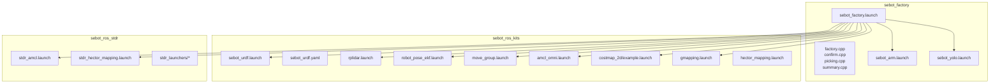
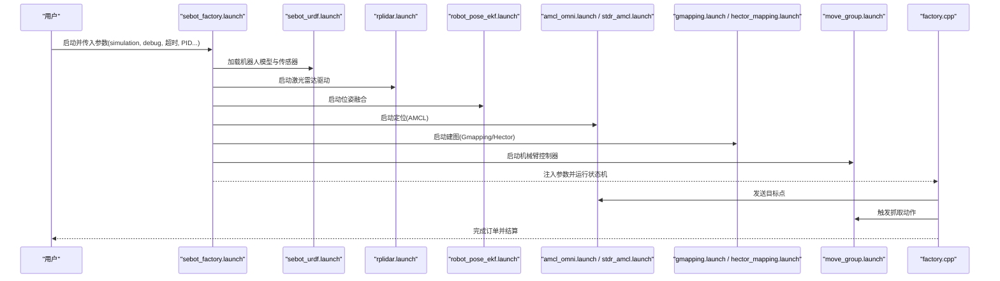
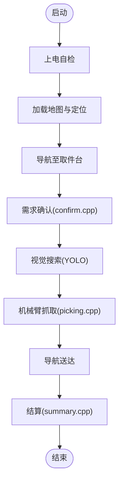
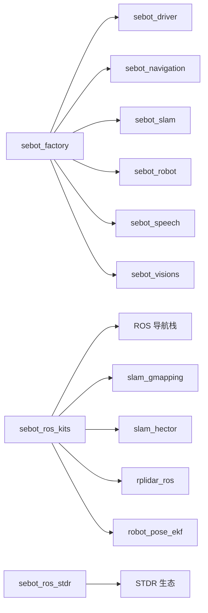

# 配置与部署

<cite>
**本文引用的文件**   
- [sebot_factory.launch](file://sebot_factory/src/sebot_factory/launch/sebot_factory.launch)
- [factory.cpp](file://sebot_factory/src/sebot_factory/src/factory.cpp)
- [confirm.cpp](file://sebot_factory/src/sebot_factory/src/confirm.cpp)
- [picking.cpp](file://sebot_factory/src/sebot_factory/src/picking.cpp)
- [summary.cpp](file://sebot_factory/src/sebot_factory/src/summary.cpp)
- [sebot_arm.launch](file://sebot_factory/src/sebot_factory/launch/sebot_arm.launch)
- [sebot_yolo.launch](file://sebot_factory/src/sebot_factory/launch/sebot_yolo.launch)
- [sebot_urdf.yaml](file://sebot_ros_kits/src/sebot_driver/sebot_urdf/config/sebot_urdf.yaml)
- [sebot_urdf.launch](file://sebot_ros_kits/src/sebot_driver/sebot_urdf/launch/sebot_urdf.launch)
- [rplidar.launch](file://sebot_ros_kits/src/sebot_driver/rplidar_ros/launch/rplidar.launch)
- [robot_pose_ekf.launch](file://sebot_ros_kits/src/sebot_driver/robot_pose_ekf/launch/robot_pose_ekf.launch)
- [move_group.launch](file://sebot_ros_kits/src/sebot_driver/sebot_talon_moveit/launch/move_group.launch)
- [amcl_omni.launch](file://sebot_ros_kits/src/sebot_navigation/amcl/examples/amcl_omni.launch)
- [example.launch](file://sebot_ros_kits/src/sebot_navigation/costmap_2d/launch/example.launch)
- [gmapping.launch](file://sebot_slam/sebot_slam/launch/gmapping.launch)
- [hector_mapping.launch](file://sebot_slam/sebot_slam/launch/hector_mapping.launch)
- [stdr_amcl.launch](file://sebot_ros_stdr/src/sebot_stdr/stdr_amcl/launch/stdr_amcl.launch)
- [stdr_hector_mapping.launch](file://sebot_ros_stdr/src/sebot_stdr/stdr_hector_mapping/launch/stdr_hector_mapping.launch)
- [stdr_launchers](file://sebot_ros_stdr/src/sebot_stdr/stdr_launchers/launch)
- [CMakeLists.txt](file://sebot_factory/src/CMakeLists.txt)
- [package.xml](file://sebot_factory/src/sebot_factory/package.xml)
</cite>

## 目录
1. [简介](#简介)
2. [项目结构](#项目结构)
3. [核心组件](#核心组件)
4. [架构总览](#架构总览)
5. [详细组件分析](#详细组件分析)
6. [依赖分析](#依赖分析)
7. [性能考虑](#性能考虑)
8. [故障排查指南](#故障排查指南)
9. [结论](#结论)
10. [附录](#附录)

## 简介
本章节面向“配置与部署”，聚焦于 sebot_factory 应用层、sebot_ros_kits 机器人套件与 sebot_ros_stdr 仿真层的启动组织、参数化配置与环境准备。文档将详细说明：
- launch 文件的组织方式与关键参数（simulation、debug、导航超时、PID 等）
- YAML 配置文件结构与含义（导航、SLAM、传感器）
- 环境变量设置与依赖包版本管理
- 实机部署、仿真部署与混合部署的配置差异
- 参数热重载与动态配置方法
- 完整配置示例、参数参考表与部署检查清单
- 常见配置问题的诊断与解决方法

## 项目结构
本项目由三个相互独立的 catkin 工作空间组成，需分别 catkin_make：
- sebot_factory：应用层业务节点与主入口 launch
- sebot_ros_kits：驱动、导航栈、SLAM、MoveIt! 等基础能力
- sebot_ros_stdr：STDR 仿真环境及集成 launch

图表来源
- [sebot_factory.launch](file://sebot_factory/src/sebot_factory/launch/sebot_factory.launch)
- [sebot_urdf.launch](file://sebot_ros_kits/src/sebot_driver/sebot_urdf/launch/sebot_urdf.launch)
- [rplidar.launch](file://sebot_ros_kits/src/sebot_driver/rplidar_ros/launch/rplidar.launch)
- [robot_pose_ekf.launch](file://sebot_ros_kits/src/sebot_driver/robot_pose_ekf/launch/robot_pose_ekf.launch)
- [move_group.launch](file://sebot_ros_kits/src/sebot_driver/sebot_talon_moveit/launch/move_group.launch)
- [amcl_omni.launch](file://sebot_ros_kits/src/sebot_navigation/amcl/examples/amcl_omni.launch)
- [example.launch](file://sebot_ros_kits/src/sebot_navigation/costmap_2d/launch/example.launch)
- [gmapping.launch](file://sebot_slam/sebot_slam/launch/gmapping.launch)
- [hector_mapping.launch](file://sebot_slam/sebot_slam/launch/hector_mapping.launch)
- [stdr_amcl.launch](file://sebot_ros_stdr/src/sebot_stdr/stdr_amcl/launch/stdr_amcl.launch)
- [stdr_hector_mapping.launch](file://sebot_ros_stdr/src/sebot_stdr/stdr_hector_mapping/launch/stdr_hector_mapping.launch)
- [stdr_launchers](file://sebot_ros_stdr/src/sebot_stdr/stdr_launchers/launch)

章节来源
- [CMakeLists.txt](file://sebot_factory/src/CMakeLists.txt)
- [package.xml](file://sebot_factory/src/sebot_factory/package.xml)

## 核心组件
- 主入口与状态机
  - sebot_factory.launch：统一入口，负责加载 URDF、传感器、EKF、导航、SLAM、机械臂与视觉等子模块；通过 simulation/debug 等参数切换运行模式与调试行为。
  - factory.cpp：实现订单处理主状态机（MultiNavi），串联导航、确认、视觉搜索、抓取、送达与结算流程。
- 业务子节点
  - confirm.cpp：需求确认交互逻辑
  - picking.cpp：智能取件策略与执行
  - summary.cpp：结算汇总与上报
- 驱动与感知
  - sebot_urdf.launch + sebot_urdf.yaml：机器人模型与关节/传感器初始配置
  - rplidar.launch：激光雷达驱动与话题发布
  - robot_pose_ekf.launch：IMU+里程计融合定位
- 导航与建图
  - amcl_omni.launch / stdr_amcl.launch：粒子滤波定位
  - gmapping.launch / hector_mapping.launch：建图算法
  - costmap_2d/example.launch：代价地图通用配置
- 机械臂
  - move_group.launch：MoveIt! 规划与执行
- 仿真
  - stdr_*：STDR 仿真器与配套 launch

章节来源
- [sebot_factory.launch](file://sebot_factory/src/sebot_factory/launch/sebot_factory.launch)
- [factory.cpp](file://sebot_factory/src/sebot_factory/src/factory.cpp)
- [confirm.cpp](file://sebot_factory/src/sebot_factory/src/confirm.cpp)
- [picking.cpp](file://sebot_factory/src/sebot_factory/src/picking.cpp)
- [summary.cpp](file://sebot_factory/src/sebot_factory/src/summary.cpp)
- [sebot_urdf.launch](file://sebot_ros_kits/src/sebot_driver/sebot_urdf/launch/sebot_urdf.launch)
- [sebot_urdf.yaml](file://sebot_ros_kits/src/sebot_driver/sebot_urdf/config/sebot_urdf.yaml)
- [rplidar.launch](file://sebot_ros_kits/src/sebot_driver/rplidar_ros/launch/rplidar.launch)
- [robot_pose_ekf.launch](file://sebot_ros_kits/src/sebot_driver/robot_pose_ekf/launch/robot_pose_ekf.launch)
- [amcl_omni.launch](file://sebot_ros_kits/src/sebot_navigation/amcl/examples/amcl_omni.launch)
- [gmapping.launch](file://sebot_slam/sebot_slam/launch/gmapping.launch)
- [hector_mapping.launch](file://sebot_slam/sebot_slam/launch/hector_mapping.launch)
- [example.launch](file://sebot_ros_kits/src/sebot_navigation/costmap_2d/launch/example.launch)
- [move_group.launch](file://sebot_ros_kits/src/sebot_driver/sebot_talon_moveit/launch/move_group.launch)
- [stdr_amcl.launch](file://sebot_ros_stdr/src/sebot_stdr/stdr_amcl/launch/stdr_amcl.launch)
- [stdr_hector_mapping.launch](file://sebot_ros_stdr/src/sebot_stdr/stdr_hector_mapping/launch/stdr_hector_mapping.launch)

## 架构总览
下图展示了从 sebot_factory.launch 到各子系统 launch 的调用关系与数据流。

图表来源
- [sebot_factory.launch](file://sebot_factory/src/sebot_factory/launch/sebot_factory.launch)
- [sebot_urdf.launch](file://sebot_ros_kits/src/sebot_driver/sebot_urdf/launch/sebot_urdf.launch)
- [rplidar.launch](file://sebot_ros_kits/src/sebot_driver/rplidar_ros/launch/rplidar.launch)
- [robot_pose_ekf.launch](file://sebot_ros_kits/src/sebot_driver/robot_pose_ekf/launch/robot_pose_ekf.launch)
- [amcl_omni.launch](file://sebot_ros_kits/src/sebot_navigation/amcl/examples/amcl_omni.launch)
- [gmapping.launch](file://sebot_slam/sebot_slam/launch/gmapping.launch)
- [hector_mapping.launch](file://sebot_slam/sebot_slam/launch/hector_mapping.launch)
- [move_group.launch](file://sebot_ros_kits/src/sebot_driver/sebot_talon_moveit/launch/move_group.launch)
- [factory.cpp](file://sebot_factory/src/sebot_factory/src/factory.cpp)

## 详细组件分析

### sebot_factory.launch 参数与组织
- 作用
  - 统一入口，按场景加载各子系统 launch
  - 通过参数控制仿真/实机、调试开关、导航超时、PID 等
- 关键参数（建议项）
  - simulation：布尔值，true 时启用 STDR 仿真相关 launch，false 使用实机驱动
  - debug：布尔值，true 时开启图像识别界面或可视化调试
  - nav_timeout：导航任务超时时间（秒），用于防止卡死
  - pid_p/pid_i/pid_d：机械臂抓取闭环 PID 参数
  - pick_distance：取件距离阈值（米）
  - rescan_interval：补扫间隔（秒），用于局部更新代价地图
- 典型组织方式
  - 条件包含：根据 simulation 选择 amcl_omni.launch 或 stdr_amcl.launch
  - 参数传递：通过 <param> 或 <rosparam> 下发至各节点
  - 资源路径：通过 <arg> 指定 map、model、config 路径

章节来源
- [sebot_factory.launch](file://sebot_factory/src/sebot_factory/launch/sebot_factory.launch)

### factory.cpp 主状态机与参数读取
- 功能
  - 基于 MultiNavi 的状态机，串联导航、确认、视觉、抓取、送达、结算
  - 读取 launch 下发的参数，驱动各阶段行为
- 关键流程
  - 上电自检 → 加载地图与定位 → 导航至取件台 → 需求确认 → 视觉搜索 → 机械臂抓取 → 导航送达 → 结算汇总

图表来源
- [factory.cpp](file://sebot_factory/src/sebot_factory/src/factory.cpp)
- [confirm.cpp](file://sebot_factory/src/sebot_factory/src/confirm.cpp)
- [picking.cpp](file://sebot_factory/src/sebot_factory/src/picking.cpp)
- [summary.cpp](file://sebot_factory/src/sebot_factory/src/summary.cpp)

章节来源
- [factory.cpp](file://sebot_factory/src/sebot_factory/src/factory.cpp)
- [confirm.cpp](file://sebot_factory/src/sebot_factory/src/confirm.cpp)
- [picking.cpp](file://sebot_factory/src/sebot_factory/src/picking.cpp)
- [summary.cpp](file://sebot_factory/src/sebot_factory/src/summary.cpp)

### sebot_urdf.yaml 与 sebot_urdf.launch
- 作用
  - 定义机器人模型、关节、传感器安装位置与初始参数
  - 被 sebot_urdf.launch 加载并发布 TF、joint_states 等
- 关键内容
  - 连杆与关节定义
  - 传感器（激光、IMU、相机）安装位姿
  - 初始质量、惯性等物理属性

章节来源
- [sebot_urdf.yaml](file://sebot_ros_kits/src/sebot_driver/sebot_urdf/config/sebot_urdf.yaml)
- [sebot_urdf.launch](file://sebot_ros_kits/src/sebot_driver/sebot_urdf/launch/sebot_urdf.launch)

### rplidar.launch 与 robot_pose_ekf.launch
- rplidar.launch
  - 启动激光雷达驱动，发布扫描数据
  - 可配置端口、帧率、分辨率等
- robot_pose_ekf.launch
  - 融合 IMU 与里程计，输出更稳健的位姿估计
  - 可配置协方差、观测频率、权重等

章节来源
- [rplidar.launch](file://sebot_ros_kits/src/sebot_driver/rplidar_ros/launch/rplidar.launch)
- [robot_pose_ekf.launch](file://sebot_ros_kits/src/sebot_driver/robot_pose_ekf/launch/robot_pose_ekf.launch)

### 导航与建图（AMCL/Gmapping/Hector/Costmap）
- AMCL
  - amcl_omni.launch：轮式底盘定位参数（粒子数、重采样、观测模型）
  - stdr_amcl.launch：仿真环境下的 AMCL 配置
- Gmapping/Hector
  - gmapping.launch：激光建图参数（分辨率、最大范围、更新频率）
  - hector_mapping.launch：无里程计建图参数（IMU 权重、匹配阈值）
- Costmap
  - example.launch：全局/局部代价地图层配置（静态、障碍物、膨胀）

章节来源
- [amcl_omni.launch](file://sebot_ros_kits/src/sebot_navigation/amcl/examples/amcl_omni.launch)
- [stdr_amcl.launch](file://sebot_ros_stdr/src/sebot_stdr/stdr_amcl/launch/stdr_amcl.launch)
- [gmapping.launch](file://sebot_slam/sebot_slam/launch/gmapping.launch)
- [hector_mapping.launch](file://sebot_slam/sebot_slam/launch/hector_mapping.launch)
- [example.launch](file://sebot_ros_kits/src/sebot_navigation/costmap_2d/launch/example.launch)

### MoveIt! 机械臂（move_group.launch）
- 作用
  - 启动 MoveIt! 规划与执行，提供轨迹生成、碰撞检测、末端控制
- 关键配置
  - SRDF、关节限制、规划器（OMPL/CHOMP）、控制器接口

章节来源
- [move_group.launch](file://sebot_ros_kits/src/sebot_driver/sebot_talon_moveit/launch/move_group.launch)

### 仿真集成（STDR）
- stdr_amcl.launch / stdr_hector_mapping.launch：在 STDR 中启用定位与建图
- stdr_launchers：提供一键启动仿真环境的脚本集合

章节来源
- [stdr_amcl.launch](file://sebot_ros_stdr/src/sebot_stdr/stdr_amcl/launch/stdr_amcl.launch)
- [stdr_hector_mapping.launch](file://sebot_ros_stdr/src/sebot_stdr/stdr_hector_mapping/launch/stdr_hector_mapping.launch)
- [stdr_launchers](file://sebot_ros_stdr/src/sebot_stdr/stdr_launchers/launch)

## 依赖分析
- 包依赖
  - sebot_factory 依赖 sebot_driver、sebot_navigation、sebot_slam、sebot_robot、sebot_speech、sebot_visions
  - sebot_ros_kits 依赖 ROS 官方导航栈、slam_gmapping、slam_hector、rplidar_ros、robot_pose_ekf 等
  - sebot_ros_stdr 依赖 STDR 仿真生态
- 构建与编译
  - 每个工作空间独立 catkin_make，确保依赖链正确解析

图表来源
- [package.xml](file://sebot_factory/src/sebot_factory/package.xml)
- [CMakeLists.txt](file://sebot_factory/src/CMakeLists.txt)

章节来源
- [package.xml](file://sebot_factory/src/sebot_factory/package.xml)
- [CMakeLists.txt](file://sebot_factory/src/CMakeLists.txt)

## 性能考虑
- 导航性能
  - 合理设置 AMCL 粒子数与重采样阈值，平衡精度与计算开销
  - 调整 DWA 局部规划器的速度/加速度限制，避免震荡
  - 代价地图膨胀半径与更新频率需与传感器频率匹配
- SLAM 性能
  - Gmapping 的最大扫描范围与分辨率影响内存占用
  - Hector 在无里程计场景下对 IMU 噪声敏感，需调优权重
- 视觉与 NPU
  - YOLO 多帧检测需控制推理频率与缓存大小，避免 CPU/GPU 拥塞
- 机械臂 PID
  - 根据负载与摩擦特性整定 P/I/D，避免过冲与抖动

[本节为通用指导，不直接分析具体文件]

## 故障排查指南
- 常见问题与解决思路
  - 无法连接激光雷达
    - 检查 rplidar.launch 端口与权限，确认设备未被占用
  - 定位发散
    - 检查 AMCL 粒子数与观测模型参数，确认 TF 树正确
  - 建图漂移
    - 调整 Gmapping/Hector 的参数，确保传感器频率与更新周期一致
  - 机械臂抓取不稳
    - 重新整定 PID，检查关节限位与碰撞检测配置
  - 仿真与实机不一致
    - 核对 simulation 参数与对应 launch 的资源路径
- 动态配置与热重载
  - 使用 rosparam set 修改运行时参数（如导航超时、PID、重采样频率）
  - 对于支持动态参数的节点，无需重启即可生效
  - 注意部分参数（如地图、模型）需重启节点或重新加载

章节来源
- [sebot_factory.launch](file://sebot_factory/src/sebot_factory/launch/sebot_factory.launch)
- [rplidar.launch](file://sebot_ros_kits/src/sebot_driver/rplidar_ros/launch/rplidar.launch)
- [amcl_omni.launch](file://sebot_ros_kits/src/sebot_navigation/amcl/examples/amcl_omni.launch)
- [gmapping.launch](file://sebot_slam/sebot_slam/launch/gmapping.launch)
- [hector_mapping.launch](file://sebot_slam/sebot_slam/launch/hector_mapping.launch)
- [move_group.launch](file://sebot_ros_kits/src/sebot_driver/sebot_talon_moveit/launch/move_group.launch)

## 结论
通过 sebot_factory.launch 的统一入口与参数化组织，结合 sebot_ros_kits 的基础能力与 sebot_ros_stdr 的仿真生态，可实现灵活的实机/仿真/混合部署。合理的参数配置与动态调整是保障系统稳定与性能的关键。

[本节为总结性内容，不直接分析具体文件]

## 附录

### 环境变量与依赖版本管理
- 环境变量
  - ROS_PACKAGE_PATH：指向各工作空间的 src 目录
  - LD_LIBRARY_PATH：若使用自定义库（如 NPU 推理库），需加入该变量
- 版本管理
  - 固定 ROS 发行版与依赖包版本，避免升级导致的不兼容
  - 使用 catkin workspace 隔离不同项目依赖

[本节为通用指导，不直接分析具体文件]

### 部署场景配置要点
- 实机部署
  - simulation=false，加载 rplidar.launch、robot_pose_ekf.launch、move_group.launch
  - 校准传感器安装位姿与 TF 树
- 仿真部署
  - simulation=true，加载 stdr_amcl.launch、stdr_hector_mapping.launch
  - 使用 STDR 地图与虚拟传感器
- 混合部署
  - 部分模块使用仿真（如视觉），部分模块使用实机（如导航）
  - 通过参数切换与消息桥接实现

[本节为通用指导，不直接分析具体文件]

### 参数参考表（建议项）
- 导航参数
  - AMCL 粒子数、重采样阈值、观测模型权重
  - DWA 速度/加速度限制、轨迹评分权重
  - 代价地图膨胀半径、更新频率
- SLAM 参数
  - Gmapping 分辨率、最大扫描范围、更新频率
  - Hector IMU 权重、匹配阈值
- 传感器配置
  - 激光雷达端口、帧率、分辨率
  - IMU 协方差、噪声模型
- 机械臂 PID
  - P/I/D 参数、限幅、死区

[本节为通用指导，不直接分析具体文件]

### 部署检查清单
- 环境准备
  - ROS 工作空间已正确 source
  - 依赖包已编译且无冲突
- 参数校验
  - simulation/debug 参数符合预期
  - 导航超时、PID、取件距离、补扫间隔已设置
- 传感器与 TF
  - 激光雷达、IMU、里程计正常发布
  - TF 树完整且无循环
- 导航与建图
  - AMCL 定位收敛
  - Gmapping/Hector 建图质量良好
- 机械臂与视觉
  - MoveIt! 规划成功
  - YOLO 推理正常，多帧确认有效

[本节为通用指导，不直接分析具体文件]