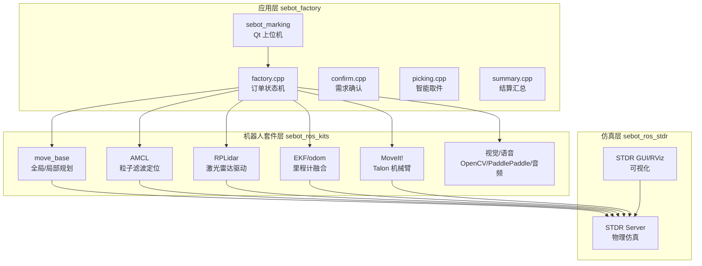
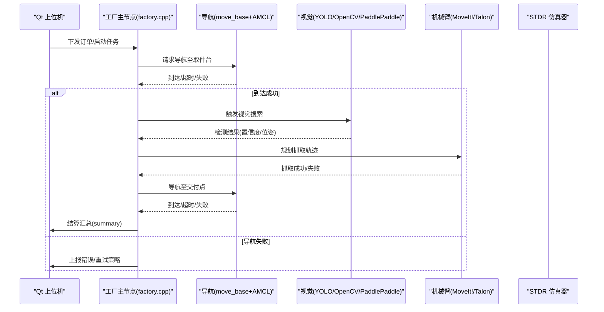
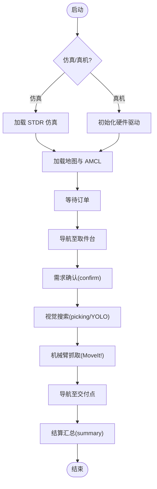
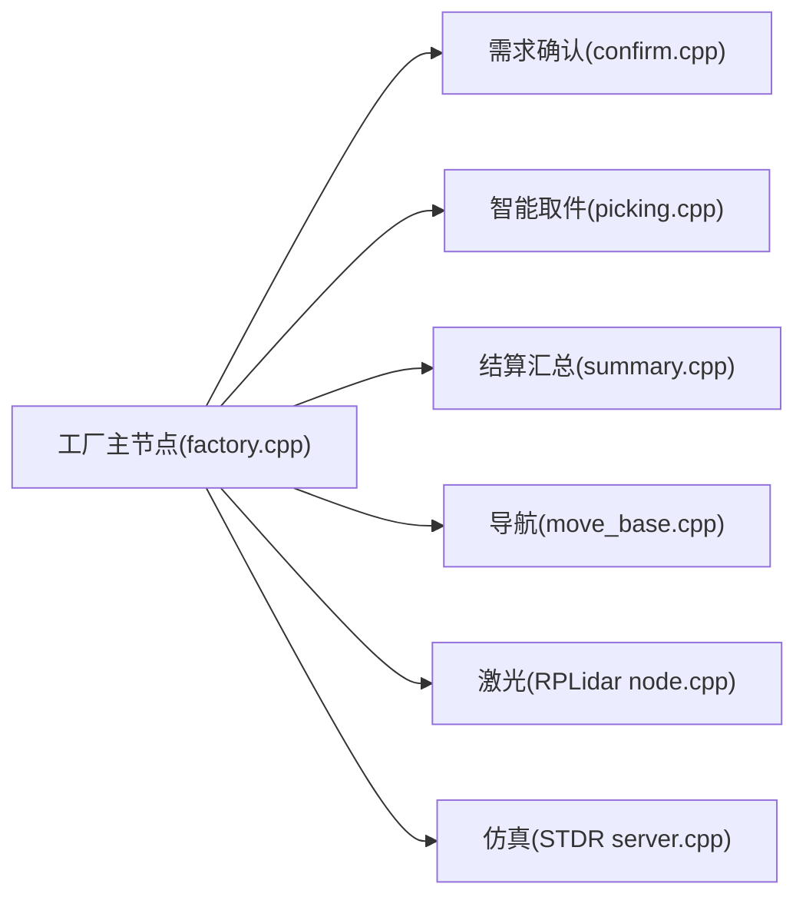

# 项目概述

<cite>
**本文引用的文件**   
- [sebot_factory/src/sebot_factory/src/factory.cpp](file://sebot_factory/src/sebot_factory/src/factory.cpp)
- [sebot_factory/src/sebot_factory/src/confirm.cpp](file://sebot_factory/src/sebot_factory/src/confirm.cpp)
- [sebot_factory/src/sebot_factory/src/picking.cpp](file://sebot_factory/src/sebot_factory/src/picking.cpp)
- [sebot_factory/src/sebot_factory/src/summary.cpp](file://sebot_factory/src/sebot_factory/src/summary.cpp)
- [sebot_factory/src/sebot_factory/launch/sebot_factory.launch](file://sebot_factory/src/sebot_factory/launch/sebot_factory.launch)
- [sebot_factory/src/sebot_marking/src/main.cpp](file://sebot_factory/src/sebot_marking/src/main.cpp)
- [sebot_ros_kits/src/sebot_robot/src/controller.cpp](file://sebot_ros_kits/src/sebot_robot/src/controller.cpp)
- [sebot_ros_kits/src/sebot_navigation/move_base/src/move_base.cpp](file://sebot_ros_kits/src/sebot_navigation/move_base/src/move_base.cpp)
- [sebot_ros_kits/src/sebot_driver/rplidar_ros/src/node.cpp](file://sebot_ros_kits/src/sebot_driver/rplidar_ros/src/node.cpp)
- [sebot_ros_stdr/src/sebot_stdr/stdr_server/src/server.cpp](file://sebot_ros_stdr/src/sebot_stdr/stdr_server/src/server.cpp)
</cite>

## 目录
1. [简介](#简介)
2. [项目结构](#项目结构)
3. [核心组件](#核心组件)
4. [架构总览](#架构总览)
5. [详细组件分析](#详细组件分析)
6. [依赖关系分析](#依赖关系分析)
7. [性能考量](#性能考量)
8. [故障排查指南](#故障排查指南)
9. [结论](#结论)
10. [附录](#附录)

## 简介
本项目面向机器人竞赛的自动化工厂物流场景，构建基于 ROS 1 的三层系统：应用层 sebot_factory、机器人套件层 sebot_ros_kits、仿真层 sebot_ros_stdr。系统以订单驱动，实现“上电自检 → 加载地图与 AMCL 定位 → 按订单导航至取件台 → 需求确认 → YOLO 视觉搜索（NPU 加速 Yolov3，多帧检测确认）→ 机械臂 PID 闭环抓取 → 导航送达并结算”的全流程自动化。技术栈以 C++/roscpp 为主，Python 脚本为辅，结合 Qt 上位机、MoveIt! 机械臂控制、OpenCV 图像处理与 PaddlePaddle 推理框架，形成从感知到执行的完整闭环。

## 项目结构
仓库由三个相互独立的 catkin 工作空间组成，各自含 src/ 且需分别 catkin_make：
- sebot_factory 应用层：业务逻辑与任务编排，包含工厂主节点、需求确认、智能取件、结算汇总等；以及 Qt 建图标注上位机 sebot_marking。
- sebot_ros_kits 机器人套件层：硬件驱动、SLAM、导航、语音与视觉等基础能力封装，提供 move_base、RPLidar、EKF 里程计融合、MoveIt! 等。
- sebot_ros_stdr 仿真层：STDR 仿真器及其配套包，用于在仿真环境中验证导航、SLAM 与任务流程。

图表来源
- [sebot_factory/src/sebot_factory/src/factory.cpp](file://sebot_factory/src/sebot_factory/src/factory.cpp)
- [sebot_factory/src/sebot_factory/src/confirm.cpp](file://sebot_factory/src/sebot_factory/src/confirm.cpp)
- [sebot_factory/src/sebot_factory/src/picking.cpp](file://sebot_factory/src/sebot_factory/src/picking.cpp)
- [sebot_factory/src/sebot_factory/src/summary.cpp](file://sebot_factory/src/sebot_factory/src/summary.cpp)
- [sebot_factory/src/sebot_marking/src/main.cpp](file://sebot_factory/src/sebot_marking/src/main.cpp)
- [sebot_ros_kits/src/sebot_navigation/move_base/src/move_base.cpp](file://sebot_ros_kits/src/sebot_navigation/move_base/src/move_base.cpp)
- [sebot_ros_kits/src/sebot_driver/rplidar_ros/src/node.cpp](file://sebot_ros_kits/src/sebot_driver/rplidar_ros/src/node.cpp)
- [sebot_ros_stdr/src/sebot_stdr/stdr_server/src/server.cpp](file://sebot_ros_stdr/src/sebot_stdr/stdr_server/src/server.cpp)

章节来源
- [sebot_factory/src/sebot_factory/launch/sebot_factory.launch](file://sebot_factory/src/sebot_factory/launch/sebot_factory.launch)

## 核心组件
- 工厂主节点（factory.cpp）：订单驱动的状态机，协调导航、视觉识别、机械臂抓取与结算，支持仿真/真机切换与调试开关。
- 需求确认（confirm.cpp）：与上层交互或传感器反馈进行订单需求校验，确保目标工件与数量正确。
- 智能取件（picking.cpp）：调用视觉模块进行目标检测与位姿估计，联动 MoveIt! 完成抓取动作。
- 结算汇总（summary.cpp）：统计订单执行结果，输出结算信息。
- Qt 上位机（sebot_marking）：用于建图标注与参数配置，辅助调试与标定。
- 导航与控制（move_base + AMCL + EKF）：全局路径规划、局部避障、定位与里程计融合。
- 传感器驱动（RPLidar）：激光数据接入与发布。
- 仿真环境（STDR）：提供物理引擎与传感器仿真，便于快速迭代。

章节来源
- [sebot_factory/src/sebot_factory/src/factory.cpp](file://sebot_factory/src/sebot_factory/src/factory.cpp)
- [sebot_factory/src/sebot_factory/src/confirm.cpp](file://sebot_factory/src/sebot_factory/src/confirm.cpp)
- [sebot_factory/src/sebot_factory/src/picking.cpp](file://sebot_factory/src/sebot_factory/src/picking.cpp)
- [sebot_factory/src/sebot_factory/src/summary.cpp](file://sebot_factory/src/sebot_factory/src/summary.cpp)
- [sebot_factory/src/sebot_marking/src/main.cpp](file://sebot_factory/src/sebot_marking/src/main.cpp)
- [sebot_ros_kits/src/sebot_navigation/move_base/src/move_base.cpp](file://sebot_ros_kits/src/sebot_navigation/move_base/src/move_base.cpp)
- [sebot_ros_kits/src/sebot_driver/rplidar_ros/src/node.cpp](file://sebot_ros_kits/src/sebot_driver/rplidar_ros/src/node.cpp)
- [sebot_ros_stdr/src/sebot_stdr/stdr_server/src/server.cpp](file://sebot_ros_stdr/src/sebot_stdr/stdr_server/src/server.cpp)

## 架构总览
系统采用三层架构，职责清晰、松耦合：
- 应用层（sebot_factory）：业务编排与状态机，负责订单生命周期管理。
- 机器人套件层（sebot_ros_kits）：硬件抽象与通用能力（导航、SLAM、视觉、语音、机械臂）。
- 仿真层（sebot_ros_stdr）：STDR 仿真器，提供一致的接口与可视化。

图表来源
- [sebot_factory/src/sebot_factory/src/factory.cpp](file://sebot_factory/src/sebot_factory/src/factory.cpp)
- [sebot_factory/src/sebot_factory/src/confirm.cpp](file://sebot_factory/src/sebot_factory/src/confirm.cpp)
- [sebot_factory/src/sebot_factory/src/picking.cpp](file://sebot_factory/src/sebot_factory/src/picking.cpp)
- [sebot_factory/src/sebot_factory/src/summary.cpp](file://sebot_factory/src/sebot_factory/src/summary.cpp)
- [sebot_factory/src/sebot_marking/src/main.cpp](file://sebot_factory/src/sebot_marking/src/main.cpp)
- [sebot_ros_kits/src/sebot_navigation/move_base/src/move_base.cpp](file://sebot_ros_kits/src/sebot_navigation/move_base/src/move_base.cpp)
- [sebot_ros_stdr/src/sebot_stdr/stdr_server/src/server.cpp](file://sebot_ros_stdr/src/sebot_stdr/stdr_server/src/server.cpp)

## 详细组件分析

### 工厂主节点（factory.cpp）
- 功能要点：订单状态机、任务调度、仿真/真机切换、调试开关、关键参数（导航超时、PID、取件距离、补扫等）集中管理。
- 数据流：订阅订单与传感器话题，发布导航目标、视觉触发、机械臂动作与服务响应。
- 异常处理：导航超时重试、视觉多次确认、抓取失败回退策略。

图表来源
- [sebot_factory/src/sebot_factory/src/factory.cpp](file://sebot_factory/src/sebot_factory/src/factory.cpp)
- [sebot_factory/src/sebot_factory/src/confirm.cpp](file://sebot_factory/src/sebot_factory/src/confirm.cpp)
- [sebot_factory/src/sebot_factory/src/picking.cpp](file://sebot_factory/src/sebot_factory/src/picking.cpp)
- [sebot_factory/src/sebot_factory/src/summary.cpp](file://sebot_factory/src/sebot_factory/src/summary.cpp)

章节来源
- [sebot_factory/src/sebot_factory/src/factory.cpp](file://sebot_factory/src/sebot_factory/src/factory.cpp)
- [sebot_factory/src/sebot_factory/launch/sebot_factory.launch](file://sebot_factory/src/sebot_factory/launch/sebot_factory.launch)

### 需求确认（confirm.cpp）
- 功能要点：与上层或传感器反馈进行订单需求校验，确保目标工件与数量正确。
- 输入/输出：接收订单信息与传感器状态，返回确认结果与必要元数据。
- 容错：对不一致情况给出重试或告警。

章节来源
- [sebot_factory/src/sebot_factory/src/confirm.cpp](file://sebot_factory/src/sebot_factory/src/confirm.cpp)

### 智能取件（picking.cpp）
- 功能要点：调用视觉模块进行目标检测与位姿估计，联动 MoveIt! 完成抓取动作。
- 算法要点：YOLOv3（NPU 加速）、多帧检测确认、OpenCV 后处理、PaddlePaddle 推理。
- 控制要点：与机械臂 PID 闭环配合，保证抓取精度与稳定性。

章节来源
- [sebot_factory/src/sebot_factory/src/picking.cpp](file://sebot_factory/src/sebot_factory/src/picking.cpp)

### 结算汇总（summary.cpp）
- 功能要点：统计订单执行结果，输出结算信息，供上层记录与展示。
- 数据要点：成功次数、失败原因、耗时统计、资源消耗等。

章节来源
- [sebot_factory/src/sebot_factory/src/summary.cpp](file://sebot_factory/src/sebot_factory/src/summary.cpp)

### Qt 上位机（sebot_marking）
- 功能要点：建图标注、参数配置、调试可视化。
- 集成方式：通过 ROS 话题/服务与工厂主节点交互，辅助标定与测试。

章节来源
- [sebot_factory/src/sebot_marking/src/main.cpp](file://sebot_factory/src/sebot_marking/src/main.cpp)

### 导航与控制（move_base + AMCL + EKF）
- 角色说明：fork 自 ROS 官方/开源项目，在本项目中作为导航核心，提供全局/局部规划与定位。
- 集成方式：通过 launch 文件加载参数与插件，与工厂主节点协作。
- 定制点：参数调优（代价地图、规划器、恢复行为），与仿真/真机一致性。

章节来源
- [sebot_ros_kits/src/sebot_navigation/move_base/src/move_base.cpp](file://sebot_ros_kits/src/sebot_navigation/move_base/src/move_base.cpp)

### 传感器驱动（RPLidar）
- 角色说明：激光雷达数据接入与发布，为 SLAM 与导航提供观测。
- 集成方式：通过 node 节点发布 scan 消息，供 gmapping/hector 使用。

章节来源
- [sebot_ros_kits/src/sebot_driver/rplidar_ros/src/node.cpp](file://sebot_ros_kits/src/sebot_driver/rplidar_ros/src/node.cpp)

### 仿真环境（STDR）
- 角色说明：STDR 仿真器提供物理引擎与传感器仿真，便于快速迭代与验证。
- 集成方式：通过 stdr_server 启动仿真，与导航、SLAM、任务节点对接。

章节来源
- [sebot_ros_stdr/src/sebot_stdr/stdr_server/src/server.cpp](file://sebot_ros_stdr/src/sebot_stdr/stdr_server/src/server.cpp)

## 依赖关系分析
- 应用层依赖机器人套件层的导航、视觉、机械臂与传感器驱动。
- 机器人套件层依赖底层硬件或仿真环境（STDR）。
- 仿真层提供统一接口，屏蔽真机差异，提升可移植性。

图表来源
- [sebot_factory/src/sebot_factory/src/factory.cpp](file://sebot_factory/src/sebot_factory/src/factory.cpp)
- [sebot_factory/src/sebot_factory/src/confirm.cpp](file://sebot_factory/src/sebot_factory/src/confirm.cpp)
- [sebot_factory/src/sebot_factory/src/picking.cpp](file://sebot_factory/src/sebot_factory/src/picking.cpp)
- [sebot_factory/src/sebot_factory/src/summary.cpp](file://sebot_factory/src/sebot_factory/src/summary.cpp)
- [sebot_ros_kits/src/sebot_navigation/move_base/src/move_base.cpp](file://sebot_ros_kits/src/sebot_navigation/move_base/src/move_base.cpp)
- [sebot_ros_kits/src/sebot_driver/rplidar_ros/src/node.cpp](file://sebot_ros_kits/src/sebot_driver/rplidar_ros/src/node.cpp)
- [sebot_ros_stdr/src/sebot_stdr/stdr_server/src/server.cpp](file://sebot_ros_stdr/src/sebot_stdr/stdr_server/src/server.cpp)

章节来源
- [sebot_factory/src/sebot_factory/launch/sebot_factory.launch](file://sebot_factory/src/sebot_factory/launch/sebot_factory.launch)

## 性能考量
- 视觉推理：NPU 加速 YOLOv3，多帧检测确认降低误检率，注意内存与带宽占用。
- 导航规划：合理设置代价地图分辨率与膨胀半径，平衡计算量与安全裕度。
- 机械臂控制：PID 参数整定影响抓取稳定性，避免过冲与振荡。
- 仿真一致性：确保仿真与真机的传感器噪声模型一致，减少迁移成本。
- 资源管理：多线程与异步 I/O 的使用，避免阻塞关键路径。

## 故障排查指南
- 导航超时：检查地图加载、AMCL 初始位姿、代价地图参数与障碍物检测。
- 视觉误检：调整阈值与多帧确认策略，检查光照与相机标定。
- 抓取失败：检查机械臂零点、末端工具标定与 PID 参数。
- 仿真不匹配：核对传感器模型与噪声参数，确保与真机一致。
- 日志定位：启用 debug 开关，查看各节点日志与 RViz 可视化。

章节来源
- [sebot_factory/src/sebot_factory/launch/sebot_factory.launch](file://sebot_factory/src/sebot_factory/launch/sebot_factory.launch)

## 结论
本项目以清晰的三层架构与模块化设计，实现了从订单到执行的全流程自动化。应用层聚焦业务编排，机器人套件层提供稳定可靠的硬件抽象与通用能力，仿真层保障开发与测试效率。通过合理的参数配置与容错策略，系统在复杂环境下具备鲁棒性与可扩展性。

## 附录
- 运行配置：关键参数集中在 sebot_factory.launch，包括 simulation 模式切换、debug 开关、导航超时、PID、取件距离、补扫参数等。
- 技术栈：ROS 1 + catkin，C++/roscpp 为主，Python 脚本为辅；导航 move_base + AMCL + DWA；建图 Gmapping/Hector；机械臂 MoveIt!（Talon）；视觉 OpenCV + PaddlePaddle；上位机 Qt。

章节来源
- [sebot_factory/src/sebot_factory/launch/sebot_factory.launch](file://sebot_factory/src/sebot_factory/launch/sebot_factory.launch)