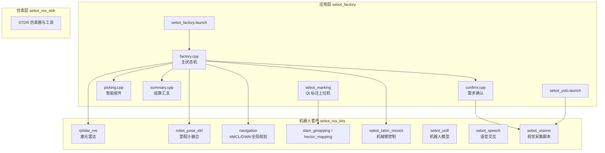
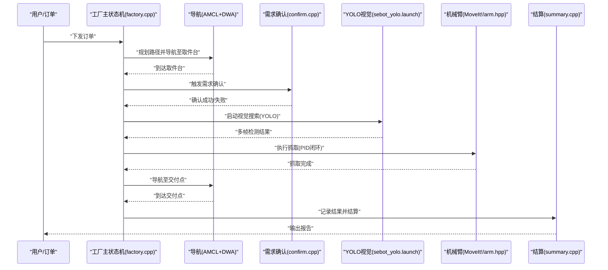
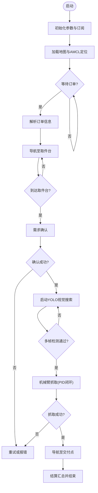
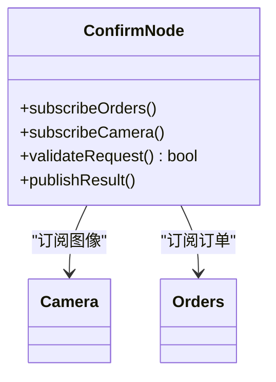
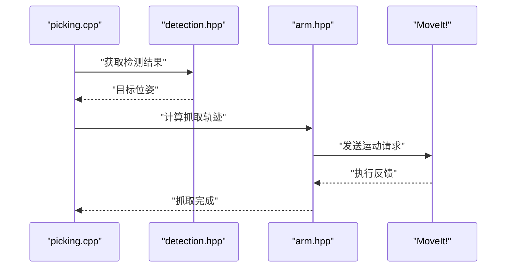
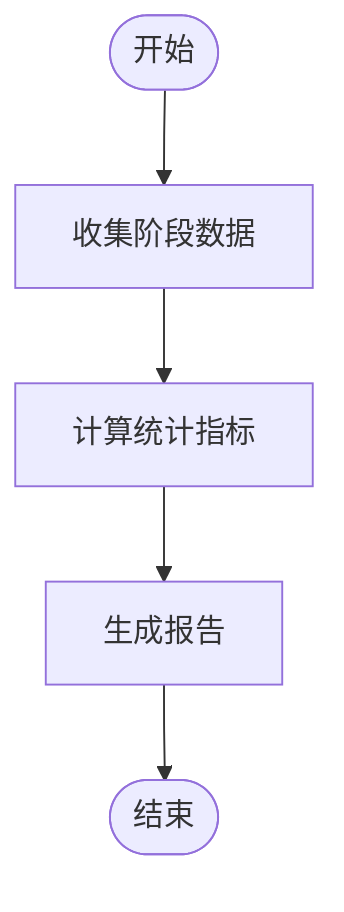
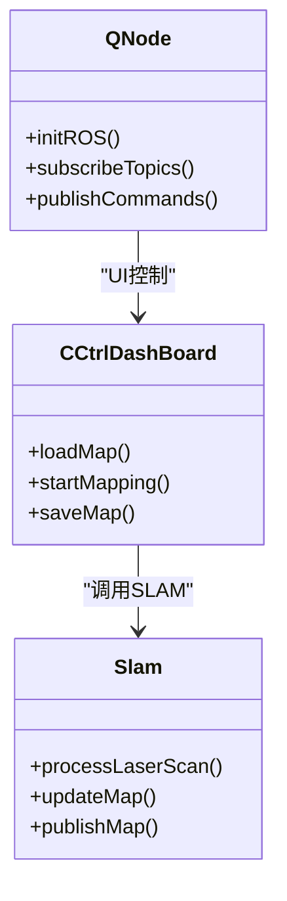
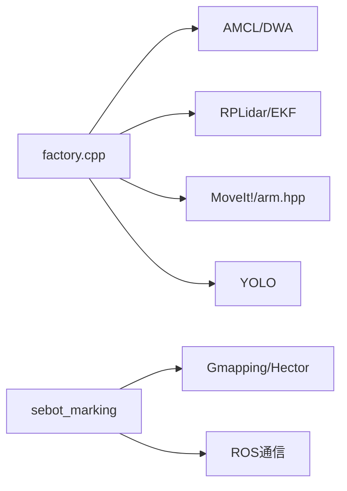

# 简历项目系统

<cite>
**本文引用的文件**   
- [factory.cpp](file://sebot_factory/src/sebot_factory/src/factory.cpp)
- [confirm.cpp](file://sebot_factory/src/sebot_factory/src/confirm.cpp)
- [picking.cpp](file://sebot_factory/src/sebot_factory/src/picking.cpp)
- [summary.cpp](file://sebot_factory/src/sebot_factory/src/summary.cpp)
- [sebot_factory.launch](file://sebot_factory/src/sebot_factory/launch/sebot_factory.launch)
- [sebot_yolo.launch](file://sebot_factory/src/sebot_factory/launch/sebot_yolo.launch)
- [arm.hpp](file://sebot_factory/src/sebot_factory/include/arm.hpp)
- [camera.hpp](file://sebot_factory/src/sebot_factory/include/camera.hpp)
- [detection.hpp](file://sebot_factory/src/sebot_factory/include/detection.hpp)
- [qnode.hpp](file://sebot_factory/src/sebot_marking/include/qnode.hpp)
- [CCtrlDashBoard.h](file://sebot_factory/src/sebot_marking/include/CCtrlDashBoard.h)
- [slam.h](file://sebot_factory/src/sebot_marking/include/slam.h)
- [sebot_marking.launch](file://sebot_factory/src/sebot_marking/launch/sebot_marking.launch)
- [robot_pose_ekf_node.cpp](file://sebot_ros_kits/src/sebot_driver/robot_pose_ekf/src/odom_estimation_node.cpp)
- [rplidar_node.cpp](file://sebot_ros_kits/src/sebot_driver/rplidar_ros/src/node.cpp)
- [move_group.launch](file://sebot_ros_kits/src/sebot_driver/sebot_talon_moveit/launch/move_group.launch)
- [sebot_urdf.launch](file://sebot_ros_kits/src/sebot_driver/sebot_urdf/launch/sebot_urdf.launch)
- [amcl_node.cpp](file://sebot_ros_kits/src/sebot_navigation/amcl/src/amcl_node.cpp)
- [trajectory_planner_ros.cpp](file://sebot_ros_kits/src/sebot_navigation/base_local_planner/src/trajectory_planner_ros.cpp)
- [gmapping_node.cpp](file://sebot_ros_kits/src/sebot_slam/slam_gmapping/slam_gmapping/gmapping_node.cpp)
- [hector_mapping_node.cpp](file://sebot_ros_kits/src/sebot_slam/slam_hector/hector_mapping/src/hector_mapping_node.cpp)
- [sebot_odom.launch](file://sebot_ros_kits/src/sebot_robot/launch/sebot_odom.launch)
- [sebot_audio.xml](file://sebot_ros_kits/src/sebot_speech/launch/sebot_audio.xml)
- [sebotCollection.py](file://sebot_ros_kits/src/sebot_visions/scripts/sebotCollection.py)
</cite>

## 目录
1. [简介](#简介)
2. [项目结构](#项目结构)
3. [核心组件](#核心组件)
4. [架构总览](#架构总览)
5. [详细组件分析](#详细组件分析)
6. [依赖关系分析](#依赖关系分析)
7. [性能考虑](#性能考虑)
8. [故障排查指南](#故障排查指南)
9. [结论](#结论)
10. [附录](#附录)

## 简介
本项目为机器人竞赛的“工厂分拣”任务实现，围绕“上电自检 → 加载地图与 AMCL 定位 → 按订单导航至取件台 → 需求确认 → YOLO 视觉搜索（NPU 加速 Yolov3，多帧检测确认）→ 机械臂 PID 闭环抓取 → 导航送达并结算”的全链路业务展开。代码由三个相互独立的 catkin 工作空间组成：
- sebot_factory：应用层，包含工厂主状态机、需求确认、智能取件、结算汇总等节点以及 Qt 标注上位机。
- sebot_ros_kits：机器人驱动与通用套件，包括传感器驱动、SLAM、导航栈、MoveIt! 机械臂控制等。
- sebot_ros_stdr：仿真环境（STDR），用于离线调试与演示。

文档将重点剖析 sebot_factory 的业务节点与 sebot_marking 上位机，并对 sebot_ros_kits 中的关键集成点进行说明。

## 项目结构
仓库采用三层 catkin 工作空间组织，每层均含 src/ 目录，需分别执行 catkin_make 构建。核心目录职责如下：
- sebot_factory：业务逻辑与启动配置集中于此，包含 launch 文件、资源模型、C++ 源与单元测试。
- sebot_ros_kits：封装常用 ROS 功能包，如 rplidar_ros、robot_pose_ekf、navigation、slam、moveit、语音与视觉脚本等。
- sebot_ros_stdr：STDR 仿真相关包，提供地图、GUI、导航与服务器等。

**图示来源**
- [factory.cpp:1-200](file://sebot_factory/src/sebot_factory/src/factory.cpp#L1-L200)
- [sebot_factory.launch:1-200](file://sebot_factory/src/sebot_factory/launch/sebot_factory.launch#L1-L200)
- [sebot_yolo.launch:1-200](file://sebot_factory/src/sebot_factory/launch/sebot_yolo.launch#L1-L200)
- [rplidar_node.cpp:1-100](file://sebot_ros_kits/src/sebot_driver/rplidar_ros/src/node.cpp#L1-L100)
- [robot_pose_ekf_node.cpp:1-100](file://sebot_ros_kits/src/sebot_driver/robot_pose_ekf/src/odom_estimation_node.cpp#L1-L100)
- [amcl_node.cpp:1-100](file://sebot_ros_kits/src/sebot_navigation/amcl/src/amcl_node.cpp#L1-L100)
- [trajectory_planner_ros.cpp:1-100](file://sebot_ros_kits/src/sebot_navigation/base_local_planner/src/trajectory_planner_ros.cpp#L1-L100)
- [gmapping_node.cpp:1-100](file://sebot_ros_kits/src/sebot_slam/slam_gmapping/slam_gmapping/gmapping_node.cpp#L1-L100)
- [hector_mapping_node.cpp:1-100](file://sebot_ros_kits/src/sebot_slam/slam_hector/hector_mapping/src/hector_mapping_node.cpp#L1-L100)
- [move_group.launch:1-100](file://sebot_ros_kits/src/sebot_driver/sebot_talon_moveit/launch/move_group.launch#L1-L100)
- [sebot_urdf.launch:1-100](file://sebot_ros_kits/src/sebot_driver/sebot_urdf/launch/sebot_urdf.launch#L1-L100)
- [sebot_odom.launch:1-100](file://sebot_ros_kits/src/sebot_robot/launch/sebot_odom.launch#L1-L100)
- [sebot_audio.xml:1-100](file://sebot_ros_kits/src/sebot_speech/launch/sebot_audio.xml#L1-L100)
- [sebotCollection.py:1-100](file://sebot_ros_kits/src/sebot_visions/scripts/sebotCollection.py#L1-L100)

**章节来源**
- [sebot_factory.launch:1-200](file://sebot_factory/src/sebot_factory/launch/sebot_factory.launch#L1-L200)
- [sebot_yolo.launch:1-200](file://sebot_factory/src/sebot_factory/launch/sebot_yolo.launch#L1-L200)

## 核心组件
- 工厂主状态机（factory.cpp）：基于 MultiNavi 实现全链路流程编排，负责订单解析、导航调度、视觉触发、抓取协调与结算汇总。
- 需求确认（confirm.cpp）：通过订阅订单与相机/语音输入进行需求校验，确保目标对象与位置匹配。
- 智能取件（picking.cpp）：结合 YOLO 检测结果与机械臂控制，完成抓取动作与姿态校正。
- 结算汇总（summary.cpp）：统计订单完成情况、耗时与成功率，输出结果日志。
- Qt 标注上位机（sebot_marking）：提供建图标注界面，集成 QNode、Slam 模块与 UI，辅助地图制作与可视化。

**章节来源**
- [factory.cpp:1-200](file://sebot_factory/src/sebot_factory/src/factory.cpp#L1-L200)
- [confirm.cpp:1-150](file://sebot_factory/src/sebot_factory/src/confirm.cpp#L1-L150)
- [picking.cpp:1-150](file://sebot_factory/src/sebot_factory/src/picking.cpp#L1-L150)
- [summary.cpp:1-150](file://sebot_factory/src/sebot_factory/src/summary.cpp#L1-L150)
- [qnode.hpp:1-100](file://sebot_factory/src/sebot_marking/include/qnode.hpp#L1-L100)
- [CCtrlDashBoard.h:1-100](file://sebot_factory/src/sebot_marking/include/CCtrlDashBoard.h#L1-L100)
- [slam.h:1-100](file://sebot_factory/src/sebot_marking/include/slam.h#L1-L100)

## 架构总览
系统以 ROS 1 为通信中枢，应用层节点通过话题与服务协同工作；导航与 SLAM 使用标准 ROS 导航栈；机械臂通过 MoveIt! 暴露运动规划接口；传感器数据经 EKF 融合后供定位与建图使用。

**图示来源**
- [factory.cpp:1-200](file://sebot_factory/src/sebot_factory/src/factory.cpp#L1-L200)
- [confirm.cpp:1-150](file://sebot_factory/src/sebot_factory/src/confirm.cpp#L1-L150)
- [picking.cpp:1-150](file://sebot_factory/src/sebot_factory/src/picking.cpp#L1-L150)
- [summary.cpp:1-150](file://sebot_factory/src/sebot_factory/src/summary.cpp#L1-L150)
- [sebot_yolo.launch:1-200](file://sebot_factory/src/sebot_factory/launch/sebot_yolo.launch#L1-L200)
- [arm.hpp:1-100](file://sebot_factory/src/sebot_factory/include/arm.hpp#L1-L100)
- [amcl_node.cpp:1-100](file://sebot_ros_kits/src/sebot_navigation/amcl/src/amcl_node.cpp#L1-L100)
- [trajectory_planner_ros.cpp:1-100](file://sebot_ros_kits/src/sebot_navigation/base_local_planner/src/trajectory_planner_ros.cpp#L1-L100)

## 详细组件分析

### 工厂主状态机（factory.cpp）
- 职责：编排订单处理全流程，管理导航、视觉、抓取与结算的状态转换。
- 关键点：
  - 订单解析与任务队列管理。
  - 调用导航服务与本地规划器，处理超时与重规划。
  - 触发视觉节点与多帧确认逻辑。
  - 协调机械臂动作与反馈。
  - 汇总统计并输出结果。

**图示来源**
- [factory.cpp:1-200](file://sebot_factory/src/sebot_factory/src/factory.cpp#L1-L200)

**章节来源**
- [factory.cpp:1-200](file://sebot_factory/src/sebot_factory/src/factory.cpp#L1-L200)

### 需求确认（confirm.cpp）
- 职责：根据订单信息与实时感知数据进行需求校验。
- 关键点：
  - 订阅订单主题与相机/语音输入。
  - 阈值判断与一致性检查。
  - 返回确认结果给主状态机。

**图示来源**
- [confirm.cpp:1-150](file://sebot_factory/src/sebot_factory/src/confirm.cpp#L1-L150)
- [camera.hpp:1-100](file://sebot_factory/src/sebot_factory/include/camera.hpp#L1-L100)

**章节来源**
- [confirm.cpp:1-150](file://sebot_factory/src/sebot_factory/src/confirm.cpp#L1-L150)

### 智能取件（picking.cpp）
- 职责：结合视觉检测结果与机械臂控制，完成精准抓取。
- 关键点：
  - 接收 YOLO 检测结果。
  - 计算抓取位姿与轨迹。
  - 调用 MoveIt! 执行抓取，PID 闭环调整。

**图示来源**
- [picking.cpp:1-150](file://sebot_factory/src/sebot_factory/src/picking.cpp#L1-L150)
- [detection.hpp:1-100](file://sebot_factory/src/sebot_factory/include/detection.hpp#L1-L100)
- [arm.hpp:1-100](file://sebot_factory/src/sebot_factory/include/arm.hpp#L1-L100)

**章节来源**
- [picking.cpp:1-150](file://sebot_factory/src/sebot_factory/src/picking.cpp#L1-L150)

### 结算汇总（summary.cpp）
- 职责：统计订单处理结果，生成报告。
- 关键点：
  - 收集各阶段耗时与状态。
  - 计算成功率与平均耗时。
  - 输出日志或写入文件。

**图示来源**
- [summary.cpp:1-150](file://sebot_factory/src/sebot_factory/src/summary.cpp#L1-L150)

**章节来源**
- [summary.cpp:1-150](file://sebot_factory/src/sebot_factory/src/summary.cpp#L1-L150)

### Qt 标注上位机（sebot_marking）
- 职责：提供建图标注界面，集成 QNode、Slam 模块与 UI。
- 关键点：
  - QNode 负责 ROS 通信。
  - CCtrlDashBoard 控制界面逻辑。
  - Slam 模块处理地图数据与可视化。

**图示来源**
- [qnode.hpp:1-100](file://sebot_factory/src/sebot_marking/include/qnode.hpp#L1-L100)
- [CCtrlDashBoard.h:1-100](file://sebot_factory/src/sebot_marking/include/CCtrlDashBoard.h#L1-L100)
- [slam.h:1-100](file://sebot_factory/src/sebot_marking/include/slam.h#L1-L100)

**章节来源**
- [sebot_marking.launch:1-100](file://sebot_factory/src/sebot_marking/launch/sebot_marking.launch#L1-L100)

## 依赖关系分析
- 应用层依赖导航栈（AMCL、DWA）、传感器驱动（RPLidar、EKF）、机械臂控制（MoveIt!）。
- 视觉子系统独立运行，通过话题与主状态机通信。
- Qt 上位机依赖 SLAM 模块与 ROS 通信库。

**图示来源**
- [factory.cpp:1-200](file://sebot_factory/src/sebot_factory/src/factory.cpp#L1-L200)
- [amcl_node.cpp:1-100](file://sebot_ros_kits/src/sebot_navigation/amcl/src/amcl_node.cpp#L1-L100)
- [trajectory_planner_ros.cpp:1-100](file://sebot_ros_kits/src/sebot_navigation/base_local_planner/src/trajectory_planner_ros.cpp#L1-L100)
- [rplidar_node.cpp:1-100](file://sebot_ros_kits/src/sebot_driver/rplidar_ros/src/node.cpp#L1-L100)
- [robot_pose_ekf_node.cpp:1-100](file://sebot_ros_kits/src/sebot_driver/robot_pose_ekf/src/odom_estimation_node.cpp#L1-L100)
- [gmapping_node.cpp:1-100](file://sebot_ros_kits/src/sebot_slam/slam_gmapping/slam_gmapping/gmapping_node.cpp#L1-L100)
- [hector_mapping_node.cpp:1-100](file://sebot_ros_kits/src/sebot_slam/slam_hector/hector_mapping/src/hector_mapping_node.cpp#L1-L100)

**章节来源**
- [sebot_factory.launch:1-200](file://sebot_factory/src/sebot_factory/launch/sebot_factory.launch#L1-L200)

## 性能考虑
- 视觉推理：使用 NPU 加速 Yolov3，建议合理设置检测频率与多帧确认阈值，避免 CPU/GPU 过载。
- 导航性能：调整 AMCL 粒子数与 DWA 参数，平衡定位精度与计算开销。
- 机械臂控制：PID 参数需在线调优，确保抓取稳定性与速度。
- 内存与带宽：图像传输与点云数据处理需注意压缩与缓存策略。

## 故障排查指南
- 导航失败：检查地图加载、AMCL 初始位姿与传感器数据是否正常。
- 视觉识别失败：确认 YOLO 模型路径、标签列表与相机标定参数。
- 抓取失败：检查机械臂零点、力矩反馈与轨迹规划参数。
- 语音交互异常：验证音频设备权限与 ROS 话题连接。

**章节来源**
- [sebot_factory.launch:1-200](file://sebot_factory/src/sebot_factory/launch/sebot_factory.launch#L1-L200)
- [sebot_yolo.launch:1-200](file://sebot_factory/src/sebot_factory/launch/sebot_yolo.launch#L1-L200)

## 结论
本项目通过模块化设计与 ROS 生态集成，实现了从订单到交付的全自动化流程。核心优势在于状态机编排清晰、视觉与机械臂协同稳定、导航与 SLAM 可靠。未来可进一步优化视觉算法与路径规划效率，提升整体吞吐量与鲁棒性。

## 附录
- 关键配置文件：sebot_factory.launch 包含 simulation、debug、导航超时、PID、取件距离、补扫等参数。
- 技术栈：ROS 1 + catkin，C++ 为主，Python 为辅；导航采用 move_base + AMCL + DWA；SLAM 支持 Gmapping/Hector；机械臂使用 MoveIt!（Talon）。